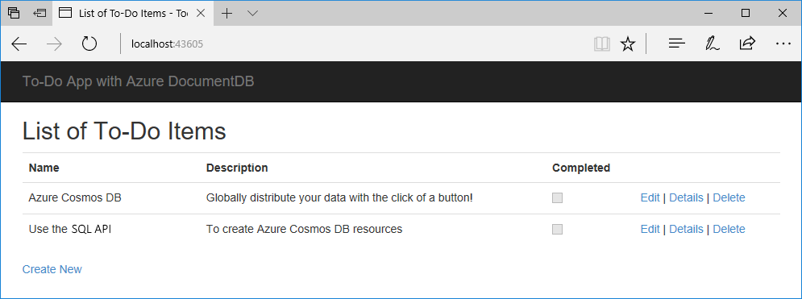

# Quickstart: Build a .NET web app with Azure Cosmos DB using the SQL API and the Azure portal

> [!div class="op_single_selector"]
> * [.NET](create-sql-api-dotnet.md)
> * [Java](create-sql-api-java.md)
> * [Node.js](create-sql-api-nodejs.md)
> * [Python](create-sql-api-python.md)
> * [Xamarin](create-sql-api-xamarin-dotnet.md)
>  
> 

Azure Cosmos DB is Microsoft’s globally distributed multi-model database service. You can quickly create and query document, key/value, and graph databases, all of which benefit from the global distribution and horizontal scale capabilities at the core of Azure Cosmos DB. 

This quick start demonstrates how to create an Azure Cosmos DB [SQL API](sql-api-introduction.md) account, document database, and collection using the Azure portal. You'll then build and deploy a todo list web app built on the [SQL .NET API](sql-api-sdk-dotnet.md), as shown in the following screenshot. 



## Prerequisites

If you don’t already have Visual Studio 2017 installed, you can download and use the **free** [Visual Studio 2017 Community Edition](https://www.visualstudio.com/downloads/). Make sure that you enable **Azure development** during the Visual Studio setup.

[!INCLUDE [quickstarts-free-trial-note](../../includes/quickstarts-free-trial-note.md)] 
[!INCLUDE [cosmos-db-emulator-docdb-api](../../includes/cosmos-db-emulator-docdb-api.md)]  

<a id="create-account"></a>
## Create a database account

[!INCLUDE [cosmos-db-create-dbaccount](../../includes/cosmos-db-create-dbaccount.md)]

<a id="create-collection"></a>
## Add a collection

[!INCLUDE [cosmos-db-create-collection](../../includes/cosmos-db-create-collection.md)]

<a id="add-sample-data"></a>
## Add sample data

[!INCLUDE [cosmos-db-create-sql-api-add-sample-data](../../includes/cosmos-db-create-sql-api-add-sample-data.md)]

## Query your data

[!INCLUDE [cosmos-db-create-sql-api-query-data](../../includes/cosmos-db-create-sql-api-query-data.md)]

## Clone the sample application

Now let's switch to working with code. Let's clone a [SQL API app from GitHub](https://github.com/Azure-Samples/documentdb-dotnet-todo-app), set the connection string, and run it. You'll see how easy it is to work with data programmatically. 

1. Open a command prompt, create a new folder named git-samples, then close the command prompt.

    ```bash
    md "C:\git-samples"
    ```

2. Open a git terminal window, such as git bash, and use the `cd` command to change to the new folder to install the sample app.

    ```bash
    cd "C:\git-samples"
    ```

3. Run the following command to clone the sample repository. This command creates a copy of the sample app on your computer.

    ```bash
    git clone https://github.com/Azure-Samples/documentdb-dotnet-todo-app.git
    ```

4. Then open the todo solution file in Visual Studio. 

## Review the code

This step is optional. If you're interested in learning how the database resources are created in the code, you can review the following snippets. Otherwise, you can skip ahead to [Update your connection string](#update-your-connection-string). 

The following snippets are all taken from the DocumentDBRepository.cs file.

* The DocumentClient is initialized on line 76.

    ```csharp
    client = new DocumentClient(new Uri(ConfigurationManager.AppSettings["endpoint"]), ConfigurationManager.AppSettings["authKey"]);
    ```

* A new database is created on line 91.

    ```csharp
    await client.CreateDatabaseAsync(new Database { Id = DatabaseId });
    ```

* A new collection is created on line 110.

    ```csharp
    await client.CreateDocumentCollectionAsync(
        UriFactory.CreateDatabaseUri(DatabaseId),
        new DocumentCollection
            {
               Id = CollectionId
            },
        new RequestOptions { OfferThroughput = 400 });
    ```

## Update your connection string

Now go back to the Azure portal to get your connection string information and copy it into the app.

1. In the [Azure portal](http://portal.azure.com/), in your Azure Cosmos DB account, in the left navigation click **Keys**, and then click **Read-write Keys**. You'll use the copy buttons on the right side of the screen to copy the URI and Primary Key into the web.config file in the next step.

    

2. In Visual Studio 2017, open the web.config file. 

3. Copy your URI value from the portal (using the copy button) and make it the value of the endpoint key in web.config. 

    `<add key="endpoint" value="FILLME" />`

4. Then copy your PRIMARY KEY value from the portal and make it the value of the authKey in web.config. 

    `<add key="authKey" value="FILLME" />`
    
5. Then update the database value to match the name of the database you have created earlier. You've now updated your app with all the info it needs to communicate with Azure Cosmos DB. 

    `<add key="database" value="Tasks" />`    
    
## Run the web app
1. In Visual Studio, right-click on the project in **Solution Explorer** and then click **Manage NuGet Packages**. 

2. In the NuGet **Browse** box, type *DocumentDB*.

3. From the results, install the **Microsoft.Azure.DocumentDB** library. This installs the Microsoft.Azure.DocumentDB package as well as all dependencies.

4. Click CTRL + F5 to run the application. Your app displays in your browser. 

5. Click **Create New** in the browser and create a few new tasks in your to-do app.

   

You can now go back to Data Explorer and see query, modify, and work with this new data. 

## Review SLAs in the Azure portal

[!INCLUDE [cosmosdb-tutorial-review-slas](../../includes/cosmos-db-tutorial-review-slas.md)]

## Clean up resources

[!INCLUDE [cosmosdb-delete-resource-group](../../includes/cosmos-db-delete-resource-group.md)]

## Next steps

In this quickstart, you've learned how to create an Azure Cosmos DB account, create a collection using the Data Explorer, and run a web app. You can now import additional data to your Cosmos DB account. 

> [!div class="nextstepaction"]
> [Import data into Azure Cosmos DB](import-data.md)


