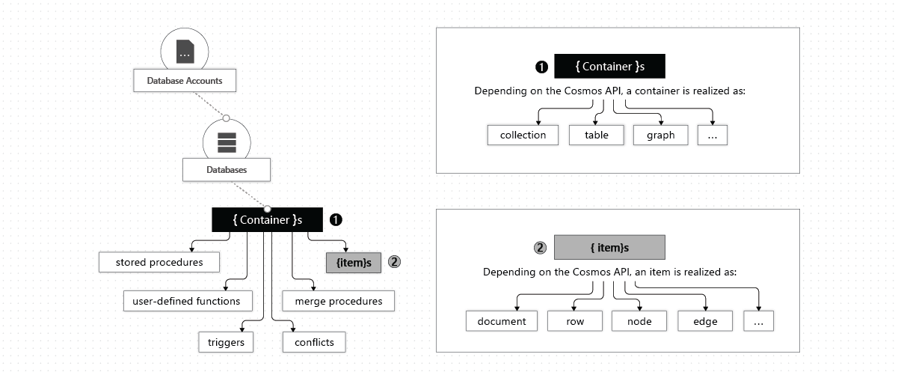

# Quickstart: Build a Java app to manage Azure Cosmos DB SQL API data


> [!div class="op_single_selector"]
> * [.NET V3](create-sql-api-dotnet.md)
> * [.NET V4](create-sql-api-dotnet-V4.md)
> * [Java SDK v4](create-sql-api-java.md)
> * [Node.js](create-sql-api-nodejs.md)
> * [Python](create-sql-api-python.md)
> * [Xamarin](create-sql-api-xamarin-dotnet.md)

In this quickstart, you create and manage an Azure Cosmos DB SQL API account from the Azure portal, and by using a Java app cloned from GitHub. First, you create an Azure Cosmos DB SQL API account using the Azure portal, then create a Java app using the SQL Java SDK, and then add resources to your Cosmos DB account by using the Java application. Azure Cosmos DB is a multi-model database service that lets you quickly create and query document, table, key-value, and graph databases with global distribution and horizontal scale capabilities.

> [!IMPORTANT]  
> This quickstart is for Azure Cosmos DB Java SDK v4 only. Please view the Azure Cosmos DB Java SDK v4 [Release notes](sql-api-sdk-java-v4.md), [Maven repository](https://mvnrepository.com/artifact/com.azure/azure-cosmos), Azure Cosmos DB Java SDK v4 [performance tips](performance-tips-java-sdk-v4-sql.md), and Azure Cosmos DB Java SDK v4 [troubleshooting guide](troubleshoot-java-sdk-v4-sql.md) for more information. If you are currently using an older version than v4, see the [Migrate to Azure Cosmos DB Java SDK v4](migrate-java-v4-sdk.md) guide for help upgrading to v4.
>

## Prerequisites

- An Azure account with an active subscription. [Create one for free](https://azure.microsoft.com/free/?ref=microsoft.com&utm_source=microsoft.com&utm_medium=docs&utm_campaign=visualstudio). Or [try Azure Cosmos DB for free](https://azure.microsoft.com/try/cosmosdb/) without an Azure subscription. You can also use the [Azure Cosmos DB Emulator](https://aka.ms/cosmosdb-emulator) with a URI of `https://localhost:8081` and the key `C2y6yDjf5/R+ob0N8A7Cgv30VRDJIWEHLM+4QDU5DE2nQ9nDuVTqobD4b8mGGyPMbIZnqyMsEcaGQy67XIw/Jw==`.
- [Java Development Kit (JDK) 8](https://www.azul.com/downloads/azure-only/zulu/?&version=java-8-lts&architecture=x86-64-bit&package=jdk). Point your `JAVA_HOME` environment variable to the folder where the JDK is installed.
- A [Maven binary archive](https://maven.apache.org/download.cgi). On Ubuntu, run `apt-get install maven` to install Maven.
- [Git](https://www.git-scm.com/downloads). On Ubuntu, run `sudo apt-get install git` to install Git.

## Introductory notes

*The structure of a Cosmos DB account.* Irrespective of API or programming language, a Cosmos DB *account* contains zero or more *databases*, a *database* (DB) contains zero or more *containers*, and a *container* contains zero or more items, as shown in the diagram below:



You may read more about databases, containers and items [here.](databases-containers-items.md) A few important properties are defined at the level of the container, among them *provisioned throughput* and *partition key*. 

The provisioned throughput is measured in Request Units (*RUs*) which have a monetary price and are a substantial determining factor in the operating cost of the account. Provisioned throughput can be selected at per-container granularity or per-database granularity, however container-level throughput specification is typically preferred. You may read more about throughput provisioning [here.](set-throughput.md)

As items are inserted into a Cosmos DB container, the database grows horizontally by adding more storage and compute to handle requests. Storage and compute capacity are added in discrete units known as *partitions*, and you must choose one field in your documents to be the partition key which maps each document to a partition. The way partitions are managed is that each partition is assigned a roughly equal slice out of the range of partition key values; therefore you are advised to choose a partition key which is relatively random or evenly-distributed. Otherwise, some partitions will see substantially more requests (*hot partition*) while other partitions see substantially fewer requests (*cold partition*), and this is to be avoided. You may learn more about partitioning [here](partitioning-overview.md).

## Create a database account

Before you can create a document database, you need to create a SQL API account with Azure Cosmos DB.

[!INCLUDE [cosmos-db-create-dbaccount](../../includes/cosmos-db-create-dbaccount.md)]

## Add a container

[!INCLUDE [cosmos-db-create-collection](../../includes/cosmos-db-create-collection.md)]

<a id="add-sample-data"></a>
## Add sample data

[!INCLUDE [cosmos-db-create-sql-api-add-sample-data](../../includes/cosmos-db-create-sql-api-add-sample-data.md)]

## Query your data

[!INCLUDE [cosmos-db-create-sql-api-query-data](../../includes/cosmos-db-create-sql-api-query-data.md)]

## Clone the sample application

Now let's switch to working with code. Let's clone a SQL API app from GitHub, set the connection string, and run it. You'll see how easy it is to work with data programmatically. 

Run the following command to clone the sample repository. This command creates a copy of the sample app on your computer.

```bash
git clone https://github.com/Azure-Samples/azure-cosmos-java-getting-started.git
```

## Review the code

This step is optional. If you're interested in learning how the database resources are created in the code, you can review the following snippets. Otherwise, you can skip ahead to [Run the app
](#run-the-app). 


# [Sync API](#tab/sync)

### Managing database resources using the synchronous (sync) API

* `CosmosClient` initialization. The `CosmosClient` provides client-side logical representation for the Azure Cosmos database service. This client is used to configure and execute requests against the service.
    
    [!code-java[](~/azure-cosmosdb-java-v4-getting-started/src/main/java/com/azure/cosmos/sample/sync/SyncMain.java?name=CreateSyncClient)]

* `CosmosDatabase` creation.

    [!code-java[](~/azure-cosmosdb-java-v4-getting-started/src/main/java/com/azure/cosmos/sample/sync/SyncMain.java?name=CreateDatabaseIfNotExists)]

* `CosmosContainer` creation.

    [!code-java[](~/azure-cosmosdb-java-v4-getting-started/src/main/java/com/azure/cosmos/sample/sync/SyncMain.java?name=CreateContainerIfNotExists)]

* Item creation by using the `createItem` method.

    [!code-java[](~/azure-cosmosdb-java-v4-getting-started/src/main/java/com/azure/cosmos/sample/sync/SyncMain.java?name=CreateItem)]
   
* Point reads are performed using `readItem` method.

    [!code-java[](~/azure-cosmosdb-java-v4-getting-started/src/main/java/com/azure/cosmos/sample/sync/SyncMain.java?name=ReadItem)]

* SQL queries over JSON are performed using the `queryItems` method.

    [!code-java[](~/azure-cosmosdb-java-v4-getting-started/src/main/java/com/azure/cosmos/sample/sync/SyncMain.java?name=QueryItems)]

# [Async API](#tab/async)

### Managing database resources using the asynchronous (async) API

* Async API calls return immediately, without waiting for a response from the server. In light of this, the following code snippets show proper design patterns for accomplishing all of the preceding management tasks using async API.

* `CosmosAsyncClient` initialization. The `CosmosAsyncClient` provides client-side logical representation for the Azure Cosmos database service. This client is used to configure and execute asynchronous requests against the service.
    
    [!code-java[](~/azure-cosmosdb-java-v4-getting-started/src/main/java/com/azure/cosmos/sample/async/AsyncMain.java?name=CreateAsyncClient)]

* `CosmosAsyncDatabase` creation.

    [!code-java[](~/azure-cosmosdb-java-v4-getting-started/src/main/java/com/azure/cosmos/sample/sync/SyncMain.java?name=CreateDatabaseIfNotExists)]

* `CosmosAsyncContainer` creation.

    [!code-java[](~/azure-cosmosdb-java-v4-getting-started/src/main/java/com/azure/cosmos/sample/sync/SyncMain.java?name=CreateContainerIfNotExists)]

* As with the sync API, item creation is accomplished using the `createItem` method. This example shows how to efficiently issue numerous async `createItem` requests by subscribing to a Reactive Stream which issues the requests and prints notifications. Since this simple example runs to completion and terminates, `CountDownLatch` instances are used to ensure the program does not terminate during item creation. **The proper asynchronous programming practice is not to block on async calls - in realistic use-cases requests are generated from a main() loop that executes indefinitely, eliminating the need to latch on async calls.**

    [!code-java[](~/azure-cosmosdb-java-v4-getting-started/src/main/java/com/azure/cosmos/sample/async/AsyncMain.java?name=CreateItem)]
   
* As with the sync API, point reads are performed using `readItem` method.

    [!code-java[](~/azure-cosmosdb-java-v4-getting-started/src/main/java/com/azure/cosmos/sample/async/AsyncMain.java?name=ReadItem)]

* As with the sync API, SQL queries over JSON are performed using the `queryItems` method.

    [!code-java[](~/azure-cosmosdb-java-v4-getting-started/src/main/java/com/azure/cosmos/sample/async/AsyncMain.java?name=QueryItems)]

---

## Run the app

Now go back to the Azure portal to get your connection string information and launch the app with your endpoint information. This enables your app to communicate with your hosted database.

1. In the git terminal window, `cd` to the sample code folder.

    ```bash
    cd azure-cosmos-java-getting-started
    ```

2. In the git terminal window, use the following command to install the required Java packages.

    ```bash
    mvn package
    ```

3. In the git terminal window, use the following command to start the Java application (replace SYNCASYNCMODE with `sync` or `async` depending on which sample code you would like to run, replace YOUR_COSMOS_DB_HOSTNAME with the quoted URI value from the portal, and replace YOUR_COSMOS_DB_MASTER_KEY with the quoted primary key from portal)

    ```bash
    mvn exec:java@SYNCASYNCMODE -DACCOUNT_HOST=YOUR_COSMOS_DB_HOSTNAME -DACCOUNT_KEY=YOUR_COSMOS_DB_MASTER_KEY

    ```

    The terminal window displays a notification that the FamilyDB database was created. 
    
4. The app creates database with name `AzureSampleFamilyDB`
5. The app creates container with name `FamilyContainer`
6. The app will perform point reads using object IDs and partition key value (which is lastName in our sample). 
7. The app will query items to retrieve all families with last name in ('Andersen', 'Wakefield', 'Johnson')

7. The app doesn't delete the created resources. Switch back to the portal to [clean up the resources](#clean-up-resources).  from your account so that you don't incur charges.

## Review SLAs in the Azure portal

[!INCLUDE [cosmosdb-tutorial-review-slas](../../includes/cosmos-db-tutorial-review-slas.md)]

## Clean up resources

[!INCLUDE [cosmosdb-delete-resource-group](../../includes/cosmos-db-delete-resource-group.md)]

## Next steps

In this quickstart, you've learned how to create an Azure Cosmos DB SQL API account, create a document database and container using the Data Explorer, and run a Java app to do the same thing programmatically. You can now import additional data into your Azure Cosmos DB account. 

> [!div class="nextstepaction"]
> [Import data into Azure Cosmos DB](import-data.md)
