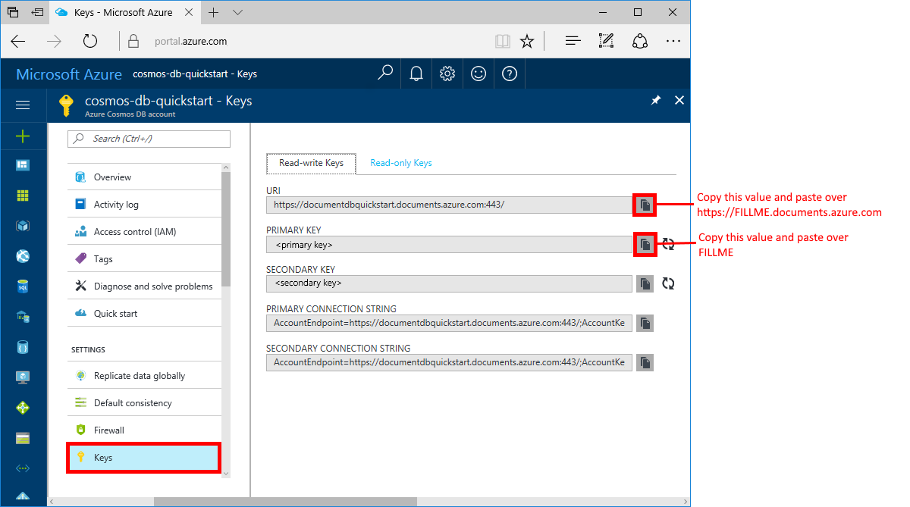
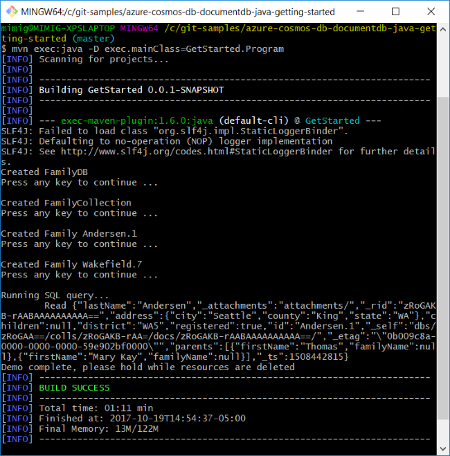

# Azure Cosmos DB: Create a document database using Java and the Azure portal

> [!div class="op_single_selector"]
> * [.NET](create-sql-api-dotnet.md)
> * [Java](create-sql-api-java.md)
> * [Node.js](create-sql-api-nodejs.md)
> * [Python](create-sql-api-python.md)
> * [Xamarin](create-sql-api-xamarin-dotnet.md)
>  

Azure Cosmos DB is Microsoft’s globally distributed multi-model database service. Using Azure Cosmos DB, you can quickly create and query managed document, table, and graph databases.

This quickstart creates a document database using the Azure portal tools for the Azure Cosmos DB [SQL API](sql-api-introduction.md). This quickstart also shows you how to quickly create a Java console app using the [SQL Java API](sql-api-sdk-java.md). The instructions in this quickstart can be followed on any operating system that is capable of running Java. By completing this quickstart you'll be familiar with creating and modifying document database resources in either the UI or programmatically, whichever is your preference.

## Prerequisites

[!INCLUDE [quickstarts-free-trial-note](../../includes/quickstarts-free-trial-note.md)] 
[!INCLUDE [cosmos-db-emulator-docdb-api](../../includes/cosmos-db-emulator-docdb-api.md)]

In addition: 

* [Java Development Kit (JDK) 1.7+](http://www.oracle.com/technetwork/java/javase/downloads/jdk8-downloads-2133151.html)
    * On Ubuntu, run `apt-get install default-jdk` to install the JDK.
    * Be sure to set the JAVA_HOME environment variable to point to the folder where the JDK is installed.
* [Download](http://maven.apache.org/download.cgi) and [install](http://maven.apache.org/install.html) a [Maven](http://maven.apache.org/) binary archive
    * On Ubuntu, you can run `apt-get install maven` to install Maven.
* [Git](https://www.git-scm.com/)
    * On Ubuntu, you can run `sudo apt-get install git` to install Git.

## Create a database account

Before you can create a document database, you need to create a SQL API account with Azure Cosmos DB.

[!INCLUDE [cosmos-db-create-dbaccount](../../includes/cosmos-db-create-dbaccount.md)]

## Add a collection

[!INCLUDE [cosmos-db-create-collection](../../includes/cosmos-db-create-collection.md)]

<a id="add-sample-data"></a>
## Add sample data

[!INCLUDE [cosmos-db-create-sql-api-add-sample-data](../../includes/cosmos-db-create-sql-api-add-sample-data.md)]

## Query your data

[!INCLUDE [cosmos-db-create-sql-api-query-data](../../includes/cosmos-db-create-sql-api-query-data.md)]

## Clone the sample application

Now let's switch to working with code. Let's clone a SQL API app from GitHub, set the connection string, and run it. You'll see how easy it is to work with data programmatically. 

1. Open a command prompt, create a new folder named git-samples, then close the command prompt.

    ```bash
    md "C:\git-samples"
    ```

2. Open a git terminal window, such as git bash, and use the `cd` command to change to the new folder to install the sample app. 

    ```bash
    cd "C:\git-samples"
    ```

3. Run the following command to clone the sample repository. This command creates a copy of the sample app on your computer.

    ```bash
    git clone https://github.com/Azure-Samples/azure-cosmos-db-documentdb-java-getting-started.git
    ```

## Review the code

This step is optional. If you're interested in learning how the database resources are created in the code, you can review the following snippets. Otherwise, you can skip ahead to [Update your connection string](#update-your-connection-string). 

The following snippets are all taken from the C:\git-samples\azure-cosmos-db-documentdb-java-getting-started\src\GetStarted\Program.java file.

* `DocumentClient` initialization. The [DocumentClient](https://docs.microsoft.com/java/api/com.microsoft.azure.documentdb._document_client) provides client-side logical representation for the Azure Cosmos DB database service. This client is used to configure and execute requests against the service. The `FILLME` portions of this code will be updated later in the quickstart.

    ```java
    this.client = new DocumentClient("https://FILLME.documents.azure.com",
            "FILLME", 
            new ConnectionPolicy(),
            ConsistencyLevel.Session);
    ```

* [Database](https://docs.microsoft.com/java/api/com.microsoft.azure.documentdb._database) creation.

    ```java
    Database database = new Database();
    database.setId(databaseName);
    
    this.client.createDatabase(database, null);
    ```

* [DocumentCollection](https://docs.microsoft.com/java/api/com.microsoft.azure.documentdb._document_collection) creation.

    ```java
    DocumentCollection collectionInfo = new DocumentCollection();
    collectionInfo.setId(collectionName);

    ...

    this.client.createCollection(databaseLink, collectionInfo, requestOptions);
    ```

* Document creation by using the [createDocument](https://docs.microsoft.com/java/api/com.microsoft.azure.documentdb._document_client.createdocument) method.

    ```java
    // Any Java object within your code can be serialized into JSON and written to Azure Cosmos DB
    Family andersenFamily = new Family();
    andersenFamily.setId("Andersen.1");
    andersenFamily.setLastName("Andersen");
    // More properties

    String collectionLink = String.format("/dbs/%s/colls/%s", databaseName, collectionName);
    this.client.createDocument(collectionLink, family, new RequestOptions(), true);
    ```

* SQL queries over JSON are performed using the [queryDocuments](https://docs.microsoft.com/java/api/com.microsoft.azure.documentdb._document_client.querydocuments) method.

    ```java
    FeedOptions queryOptions = new FeedOptions();
    queryOptions.setPageSize(-1);
    queryOptions.setEnableCrossPartitionQuery(true);

    String collectionLink = String.format("/dbs/%s/colls/%s", databaseName, collectionName);
    FeedResponse<Document> queryResults = this.client.queryDocuments(
        collectionLink,
        "SELECT * FROM Family WHERE Family.lastName = 'Andersen'", queryOptions);

    System.out.println("Running SQL query...");
    for (Document family : queryResults.getQueryIterable()) {
        System.out.println(String.format("\tRead %s", family));
    }
    ```    

## Update your connection string

Now go back to the Azure portal to get your connection string information and copy it into the app. This enables your app to communicate with your hosted database.

1. In the [Azure portal](http://portal.azure.com/), click **Keys**. 

    Use the copy buttons on the right side of the screen to copy the top value, the URI.

    

2. Open the `Program.java` file from C:\git-samples\azure-cosmos-db-documentdb-java-getting-started\src\GetStarted folder. 

3. Paste the URI value from the portal over `https://FILLME.documents.azure.com` on line 45.

4. Go back to portal and copy the PRIMARY KEY value as shown in the screenshot. Paste the PRIMARY KEY value from the portal over `FILLME` on line 46.

    The getStartedDemo method should now look similar to this: 
    
    ```java
    private void getStartedDemo() throws DocumentClientException, IOException {
        this.client = new DocumentClient("https://youraccountname.documents.azure.com:443/",
                "your-primary-key...RJhQrqQ5QQ==", 
                new ConnectionPolicy(),
                ConsistencyLevel.Session);
    ```

5. Save the Program.java file.

## Run the app

1. In the git terminal window, `cd` to the azure-cosmos-db-documentdb-java-getting-started folder.

    ```git
    cd "C:\git-samples\azure-cosmos-db-documentdb-java-getting-started"
    ```

2. In the git terminal window, use the following command to install the required Java packages.

    ```
    mvn package
    ```

3. In the git terminal window, use the following command to start the Java application.

    ```
    mvn exec:java -D exec.mainClass=GetStarted.Program
    ```

    The terminal window displays a notification that the FamilyDB database was created. 
    
4. Press a key to create the database, and then another key to create the collection. 

    At the end of the program all the resources are deleted, so switch back to Data Explorer in your browser to see that it now contains a FamilyDB database, and FamilyCollection collection.

5. Switch to the console window and press a key to create the first document, and then another key to create the second document. Then switch back to Data Explorer to view them. 

6. Press a key to run a query and see the output in the console window. 

7. The next key you press deletes the resources. If you want to keep the resources you can press CTRL+C in the console window to end the program. Otherwise, press any key to delete the resources from your account so that you don't incur charges. 

    


## Review SLAs in the Azure portal

[!INCLUDE [cosmosdb-tutorial-review-slas](../../includes/cosmos-db-tutorial-review-slas.md)]

## Clean up resources

[!INCLUDE [cosmosdb-delete-resource-group](../../includes/cosmos-db-delete-resource-group.md)]

## Next steps

In this quickstart, you've learned how to create an Azure Cosmos DB account, document database, and collection using the Data Explorer, and run an app to do the same thing programmatically. You can now import additional data into your Azure Cosmos DB collection. 

> [!div class="nextstepaction"]
> [Import data into Azure Cosmos DB](import-data.md)


