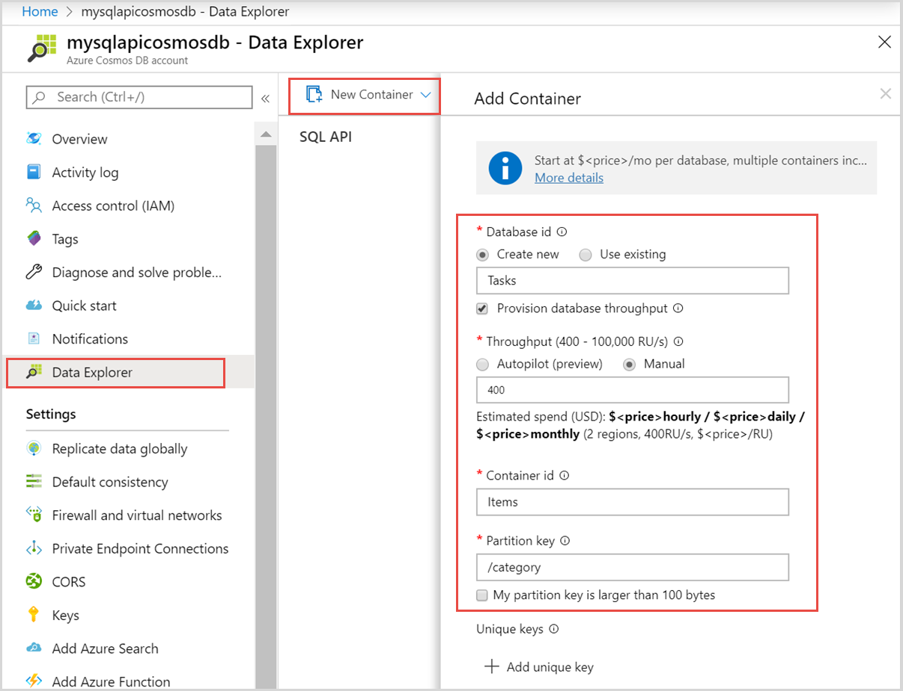

# Quickstart: Use Node.js to connect and query data from Azure Cosmos DB SQL API account

> [!div class="op_single_selector"]
> - [.NET V3](create-sql-api-dotnet.md)
> - [.NET V4](create-sql-api-dotnet-V4.md)
> - [Java SDK v4](create-sql-api-java.md)
> - [Node.js](create-sql-api-nodejs.md)
> - [Python](create-sql-api-python.md)
> - [Xamarin](create-sql-api-xamarin-dotnet.md)

In this quickstart, you create and manage an Azure Cosmos DB SQL API account from the Azure portal, and by using a Node.js app cloned from GitHub. Azure Cosmos DB is a multi-model database service that lets you quickly create and query document, table, key-value, and graph databases with global distribution and horizontal scale capabilities.

## Walkthrough video

Watch this video for a complete walkthrough of the content in this article.

> [!VIDEO https://channel9.msdn.com/Shows/Docs-Azure/Quickstart-Use-Nodejs-to-connect-and-query-data-from-Azure-Cosmos-DB-SQL-API-account/player]

## Prerequisites

- An Azure account with an active subscription. [Create one for free](https://azure.microsoft.com/free/?ref=microsoft.com&utm_source=microsoft.com&utm_medium=docs&utm_campaign=visualstudio). Or [try Azure Cosmos DB for free](https://azure.microsoft.com/try/cosmosdb/) without an Azure subscription. You can also use the [Azure Cosmos DB Emulator](https://aka.ms/cosmosdb-emulator) with a URI of `https://localhost:8081` and the key `C2y6yDjf5/R+ob0N8A7Cgv30VRDJIWEHLM+4QDU5DE2nQ9nDuVTqobD4b8mGGyPMbIZnqyMsEcaGQy67XIw/Jw==`.
- [Node.js 6.0.0+](https://nodejs.org/).
- [Git](https://www.git-scm.com/downloads).

## Create an Azure Cosmos account

For this quickstart purpose, you can use the [try Azure Cosmos DB for free](https://azure.microsoft.com/try/cosmosdb/) option to create an Azure Cosmos account.

1. Navigate to the [try Azure Cosmos DB for free](https://azure.microsoft.com/try/cosmosdb/) page.

1. Choose the **SQL** API account and select **Create**. Sign-in using your Microsoft account.

1. After the sign-in is successful, your Azure Cosmos account should be ready. Select **Open in the Azure portal** to open the newly created account.

The "try Azure Cosmos DB for free" option doesn't require an Azure subscription and it offers you an Azure Cosmos account for a limited period of 30 days. If you want to use the Azure Cosmos account for a longer period, you should instead [create the account](create-cosmosdb-resources-portal.md#create-an-azure-cosmos-db-account) within your Azure subscription.

## Add a container

You can now use the Data Explorer tool in the Azure portal to create a database and container.

1. Select **Data Explorer** > **New Container**.

   The **Add Container** area is displayed on the far right, you may need to scroll right to see it.

   

2. In the **Add container** page, enter the settings for the new container.

   | Setting           | Suggested value | Description                                                                                                                                                                                                                                                                                                                                                                           |
   | ----------------- | --------------- | ------------------------------------------------------------------------------------------------------------------------------------------------------------------------------------------------------------------------------------------------------------------------------------------------------------------------------------------------------------------------------------- |
   | **Database ID**   | Tasks           | Enter _Tasks_ as the name for the new database. Database names must contain from 1 through 255 characters, and they cannot contain `/, \\, #, ?`, or a trailing space. Check the **Provision database throughput** option, it allows you to share the throughput provisioned to the database across all the containers within the database. This option also helps with cost savings. |
   | **Throughput**    | 400             | Leave the throughput at 400 request units per second (RU/s). If you want to reduce latency, you can scale up the throughput later.                                                                                                                                                                                                                                                    |
   | **Container ID**  | Items           | Enter _Items_ as the name for your new container. Container IDs have the same character requirements as database names.                                                                                                                                                                                                                                                               |
   | **Partition key** | /category       | The sample described in this article uses _/category_ as the partition key.                                                                                                                                                                                                                                                                                                           |

   In addition to the preceding settings, you can optionally add **Unique keys** for the container. Let's leave the field empty in this example. Unique keys provide developers with the ability to add a layer of data integrity to the database. By creating a unique key policy while creating a container, you ensure the uniqueness of one or more values per partition key. To learn more, refer to the [Unique keys in Azure Cosmos DB](unique-keys.md) article.

   Select **OK**. The Data Explorer displays the new database and container.

## Add sample data

[!INCLUDE [cosmos-db-create-sql-api-add-sample-data](../../includes/cosmos-db-create-sql-api-add-sample-data.md)]

## Query your data

[!INCLUDE [cosmos-db-create-sql-api-query-data](../../includes/cosmos-db-create-sql-api-query-data.md)]

## Clone the sample application

Now let's clone a Node.js app from GitHub, set the connection string, and run it.

1. Run the following command to clone the sample repository. This command creates a copy of the sample app on your computer.

   ```bash
   git clone https://github.com/Azure-Samples/azure-cosmos-db-sql-api-nodejs-getting-started.git
   ```

## Review the code

This step is optional. If you're interested in learning how the Azure Cosmos database resources are created in the code, you can review the following snippets. Otherwise, you can skip ahead to [Update your connection string](#update-your-connection-string).

If you're familiar with the previous version of the SQL JavaScript SDK, you may be used to seeing the terms _collection_ and _document_. Because Azure Cosmos DB supports [multiple API models](introduction.md), [version 2.0+ of the JavaScript SDK](https://www.npmjs.com/package/@azure/cosmos) uses the generic terms _container_, which may be a collection, graph, or table, and _item_ to describe the content of the container.

The Cosmos DB JavaScript SDK is called "@azure/cosmos" and can be installed from npm...

```bash
npm install @azure/cosmos
```

The following snippets are all taken from the _app.js_ file.

- The `CosmosClient` is imported from the `@azure/cosmos` npm package.

  ```javascript
  const CosmosClient = require("@azure/cosmos").CosmosClient;
  ```

- A new `CosmosClient` object is initialized.

  ```javascript
  const client = new CosmosClient({ endpoint, key });
  ```

- Select the "Tasks" database.

  ```javascript
  const database = client.database(databaseId);
  ```

- Select the "Items" container/collection.

  ```javascript
  const container = database.container(containerId);
  ```

- Select all the items in the "Items" container.

  ```javascript
  // query to return all items
  const querySpec = {
    query: "SELECT * from c"
  };

  const { resources: items } = await container.items
    .query(querySpec)
    .fetchAll();
  ```

- Create a new item

  ```javascript
  const { resource: createdItem } = await container.items.create(newItem);
  ```

- Update an item

  ```javascript
  const { id, category } = createdItem;

  createdItem.isComplete = true;
  const { resource: updatedItem } = await container
    .item(id, category)
    .replace(createdItem);
  ```

- Delete an item

  ```javascript
  const { resource: result } = await container.item(id, category).delete();
  ```

> [!NOTE]
> In both the "update" and "delete" methods, the item has to be selected from the database by calling `container.item()`. The two parameters passed in are the id of the item and the item's partition key. In this case, the parition key is the value of the "category" field.

## Update your connection string

Now go back to the Azure portal to get the connection string details of your Azure Cosmos account. Copy the connection string into the app so that it can connect to your database.

1. In your Azure Cosmos DB account in the [Azure portal](https://portal.azure.com/), select **Keys** from the left navigation, and then select **Read-write Keys**. Use the copy buttons on the right side of the screen to copy the URI and Primary Key into the _app.js_ file in the next step.

   

2. In Open the _config.js_ file.

3. Copy your URI value from the portal (using the copy button) and make it the value of the endpoint key in _config.js_.

   `endpoint: "<Your Azure Cosmos account URI>"`

4. Then copy your PRIMARY KEY value from the portal and make it the value of the `config.key` in _config.js_. You've now updated your app with all the info it needs to communicate with Azure Cosmos DB.

   `key: "<Your Azure Cosmos account key>"`

## Run the app

1. Run `npm install` in a terminal to install the "@azure/cosmos" npm package

2. Run `node app.js` in a terminal to start your node application.

3. The two items that you created earlier in this quickstart are listed out. A new item is created. The "isComplete" flag on that item is updated to "true" and then finally, the item is deleted.

You can continue to experiment with this sample application or go back to Data Explorer, modify, and work with your data.

## Review SLAs in the Azure portal

[!INCLUDE [cosmosdb-tutorial-review-slas](../../includes/cosmos-db-tutorial-review-slas.md)]

## Next steps

In this quickstart, you've learned how to create an Azure Cosmos DB account, create a container using the Data Explorer, and run a Node.js app. You can now import additional data to your Azure Cosmos DB account.

> [!div class="nextstepaction"]
> [import data into azure cosmos db](import-data.md)
