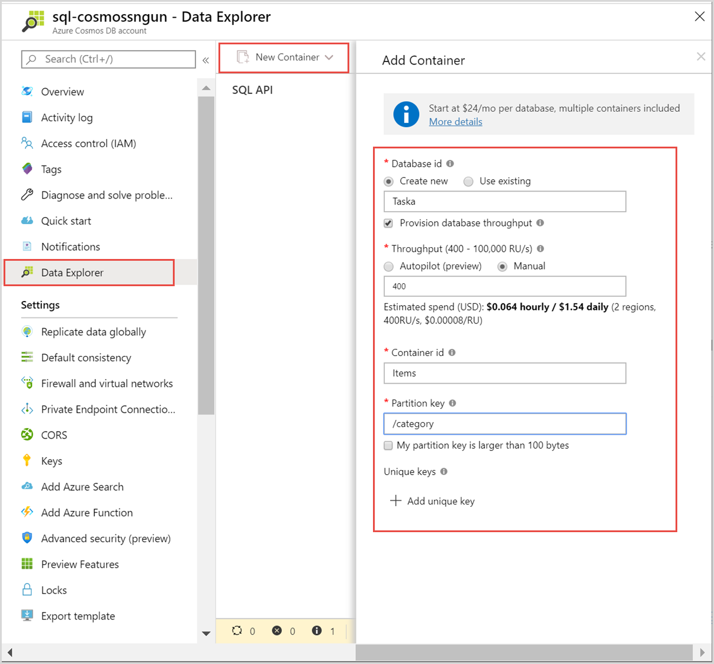
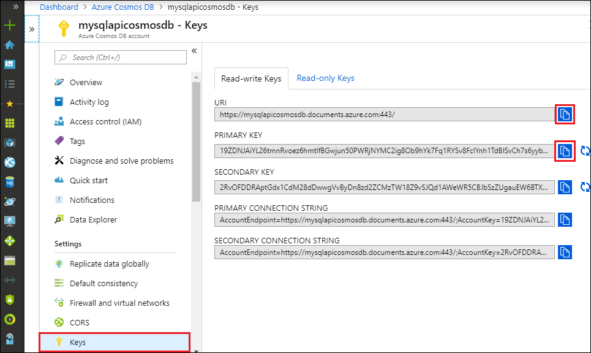

# Quickstart: Build a Python application using an Azure Cosmos DB SQL API account

> [!div class="op_single_selector"]
> * [.NET V3](create-sql-api-dotnet.md)
> * [.NET V4](create-sql-api-dotnet-V4.md)
> * [Java](create-sql-api-java.md)
> * [Node.js](create-sql-api-nodejs.md)
> * [Python](create-sql-api-python.md)
> * [Xamarin](create-sql-api-xamarin-dotnet.md)

This quickstart demonstrates how to create an Azure Cosmos DB [SQL API](sql-api-introduction.md) account, document database, and container using the Azure portal. You then build and run a console app built with the Python SDK for [SQL API](sql-api-sdk-python.md).

Azure Cosmos DB is Microsoft’s globally distributed multi-model database service. You can quickly create and query documents, key/value, wide column and graph databases. All of these operations benefit from the distribution and scale of Azure Cosmos DB.

This quickstart uses version 4 of the [Python SDK](https://pypi.org/project/azure-cosmos/#history).

[!INCLUDE [quickstarts-free-trial-note](../../includes/quickstarts-free-trial-note.md)] [!INCLUDE [cosmos-db-emulator-docdb-api](../../includes/cosmos-db-emulator-docdb-api.md)]

## Prerequisites

* [Python 3.6+](https://www.python.org/downloads/), with the `python` executable available in your `PATH`.
* [Visual Studio Code](https://code.visualstudio.com/)
* [Python extention for Visual Studio Code](https://marketplace.visualstudio.com/items?itemName=ms-python.python#overview)

## Create a database account

[!INCLUDE [cosmos-db-create-dbaccount](../../includes/cosmos-db-create-dbaccount.md)]

## Add a container

You can now use the Data Explorer tool in the Azure portal to create a database and container. 

1. Select **Data Explorer** > **New Container**. 
    
    The **Add Container** area is displayed on the far right, you may need to scroll right to see it.

    

2. In the **Add container** page, enter the settings for the new container.

    |Setting|Suggested value|Description
    |---|---|---|
    |**Database ID**|Tasks|Enter *ToDoList* as the name for the new database. Database names must contain from 1 through 255 characters, and they cannot contain `/, \\, #, ?`, or a trailing space. Check the **Provision database throughput** option, it allows you to share the throughput provisioned to the database across all the containers within the database. This option also helps with cost savings. |
    |**Throughput**|400|Leave the throughput at 400 request units per second (RU/s). If you want to reduce latency, you can scale up the throughput later.| 
    |**Container ID**|Items|Enter *Items* as the name for your new container. Container IDs have the same character requirements as database names.|
    |**Partition key**| /category| The sample described in this article uses */category* as the partition key.|
    
    In addition to the preceding settings, you can optionally add **Unique keys** for the container. Let's leave the field empty in this example. Unique keys provide developers with the ability to add a layer of data integrity to the database. By creating a unique key policy while creating a container, you ensure the uniqueness of one or more values per partition key. To learn more, refer to the [Unique keys in Azure Cosmos DB](unique-keys.md) article.
    
    Select **OK**. The Data Explorer displays the new database and container.

## Add sample data

[!INCLUDE [cosmos-db-create-sql-api-add-sample-data](../../includes/cosmos-db-create-sql-api-add-sample-data.md)]

## Query your data

[!INCLUDE [cosmos-db-create-sql-api-query-data](../../includes/cosmos-db-create-sql-api-query-data.md)]

## Clone the sample application

Now let's clone a SQL API app from GitHub, set the connection string, and run it.

1. Open a command prompt, create a new folder named git-samples, then close the command prompt.

    ```cmd
    md "git-samples"
    ```
   If you are using a bash prompt, you should instead use the following command:

   ```bash
   mkdir "git-samples"
   ```

2. Open a git terminal window, such as git bash, and use the `cd` command to change to the new folder to install the sample app.

    ```bash
    cd "git-samples"
    ```

3. Run the following command to clone the sample repository. This command creates a copy of the sample app on your computer. 

    ```bash
    git clone https://github.com/Azure-Samples/azure-cosmos-db-python-getting-started.git
    ```  

## Update your connection string

Now go back to the Azure portal to get your connection string information and copy it into the app.

1. In the [Azure portal](https://portal.azure.com/), in your Azure Cosmos account, in the left navigation select **Keys**. You'll use the copy buttons on the right side of the screen to copy the **URI** and **Primary Key** into the `cosmos_get_started.py` file in the next step.

    

2. Open the `cosmos_get_started.py` file in \git-samples\azure-cosmos-db-python-getting-started in Visual Studio Code.

3. Copy your **URI** value from the portal (using the copy button) and make it the value of the **endpoint** variable in ``cosmos_get_started.py``. 

    `endpoint = 'https://FILLME.documents.azure.com',`

4. Then copy your **PRIMARY KEY** value from the portal and make it the value of the **key** in ``cosmos_get_started.py``. You've now updated your app with all the info it needs to communicate with Azure Cosmos DB. 

    `key = 'FILLME'`

5. Save the ``cosmos_get_started.py`` file.

## Review the code

This step is optional. Learn about the database resources created in code, or skip ahead to [Update your connection string](#update-your-connection-string).

The following snippets are all taken from the `cosmos_get_started.py` file.

* The CosmosClient is initialized. Make sure to update the "endpoint" and "key" values as described in the [Update your connection string](#update-your-connection-string) section. 

    [!code-python[](~/azure-cosmos-db-python-getting-started/cosmos_get_started.py?name=create_cosmos_client)]

* A new database is created.

    [!code-python[](~/azure-cosmos-db-python-getting-started/cosmos_get_started.py?name=create_database_if_not_exists)]

* A new container is created, with 400 RU/s of [provisioned throughput](request-units.md). We choose `lastName` as the [partition key](partitioning-overview.md#choose-partitionkey), which allows us to do efficient queries that filter on this property. 

    [!code-python[](~/azure-cosmos-db-python-getting-started/cosmos_get_started.py?name=create_container_if_not_exists)]

* Some items are added to the container. Containers are a collection of items (JSON documents) that can have varied schema. The helper methods ```get_[name]_family_item``` return representations of a family that are stored in Azure Cosmos DB as JSON documents.

    [!code-python[](~/azure-cosmos-db-python-getting-started/cosmos_get_started.py?name=create_item)]

* Point reads (key value lookups) are performed using the `read_item` method. We print out the [RU charge](request-units.md) of each operation.
    [!code-python[](~/azure-cosmos-db-python-getting-started/cosmos_get_started.py?name=read_item)]

* A query is performed using SQL query syntax. Because we're using partition key values of ```lastName``` in the WHERE clause, Azure Cosmos DB will efficiently route this query to the relevant partitions, improving performance.

    [!code-python[](~/azure-cosmos-db-python-getting-started/cosmos_get_started.py?name=query_items)]
   
## Run the app

1. In Visual Studio Code, select **View** > **Command Palette**. 

2. At the prompt, enter  **Python: Select Interpreter** and then select the version of Python to use.

    The Footer in Visual Studio Code is updated to indicate the interpreter selected. 

3. Select **View** > **Integrated Terminal** to open the Visual Studio Code integrated terminal.

4. In the integrated terminal window, ensure you are in the azure-cosmos-db-python-getting-started folder. If not, run the following command to switch to the sample folder. 

    ```cmd
    cd "\git-samples\azure-cosmos-db-python-getting-started"`
    ```

5. Run the following command to install the azure-cosmos package. 

    ```python
    pip install --pre azure-cosmos
    ```

    If you get an error about access being denied when attempting to install azure-cosmos, you'll need to [run VS Code as an administrator](https://stackoverflow.com/questions/37700536/visual-studio-code-terminal-how-to-run-a-command-with-administrator-rights).

6. Run the following command to run the sample and create and store new documents in Azure Cosmos DB.

    ```python
    python cosmos_get_started.py
    ```

7. To confirm the new items were created and saved, in the Azure portal, select **Data Explorer** > **AzureSampleFamilyDatabase** > **Items**. View the items that were created. For example, here is a sample JSON document for the Andersen family:

```json
{
    "id": "Andersen-1569479288379",
    "lastName": "Andersen",
    "district": "WA5",
    "parents": [
        {
            "familyName": null,
            "firstName": "Thomas"
        },
        {
            "familyName": null,
            "firstName": "Mary Kay"
        }
    ],
    "children": null,
    "address": {
        "state": "WA",
        "county": "King",
        "city": "Seattle"
    },
    "registered": true,
    "_rid": "8K5qAIYtZXeBhB4AAAAAAA==",
    "_self": "dbs/8K5qAA==/colls/8K5qAIYtZXc=/docs/8K5qAIYtZXeBhB4AAAAAAA==/",
    "_etag": "\"a3004d78-0000-0800-0000-5d8c5a780000\"",
    "_attachments": "attachments/",
    "_ts": 1569479288
}
```

## Review SLAs in the Azure portal

[!INCLUDE [cosmosdb-tutorial-review-slas](../../includes/cosmos-db-tutorial-review-slas.md)]

## Clean up resources

[!INCLUDE [cosmosdb-delete-resource-group](../../includes/cosmos-db-delete-resource-group.md)]

## Next steps

In this quickstart, you've learned how to create an Azure Cosmos account, create a container using the Data Explorer, and run an app. You can now import additional data to your Cosmos DB account. 

> [!div class="nextstepaction"]
> [Import data into Azure Cosmos DB for the SQL API](import-data.md)


