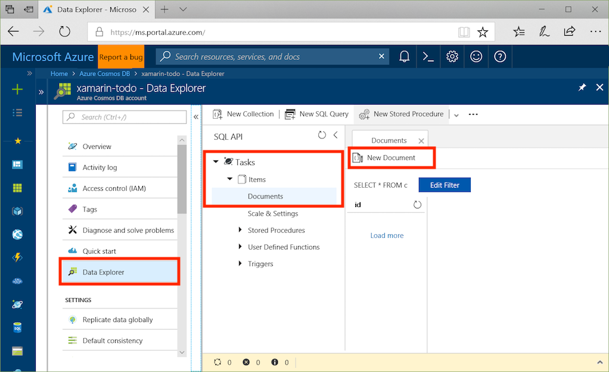
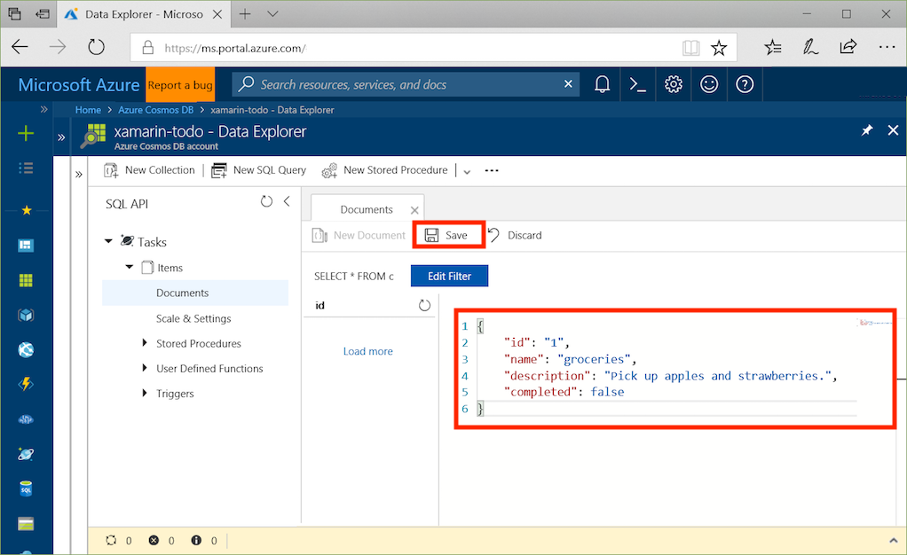

# Azure Cosmos DB: Build a todo app with Xamarin

Azure Cosmos DB is Microsoft’s globally distributed multi-model database service. You can quickly create and query document, key/value, and graph databases, all of which benefit from the global distribution and horizontal scale capabilities at the core of Azure Cosmos DB.

> [!NOTE]
> Sample code for an entire canonical sample Xamarin app showcasing multiple Azure offerings, including CosmosDB, can be found on GitHub [here](https://github.com/xamarinhq/app-geocontacts). This app demonstrates viewing geographically dispersed contacts, and allowing those contacts to update their location.

This quickstart demonstrates how to create an Azure Cosmos DB account, document database, and collection using the Azure portal. You'll then build and deploy a todo list web app built on the [SQL .NET API](sql-api-sdk-dotnet.md) and [Xamarin](https://docs.microsoft.com/xamarin/#pivot=platforms&panel=Cross-Platform) utilizing [Xamarin.Forms](https://docs.microsoft.com/xamarin/#pivot=platforms&panel=XamarinForms) and the [MVVM architectural pattern](https://docs.microsoft.com/xamarin/xamarin-forms/xaml/xaml-basics/data-bindings-to-mvvm).


## Prerequisites

If you are developing on Windows and don’t already have Visual Studio 2017 installed, you can download and use the **free** [Visual Studio 2017 Community Edition](https://www.visualstudio.com/downloads/). Make sure that you enable **Azure development** and **Mobile Development with .NET** workloads during the Visual Studio setup.

If you are using a Mac, you can download the **free** [Visual Studio for Mac](https://www.visualstudio.com/vs/mac/).

[!INCLUDE [quickstarts-free-trial-note](../../includes/quickstarts-free-trial-note.md)]
[!INCLUDE [cosmos-db-emulator-docdb-api](../../includes/cosmos-db-emulator-docdb-api.md)]

## Create a database account

[!INCLUDE [cosmos-db-create-dbaccount](../../includes/cosmos-db-create-dbaccount.md)]

## Add a collection

[!INCLUDE [cosmos-db-create-collection](../../includes/cosmos-db-create-collection.md)]

## Add sample data

You can now add data to your new collection using Data Explorer.

1. From the Data Explorer > Expand the **Tasks** database, expand the **Items** collection, click **Documents**, and then click **New Documents**.

   

2. Now add a document to the collection with the following structure.

     ```json
     {
         "id": "1",
         "name": "groceries",
         "description": "Pick up apples and strawberries.",
         "completed": false
     }
     ```

3. Once you've added the json to the **Documents** tab, click **Save**.

    

4. Create and save one more document where you insert a unique value for the `id` property, and change the other properties as you see fit. Your new documents can have any structure you want as Azure Cosmos DB doesn't impose any schema on your data.

     You can now use queries in Data Explorer to retrieve your data. By default, Data Explorer uses `SELECT * FROM c` to retrieve all documents in the collection, but you can change that to a different [SQL query](sql-api-sql-query.md), such as `SELECT * FROM c ORDER BY c._ts DESC`, to return all the documents in descending order based on their timestamp.

     You can also use Data Explorer to create stored procedures, UDFs, and triggers to perform server-side business logic as well as scale throughput. Data Explorer exposes all of the built-in programmatic data access available in the APIs, but provides easy access to your data in the Azure portal.

## Clone the sample application

Now let's clone the Xamarin SQL API app from github, review the code, obtain the API keys, and run it. You'll see how easy it is to work with data programmatically.

1. Open a git terminal window, such as git bash, and `cd` to a working directory.

2. Run the following command to clone the sample repository.

    ```bash
    git clone https://github.com/Azure/azure-documentdb-dotnet.git
    ```

3. Then open the ToDoItems.sln file from the samples/xamarin/ToDoItems folder in Visual Studio.

## Review the code

This solution demonstrates how to create a ToDo app using the Cosmos DB SQL API. The app has 2 tabs, the first tab contains a list view showing todo items that are not yet complete. The second tab displays todo items that have been completed. In addition to viewing not completed todo items in the first tab, you can also add new todo items, edit existing ones, and mark items as completed.


The code in the ToDoItems Solution contains:

* ToDoItems.Core: This is a .NET Standard project holding a Xamarin.Forms project and shared application logic code that maintains todo items within Cosmos DB.
* ToDoItems.Android: This project contains the Android app.
* ToDoItems.iOS: This project contains the iOS app.

Now let's take a quick review of how the Xamarin.Forms app communicates with Cosmos DB.

* The [Microsoft.Azure.DocumentDb.Core](https://www.nuget.org/packages/Microsoft.Azure.DocumentDB.Core/) NuGet package is required to be added to all projects.
* The `ToDoItem` class in the azure-documentdb-dotnet/samples/xamarin/ToDoItems/ToDoItems.Core/Models folder models the documents in the **Items** collection created above. Note that property naming is case-sensitive.
* The `CosmosDBService` class in the azure-documentdb-dotnet/samples/xamarin/ToDoItems/ToDoItems.Core/Services folder encapsulates the communication to Cosmos DB.
* Within the `CosmosDBService` class there is a `DocumentClient` type variable. The `DocumentClient` is used to configure and execute requests against the Cosmos DB account, and is instantiated on line 31:

    ```csharp
    docClient = new DocumentClient(new Uri(APIKeys.CosmosEndpointUrl), APIKeys.CosmosAuthKey);
    ```

The URL and authentication key of your Cosmos DB account are parameters. A discussion of how to obtain those is in the next section **Obtain your API keys**.

* When querying a collection for documents, the `DocumentClient.CreateDocumentQuery<T>` method is used, as seen here in the `GetToDoItems()` function:

    ```csharp
    public async static Task<List<ToDoItem>> GetToDoItems()
    {
        var todos = new List<ToDoItem>();

        var todoQuery = docClient.CreateDocumentQuery<ToDoItem>(
                                UriFactory.CreateDocumentCollectionUri(databaseName, collectionName),
                                .Where(todo => todo.Completed == false)
                                .AsDocumentQuery();

        while (todoQuery.HasMoreResults)
        {
            var queryResults = await todoQuery.ExecuteNextAsync<ToDoItem>();

            todos.AddRange(queryResults);
        }

        return todos;
    }
    ```

The `CreateDocumentQuery<T>` takes a URI that points to the collection created in the previous section. And you are also able to specify LINQ operators such as a `Where` clause. In this case only todo items that are not completed are returned.

> [!INFO]
> Several functions that operate on Cosmos DB collections and documents take an URI as a parameter which specifies the address of the collection or document. This URI is constructed using the `URIFactory` class. URIs for databases, collections, and documents can all be created with this class.

`CreateDcoumentQuery<T>` is executed synchronously, and returns an `IQueryable<T>`. However, the `AsDocumentQuery` method converts the `IQueryable<T>` to an `IDocumentQuery<T>` object which can be executed asynchronously. Thus not blocking the UI thread for mobile applications.

The `IDocumentQuery<T>.ExecuteNextAsync<T>` function retrieves the page of results from Cosmos DB, which `HasMoreResults` checking to see if additional results remain to be returned.

* The `InsertToDoItem` function on line 107 demonstrates how to insert a new document:

    ```csharp
    await docClient.CreateDocumentAsync(UriFactory.CreateDocumentCollectionUri(databaseName, collectionName), item);
    ```

The document collection URI is specified as well as the item to be inserted.

* The `UpdateToDoItem` function on line 124 demonstrates how to replace an existing document with a new one:

    ```csharp
    var docUri = UriFactory.CreateDocumentUri(databaseName, collectionName, item.Id);
    await docClient.ReplaceDocumentAsync(docUri, item);
    ```

Here a new URI is needed to uniquely identify the document to replace and is obtained by using `UriFactory.CreateDocumentUri` and passing it the database and collection names and the id of the document.

The `DocumentClient.ReplaceDocumentAsync` replaces the document identified by the URI with the one specified as a parameter.

* Deleting an item is demonstrated with the `DeleteToDoItem` function on line 115:

    ```csharp
    var docUri = UriFactory.CreateDocumentUri(databaseName, collectionName, item.Id);
    await docClient.DeleteDocumentAsync(docUri);
    ```

Again note the unique doument URI being created and passed to the `DocumentClient.DeleteDocumentAsync` function.

## Obtain your API keys

Now go back to the Azure portal to get your connection string information and copy it into the app.

1. In the [Azure portal](http://portal.azure.com/), in your Azure Cosmos DB account, in the left navigation click **Keys**, and then click **Read-write Keys**. You'll use the copy buttons on the right side of the screen to copy the URI and Primary Key into the APIKeys.cs file in the next step.

    

2. In either Visual Studio 2017 or Visual Studio for Mac, open the APIKeys.cs file in the azure-documentdb-dotnet/samples/xamarin/ToDoItems/ToDoItems.Core/Helpers folder.

3. Copy your URI value from the portal (using the copy button) and make it the value of the `CosmosEndpointUrl` variable in APIKeys.cs.

    `public static readonly string CosmosEndpointUrl = "{Azure Cosmos DB account URL}";`

4. Then copy your PRIMARY KEY value from the portal and make it the value of the `Cosmos Auth Key` in APIKeys.cs.

    `public static readonly string CosmosAuthKey = "{Azure Cosmos DB secret}";`

You've now updated your app with all the info it needs to communicate with Azure Cosmos DB, and you will be able to run it.

## Review SLAs in the Azure portal

[!INCLUDE [cosmosdb-tutorial-review-slas](../../includes/cosmos-db-tutorial-review-slas.md)]

## Clean up resources

If you're not going to continue to use this app, delete all resources created by this quickstart in the Azure portal with the following steps:

1. From the left-hand menu in the Azure portal, click **Resource groups** and then click the name of the resource you created.
2. On your resource group page, click **Delete**, type the name of the resource to delete in the text box, and then click **Delete**.

## Next steps

In this quickstart, you've learned how to create an Azure Cosmos DB account, create a collection using the Data Explorer, and build and deploy a Xamarin app. You can now import additional data to your Cosmos DB account.

> [!div class="nextstepaction"]
> [Import data into Azure Cosmos DB](import-data.md)
