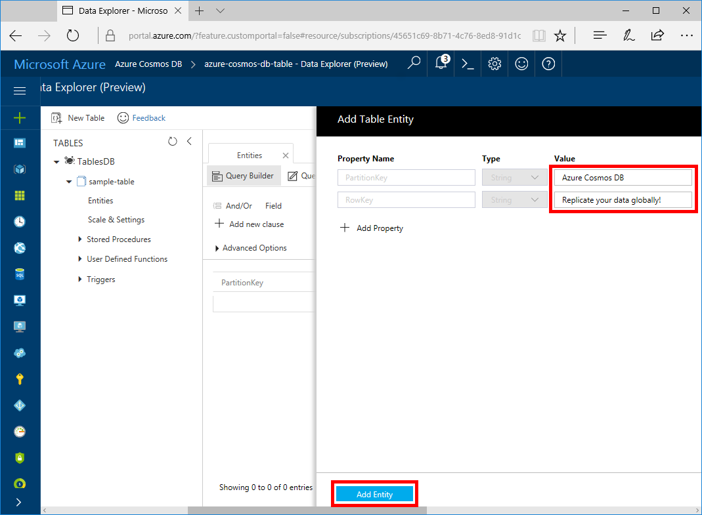
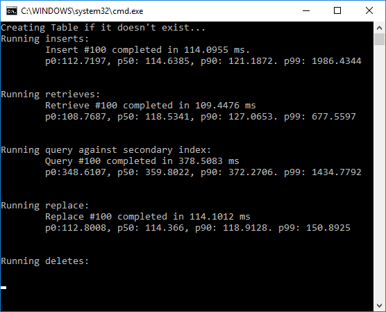
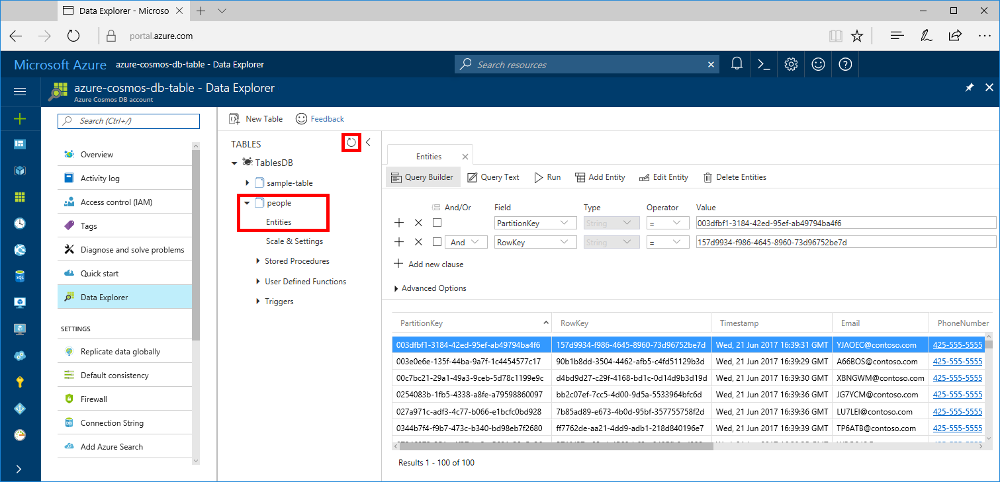

# Azure Cosmos DB: Build a .NET application using the Table API

Azure Cosmos DB is Microsoft’s globally distributed multi-model database service. You can quickly create and query document, key/value, and graph databases, all of which benefit from the global distribution and horizontal scale capabilities at the core of Azure Cosmos DB. 

This quickstart demonstrates how to create an Azure Cosmos DB account, and create a table within that account using the Azure portal. You'll then write code to insert, update, and delete entities, and run some queries using the [Azure Cosmos DB Table API](https://aka.ms/tableapinuget) package from NuGet.

## Prerequisites

If you don’t already have Visual Studio 2017 installed, you can download and use the **free** [Visual Studio 2017 Community Edition](https://www.visualstudio.com/downloads/). Make sure that you enable **Azure development** during the Visual Studio setup.

[!INCLUDE [quickstarts-free-trial-note](../../includes/quickstarts-free-trial-note.md)]

## Create a database account

[!INCLUDE [cosmos-db-create-dbaccount-table](../../includes/cosmos-db-create-dbaccount-table.md)]

## Add a table

[!INCLUDE [cosmos-db-create-table](../../includes/cosmos-db-create-table.md)]

## Add sample data

You can now add data to your new table using Data Explorer.

1. In Data Explorer, expand **sample-table**, click **Entities**, and then click **Add Entity**.

   
2. Now add data to the PartitionKey value box and RowKey value boxes, and click **Add Entity**.

   
  
    You can now add more entities to your table, edit your entities, or query your data in Data Explorer. Data Explorer is also where you can scale your throughput and add stored procedures, user defined functions, and triggers to your table.

## Clone the sample application

Now let's clone a Table app from github, set the connection string, and run it. You'll see how easy it is to work with data programmatically. 

1. Open a git terminal window, such as git bash, and use the `cd` command to change to a folder to install the sample app. 

    ```bash
    cd "C:\git-samples"
    ```

2. Run the following command to clone the sample repository. This command creates a copy of the sample app on your computer. 

    ```bash
    git clone https://github.com/Azure-Samples/azure-cosmos-db-table-dotnet-getting-started.git
    ```

3. Then open the solution file in Visual Studio. 

## Update your connection string

Now go back to the Azure portal to get your connection string information and copy it into the app. This enables your app to communicate with your hosted database. 

1. In the [Azure portal](http://portal.azure.com/), click **Connection String**. 

    Use the copy buttons on the right side of the screen to copy the CONNECTION STRING.

    

2. In Visual Studio, open the app.config file. 

3. Paste the CONNECTION STRING value into the app.config file as the value of the CosmosDBStorageConnectionString. 

    `<add key="CosmosDBStorageConnectionString" 
        value="DefaultEndpointsProtocol=https;AccountName=MYSTORAGEACCOUNT;AccountKey=AUTHKEY;TableEndpoint=https://account-name.table.cosmosdb.net" />`    

    > [!NOTE]
    > To use this app with Azure Table storage, you need to change the connection string in `app.config file`. Use the account name as Table-account name and key as Azure Storage Primary key. <br>
    >`<add key="StandardStorageConnectionString" value="DefaultEndpointsProtocol=https;AccountName=account-name;AccountKey=account-key;EndpointSuffix=core.windows.net" />`
    > 
    >

4. Save the app.config file.

You've now updated your app with all the info it needs to communicate with Azure Cosmos DB. 

## Review the code

Let's quickly review what's happening in the app. Open the Program.cs file and you'll find that these lines of code create the Azure Cosmos DB resources. 

* The CloudTableClient is initialized.

    ```csharp
    CloudStorageAccount storageAccount = CloudStorageAccount.Parse(connectionString); 
    CloudTableClient tableClient = storageAccount.CreateCloudTableClient();
    ```

* A new table is created if it does not exist.

    ```csharp
    CloudTable table = tableClient.GetTableReference("people");
    table.CreateIfNotExists();
    ```

* A series of steps are executed on the table using the `TableOperation` class.

   ```csharp
   TableOperation insertOperation = TableOperation.Insert(item);
   table.Execute(insertOperation);
   ```
   
   ```csharp
   TableOperation retrieveOperation = TableOperation.Retrieve<T>(items[i].PartitionKey, items[i].RowKey);
   table.Execute(retrieveOperation);
   ```
   
   ```csharp
   TableOperation deleteOperation = TableOperation.Delete(items[i]);
   table.Execute(deleteOperation);
   ```

## Build and deploy the app

1. In Visual Studio, right-click on the **CosmosDBTableGetStarted** project in **Solution Explorer** and then click **Manage NuGet Packages**. 

2. In the NuGet **Browse** box, type *Microsoft.Azure.CosmosDB.Table*.

3. From the results, install the **Microsoft.Azure.CosmosDB.Table** library. This installs the Azure Cosmos DB Table API package as well as all dependencies.

4. Add a breakpoint on line 196 of the Program.cs file so that the program stops before the new entities are deleted from the table. 

4. Click CTRL + F5 to run the application.

    The console window displays the data being added, retrieved, queried, and replaced in the table. 
    
    

5. You can now go back to Data Explorer, click **Refresh**, expand the **people** table and click **Entities**, and then work with this new data. 

    

    If you want to delete the entities from the table, disable the breakpoint and continue the app execution. When the script completes, press any key to close the console window. 

## Review SLAs in the Azure portal

[!INCLUDE [cosmosdb-tutorial-review-slas](../../includes/cosmos-db-tutorial-review-slas.md)]

## Clean up resources

If you're not going to continue to use this app, delete all resources created by this quickstart in the Azure portal with the following steps: 

1. From the left-hand menu in the Azure portal, click **Resource groups** and then click the name of the resource you created. 
2. On your resource group page, click **Delete**, type the name of the resource to delete in the text box, and then click **Delete**.

## Next steps

In this quickstart, you've learned how to create an Azure Cosmos DB account, create a table using the Data Explorer, and run an app.  Now you can query your data using the Table API.  

> [!div class="nextstepaction"]
> [Query using the Table API](tutorial-query-table.md)

