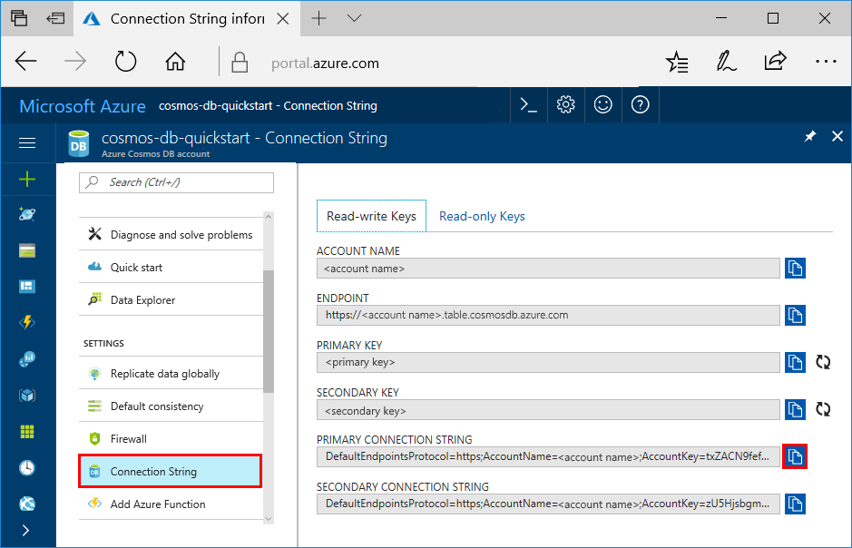
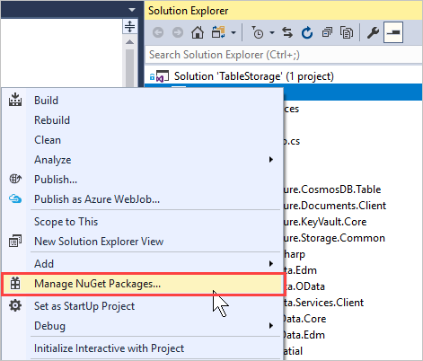
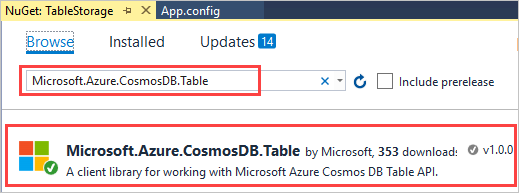
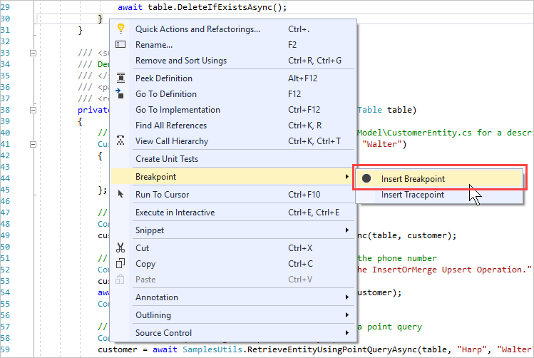
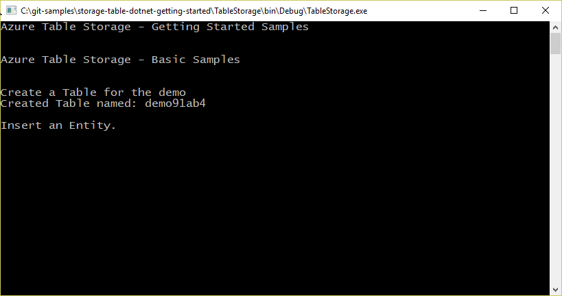
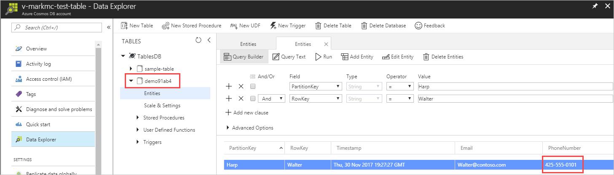

# Quickstart: Build a Table API app with .NET SDK and Azure Cosmos DB 

> [!div class="op_single_selector"]
> * [.NET](create-table-dotnet.md)
> * [Java](create-table-java.md)
> * [Node.js](create-table-nodejs.md)
> * [Python](create-table-python.md)
>  

This quickstart shows how to use .NET and the Azure Cosmos DB [Table API](table-introduction.md) to build an app by cloning an example from GitHub. This quickstart also shows you how to create an Azure Cosmos DB account and how to use Data Explorer to create tables and entities in the web-based Azure portal.

## Prerequisites

If you don’t already have Visual Studio 2019 installed, you can download and use the **free** [Visual Studio 2019 Community Edition](https://www.visualstudio.com/downloads/). Make sure that you enable **Azure development** during the Visual Studio setup.

[!INCLUDE [quickstarts-free-trial-note](../../includes/quickstarts-free-trial-note.md)]

## Create a database account

[!INCLUDE [cosmos-db-create-dbaccount-table](../../includes/cosmos-db-create-dbaccount-table.md)]

## Add a table

[!INCLUDE [cosmos-db-create-table](../../includes/cosmos-db-create-table.md)]

## Add sample data

[!INCLUDE [cosmos-db-create-table-add-sample-data](../../includes/cosmos-db-create-table-add-sample-data.md)]

## Clone the sample application

Now let's clone a Table app from GitHub, set the connection string, and run it. You'll see how easy it is to work with data programmatically. 

1. Open a command prompt, create a new folder named git-samples, then close the command prompt.

   ```bash
   md "C:\git-samples"
   ```

2. Open a git terminal window, such as git bash, and use the `cd` command to change to the new folder to install the sample app.

   ```bash
   cd "C:\git-samples"
   ```

3. Run the following command to clone the sample repository. This command creates a copy of the sample app on your computer.

   ```bash
   git clone https://github.com/Azure-Samples/azure-cosmos-table-dotnet-core-getting-started.git
   ```

## Open the sample application in Visual Studio

1. In Visual Studio, from the **File** menu, choose **Open**, then choose **Project/Solution**. 

    

2. Navigate to the folder where you cloned the sample application and open the TableStorage.sln file.

## Update your connection string

Now go back to the Azure portal to get your connection string information and copy it into the app. This enables your app to communicate with your hosted database. 

1. In the [Azure portal](https://portal.azure.com/), click **Connection String**. Use the copy button on the right side of the window to copy the **PRIMARY CONNECTION STRING**.

   

2. In Visual Studio, open the **Settings.json** file. 

3. Paste the **PRIMARY CONNECTION STRING** from the portal into the StorageConnectionString value. Paste the string inside the quotes.

   ```csharp
   {
      "StorageConnectionString": "<Primary connection string from Azure portal>"
   }
   ```

4. Press CTRL+S to save the **Settings.json** file.

You've now updated your app with all the info it needs to communicate with Azure Cosmos DB. 

## Build and deploy the app

1. In Visual Studio, right-click on the **CosmosTableSamples** project in **Solution Explorer** and then click **Manage NuGet Packages**. 

   

2. In the NuGet **Browse** box, type Microsoft.Azure.Cosmos.Table. This will find the Cosmos DB Table API client library. Note that this library is currently available for .NET Framework and .NET Standard. 
   
   

3. Click **Install** to install the **Microsoft.Azure.Cosmos.Table** library. This installs the Azure Cosmos DB Table API package and all dependencies.

4. When you run the entire app, sample data is inserted into the table entity and deleted at the end so you won’t see any data inserted if you run the whole sample. However you can insert some breakpoints to view the data. Open BasicSamples.cs file and right-click on line 52, select **Breakpoint**, then select **Insert Breakpoint**. Insert another breakpoint on line 55.

    

5. Press F5 to run the application. The console window displays the name of the new table database (in this case, demoa13b1) in Azure Cosmos DB. 
    
   

   When you hit the first breakpoint, go back to Data Explorer in the Azure portal. Click the **Refresh** button, expand the demo* table, and click **Entities**. The **Entities** tab on the right shows the new entity that was added for Walter Harp. Note that the phone number for the new entity is 425-555-0101.

   
    
   If you receive an error that says Settings.json file can’t be found when running the project, you can resolve it by adding the following XML entry to the project settings. Right click on CosmosTableSamples, select Edit CosmosTableSamples.csproj and add the following itemGroup: 

   ```csharp
     <ItemGroup>
       <None Update="Settings.json">
         <CopyToOutputDirectory>PreserveNewest</CopyToOutputDirectory>
       </None>
     </ItemGroup>
   ```

6. Close the **Entities** tab in Data Explorer.
    
7. Press F5 to run the app to the next breakpoint. 

    When you hit the breakpoint, switch back to the Azure portal, click **Entities** again to open the **Entities** tab, and note that the phone number has been updated to 425-555-0105.

8. Press F5 to run the app. 
 
   The app adds entities for use in an advanced sample app that the Table API currently does not support. The app then deletes the table created by the sample app.

9. In the console window, press Enter to end the execution of the app. 
  

## Review SLAs in the Azure portal

[!INCLUDE [cosmosdb-tutorial-review-slas](../../includes/cosmos-db-tutorial-review-slas.md)]

## Clean up resources

[!INCLUDE [cosmosdb-delete-resource-group](../../includes/cosmos-db-delete-resource-group.md)]

## Next steps

In this quickstart, you've learned how to create an Azure Cosmos DB account, create a table using the Data Explorer, and run an app.  Now you can query your data using the Table API.  

> [!div class="nextstepaction"]
> [Import table data to the Table API](table-import.md)

