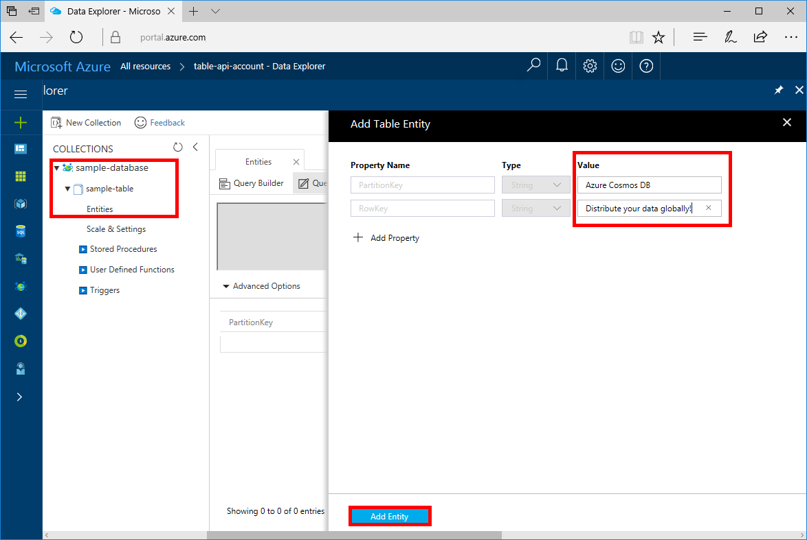

# Azure Cosmos DB: Build a .NET application using the Table API

Azure Cosmos DB is Microsoft’s globally distributed multi-model database service. You can quickly create and query document, key/value, and graph databases, all of which benefit from the global distribution and horizontal scale capabilities at the core of Azure Cosmos DB. 

This quick start demonstrates how to create an Azure Cosmos DB account, and create a table within that account using the Azure portal. You'll then write code to insert, update, and delete entities, and run some queries using the new [Windows Azure Storage Premium Table](https://aka.ms/premiumtablenuget) (preview) package from NuGet. This library has the same classes and method signatures as the public [Windows Azure Storage SDK](https://www.nuget.org/packages/WindowsAzure.Storage), but also has the ability to connect to Azure Cosmos DB accounts using the [Table API](table-introduction.md) (preview). 

## Prerequisites

If you don’t already have Visual Studio 2017 installed, you can download and use the **free** [Visual Studio 2017 Community Edition](https://www.visualstudio.com/downloads/). Make sure that you enable **Azure development** during the Visual Studio setup.

[!INCLUDE [quickstarts-free-trial-note](../../includes/quickstarts-free-trial-note.md)]

## Create a database account

[!INCLUDE [cosmos-db-create-dbaccount-table](../../includes/cosmos-db-create-dbaccount-table.md)]

## Add a table

[!INCLUDE [cosmos-db-create-table](../../includes/cosmos-db-create-table.md)]

## Add sample data

You can now add data to your new table using Data Explorer.

1. In Data Explorer, expand **sample-database**, **sample-table**, click **Entities**, and then click **Add Entity**.
2. Now add data to the PartitionKey value box and RowKey value box, and click **Add Entity**.

   
  
    You can now add more entities to your table, edit your entities, or query your data in Data Explorer. Data Explorer is also where you can scale your throughput and add stored procedures, user defined functions, and triggers to your table.

## Clone the sample application

Now let's clone a  DocumentDB API app from github, set the connection string, and run it. You'll see how easy it is to work with data programmatically. 

1. Open a git terminal window, such as git bash, and `cd` to a working directory.  

2. Run the following command to clone the sample repository. 

    ```bash
    git clone https://github.com/Azure-Samples/azure-cosmos-db-table-dotnet-getting-started.git
    ```

3. Then open the solution file in Visual Studio. 

## Review the code

Let's make a quick review of what's happening in the app. Open the Program.cs file and you'll find that these lines of code create the Azure Cosmos DB resources. 

* The CloudTableClient is initialized.

    ```csharp
    CloudStorageAccount storageAccount = CloudStorageAccount.Parse(connectionString); 
    CloudTableClient tableClient = storageAccount.CreateCloudTableClient();
    ```

* A new table is created if it does not exist.

    ```csharp
    CloudTable table = tableClient.GetTableReference("people");
    table.CreateIfNotExists();
    ```

* A new Table container is created. You will notice this code very similar to regular Azure Table storage SDK 

    ```csharp
    CustomerEntity item = new CustomerEntity()
                {
                    PartitionKey = Guid.NewGuid().ToString(),
                    RowKey = Guid.NewGuid().ToString(),
                    Email = $"{GetRandomString(6)}@contoso.com",
                    PhoneNumber = "425-555-0102",
                    Bio = GetRandomString(1000)
                };
    ```

## Update your connection string

Now go back to the Azure portal to get your connection string information and copy it into the app.

1. In the [Azure portal](http://portal.azure.com/), in your Azure Cosmos DB account, in the left navigation click **Keys**, and then click **Read-write Keys**. You'll use the copy buttons on the right side of the screen to copy the URI and Primary Key into the app.config file in the next step.

    

2. In Visual Studio, open the app.config file. 

3. Copy your Azure Cosmos DB account name from the portal and make it the value of the AccountName in the PremiumStorageConnection string value in app.config. In the screenshot above, the account name is cosmos-db-quickstart. Your account name is in displayed at the top of the portal.

    `<add key="PremiumStorageConnectionString" 
        value="DefaultEndpointsProtocol=https;AccountName=MYSTORAGEACCOUNT;AccountKey=AUTHKEY;TableEndpoint=https://COSMOSDB.documents.azure.com" />`

4. Then copy your PRIMARY KEY value from the portal and make it the value of the AccountKey in PremiumStorageConnectionString. 

    `AccountKey=AUTHKEY`

5. Finally, copy your URI value from the Keys page of the portal (using the copy button) and make it the value of the TableEndpoint of the PremiumStorageConnectionString.

    `TableEndpoint=https://COSMOSDB.documents.azure.com`

    You can leave the StandardStorageConnectionString as is.

You've now updated your app with all the info it needs to communicate with Azure Cosmos DB. 

## Run the web app

1. In Visual Studio, right-click on the project in **Solution Explorer** and then click **Manage NuGet Packages**. 

2. In the NuGet **Browse** box, type *WindowsAzure.Storage* and check the **Include prerelease** box. 

3. From the results, install the **Windows Azure Storage Premium Table** library. This installs the preview Azure Cosmos DB Table API package as well as all dependencies. Note that this is a different NuGet package than the Windows Azure Storage package used by Azure Table storage. 

4. Click CTRL + F5 to run the application.

    The console window displays the data being added to the table. When the script completes, close the console window. 

You can now go back to Data Explorer and see query, modify, and work with this new data. 

## Review SLAs in the Azure portal

[!INCLUDE [cosmosdb-tutorial-review-slas](../../includes/cosmos-db-tutorial-review-slas.md)]

## Clean up resources

If you're not going to continue to use this app, delete all resources created by this quickstart in the Azure portal with the following steps: 

1. From the left-hand menu in the Azure portal, click **Resource groups** and then click the name of the resource you created. 
2. On your resource group page, click **Delete**, type the name of the resource to delete in the text box, and then click **Delete**.

## Next steps

In this quickstart, you've learned how to create an Azure Cosmos DB account, create a table using the Data Explorer, and run an app.  Now you can query your data using the Table API.  

> [!div class="nextstepaction"]
> [Query using the Table API](tutorial-query-table.md)

