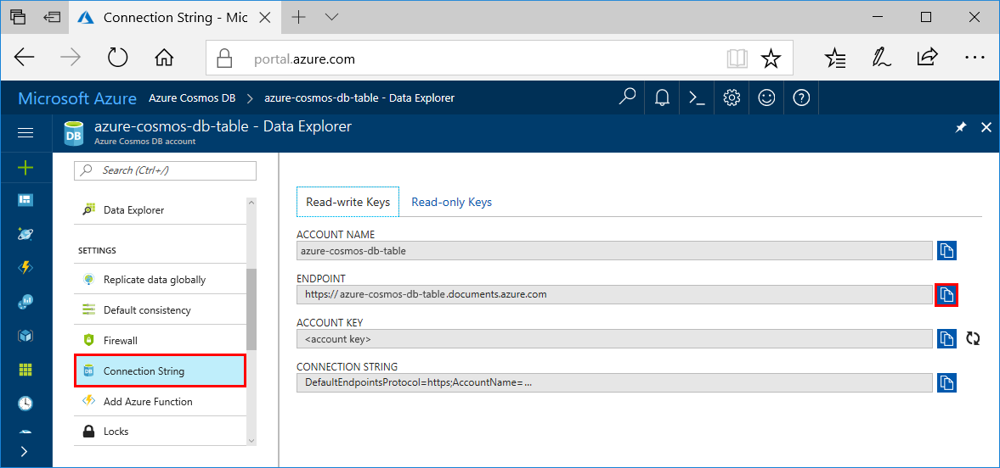

# Azure Cosmos DB: Build a Java application using the Table API

Azure Cosmos DB is Microsoft’s globally distributed multi-model database service. You can quickly create and query document, key/value, wide-column, and graph databases, all of which benefit from the global distribution and horizontal scale capabilities at the core of Azure Cosmos DB. 

This quick start demonstrates how to create an Azure Cosmos DB [Table API](table-introduction.md) account by using the Azure portal. You'll then clone and run a sample from github that inserts, updates, queries, and deletes entities in a table by using Java and the Azure Cosmos DB Table API.

## Prerequisites

[!INCLUDE [quickstarts-free-trial-note](../../includes/quickstarts-free-trial-note.md)]
[!INCLUDE [cosmos-db-emulator-docdb-api](../../includes/cosmos-db-emulator-docdb-api.md)]

In addition: 

* [Java Development Kit (JDK) 1.7+](http://www.oracle.com/technetwork/java/javase/downloads/jdk8-downloads-2133151.html)
    * On Ubuntu, run `apt-get install default-jdk` to install the JDK.
    * Be sure to set the JAVA_HOME environment variable to point to the folder where the JDK is installed.
* [Download](http://maven.apache.org/download.cgi) and [install](http://maven.apache.org/install.html) a [Maven](http://maven.apache.org/) binary archive
    * On Ubuntu, you can run `apt-get install maven` to install Maven.
* [Git](https://www.git-scm.com/)
    * On Ubuntu, you can run `sudo apt-get install git` to install Git.

## Create a database account

[!INCLUDE [cosmos-db-create-dbaccount-table](../../includes/cosmos-db-create-dbaccount-table.md)]

## Add a table

[!INCLUDE [cosmos-db-create-table](../../includes/cosmos-db-create-table.md)]

## Add sample data

You can now add data to your new table using Data Explorer.

1. In Data Explorer, expand **sample-table**, click **Entities**, and then click **Add Entity**.

   
2. Now add data to the PartitionKey value box and RowKey value boxes, and click **Add Entity**.

   
  
    You can now add more entities to your table, edit your entities, or query your data in Data Explorer. Data Explorer is also where you can scale your throughput and add stored procedures, user defined functions, and triggers to your table.

## Clone the sample application

Now let's clone a Table app from github, set the connection string, and run it. You'll see how easy it is to work with data programmatically. 

1. Open a git terminal window, such as git bash, and use the `cd` command to change to a folder to install the sample app. 

    ```bash
    cd "C:\git-samples"
    ```

2. Run the following command to clone the sample repository. This command creates a copy of the sample app on your computer. 

    ```bash
    git clone https://github.com/Azure-Samples/storage-table-java-getting-started.git 
    ```

3. Then open the solution file in Visual Studio. 

## Update your connection string

Now go back to the Azure portal to get your connection string information and copy it into the app. This enables your app to communicate with your hosted database. 

1. In the [Azure portal](http://portal.azure.com/), click **Connection String**. 

    Use the copy buttons on the right side of the screen to copy the CONNECTION STRING.

    

2. In Visual Studio, open the app.config file. 

3. Paste the CONNECTION STRING value into the app.config file as the value of the CosmosDBStorageConnectionString. 

    `<add key="CosmosDBStorageConnectionString" 
        value="DefaultEndpointsProtocol=https;AccountName=MYSTORAGEACCOUNT;AccountKey=AUTHKEY;TableEndpoint=https://account-name.table.cosmosdb.net" />`    

    > [!NOTE]
    > To use this app with Azure Table storage, you need to change the connection string in `app.config file`. Use the account name as Table-account name and key as Azure Storage Primary key. <br>
    >`<add key="StandardStorageConnectionString" value="DefaultEndpointsProtocol=https;AccountName=account-name;AccountKey=account-key;EndpointSuffix=core.windows.net" />`
    > 
    >

4. Save the app.config file.

You've now updated your app with all the info it needs to communicate with Azure Cosmos DB. 

## Run the app

1. In the git terminal window, `cd` to the azure-cosmos-db-documentdb-java-getting-started folder.

    ```git
    cd "C:\git-samples\azure-cosmos-db-documentdb-java-getting-started"
    ```

2. In the git terminal window, type `mvn package` to install the required Java packages.

3. In the git terminal window, run `mvn exec:java -D exec.mainClass=GetStarted.Program` to start the Java application.

    The terminal window displays a notification that the FamilyDB database was created. Press a key to create the collection, then switch to the Data Explorer and you'll see that it now contains a FamilyDB database.
    
    Continue to press keys to create the documents and then perform a query.
    
    At the end of the program, all the resources from this app are deleted from your account so that you don't incur any charges.  

## Review SLAs in the Azure portal

[!INCLUDE [cosmosdb-tutorial-review-slas](../../includes/cosmos-db-tutorial-review-slas.md)]

## Clean up resources

If you're not going to continue to use this app, delete all resources created by this quickstart in the Azure portal with the following steps: 

1. From the left-hand menu in the Azure portal, click **Resource groups** and then click the name of the resource you created. 
2. On your resource group page, click **Delete**, type the name of the resource to delete in the text box, and then click **Delete**.

## Next steps

In this quickstart, you've learned how to create an Azure Cosmos DB account, create a table using the Data Explorer, and run an app.  Now you can query your data using the Table API.  

> [!div class="nextstepaction"]
> [Query using the Table API](tutorial-query-table.md)
