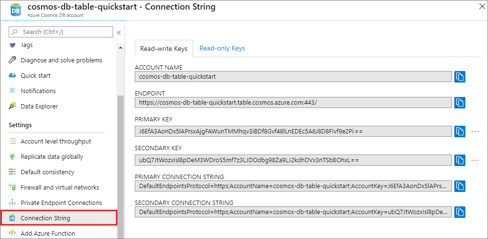

# Quickstart: Build a Java app to manage Azure Cosmos DB Table API data

> [!div class="op_single_selector"]
> * [.NET](create-table-dotnet.md)
> * [Java](create-table-java.md)
> * [Node.js](create-table-nodejs.md)
> * [Python](create-table-python.md)
> 

In this quickstart, you create an Azure Cosmos DB Table API account, and use Data Explorer and a Java app cloned from GitHub to create tables and entities. Azure Cosmos DB is a multi-model database service that lets you quickly create and query document, table, key-value, and graph databases with global distribution and horizontal scale capabilities.

## Prerequisites

- An Azure account with an active subscription. [Create one for free](https://azure.microsoft.com/free/?ref=microsoft.com&utm_source=microsoft.com&utm_medium=docs&utm_campaign=visualstudio). Or [try Azure Cosmos DB for free](https://azure.microsoft.com/try/cosmosdb/) without an Azure subscription. You can also use the [Azure Cosmos DB Emulator](https://aka.ms/cosmosdb-emulator) with a URI of `https://localhost:8081` and the key `C2y6yDjf5/R+ob0N8A7Cgv30VRDJIWEHLM+4QDU5DE2nQ9nDuVTqobD4b8mGGyPMbIZnqyMsEcaGQy67XIw/Jw==`.
- [Java Development Kit (JDK) 8](https://www.azul.com/downloads/azure-only/zulu/?&version=java-8-lts&architecture=x86-64-bit&package=jdk). Point your `JAVA_HOME` environment variable to the folder where the JDK is installed.
- A [Maven binary archive](https://maven.apache.org/download.cgi). 
- [Git](https://www.git-scm.com/downloads). 

## Create a database account

> [!IMPORTANT] 
> You need to create a new Table API account to work with the generally available Table API SDKs. Table API accounts created during preview are not supported by the generally available SDKs.
>

[!INCLUDE [cosmos-db-create-dbaccount-table](../../includes/cosmos-db-create-dbaccount-table.md)]

## Add a table

[!INCLUDE [cosmos-db-create-table](../../includes/cosmos-db-create-table.md)]

## Add sample data

[!INCLUDE [cosmos-db-create-table-add-sample-data](../../includes/cosmos-db-create-table-add-sample-data.md)]

## Clone the sample application

Now let's clone a Table app from GitHub, set the connection string, and run it. You'll see how easy it is to work with data programmatically. 

1. Open a command prompt, create a new folder named git-samples, then close the command prompt.

    ```bash
    md "C:\git-samples"
    ```

2. Open a git terminal window, such as git bash, and use the `cd` command to change to the new folder to install the sample app.

    ```bash
    cd "C:\git-samples"
    ```

3. Run the following command to clone the sample repository. This command creates a copy of the sample app on your computer.

    ```bash
    git clone https://github.com/Azure-Samples/storage-table-java-getting-started.git 
    ```

## Update your connection string

Now go back to the Azure portal to get your connection string information and copy it into the app. This enables your app to communicate with your hosted database. 

1. In your Azure Cosmos DB account in the [Azure portal](https://portal.azure.com/), select **Connection String**. 

   

2. Copy the PRIMARY CONNECTION STRING using the copy button on the right.

3. Open *config.properties* from the *C:\git-samples\storage-table-java-getting-started\src\main\resources* folder. 

5. Comment out line one and uncomment line two. The first two lines should now look like this.

    ```xml
    #StorageConnectionString = UseDevelopmentStorage=true
    StorageConnectionString = DefaultEndpointsProtocol=https;AccountName=[ACCOUNTNAME];AccountKey=[ACCOUNTKEY]
    ```

6. Paste your PRIMARY CONNECTION STRING from the portal into the StorageConnectionString value in line 2. 

    > [!IMPORTANT]
    > If your Endpoint uses documents.azure.com, that means you have a preview account, and you need to create a [new Table API account](#create-a-database-account) to work with the generally available Table API SDK.
    >

7. Save the *config.properties* file.

You've now updated your app with all the info it needs to communicate with Azure Cosmos DB. 

## Run the app

1. In the git terminal window, `cd` to the storage-table-java-getting-started folder.

    ```git
    cd "C:\git-samples\storage-table-java-getting-started"
    ```

2. In the git terminal window, run the following commands to run the Java application.

    ```git
    mvn compile exec:java 
    ```

    The console window displays the table data being added to the new table database in Azure Cosmos DB.

    You can now go back to Data Explorer and see, query, modify, and work with this new data. 

## Review SLAs in the Azure portal

[!INCLUDE [cosmosdb-tutorial-review-slas](../../includes/cosmos-db-tutorial-review-slas.md)]

## Clean up resources

[!INCLUDE [cosmosdb-delete-resource-group](../../includes/cosmos-db-delete-resource-group.md)]

## Next steps

In this quickstart, you learned how to create an Azure Cosmos DB account, create a table using the Data Explorer, and run a Java app to add table data.  Now you can query your data using the Table API.  

> [!div class="nextstepaction"]
> [Import table data to the Table API](table-import.md)
