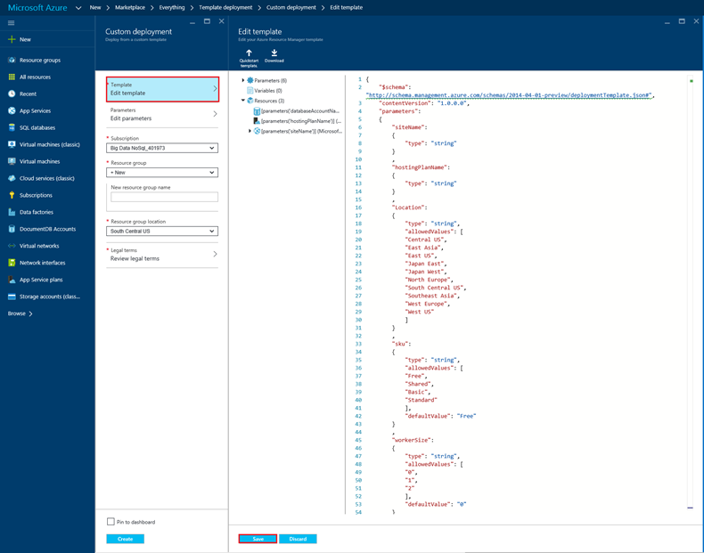
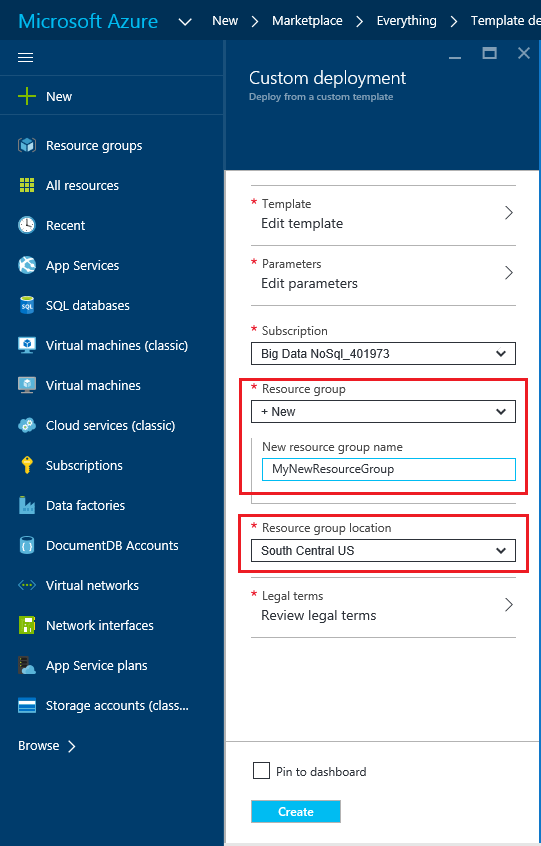
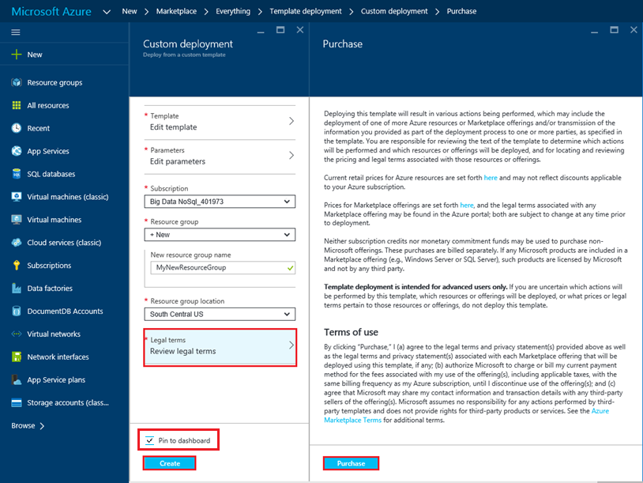
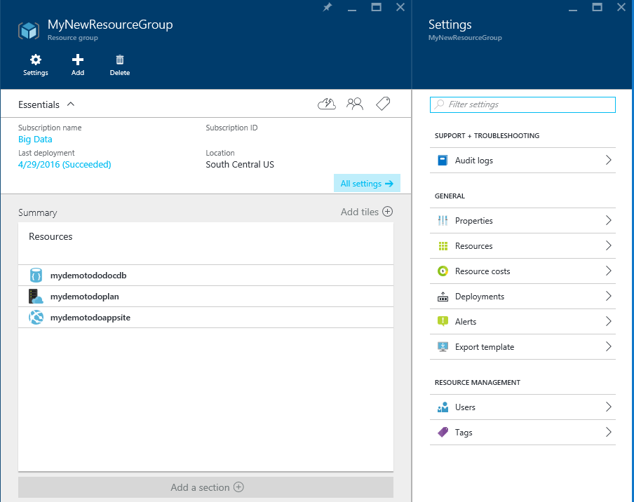
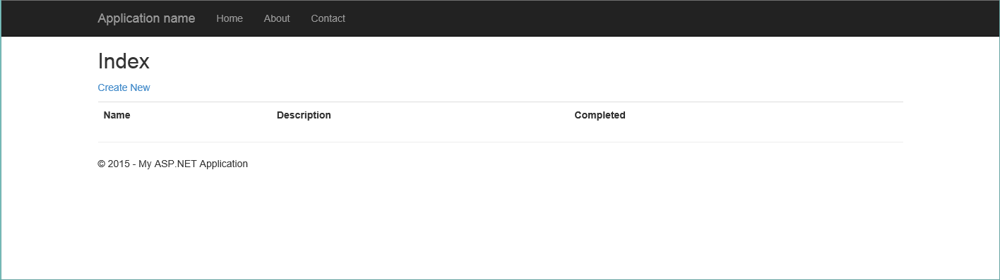
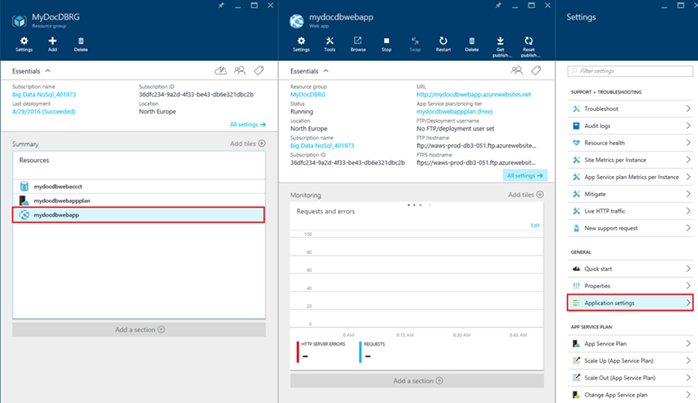

# Deploy Azure Cosmos DB and Azure App Service Web Apps using an Azure Resource Manager Template
This tutorial shows you how to use an Azure Resource Manager template to deploy and integrate [Microsoft Azure Cosmos DB](https://azure.microsoft.com/services/cosmos-db/), an [Azure App Service](https://go.microsoft.com/fwlink/?LinkId=529714) web app, and a sample web application.

Using Azure Resource Manager templates, you can easily automate the deployment and configuration of your Azure resources.  This tutorial shows how to deploy a web application and automatically configure Azure Cosmos DB account connection information.

After completing this tutorial, you will be able to answer the following questions:  

* How can I use an Azure Resource Manager template to deploy and integrate an Azure Cosmos DB account and a web app in Azure App Service?
* How can I use an Azure Resource Manager template to deploy and integrate an Azure Cosmos DB account, a web app in App Service Web Apps, and a Webdeploy application?

## Prerequisites
> [!TIP]
> While this tutorial does not assume prior experience with Azure Resource Manager templates or JSON, should you wish to modify the referenced templates or deployment options, then knowledge of each of these areas is required.
> 
> 

Before following the instructions in this tutorial, ensure that you have the an Azure subscription. Azure is a subscription-based platform.  For more information about obtaining a subscription, see [Purchase Options](https://azure.microsoft.com/pricing/purchase-options/), [Member Offers](https://azure.microsoft.com/pricing/member-offers/), or [Free Trial](https://azure.microsoft.com/pricing/free-trial/).

## Step 1: Download the template files
Let's start by downloading the template files that this tutorial requires.

1. Download the [Create an Azure Cosmos DB account, Web Apps, and deploy a demo application sample](https://portalcontent.blob.core.windows.net/samples/DocDBWebsiteTodo.json) template to a local folder (for example, C:\Azure Cosmos DBTemplates). This template deploys an Azure Cosmos DB account, an App Service web app, and a web application.  It also automatically configures the web application to connect to the Azure Cosmos DB account.
2. Download the [Create an Azure Cosmos DB account and Web Apps sample](https://portalcontent.blob.core.windows.net/samples/DocDBWebSite.json) template to a local folder (for example, C:\Azure Cosmos DBTemplates). This template deploys an Azure Cosmos DB account, an App Service web app, and modifies the site's application settings to easily surface Azure Cosmos DB connection information, but does not include a web application.  

## Step 2: Deploy the Azure Cosmos DB account, App Service web app, and demo application sample
Now let's deploy your first template.

> [!TIP]
> The template does not validate that the web app name and Azure Cosmos DB account name entered in the following template are a) valid and b) available.  It is highly recommended that you verify the availability of the names you plan to supply prior to submitting the deployment.
> 
> 

1. Login to the [Azure Portal](https://portal.azure.com), click New and search for "Template deployment".
    
2. Select the Template deployment item and click **Create**
    
3. Click **Edit template**, paste the contents of the DocDBWebsiteTodo.json template file, and click **Save**.
   
4. Click **Edit parameters**, provide values for each of the mandatory parameters, and click **OK**.  The parameters are as follows:
   
   1. SITENAME: Specifies the App Service web app name and is used to construct the URL that you use to access the web app (for example, if you specify "mydemodocdbwebapp", then the URL by which you access the web app is mydemodocdbwebapp.azurewebsites.net).
   2. HOSTINGPLANNAME: Specifies the name of App Service hosting plan to create.
   3. LOCATION: Specifies the Azure location in which to create the Azure Cosmos DB and web app resources.
   4. DATABASEACCOUNTNAME: Specifies the name of the Azure Cosmos DB account to create.   
      
      
5. Choose an existing Resource group or provide a name to make a new resource group, and choose a location for the resource group.

    
6. Click **Review legal terms**, **Purchase**, and then click **Create** to begin the deployment.  Select **Pin to dashboard** so the resulting deployment is easily visible on your Azure portal home page.
   
7. When the deployment finishes, the Resource group pane opens.
     
8. To use the application, navigate to the web app URL (in the example above, the URL would be http://mydemodocdbwebapp.azurewebsites.net).  You'll see the following web application:
   
   
9. Go ahead and create a couple of tasks in the web app and then return to the Resource group pane in the Azure portal. Click the Azure Cosmos DB account resource in the Resources list and then click **Data Explorer**.
10. Run the default query, "SELECT * FROM c" and inspect the results.  Notice that the query has retrieved the JSON representation of the todo items you created in step 7 above.  Feel free to experiment with queries; for example, try running SELECT * FROM c WHERE c.isComplete = true to return all todo items that have been marked as complete.
11. Feel free to explore the Azure Cosmos DB portal experience or modify the sample Todo application.  When you're ready, let's deploy another template.

 

## Step 3: Deploy the Document account and web app sample
Now let's deploy your second template.  This template is useful to show how you can inject Azure Cosmos DB connection information such as account endpoint and master key into a web app as application settings or as a custom connection string. For example, perhaps you have your own web application that you would like to deploy with an Azure Cosmos DB account and have the connection information automatically populated during deployment.

> [!TIP]
> The template does not validate that the web app name and Azure Cosmos DB account name entered below are a) valid and b) available.  It is highly recommended that you verify the availability of the names you plan to supply prior to submitting the deployment.
> 
> 

1. In the [Azure Portal](https://portal.azure.com), click New and search for "Template deployment".
    
2. Select the Template deployment item and click **Create**
    
3. Click **Edit template**, paste the contents of the DocDBWebSite.json template file, and click **Save**.
   
4. Click **Edit parameters**, provide values for each of the mandatory parameters, and click **OK**.  The parameters are as follows:
   
   1. SITENAME: Specifies the App Service web app name and is used to construct the URL that you will use to access the web app (for example, if you specify "mydemodocdbwebapp", then the URL by which you access the web app is mydemodocdbwebapp.azurewebsites.net).
   2. HOSTINGPLANNAME: Specifies the name of App Service hosting plan to create.
   3. LOCATION: Specifies the Azure location in which to create the Azure Cosmos DB and web app resources.
   4. DATABASEACCOUNTNAME: Specifies the name of the Azure Cosmos DB account to create.   
      
      
5. Choose an existing Resource group or provide a name to make a new resource group, and choose a location for the resource group.

    
6. Click **Review legal terms**, **Purchase**, and then click **Create** to begin the deployment.  Select **Pin to dashboard** so the resulting deployment is easily visible on your Azure portal home page.
   
7. When the deployment finishes, the Resource group pane opens.
     
8. Click the Web App resource in the Resources list and then click **Application settings**
      
9. Note how there are application settings present for the Azure Cosmos DB endpoint and each of the Azure Cosmos DB master keys.

      
10. Feel free to continue exploring the Azure Portal, or follow one of our Azure Cosmos DB [samples](https://go.microsoft.com/fwlink/?LinkID=402386) to create your own Azure Cosmos DB application.

## Next steps
Congratulations! You've deployed Azure Cosmos DB, App Service web app and a sample web application using Azure Resource Manager templates.

* To learn more about Azure Cosmos DB, click [here](https://azure.microsoft.com/services/cosmos-db/).
* To learn more about Azure App Service Web apps, click [here](https://go.microsoft.com/fwlink/?LinkId=325362).
* To learn more about Azure Resource Manager templates, click [here](https://msdn.microsoft.com/library/azure/dn790549.aspx).

## What's changed
* For a guide to the change from Websites to App Service see: [Azure App Service and Its Impact on Existing Azure Services](https://go.microsoft.com/fwlink/?LinkId=529714)

> [!NOTE]
> If you want to get started with Azure App Service before signing up for an Azure account, go to [Try App Service](https://go.microsoft.com/fwlink/?LinkId=523751), where you can immediately create a short-lived starter web app in App Service. No credit cards required; no commitments.
> 
> 

