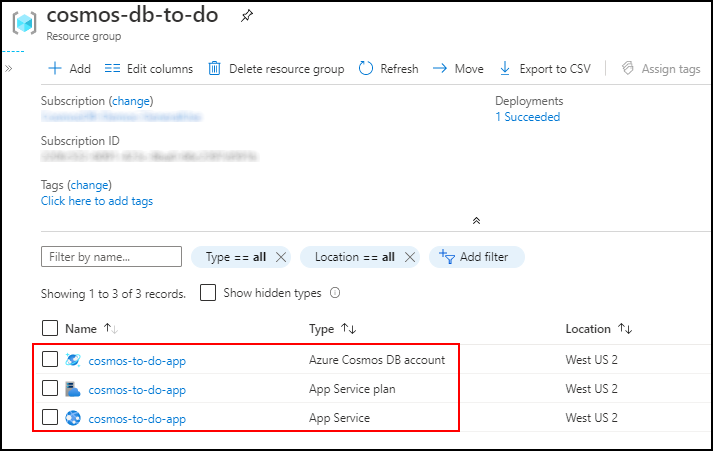
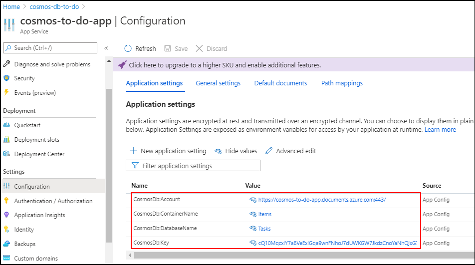
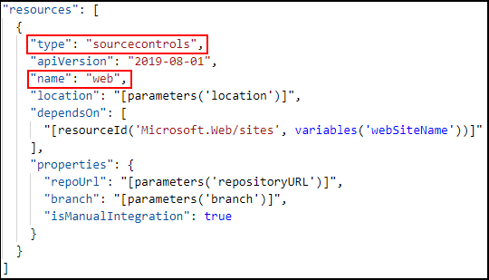

# Deploy Azure Cosmos DB and Azure App Service with a web app from Git Hub using an Azure Resource Manager Template

This tutorial shows you how to do a "no touch" deployment of a web application that connects to Azure Cosmos DB on first run without having to cut and paste any connection information from Cosmos DB to `appsettings.json` or to Azure App Services Application Settings in the Azure Portal. This can all be accomplished using an Azure Resource Manager template in a single operation. In the example here we will deploy the [Cosmos DB To Do Sample](https://github.com/Azure-Samples/cosmos-dotnet-core-todo-app) from our [Web App Tutorial](sql-api-dotnet-application.md).

Azure Resource Manager templates, are quite flexible and allow you to compose complex deployments across any service in Azure. This includes advanced tasks such as deploying applications from GitHub and injecting connection information into Azure App Service's Application Settings in the Azure Portal. This tutorial will show you how to do the following things using a single Azure Resource Manager template.

* Deploy an Azure Cosmos DB account.
* Deploy an Azure App Service Hosting Plan.
* Deploy an Azure App Service.
* Inject the endpoint and keys from the Cosmos DB account into the App Service Application Settings in the Azure Portal.
* Deploy a web application from a GitHub repository to the App Service.

The resulting deployment will have a fully functional web application that can connect to Cosmos DB without ever having to cut and paste the Cosmos DB endpoint uri or authentication keys from the Azure Portal.

## Prerequisites

> [!TIP]
> While this tutorial does not assume prior experience with Azure Resource Manager templates or JSON, should you wish to modify the referenced templates or deployment options, then knowledge of each of these areas is required.

## Step 1: Deploy the template

First, click the **Deploy to Azure** button below to open the Azure portal to create a custom deployment. You can also view the Azure Resource Management template from the [Azure Quickstart Templates Gallery](https://github.com/Azure/azure-quickstart-templates/tree/master/101-cosmosdb-webapp)

Once in the Azure Portal you will need to select the subscription to deploy into and select or create a new resource group. Then fill in the following values.

* **Region** - This is required by ARM. Enter the same region used by Location where your resources will be located.
* **Application Name** - This name will be used by all the resources for this deployment. Make sure to choose a unique name to avoid conflicts with existing Cosmos DB and App Service accounts.
* **Location** - The region where your resources will be deployed.
* **App Service Plan Tier** - App Service Plan's pricing tier.
* **App Service Plan Instances** - The number of workers for the app service plan.
* **Repository URL** - The repository to the web application on Git Hub.
* **Branch** - The branch for the GitHub repository.
* **Database Name** - The Cosmos DB database name.
* **Container Name** - The Cosmos DB container name.

After filling in the values, click the Create button to start the deployment. This step should take between 5 and 10 minutes to complete.

> [!TIP]
> The template does not validate that the Azure App Service name and Azure Cosmos DB account name entered in the template are valid and available. It is highly recommended that you verify the availability of the names you plan to supply prior to submitting the deployment.

## Step 2: Explore the resources

### View the deployed resources

Once the template has completed deploying the resources, you can now see each of them in your resource group.

### View Cosmos DB endpoint and keys

Next, open the Cosmos DB account in the portal. Below you can see the endpoint and keys for this Cosmos DB account.

### View Cosmos DB keys in Application Settings

Next, navigate to the Azure App Service in the resource group. Click the Configuration tab to view the Application Settings for the App Service. The Application Settings contains the Cosmos DB account and primary key values necessary to connect to Cosmos DB as well as the database and container names that were passed in from the template deployment.

### View web app in Deployment Center

Next go to the Deployment Center for the App Service. Here you will see Repository points to the GitHub repository passed in to the template. Also the Status below indicates Success(Active), meaning the application successfully deployed and started.

### Run the web application

Click **Browse** at the top of Deployment Center to open the web application. The web application will open up to the home screen. Click on **Create New** and enter some data into the fields and click Save. The resulting screen shows the data saved to Cosmos DB.

## Step 3: How does it work

There are three elements necessary for this to work.

### Reading app settings at runtime

First, the application needs to request the Cosmos DB endpoint and key in the `Startup` class in the ASP.NET MVC web application. The [Cosmos DB To Do Sample](https://github.com/Azure-Samples/cosmos-dotnet-core-todo-app) can run locally where you can enter the connection information into appsettings.json. However, when deployed, this file does deploy with the app. If these lines in red cannot access the settings from appsettings.json, it will try from Application Settings in Azure App Service.

### Using special Azure Resource Management functions

For these values to be available to the application when deployed, the Azure Resource Manager template can ask for those values from the Cosmos DB account using special Azure Resource Management functions including [reference](../azure-resource-manager/templates/template-functions-resource.md#reference) and [listKeys](../azure-resource-manager/templates/template-functions-resource.md#listkeys) which grab the values from the Cosmos DB account and insert them into the application settings values with key names that match what is used in the application above in a '{section:key}' format. For example, `CosmosDb:Account`.

### Deploying web apps from Git Hub

Lastly, we need to deploy the web application from GitHub into the App Service. This is done using the JSON below. Two things to be careful with are the type and name for this resource. Both the `"type": "sourcecontrols"` and `"name": "web"` property values are hard coded and should not be changed.

## Next steps

Congratulations! You've deployed Azure Cosmos DB, Azure App Service, and a sample web application that automatically has the connection info necessary to connect to Cosmos DB, all in a single operation and without having to cut and paste sensitive information. Using this template as a starting point, you can modify it to deploy your own web applications the same way.

* For the Azure Resource Manager Template for this sample go to [Azure Quickstart Templates Gallery](https://github.com/Azure/azure-quickstart-templates/tree/master/101-cosmosdb-webapp)
* For the source code for the sample app go to [Cosmos DB To Do App on GitHub](https://github.com/Azure-Samples/cosmos-dotnet-core-todo-app).
