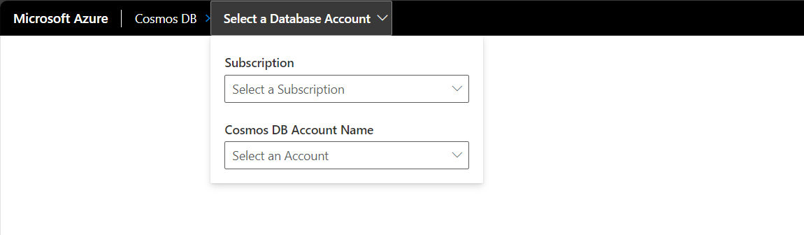
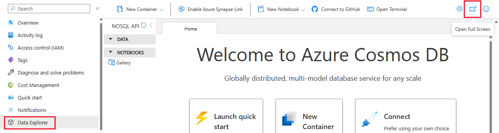
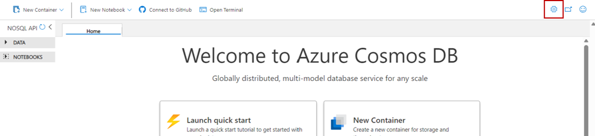
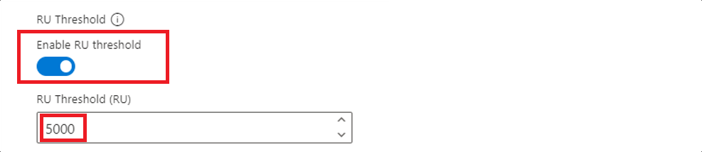

# Use the Azure Cosmos DB Explorer to manage your data

[!INCLUDE[NoSQL, MongoDB, Cassandra, Gremlin, Table](includes/appliesto-nosql-mongodb-cassandra-gremlin-table.md)]

Azure Cosmos DB Explorer is a standalone web-based interface that allows you to view and manage the data stored in Azure Cosmos DB. Azure Cosmos DB Explorer is equivalent to the existing **Data Explorer** section that is available in Azure portal for Azure Cosmos DB accounts.

The Azure Cosmos DB Explorer has a few key advantages when compared to the Data explorer, including:

- Full screen real-estate to browse data, run queries, and observe query results
- Ability to provide users without access to the Azure portal or an Azure subscription read or read-write capabilities over data in containers
- Ability to share query results with users who don't have an Azure subscription or Azure portal access

## Prerequisites

- An existing Azure Cosmos DB account.
  - If you don't have an Azure subscription, [Try Azure Cosmos DB free](https://cosmos.azure.com/try/).

## Access the Explorer directly using your Azure subscription

You can use access the Explorer directly and use your existing credentials to quickly get started with the tool.

1. Navigate to <https://cosmos.azure.com>.

1. Select **Sign In**. Sign in using your existing credentials that have access to the Azure Cosmos DB account.

1. Next, select your Azure subscription and target account from the **Select a Database Account** menu.

    

## Access the Explorer from the Azure portal using your Azure subscription

If you're already comfortable with the Azure portal, you can navigate directly from the in-portal Data Explorer to the standalone Explorer.

1. Sign in to [Azure portal](https://portal.azure.com/).

1. Navigate to your existing Azure Cosmos DB account.

1. In the resource menu, select **Data Explorer**.

1. Next, select the **Open Full Screen** menu option.

    

1. In the **Open Full Screen** dialog, select **Open**.

## Grant someone else access to the Explorer using a connection string

Use either the **read-write** or **read-only** key to give another user access to your Azure Cosmos DB account. This method works even if the user doesn't have access to an Azure subscription or the Azure portal.

1. Sign in to [Azure portal](https://portal.azure.com/).

1. Navigate to your existing Azure Cosmos DB account.

1. In the resource menu, select **Keys**.

1. On the **keys** page, select either the **Read-write Keys** or **Read-only Keys** option. Then, copy the value of the **Primary Connection String** field. You use this value in a later step.

    | | Description |
    | --- | --- |
    | **Read-write key** | Provides access to view and modify the databases, containers, queries, and other resources associated with that specific account |
    | **Read-only key** | Provides access to view databases, containers, queries, and other resources associated with that specific account |

    > [!TIP]
    > If you want to share results of a query with your teammates who don't have access to an Azure Subscription or the Azure portal, you can provide them with the read-only .

1. Now, have the other user navigate to <https://cosmos.azure.com>.

1. Select **Connect to your account with connection string**. Then, have the user enter the connection string copied earlier and select **Connect**.

## Configure request unit threshold

In the Explorer, you can configure a limit to the request units per second (RU/s) that queries use. Use this functionality to control the cost and performance in request units (RU) of your queries. This functionality can also cancel high-cost queries automatically.

1. Start in the Explorer for the target Azure Cosmos DB account.

1. Select the **Settings** menu option.

    

1. In the **Settings** dialog, configure whether you want to **Enable RU threshold** and the actual **RU threshold** value.

    

    > [!TIP]
    > The RU threshold is enabled automatically with a default value of **5,000** RUs.

## Known issues

Here are a few currently known issues:

- Browsing items that contain a UUID isn't supported in Data Explorer. This limitation doesn't affect loading containers, only viewing individual items or queries that include these items. To view and manage these items, users should continue to use the same tooling/SDKs that was originally used to create these items.

- HTTP 401 errors could occur due to insufficient role-based access control permissions for your Microsoft Entra ID account. This condition can be true particularly if the account has a custom role. Any custom roles must have the `Microsoft.DocumentDB/databaseAccounts/listKeys/*` action included to use the Explorer.

## Next step

> [!div class="nextstepaction"]
> [Getting started with queries](nosql/query/getting-started.md)
