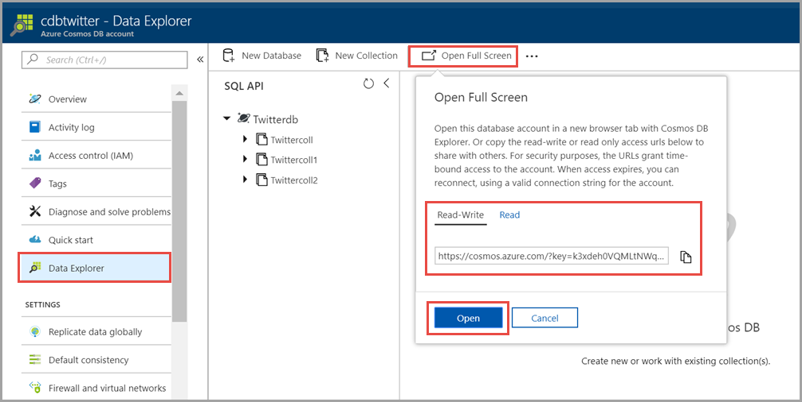

# Work with data using Azure Cosmos explorer 

Azure Cosmos DB explorer is a standalone web-based interface that allows you to view and manage the data stored in Azure Cosmos DB. Azure Cosmos DB explorer is equivalent to the existing **Data Explorer** tab that is available in Azure portal when you create an Azure Cosmos DB account. The key advantages of Azure Cosmos DB explorer over the existing Data explorer are:

* You have a full screen real-estate to view your data, run queries, stored procedures, triggers, and view their results.  

* You can provide temporary or permanent read or read-write access to your database account and its collections to other users who do not have access to Azure portal or subscription.  

* You can share the query results with other users who do not have access to Azure portal or subscription.  

## Access Azure Cosmos DB explorer

1. Sign in to [Azure Portal](https://portal.azure.com/). 

2. From **All resources**, find and navigate to your Azure Cosmos DB account, select Keys, and copy the **Primary Connection String**.  

3. Go to https://cosmos.azure.com/, paste the connection string and select **Connect**. By using the connection string, you can access the Azure Cosmos DB explorer without any time limits.  

   If you want to provide other users temporary access to your Azure Cosmos DB account, you can do so by using the read-write and read access URLs. 

4. Open the **Data Explorer** blade, select **Open Full Screen**. From the pop-up dialog, you can view two access URLs – **Read-Write** and **Read**. These URLs allow you to share your Azure Cosmos DB account temporarily with other users. Access to the account expires in 24 hours after which you can reconnect by using a new access URL or the connection string. 

   **Read-Write** – When you share the Read-Write URL with other users, they can view and modify the databases, collections, queries, and other resources associated with that specific account.

   **Read** - When you share the read-only URL with other users, they can view the databases, collections, queries, and other resources associated with that specific account. For example, if you want to share results of a query with your teammates who don't have access to Azure portal or your Azure Cosmos DB account, you can provide them with this URL.

   Choose the type of access you'd like to open the account with and click **Open**. After you open the explorer, the experience is same as you had with the Data Explorer tab in Azure portal.   

   

## Known issues

Currently the **Open Full Screen** experience that allows you to share temporary read-write or read access is not yet supported for Azure Cosmos DB Gremlin and Table API accounts. You can still view your Gremlin and Table API accounts by passing the connection string to Azure Cosmos DB Explorer. 

## Next steps
Now that you have learned how to get started with Azure Cosmos DB explorer to manage your data, next you can:

* Start defining [queries](sql-api-query-reference.md) using SQL syntax and perform [server side programming](stored-procedures-triggers-udfs.md) by using stored procedures, UDFs, triggers. 
