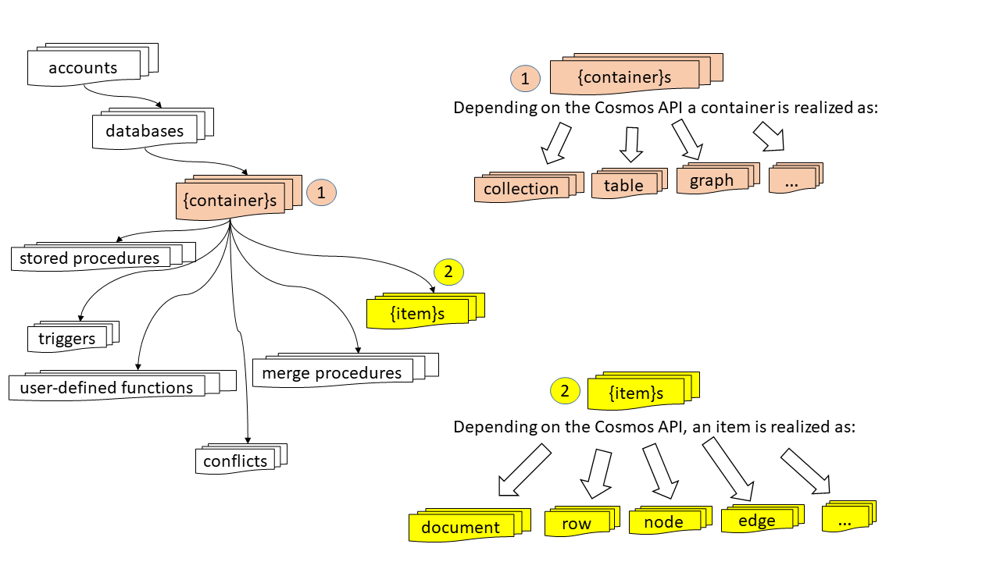
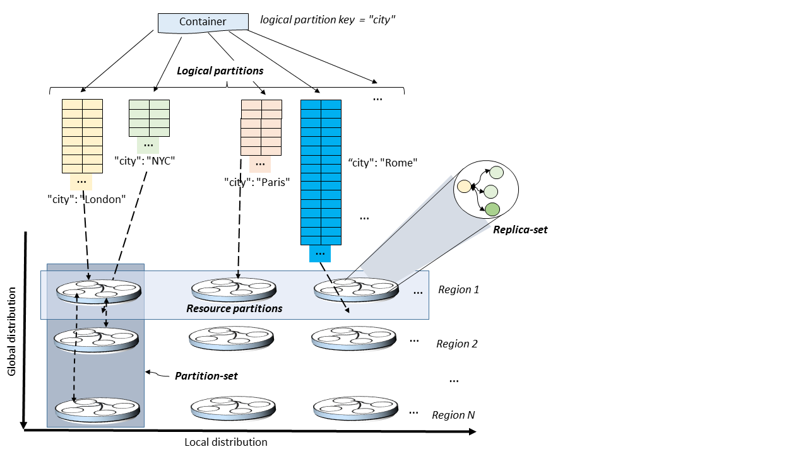

# Working with Cosmos databases, containers and items

You start working with Azure Cosmos DB by creating a Cosmos account under your Azure subscription (see [Working with Cosmos account](account-overview.md)). To manage data in your Cosmos account, you will need to create databases, containers, and items. We describe each of these entities below.

## Cosmos databases

You can create one or more Cosmos databases under your Cosmos account. A Cosmos database is analogous to a namespace; it is the unit of management for a set of Cosmos containers. The following table shows how a Cosmos database is mapped to various API-specific entities.

| Cosmos entity | SQL API | Cassandra API | MongoDB API | Gremlin API | Table API |
| --- | --- | --- | --- | --- | --- |
|Cosmos database | Database | Keyspace | Database | NA | NA |

### Operations on a Cosmos database

You can interact with Cosmos databases using the following Cosmos APIs.

| Operation | Azure CLI| SQL API | Cassandra API | MongoDB API | Gremlin API | Table API |
| --- | --- | --- | --- | --- | --- | --- |
|Enumerate all databases| Yes*** | Yes | Yes** | Yes | NA | NA |
|Read database| Yes*** | Yes | Yes** | Yes | NA | NA |
|Create new database| Yes*** | Yes | Yes** | Yes | NA* | NA* |
|Update database| Yes*** | Yes | Yes** | Yes | NA | NA |

\* While using the Gremlin and Table APIs, a “default” database is automatically created within your Cosmos account when you create your first graph or table respectively.

** While using the Cassandra API, a keyspace is mapped to a Cosmos database.

*** Will be available in January 2019.

## Cosmos containers

A Cosmos container is the unit of scalability for both provisioned throughput and storage of items.  A Cosmos container is horizontally partitioned and then replicated across multiple regions. The items that you add to the container and the throughput that you provision on it are both automatically distributed across a set of logical partitions (see [Logical partitions](partition-data.md)), based on the partition key (see [Partition key](TBD)) that you specify for the Cosmos container.

When creating a Cosmos container, you configure it to be in one of two modes:

* **Dedicated provisioned throughput** mode – Provisioned throughput configured on such a container is exclusively reserved for it and is backed by the SLAs. See [How to configure provisioned throughput on a Cosmos container](how-to-provision-container-throughput.md).

* **Shared provisioned throughput** mode – These containers share the provisioned throughput with the other containers within the database (excluding those containers that have been configured with dedicated provisioned throughput). In other words, the provisioned throughput on the database is shared among all the “shared” containers. See [How to configure provisioned throughput on a Cosmos database](how-to-provision-database-throughput.md).

A Cosmos container can scale elastically, whether you create containers with either “shared” or “dedicated” provisioned throughput modes, i.e., they can have unlimited storage and provisioned throughput.  

A Cosmos container is a schema-agnostic container of items. Items within a Cosmos container can be of arbitrary schemas, e.g., an item representing a person and an item representing an automobile could be placed in the same container. By default, all items that you add to a Cosmos container get automatically indexed without requiring any explicit index or schema management. You can customize the indexing behavior by configuring the indexing policy on a Cosmos container. See [How to configure indexing policy on your container](TBD).

You can set Time To Live (TTL) on selected items within a Cosmos container or for the entire container to gracefully purge those items out of the system. Cosmos DB will automatically delete the items when they expire. Cosmos DB also guarantees that a query performed against the container does not return the expired items within a fixed bound.  See [How to configure TTL on your container](TBD).

Using Change Feed, you can subscribe to the operations-log, which is managed for each of the logical partitions of your container. The Change Feed provides the log of all the updates performed on the container along with the before and the after images of the items. See [How to build reactive applications using change feed](change-feed.md). You can also configure the retention duration for your Change Feed by configuring the Change Feed Policy on the Cosmos container. See [How to configure retention policy for change feed](TBD).

You can also register stored procedures, triggers, user-defined functions (UDFs) and merge procedures with your Cosmos container. See [How to register stored procedures, triggers, UDFs, and merge procedures with your Cosmos containers](TBD).

You can also specify a unique key on your Cosmos container. By creating a unique key policy when a container is created, you ensure the uniqueness of one or more values per logical partition key. Once a container has been created with a unique key policy, it prevents the creation of any new or updated items with values that duplicate the values specified by the unique key constraint. See [Unique key constraints](unique-keys.md).

A Cosmos container is specialized into API-specific entities.

| Cosmos entity | SQL API | Cassandra API | MongoDB API | Gremlin API | Table API |
| --- | --- | --- | --- | --- | --- |
|Cosmos container | Container | Table | Collection | Graph | Table |

### Properties of Cosmos container

A Cosmos container has a set of system defined properties. Depending on the choice of API, some of them may not be directly exposed.

| System defined property | System generated or user-settable | Purpose | SQL API | Cassandra API | Mongo DB API | Gremlin API | Table API |
| --- | --- | --- | --- | --- | --- | --- | --- |
|__rid | System generated | Unique identifier of container | Yes | No | No | No | No |
|__etag | System generated | Entity tag used for optimistic concurrency control | Yes | No | No | No | No |
|__ts | System generated | Last updated timestamp of the container | Yes | No | No | No | No |
|__self | System generated | Addressable URI of the container | Yes | No | No | No | No |
|id | User configurable | User-defined unique name of the container | Yes | Yes | Yes | Yes | Yes |
|indexingPolicy | User configurable | See [Indexing policy](TBD) | Yes | No | No | No | Yes |
|TimeToLive | User configurable | See [Time to live](TBD) | Yes | No | No | No | Yes |
|changeFeedPolicy | User configurable | See [Change feed](TBD) | Yes | No | No | No | Yes |
|uniqueKeyPolicy | User configurable | See [Unique key constraints](TBD) | Yes | No | No | No | Yes |

### Operations on Cosmos container

A Cosmos container supports the following operations that can be performed using any of the Cosmos APIs.

| Operation | Azure CLI | SQL API | Cassandra API | MongoDB API | Gremlin API | Table API |
| --- | --- | --- | --- | --- | --- | --- | --- |
| Enumerate containers in a database | Yes* | Yes | Yes | Yes | NA | NA |
| Read a container | Yes* | Yes | Yes | Yes | NA | NA |
| Create new container | Yes* | Yes | Yes | Yes | NA | NA |
| Update container | Yes* | Yes | Yes | Yes | NA | NA |
| Delete container | Yes* | Yes | Yes | Yes | NA | NA |

\* Will be available in January 2019.

## Cosmos items

Depending on the choice of the API, a Cosmos item can represent either a document in a collection, a row in a table or a node/edge in a graph. The following table shows how the API-specific entities are mapped to a Cosmos item.

| Cosmos entity | SQL API | Cassandra API | MongoDB API | Gremlin API | Table API |
| --- | --- | --- | --- | --- | --- |
|Cosmos item | Item | Row | Document | Node or Edge | Item |

### Properties of an item

Every Cosmos item has the following system defined properties. Depending on the choice of API, some of them may not be directly exposed.

| System defined property | System generated or user-settable | Purpose | SQL API | Cassandra API | Mongo DB API | Gremlin API | Table API |
| --- | --- | --- | --- | --- | --- | --- | --- |
|__id | System generated | Unique identifier of item | Yes | No | No | No | No |
|__etag | System generated | Entity tag used for optimistic concurrency control | Yes | No | No | No | No |
|__ts | System generated | Last updated timestamp of the item | Yes | No | No | No | No |
|__self | System generated | Addressable URI of the item | Yes | No | No | No | No |
|id | Either | User-defined unique name within a logical partition. If the user doesn’t specify the id, the system will automatically generate one.  | Yes | Yes | Yes | Yes | Yes |
|Arbitrary user-defined properties | User-defined | User-defined properties represented in API-native representation (JSON, BSON, CQL, etc.) | Yes | Yes | Yes | Yes | Yes |

### Operations on items

A Cosmos item supports the following operations that can be performed using any of the Cosmos APIs.

| Operation | Azure CLI | SQL API | Cassandra API | MongoDB API | Gremlin API | Table API |
| --- | --- | --- | --- | --- | --- | --- | --- |
| Insert, Replace, Delete, Upsert, Read | No | Yes | Yes | Yes | Yes | Yes |

## Next steps

* [Logical partitions](partition-data.md)
* [Partition key](TBD)
* [How to configure provisioned throughput on a Cosmos database](how-to-provision-database-throughput.md)
* [How to configure provisioned throughput on a Cosmos container](how-to-provision-container-throughput.md)
* [Scaling Cosmos databases and containers](TBD)
* [How to configure the indexing policy on Cosmos container](TBD)
* [How to configure TTL on Cosmos container](TBD)
* [How to build reactive applications using Change Feed](Tchange-feed.md)
* [How to configure retention policy for change feed](TBD)
* [How to register stored procedures, triggers, UDFs, and merge procedures with your Cosmos containers](TBD)
* [How to configure unique key constraint on your Cosmos container](TBD)
