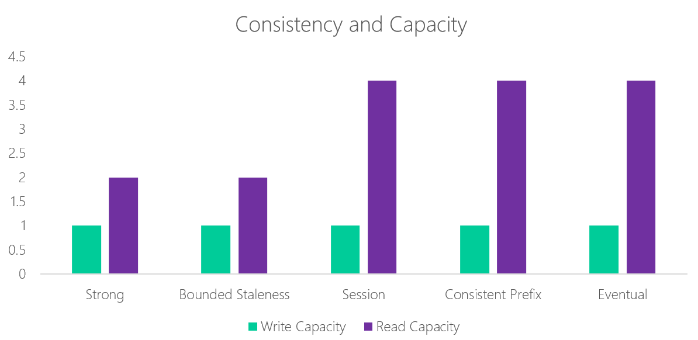

# How to distribute data globally with Azure Cosmos DB
Azure is ubiquitous - it has a global footprint across 50+ geographical regions and is continuously expanding. With its global presence, one of the differentiated capabilities Azure offers to its developers is the ability to build, deploy, and manage globally distributed applications easily. 

[Azure Cosmos DB](../cosmos-db/introduction.md) is Microsoft's globally distributed, multi-model database service for mission-critical applications. Azure Cosmos DB provides turnkey global distribution, [elastic scaling of throughput and storage](../cosmos-db/partition-data.md) worldwide, single-digit millisecond latencies at the 99th percentile, [five well-defined consistency models](consistency-levels.md), and guaranteed high availability, all backed by [industry-leading comprehensive SLAs](https://azure.microsoft.com/support/legal/sla/cosmos-db/). Azure Cosmos DB [automatically indexes all your data](http://www.vldb.org/pvldb/vol8/p1668-shukla.pdf) without requiring you to deal with schema or index management. It is a multi-model service and supports document, key-value, graph, and column-family data models. As a natively born in the cloud service, Azure Cosmos DB is carefully engineered with multi-tenancy and global distribution from the ground up.

**A single Azure Cosmos DB container partitioned and distributed across multiple Azure regions**

As we have learned while building Azure Cosmos DB, adding global distribution cannot be an afterthought. It cannot be "bolted-on" atop a "single site" database system. The capabilities offered by a globally distributed database span beyond that of traditional geographical disaster recovery (Geo-DR) offered by "single-site" databases. Single site databases offering Geo-DR capability are a strict subset of globally distributed databases. 

With Azure Cosmos DB's turnkey global distribution, developers do not have to build their own replication scaffolding by employing either the Lambda pattern (for example, [AWS DynamoDB replication](https://github.com/awslabs/dynamodb-cross-region-library/blob/master/README.md)) over the database log or by performing "double writes" across multiple regions. We do *not* recommend these approaches, since it is impossible to ensure correctness of such approaches and provide sound SLAs. 

In this article, we provide an overview of Azure Cosmos DB's global distribution capabilities. We also describe Azure Cosmos DB's unique approach to providing comprehensive SLAs. 

## Enabling turnkey global distribution
Azure Cosmos DB provides the following capabilities to enable you to easily write globally distributed applications. These capabilities are available via the Azure Cosmos DB's resource provider-based [REST APIs](https://docs.microsoft.com/rest/api/cosmos-db-resource-provider/) as well as the Azure portal.

### Ubiquitous regional presence 
Azure is constantly growing its geographical presence by bringing [new regions](https://azure.microsoft.com/regions/) online. Azure Cosmos DB is classified as a *foundational service* in Azure and is available in all new Azure regions by default. This allows you to associate a geographical region with your Azure Cosmos DB database account as soon as Azure opens the new region for business.

### Associating an unlimited number of regions with your Azure Cosmos DB database account
Azure Cosmos DB allows you to associate any number of Azure regions with your Azure Cosmos DB database account. Outside of geo-fencing restrictions (for example, China, Germany), there are no limitations on the number of regions that can be associated with your Azure Cosmos DB database account. The following figure shows a database account configured to span across 25 Azure regions.  

**A tenant's Azure Cosmos DB database account spanning 25 Azure regions**

### Policy-based geo-fencing
Azure Cosmos DB is designed to support policy-based geo-fencing. Geo-fencing is an important component to ensure data governance and compliance restrictions and may prevent associating a specific region with your account. Examples of geo-fencing include (but are not limited to) scoping global distribution to the regions within a sovereign cloud (for example, China and Germany) or within a government taxation boundary (for example, Australia). The policies are controlled using the metadata of your Azure subscription.

### Dynamically add and remove regions
Azure Cosmos DB allows you to add (associate) or remove (dissociate) regions from your database account at any point in time (see [preceding figure](#UnlimitedRegionsPerAccount)). By virtue of parallel replication of data across partitions, Azure Cosmos DB ensures that when a new region gets added, it is available for operations within 30 minutes anywhere in the world (assuming your data is 100 TBs or less). 

### Failover priorities
To control exact sequence of regional failovers in cases of an outage, Azure Cosmos DB enables you to associate a *priority* with various regions associated with the database account (see the figure below). Azure Cosmos DB ensures that the automatic failover sequence occurs in the priority order you specified. For more information about regional failovers, see [Automatic regional failovers for business continuity in Azure Cosmos DB](regional-failover.md).

**A tenant of Azure Cosmos DB can configure the failover priority order (right pane) for regions associated with a database account**

### Multiple, well-defined consistency models for globally distributed databases
Azure Cosmos DB supports [multiple well-defined, intuitive, and practical consistency models](consistency-levels.md) backed by SLAs. You can choose a specific consistency model (from the available list of options) depending on the workload/scenarios. 

### Tunable consistency for globally replicated databases
Azure Cosmos DB allows you to programmatically override and relax the default consistency choice on a per request basis at runtime. 

### Dynamically configurable read and write regions
Azure Cosmos DB enables you to configure the regions (associated with the database) for "read", "write" or "read/write" regions. 

### Elastically scaling throughput across Azure regions
You can elastically scale an Azure Cosmos DB container by provisioning throughput programmatically. The throughput is applied to all the regions the Azure Cosmos DB container is distributed in.

### Geo-local reads and writes
The key benefit of a globally distributed database is that it offers low latency access to data anywhere in the world. Azure Cosmos DB offers low latency reads and writes at the 99th percentile worldwide. It ensures that all reads are served from the closest (local) region. To serve a read request, the quorum local to the region in which the read is issued is used. The same applies to writes. A write is acknowledged only after a majority of replicas have durably committed the write locally but without being gated on remote replicas to acknowledge the writes. To put it differently, the replication protocol of Azure Cosmos DB operates under the assumption that the read and write quorums are always local to the region where the request has been issued.

### Manual failover
Azure Cosmos DB allows you to trigger the failover of a database account to validate the *end to end* availability properties of the entire application (beyond the database). Since both the safety and the liveness properties of the failure detection and leader election are guaranteed, Azure Cosmos DB guarantees *zero-data-loss* for a tenant-initiated manual failover operation.

### Automatic failover
Azure Cosmos DB supports automatic failover during one or more regional outages. During a regional failover, Azure Cosmos DB maintains its read latency, uptime availability, consistency, and throughput SLAs. Azure Cosmos DB provides an upper bound for the duration of an automatic failover operation to complete. This is the window of potential data loss during a regional outage.

### Designed for different failover granularities
Currently the automatic and manual failover capabilities are exposed at the granularity of the database account. Note, internally Azure Cosmos DB is designed to offer *automatic* failover at finer granularity of a database, a container, or even a partition (of a container owning a range of keys). 

### Multi-homing in Azure Cosmos DB
Azure Cosmos DB allows you to interact with a database using either *logical* (region-agnostic) or *physical* (region-specific) endpoints. Using logical endpoints ensures that the application can transparently be multi-homed in case of a failover. The latter, a physical endpoint, provides fine-grained control to the application to redirect reads and writes to specific regions.

You can find information on how to configure read preferences for the [SQL API](../cosmos-db/tutorial-global-distribution-sql-api.md),  [Table API](../cosmos-db/tutorial-global-distribution-table.md), and [MongoDB API](../cosmos-db/tutorial-global-distribution-mongodb.md) in these articles.

### Transparent and consistent database schema and index migration 
Azure Cosmos DB is fully [schema-agnostic](http://www.vldb.org/pvldb/vol8/p1668-shukla.pdf). The unique design of the database engine allows Azure Cosmos DB to automatically and synchronously index all of the data upon ingestion, without requiring any schema or secondary indices from the user. This enables you to iterate your globally distributed application rapidly without worrying about database schema and index migration or coordinating multi-phase application rollouts of schema changes. Azure Cosmos DB guarantees that any changes to indexing policies explicitly made by you do not result in either performance or availability degradation.  

### Comprehensive SLAs (beyond high availability)
As a globally distributed database service, Azure Cosmos DB offers well-defined and comprehensive SLAs for **availability**, **latency**, **throughput**, and **consistency** for the database running at global scale, regardless of the number of regions associated with the database.  

## Latency guarantees
The key benefit of a globally distributed database service like Azure Cosmos DB is to offer low latency access to your data anywhere in the world. Azure Cosmos DB offers guaranteed low latency at the 99th percentile for various database operations. The replication protocol that Azure Cosmos DB employs ensures that the database operations (both reads and writes) are always performed in the region local to that of the client. The latency SLA of Azure Cosmos DB provides guarantees at the 99th percentile for both reads, (synchronously) indexed writes and queries for various request and response sizes. The latency guarantees for writes include durable majority quorum commits within the local region.

### Latency's relationship with consistency 
For a globally distributed service to offer strong consistency in a globally distributed setup, it needs to synchronously replicate the writes or to synchronously perform cross-region reads. The speed of light and the wide area network reliability dictates that strong consistency will result in higher latencies and reduced availability of database operations. Hence, in order to offer guaranteed low latencies at the 99th percentile and 99.99% availability for all single region accounts and all multi-region accounts with relaxed consistency, and 99.999% availability on all multi-region database accounts, the service must employ asynchronous replication. This in-turn requires that the service must also offer [well-defined, relaxed consistency model(s)](consistency-levels.md) – weaker than strong (to offer low latency and availability guarantees) and ideally stronger than "eventual" consistency (with an intuitive programming model).

Azure Cosmos DB ensures that a read operation is not required to contact replicas across multiple regions to deliver a specific consistency level guarantee. Likewise, it ensures that a write operation does not get blocked while the data is being replicated across all regions that is, writes are asynchronously replicated across regions). For multi-region database accounts both strong as well as multiple relaxed consistency levels are available. 

### Latency's relationship with availability 
Latency and availability are the two sides of the same coin. Talking about latency of an operation in steady state and availability in the presence of failures and network partitions. From the application standpoint, a slow running database operation is indistinguishable from a database that is unavailable. 

To distinguish high latency from unavailability, Azure Cosmos DB provides an absolute upper bound for latency of various database operations. If the database operation takes longer than the upper bound to complete, Azure Cosmos DB returns a timeout error. The Azure Cosmos DB availability SLA ensures that the timeouts are counted against the availability SLA. 

### Latency's relationship with throughput
Azure Cosmos DB does not make you choose between latency and throughput. It honors the SLA for both latency at the 99th percentile and delivers the throughput that you have provisioned. 

## Consistency guarantees
While the [strong consistency model](http://cs.brown.edu/~mph/HerlihyW90/p463-herlihy.pdf) is the gold standard of data programmability, it comes at a steep price of higher latency (in steady state) and reduced availability (in the face of failures). 

Azure Cosmos DB offers a well-defined programming model for you to reason about replicated data's consistency. In order to enable you to easily build globally distributed applications with multi-homing capability, the consistency models exposed by Azure Cosmos DB are designed to be region-agnostic and independent from the region from where the reads and writes are being served. 

Azure Cosmos DB's consistency SLA guarantees that 100% of read requests will meet the consistency guarantee for the consistency model specified by you (either at the database account or the request level). A read request is considered to have met the consistency SLA, if all the consistency guarantees associated with the consistency level are satisfied. The following table captures the consistency guarantees that correspond to specific consistency models offered by Azure Cosmos DB.

<table>
	<tr>
		<td><strong>Consistency Model</strong></td>
		<td><strong>Consistency Characteristics</strong></td>
		<td><strong>SLA</strong></td>
	</tr>
		<tr>
		<td>Strong</td>
		<td>Linearizable</td>
		<td>100%</td>
	</tr>
	<tr>
		<td rowspan="3">Bounded staleness</td>
		<td>Monotonic read (within a region)</td>
		<td>100%</td>
	</tr>
	<tr>
		<td>Consistent prefix</td>
		<td>100%</td>
	</tr>
	<tr>
		<td>Staleness bound &lt; K,T</td>
		<td>100%</td>
	</tr>
<tr>
		<td rowspan="3">Session</td>
		<td>Read your own write</td>
		<td>100%</td>
	</tr>
	<tr>
		<td>Monotonic read</td>
		<td>100%</td>
	</tr>
	<tr>
		<td>Consistent prefix</td>
		<td>100%</td>
	</tr>
	<tr>
		<td>Consistent prefix</td>
		<td>Consistent prefix</td>
		<td>100%</td>
	</tr>
</table>

**Consistency guarantees associated with a given consistency model in Azure Cosmos DB**

### Consistency's relationship with availability
The [impossibility result](http://www.glassbeam.com/sites/all/themes/glassbeam/images/blog/10.1.1.67.6951.pdf) of the [CAP theorem](https://people.eecs.berkeley.edu/~brewer/cs262b-2004/PODC-keynote.pdf) proves that it is indeed impossible for a system to remain available and offer linearizable consistency in the face of failures. The database service must choose to be either CP or AP, where CP systems forgo availability in favor of linearizable consistency while the AP systems forgo [linearizable consistency](http://cs.brown.edu/~mph/HerlihyW90/p463-herlihy.pdf) in favor of availability. Azure Cosmos DB never violates the requested consistency model, which formally makes it a CP system. However, in practice consistency is not an all or nothing proposition; there are multiple well-defined consistency models along the consistency spectrum between linearizable and eventual consistency. In Azure Cosmos DB identifies several relaxed consistency models that are applicable to real world scenarios and are intuitive to use. Azure Cosmos DB navigates the consistency-availability tradeoffs by offering a [multiple relaxed yet well-defined consistency models](consistency-levels.md) and a 99.99% availability for all single region database accounts and 99.999% read and write availability for all multi-region database accounts. 

### Consistency's relationship with latency
A more comprehensive variation of CAP theorem is called [PACELC](http://cs-www.cs.yale.edu/homes/dna/papers/abadi-pacelc.pdf), which also accounts for latency and consistency tradeoffs in a steady state. It states that in a steady state, a database system must choose between consistency, and latency. With multiple relaxed consistency models (backed by asynchronous replication and local read and write quorums), Azure Cosmos DB ensures that all reads and writes are local to the read and write regions respectively. This allows Azure Cosmos DB to offer low latency guarantees within the region for the given consistency models.  

### Consistency's relationship with throughput
Since the implementation of a specific consistency model depends on the choice of a [quorum type](http://cs.brown.edu/~mph/HerlihyW90/p463-herlihy.pdf), throughput also varies based on the choice of a consistency model. For instance, in Azure Cosmos DB, the RU charge for strongly consistent reads is roughly *double* that of eventually consistent reads. In this case, you will need to provision double the RUs to achieve the same throughput.

**Relationship of read capacity for a specific consistency model in Azure Cosmos DB**

## Throughput guarantees 
Azure Cosmos DB allows you to scale throughput (as well as, storage), elastically across any number of regions depending on your needs or demand. 

**A single Azure Cosmos DB container horizontally partitioned (across three resource partitions within a region) and then globally distributed across three Azure regions**

An Azure Cosmos DB container gets distributed in two dimensions (i) within a region and (ii) across regions. Here's how: 

* **Local distribution**: Within a single region, an Azure Cosmos DB container is horizontally scaled out in terms of *resource partitions*. Each resource partition manages a set of keys and is strongly consistent and highly available being physically represented by four replicas also called a *replica-set* and state machine replication among those replicas. Azure Cosmos DB is a fully resource-governed system, where a resource partition is responsible to deliver its share of throughput for the budget of system resources allocated to it. The scaling of an Azure Cosmos DB container is transparent to the users. Azure Cosmos DB manages the resource partitions and splits and merges them as needed as storage and throughput requirements change. 
* **Global distribution**: If it is a multi-region database, each of the resource partitions is then distributed across those regions. Resource partitions owning the same set of keys across various regions form *partition set* (see [preceding figure](#ThroughputGuarantees)).  Resource partitions within a partition set are coordinated using state machine replication across multiple regions associated with the database. Depending on the consistency level configured, the resource partitions within a partition set are configured dynamically using different topologies (for example, star, daisy-chain, tree etc.). 

By virtue of a highly responsive partition management, load balancing and strict resource governance, Azure Cosmos DB allows you to elastically scale throughput across multiple Azure regions associated with an Azure Cosmos DB container or database. Changing provisioned throughput is a runtime operation in Azure Cosmos DB. Similar to other database operations, Azure Cosmos DB guarantees the absolute upper bound on latency for your request to change provisioned throughput. For example, the following figure shows a customer's container with elastically provisioned throughput (ranging from 1M-10M requests/sec across two regions) based on the demand.

**A customer's container with elastically provisioned throughput (varying from 1M-10M requests/sec)**

### Throughput's relationship with consistency 
It is the same as described in [Consistency's relationship with throughput](#ConsistencyAndThroughput).

### Throughput's relationship with availability
Azure Cosmos DB continues to maintain its high availability when changes are made to provisioned throughput. Azure Cosmos DB transparently manages resource partitions (and performs split, merge, and clone operations) and ensures that the operations do not degrade performance or availability, while the application elastically increases or decreases throughput. 

## Availability guarantees
Azure Cosmos DB offers a 99.99% availability SLA for all single region database accounts and all multi-region accounts with relaxed consistency, and 99.999% availability on all multi-region database accounts. As described earlier, Azure Cosmos DB's availability guarantees include an absolute upper bound for latency for every data and control plane operations. The availability guarantees do not change with the number of regions or the geographical distance between regions. Availability guarantees are applicable with respect to both manual as well as automatic failovers. Azure Cosmos DB offers transparent multi-homing APIs that ensure that your application can operate against logical endpoints and can transparently route the requests to a new region in case of a failover. Your application does not need to be redeployed in case of a regional failover and the availability SLAs are preserved at all times.

### Availability's relationship with consistency, latency, and throughput
Availability’s relationship with consistency, latency, and throughput is described in the sections [Consistency's relationship with availability](#ConsistencyAndAvailability), [Latency's relationship with availability](#LatencyAndAvailability) and [Throughput's relationship with availability](#ThroughputAndAvailability). 

## Customer-facing SLA metrics
Azure Cosmos DB transparently exposes the throughput, latency, consistency, and availability metrics. These metrics are accessible programmatically and via the Azure portal (see the figure below). You can also set up alerts on various thresholds using Azure Application Insights.
 

**Consistency, Latency, Throughput, and Availability metrics are transparently available to each tenant**

## Next steps
* To implement global replication on your Azure Cosmos DB account using the Azure portal, see [How to perform Azure Cosmos DB global database replication using the Azure portal](tutorial-global-distribution-sql-api.md).
* To learn about how to implement multi-master architectures with Azure Cosmos DB, see [Multi-master database architectures with Azure Cosmos DB](multi-region-writers.md).
* To learn more about how automatic and manual failovers work in Azure Cosmos DB, see [Regional Failovers in Azure Cosmos DB](regional-failover.md).

## References
1. Eric Brewer. [Towards Robust Distributed Systems](https://people.eecs.berkeley.edu/~brewer/cs262b-2004/PODC-keynote.pdf)
2. Eric Brewer. [CAP Twelve Years Later – How the rules have changed](http://informatik.unibas.ch/fileadmin/Lectures/HS2012/CS341/workshops/reportsAndSlides/PresentationKevinUrban.pdf)
3. Gilbert, Lynch. - [Brewer&#39;s Conjecture and Feasibility of Consistent, Available, Partition Tolerant Web Services](http://www.glassbeam.com/sites/all/themes/glassbeam/images/blog/10.1.1.67.6951.pdf)
4. Daniel Abadi. [Consistency Tradeoffs in Modern Distributed Database Systems Design](http://cs-www.cs.yale.edu/homes/dna/papers/abadi-pacelc.pdf)
5. Martin Kleppmann. [Please stop calling databases CP or AP](https://martin.kleppmann.com/2015/05/11/please-stop-calling-databases-cp-or-ap.html)
6. Peter Bailis et al. [Probabilistic Bounded Staleness (PBS) for Practical Partial Quorums](http://vldb.org/pvldb/vol5/p776_peterbailis_vldb2012.pdf)
7. Naor and Wool. [Load, Capacity and Availability in Quorum Systems](http://www.cs.utexas.edu/~lorenzo/corsi/cs395t/04S/notes/naor98load.pdf)
8. Herlihy and Wing. [Lineralizability: A correctness condition for concurrent objects](http://cs.brown.edu/~mph/HerlihyW90/p463-herlihy.pdf)
9. [Azure Cosmos DB SLA](https://azure.microsoft.com/support/legal/sla/cosmos-db/)
