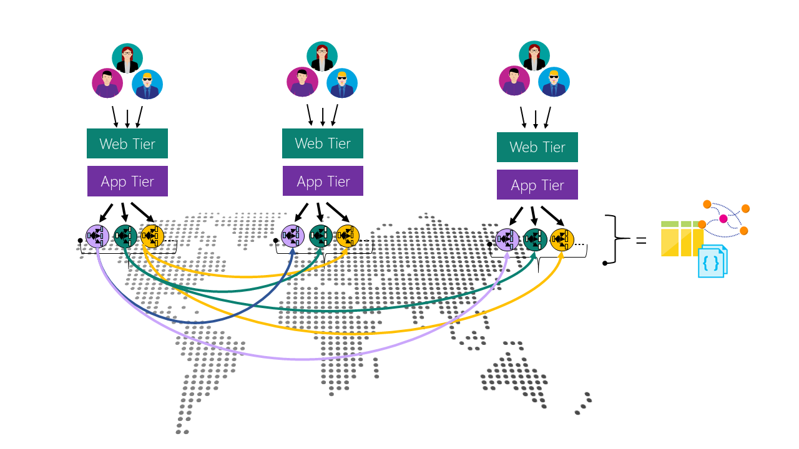

# Global data distribution with Azure Cosmos DB

Azure is ubiquitous - it has a global footprint across 50+ geographical regions and is continuously expanding. With its global presence and multi-master support, one of the differentiated capabilities Azure offers to its developers is the ability to build, deploy, and manage globally distributed applications easily.

[Azure Cosmos DB](../cosmos-db/introduction.md) is Microsoft's globally distributed, multi-model database service for mission-critical applications. Azure Cosmos DB provides turnkey global distribution, [elastic scaling of throughput and storage](../cosmos-db/partition-data.md) worldwide, single-digit read and write millisecond latencies at the 99th percentile, [well-defined consistency models](consistency-levels.md), and guaranteed high availability, all backed by [industry-leading comprehensive SLAs](https://azure.microsoft.com/support/legal/sla/cosmos-db/). Azure Cosmos DB [automatically indexes all your data](http://www.vldb.org/pvldb/vol8/p1668-shukla.pdf) without requiring you to deal with schema or index management.

## Global distribution with multi-master

As a cloud service, Azure Cosmos DB is carefully engineered to support multi-tenancy, global distribution, and multi-master for document, key-value, graph, and column-family data models.

**A single Azure Cosmos DB container partitioned and distributed across multiple Azure regions**

As we have learned while building Azure Cosmos DB, adding global distribution cannot be an afterthought. It cannot be "bolted-on" atop a "single site" database system. The capabilities offered by a globally distributed database span beyond the features offered by a traditional geographical disaster recovery (Geo-DR) offered by "single-site" databases. Single site databases offering Geo-DR capability are a strict subset of globally distributed databases.

With Azure Cosmos DB turnkey global distribution, developers do not have to build their own replication scaffolding by employing either the Lambda pattern over the database log or by performing "double writes" across multiple regions. We do *not* recommend these approaches, since it is impossible to ensure correctness of such approaches and provide sound SLAs.

## Next steps

* [How Azure Cosmos DB enables turnkey global distribution](distribute-data-globally-turnkey.md)

* [Azure Cosmos DB global distribution key benefits](distribute-data-globally-benefits.md)

* [How to configure Azure Cosmos DB global database replication](tutorial-global-distribution-sql-api.md)

* [How to enable multi-master for Azure Cosmos DB accounts](enable-multi-master.md)

* [How automatic and manual failover works in Azure Cosmos DB](regional-failover.md)

* [Understanding conflict resolution in Azure Cosmos DB](multi-master-conflict-resolution.md)

* [using multi-master with open source NoSQL databases](multi-master-oss-nosql.md)
