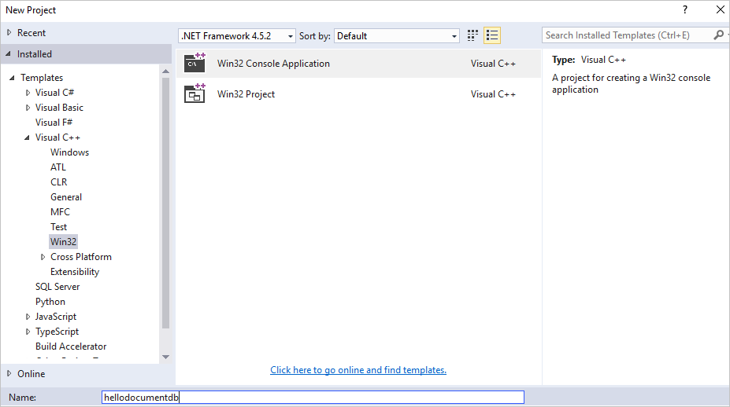
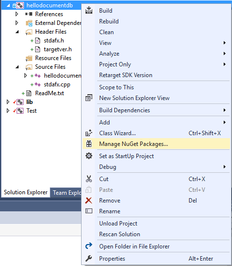
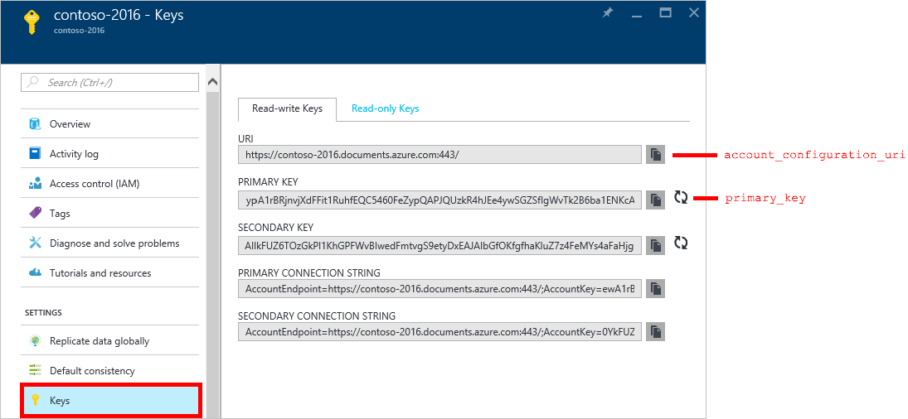
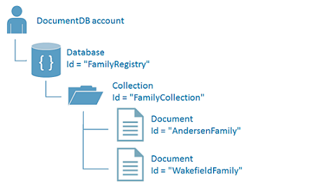
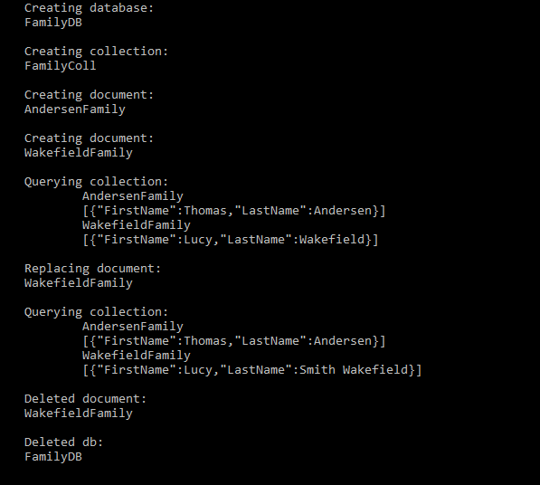

# Azure Cosmos DB: C++ console application tutorial for the DocumentDB API
> [!div class="op_single_selector"]
> * [.NET](documentdb-get-started.md)
> * [.NET Core](documentdb-dotnetcore-get-started.md)
> * [Node.js for MongoDB](mongodb-samples.md)
> * [Node.js](documentdb-nodejs-get-started.md)
> * [Java](documentdb-java-get-started.md)
> * [C++](documentdb-cpp-get-started.md)
>  
> 
 

Welcome to the C++ tutorial for the Azure Cosmos DB DocumentDB API endorsed SDK for C++! After following this tutorial, you'll have a console application that creates and queries Azure Cosmos DB resources, including a C++ database.

We'll cover:

* Creating and connecting to an Azure Cosmos DB account
* Setting up your application
* Creating a C++ Azure Cosmos DB database
* Creating a collection
* Creating JSON documents
* Querying the collection
* Replacing a document
* Deleting a document
* Deleting the C++ Azure Cosmos DB database

Don't have time? Don't worry! The complete solution is available on [GitHub](https://github.com/stalker314314/DocumentDBCpp). See [Get the complete solution](#GetSolution) for quick instructions.

After you've completed the C++ tutorial, please use the voting buttons at the bottom of this page to give us feedback. 

If you'd like us to contact you directly, feel free to include your email address in your comments or [reach out to us here](https://www.research.net/r/8BKRJ3Z). 

Now let's get started!

## Prerequisites for the C++ tutorial
Please make sure you have the following:

* An active Azure account. If you don't have one, you can sign up for a [Free Azure Trial](https://azure.microsoft.com/pricing/free-trial/).
* [Visual Studio](https://www.visualstudio.com/downloads/), with the C++ language components installed.

## Step 1: Create an Azure Cosmos DB account
Let's create an Azure Cosmos DB account. If you already have an account you want to use, you can skip ahead to [Setup your C++ application](#SetupNode).

[!INCLUDE [cosmos-db-create-dbaccount](../../includes/cosmos-db-create-dbaccount.md)]

## Step 2: Set up your C++ application
1. Open Visual Studio, and then on the **File** menu, click **New**, and then click **Project**. 
2. In the **New Project** window, in the **Installed** pane, expand **Visual C++**, click **Win32**, and then click **Win32 Console Application**. Name the project hellodocumentdb and then click **OK**. 
   
    
3. When the Win32 Application Wizard starts, click **Finish**.
4. Once the project has been created, open the NuGet package manager by right-clicking the **hellodocumentdb** project in **Solution Explorer** and clicking **Manage NuGet Packages**. 
   
    
5. In the **NuGet: hellodocumentdb** tab, click **Browse**, and then search for *documentdbcpp*. In the results, select DocumentDbCPP, as shown in the following screenshot. This package installs references to C++ REST SDK, which is a dependency for the DocumentDbCPP.  
   
    
   
    Once the packages have been added to your project, we are all set to start writing some code.   

## Step 3: Copy connection details from Azure portal for your Azure Cosmos DB database
Bring up [Azure portal](https://portal.azure.com) and traverse to the Azure Cosmos DB database account you created. We will need the URI and the primary key from Azure portal in the next step to establish a connection from our C++ code snippet. 

## Step 4: Connect to an Azure Cosmos DB account
1. Add the following headers and namespaces to your source code, after `#include "stdafx.h"`.
   
        #include <cpprest/json.h>
        #include <documentdbcpp\DocumentClient.h>
        #include <documentdbcpp\exceptions.h>
        #include <documentdbcpp\TriggerOperation.h>
        #include <documentdbcpp\TriggerType.h>
        using namespace documentdb;
        using namespace std;
        using namespace web::json;
2. Next add the following code to your main function and replace the account configuration and primary key to match your Azure Cosmos DB settings from step 3. 
   
        DocumentDBConfiguration conf (L"<account_configuration_uri>", L"<primary_key>");
        DocumentClient client (conf);
   
    Now that you have the code to initialize the documentdb client, let's take a look at working with Azure Cosmos DB resources.

## Step 5: Create a C++ database and collection
Before we perform this step, let's go over how a database, collection and documents interact for those of you who are new to Azure Cosmos DB. A [database](documentdb-resources.md#databases) is a logical container of document storage portioned across collections. A [collection](documentdb-resources.md#collections) is a container of JSON documents and the associated JavaScript application logic. You can learn more about the Azure Cosmos DB hierarchical resource model and concepts in [Azure Cosmos DB hierarchical resource model and concepts](documentdb-resources.md).

To create a database and a corresponding collection add the following code to the end of your main function. This creates a database called 'FamilyRegistry’ and a collection called ‘FamilyCollection’ using the client configuration you declared in the previous step.

    try {
      shared_ptr<Database> db = client.CreateDatabase(L"FamilyRegistry");
      shared_ptr<Collection> coll = db->CreateCollection(L"FamilyCollection");
    } catch (DocumentDBRuntimeException ex) {
      wcout << ex.message();
    }

## Step 6: Create a document
[Documents](documentdb-resources.md#documents) are user-defined (arbitrary) JSON content. You can now insert a document into Azure Cosmos DB. You can create a document by copying the following code into the end of the main function. 

    try {
      value document_family;
      document_family[L"id"] = value::string(L"AndersenFamily");
      document_family[L"FirstName"] = value::string(L"Thomas");
      document_family[L"LastName"] = value::string(L"Andersen");
      shared_ptr<Document> doc = coll->CreateDocumentAsync(document_family).get();

      document_family[L"id"] = value::string(L"WakefieldFamily");
      document_family[L"FirstName"] = value::string(L"Lucy");
      document_family[L"LastName"] = value::string(L"Wakefield");
      doc = coll->CreateDocumentAsync(document_family).get();
    } catch (ResourceAlreadyExistsException ex) {
      wcout << ex.message();
    }

To summarize, this code creates an Azure Cosmos DB database, collection, and documents, which you can query in Document Explorer in Azure portal. 

## Step 7: Query Azure Cosmos DB resources
Azure Cosmos DB supports [rich queries](documentdb-sql-query.md) against JSON documents stored in each collection. The following sample code shows a query made using SQL syntax that you can run against the documents we created in the previous step.

The function takes in as arguments the unique identifier or resource id for the database and the collection along with the document client. Add this code before main function.

    void executesimplequery(const DocumentClient &client,
                            const wstring dbresourceid,
                            const wstring collresourceid) {
      try {
        client.GetDatabase(dbresourceid).get();
        shared_ptr<Database> db = client.GetDatabase(dbresourceid);
        shared_ptr<Collection> coll = db->GetCollection(collresourceid);
        wstring coll_name = coll->id();
        shared_ptr<DocumentIterator> iter =
            coll->QueryDocumentsAsync(wstring(L"SELECT * FROM " + coll_name)).get();
        wcout << "\n\nQuerying collection:";
        while (iter->HasMore()) {
          shared_ptr<Document> doc = iter->Next();
          wstring doc_name = doc->id();
          wcout << "\n\t" << doc_name << "\n";
          wcout << "\t"
                << "[{\"FirstName\":"
                << doc->payload().at(U("FirstName")).as_string()
                << ",\"LastName\":" << doc->payload().at(U("LastName")).as_string()
                << "}]";
        }
      } catch (DocumentDBRuntimeException ex) {
        wcout << ex.message();
      }
    }

## Step 8: Replace a document
Azure Cosmos DB supports replacing JSON documents, as demonstrated in the following code. Add this code after the executesimplequery function.

    void replacedocument(const DocumentClient &client, const wstring dbresourceid,
                         const wstring collresourceid,
                         const wstring docresourceid) {
      try {
        client.GetDatabase(dbresourceid).get();
        shared_ptr<Database> db = client.GetDatabase(dbresourceid);
        shared_ptr<Collection> coll = db->GetCollection(collresourceid);
        value newdoc;
        newdoc[L"id"] = value::string(L"WakefieldFamily");
        newdoc[L"FirstName"] = value::string(L"Lucy");
        newdoc[L"LastName"] = value::string(L"Smith Wakefield");
        coll->ReplaceDocument(docresourceid, newdoc);
      } catch (DocumentDBRuntimeException ex) {
        throw;
      }
    }

## Step 9: Delete a document
Azure Cosmos DB supports deleting JSON documents, you can do so by copy and pasting the following code after the replacedocument function. 

    void deletedocument(const DocumentClient &client, const wstring dbresourceid,
                        const wstring collresourceid, const wstring docresourceid) {
      try {
        client.GetDatabase(dbresourceid).get();
        shared_ptr<Database> db = client.GetDatabase(dbresourceid);
        shared_ptr<Collection> coll = db->GetCollection(collresourceid);
        coll->DeleteDocumentAsync(docresourceid).get();
      } catch (DocumentDBRuntimeException ex) {
        wcout << ex.message();
      }
    }

## Step 10: Delete a database
Deleting the created database removes the database and all child resources (collections, documents, etc.).

Copy and paste the following code snippet (function cleanup) after the deletedocument function to remove the database and all the child resources.

    void deletedb(const DocumentClient &client, const wstring dbresourceid) {
      try {
        client.DeleteDatabase(dbresourceid);
      } catch (DocumentDBRuntimeException ex) {
        wcout << ex.message();
      }
    }

## Step 11: Run your C++ application all together!
We have now added code to create, query, modify, and delete different Azure Cosmos DB resources.  Let us now wire this up by adding calls to these different functions from our main function in hellodocumentdb.cpp along with some diagnostic messages.

You can do so by replacing the main function of your application with the following code. This writes over the account_configuration_uri and primary_key you copied into the code in Step 3, so save that line or copy the values in again from the portal. 

    int main() {
        try {
            // Start by defining your account's configuration
            DocumentDBConfiguration conf (L"<account_configuration_uri>", L"<primary_key>");
            // Create your client
            DocumentClient client(conf);
            // Create a new database
            try {
                shared_ptr<Database> db = client.CreateDatabase(L"FamilyDB");
                wcout << "\nCreating database:\n" << db->id();
                // Create a collection inside database
                shared_ptr<Collection> coll = db->CreateCollection(L"FamilyColl");
                wcout << "\n\nCreating collection:\n" << coll->id();
                value document_family;
                document_family[L"id"] = value::string(L"AndersenFamily");
                document_family[L"FirstName"] = value::string(L"Thomas");
                document_family[L"LastName"] = value::string(L"Andersen");
                shared_ptr<Document> doc =
                    coll->CreateDocumentAsync(document_family).get();
                wcout << "\n\nCreating document:\n" << doc->id();
                document_family[L"id"] = value::string(L"WakefieldFamily");
                document_family[L"FirstName"] = value::string(L"Lucy");
                document_family[L"LastName"] = value::string(L"Wakefield");
                doc = coll->CreateDocumentAsync(document_family).get();
                wcout << "\n\nCreating document:\n" << doc->id();
                executesimplequery(client, db->resource_id(), coll->resource_id());
                replacedocument(client, db->resource_id(), coll->resource_id(),
                    doc->resource_id());
                wcout << "\n\nReplaced document:\n" << doc->id();
                executesimplequery(client, db->resource_id(), coll->resource_id());
                deletedocument(client, db->resource_id(), coll->resource_id(),
                    doc->resource_id());
                wcout << "\n\nDeleted document:\n" << doc->id();
                deletedb(client, db->resource_id());
                wcout << "\n\nDeleted db:\n" << db->id();
                cin.get();
            }
            catch (ResourceAlreadyExistsException ex) {
                wcout << ex.message();
            }
        }
        catch (DocumentDBRuntimeException ex) {
            wcout << ex.message();
        }
        cin.get();
    }

You should now be able to build and run your code in Visual Studio by pressing F5 or alternatively in the terminal window by locating the application and running the executable. 

You should see the output of your get started app. The output should match the following screenshot.

Congratulations! You've completed the C++ tutorial and have your first Azure Cosmos DB console application!

## Get the complete C++ tutorial solution
To build the GetStarted solution that contains all the samples in this article, you need the following:

* [Azure Cosmos DB account][create-account].
* The [GetStarted](https://github.com/stalker314314/DocumentDBCpp) solution available on GitHub.

## Next steps
* Learn how to [monitor an Azure Cosmos DB account](monitor-accounts.md).
* Run queries against our sample dataset in the [Query Playground](https://www.documentdb.com/sql/demo).
* Learn more about the programming model in the Develop section of the [Azure Cosmos DB documentation page](https://azure.microsoft.com/documentation/services/documentdb/).

[create-account]: create-documentdb-dotnet.md#create-account

