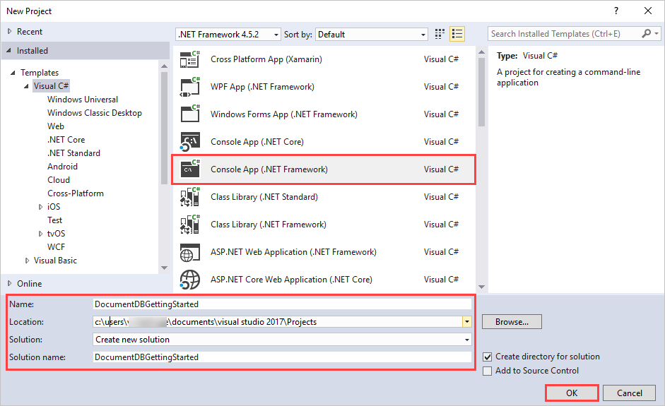
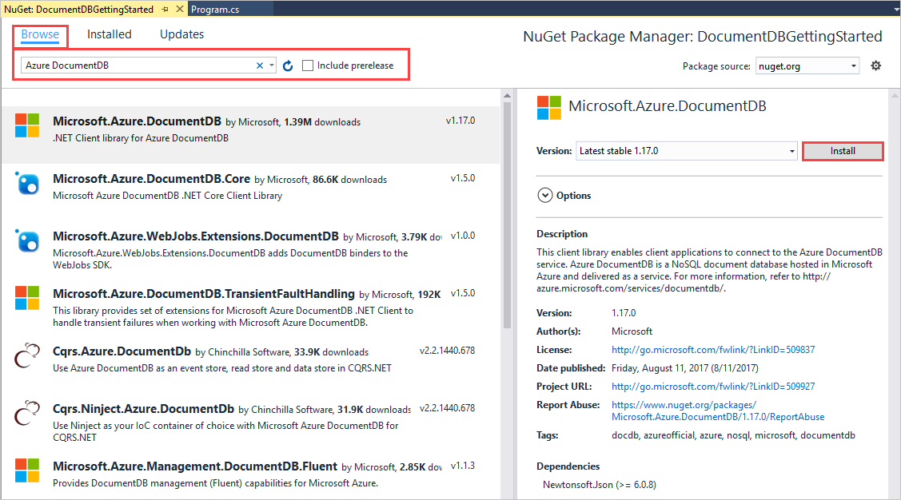

# Azure Cosmos DB: DocumentDB API getting started tutorial
> [!div class="op_single_selector"]
> * [.NET](documentdb-get-started.md)
> * [.NET Core](documentdb-dotnetcore-get-started.md)
> * [Node.js for MongoDB](mongodb-samples.md)
> * [Node.js](documentdb-nodejs-get-started.md)
> * [Java](documentdb-java-get-started.md)
> * [C++](documentdb-cpp-get-started.md)
>  
> 

Welcome to the Azure Cosmos DB DocumentDB API getting started tutorial! After following this tutorial, you'll have a console application that creates and queries DocumentDB resources.

We'll cover:

* Creating and connecting to an Azure Cosmos DB account
* Configuring your Visual Studio Solution
* Creating an online database
* Creating a collection
* Creating JSON documents
* Querying the collection
* Replacing a document
* Deleting a document
* Deleting the database

Don't have time? Don't worry! The complete solution is available on [GitHub](https://github.com/Azure-Samples/documentdb-dotnet-getting-started). Jump to the [Get the complete NoSQL tutorial solution section](#GetSolution) for quick instructions.

Afterwards, please use the voting buttons at the top or bottom of this page to give us feedback. If you'd like us to contact you directly, feel free to include your email address in your comments.

Now let's get started!

## Prerequisites
Please make sure you have the following:

* An active Azure account. If you don't have one, you can sign up for a [free account](https://azure.microsoft.com/free/). 
    * Alternatively, you can use the [Azure Cosmos DB Emulator](local-emulator.md) for this tutorial.
* [Visual Studio 2013 / Visual Studio 2015](http://www.visualstudio.com/).

## Step 1: Create an Azure Cosmos DB account
Let's create an Azure Cosmos DB account. If you already have an account you want to use, you can skip ahead to [Setup your Visual Studio Solution](#SetupVS). If you are using the Azure Cosmos DB Emulator, please follow the steps at [Azure Cosmos DB Emulator](local-emulator.md) to setup the emulator and skip ahead to [Setup your Visual Studio Solution](#SetupVS).

[!INCLUDE [create-dbaccount](../../includes/cosmos-db-create-dbaccount.md)]

## Step 2: Setup your Visual Studio solution
1. Open **Visual Studio 2015** on your computer.
2. On the **File** menu, select **New**, and then choose **Project**.
3. In the **New Project** dialog, select **Templates** / **Visual C#** / **Console Application**, name your project, and then click **OK**.
   
4. In the **Solution Explorer**, right click on your new console application, which is under your Visual Studio solution, and then click **Manage NuGet Packages...**
    
    
5. In the **Nuget** tab, click **Browse**, and type **azure documentdb** in the search box.
6. Within the results, find **Microsoft.Azure.DocumentDB** and click **Install**.
   The package ID for the Azure Cosmos DB DocumentDB API Client Library is [Microsoft Azure DocumentDB Client Library](https://www.nuget.org/packages/Microsoft.Azure.DocumentDB/).
   

    If you get a messages about reviewing changes to the solution, click **OK**. If you get a message about license acceptance, click **I accept**.

Great! Now that we finished the setup, let's start writing some code. You can find a completed code project of this tutorial at [GitHub](https://github.com/Azure-Samples/documentdb-dotnet-getting-started/blob/master/src/Program.cs).

## Step 3: Connect to an Azure Cosmos DB account
First, add these references to the beginning of your C# application, in the Program.cs file:

    using System;
    using System.Linq;
    using System.Threading.Tasks;

    // ADD THIS PART TO YOUR CODE
    using System.Net;
    using Microsoft.Azure.Documents;
    using Microsoft.Azure.Documents.Client;
    using Newtonsoft.Json;

> [!IMPORTANT]
> In order to complete the tutorial, make sure you add the dependencies above.
> 
> 

Now, add these two constants and your *client* variable underneath your public class *Program*.

    public class Program
    {
        // ADD THIS PART TO YOUR CODE
        private const string EndpointUrl = "<your endpoint URL>";
        private const string PrimaryKey = "<your primary key>";
        private DocumentClient client;

Next, head back to the [Azure Portal](https://portal.azure.com) to retrieve your endpoint URL and primary key. The endpoint URL and primary key are necessary for your application to understand where to connect to, and for Azure Cosmos DB to trust your application's connection.

In the Azure Portal, navigate to your Azure Cosmos DB account, and then click **Keys**.

Copy the URI from the portal and paste it into `<your endpoint URL>` in the program.cs file. Then copy the PRIMARY KEY from the portal and paste it into `<your primary key>`.

![Screen shot of the Azure Portal used by the NoSQL tutorial to create a C# console application. Shows an Azure Cosmos DB account, with the ACTIVE hub highlighted, the KEYS button highlighted on the Azure Cosmos DB account blade, and the URI, PRIMARY KEY and SECONDARY KEY values highlighted on the Keys blade][keys]

Next, we'll start the application by creating a new instance of the **DocumentClient**.

Below the **Main** method, add this new asynchronous task called **GetStartedDemo**, which will instantiate our new **DocumentClient**.

    static void Main(string[] args)
    {
    }

    // ADD THIS PART TO YOUR CODE
    private async Task GetStartedDemo()
    {
        this.client = new DocumentClient(new Uri(EndpointUrl), PrimaryKey);
    }

Add the following code to run your asynchronous task from your **Main** method. The **Main** method will catch exceptions and write them to the console.

    static void Main(string[] args)
    {
            // ADD THIS PART TO YOUR CODE
            try
            {
                    Program p = new Program();
                    p.GetStartedDemo().Wait();
            }
            catch (DocumentClientException de)
            {
                    Exception baseException = de.GetBaseException();
                    Console.WriteLine("{0} error occurred: {1}, Message: {2}", de.StatusCode, de.Message, baseException.Message);
            }
            catch (Exception e)
            {
                    Exception baseException = e.GetBaseException();
                    Console.WriteLine("Error: {0}, Message: {1}", e.Message, baseException.Message);
            }
            finally
            {
                    Console.WriteLine("End of demo, press any key to exit.");
                    Console.ReadKey();
            }

Press **F5** to run your application. The console window output displays the message `End of demo, press any key to exit.` confirming that the connection was made.  You can then close the console window. 

Congratulations! You have successfully connected to an Azure Cosmos DB account, let's now take a look at working with Azure Cosmos DB resources.  

## Step 4: Create a database
Before you add the code for creating a database, add a helper method for writing to the console.

Copy and paste the **WriteToConsoleAndPromptToContinue** method after the **GetStartedDemo** method.

    // ADD THIS PART TO YOUR CODE
    private void WriteToConsoleAndPromptToContinue(string format, params object[] args)
    {
            Console.WriteLine(format, args);
            Console.WriteLine("Press any key to continue ...");
            Console.ReadKey();
    }

Your Azure Cosmos DB [database](documentdb-resources.md#databases) can be created by using the [CreateDatabaseIfNotExistsAsync](https://msdn.microsoft.com/library/microsoft.azure.documents.client.documentclient.createdatabaseifnotexistsasync.aspx) method of the **DocumentClient** class. A database is the logical container of JSON document storage partitioned across collections.

Copy and paste the following code to your **GetStartedDemo** method after the client creation. This will create a database named *FamilyDB*.

    private async Task GetStartedDemo()
    {
        this.client = new DocumentClient(new Uri(EndpointUrl), PrimaryKey);

        // ADD THIS PART TO YOUR CODE
        await this.client.CreateDatabaseIfNotExistsAsync(new Database { Id = "FamilyDB" });

Press **F5** to run your application.

Congratulations! You have successfully created an Azure Cosmos DB database.  

## Step 5: Create a collection
> [!WARNING]
> **CreateDocumentCollectionIfNotExistsAsync** will create a new collection with reserved throughput, which has pricing implications. For more details, please visit our [pricing page](https://azure.microsoft.com/pricing/details/cosmos-db/).
> 
> 

A [collection](documentdb-resources.md#collections) can be created by using the [CreateDocumentCollectionIfNotExistsAsync](https://msdn.microsoft.com/library/microsoft.azure.documents.client.documentclient.createdocumentcollectionifnotexistsasync.aspx) method of the **DocumentClient** class. A collection is a container of JSON documents and associated JavaScript application logic.

Copy and paste the following code to your **GetStartedDemo** method after the database creation. This will create a document collection named *FamilyCollection*.

        this.client = new DocumentClient(new Uri(EndpointUrl), PrimaryKey);

        await this.client.CreateDatabaseIfNotExistsAsync(new Database { Id = "FamilyDB" });

        // ADD THIS PART TO YOUR CODE
         await this.client.CreateDocumentCollectionIfNotExistsAsync(UriFactory.CreateDatabaseUri("FamilyDB"), new DocumentCollection { Id = "FamilyCollection" });

Press **F5** to run your application.

Congratulations! You have successfully created an Azure Cosmos DB document collection.  

## Step 6: Create JSON documents
A [document](documentdb-resources.md#documents) can be created by using the [CreateDocumentAsync](https://msdn.microsoft.com/library/microsoft.azure.documents.client.documentclient.createdocumentasync.aspx) method of the **DocumentClient** class. Documents are user defined (arbitrary) JSON content. We can now insert one or more documents. If you already have data you'd like to store in your database, you can use DocumentDB's [Data Migration tool](import-data.md) to import the data into a database.

First, we need to create a **Family** class that will represent objects stored within Azure Cosmos DB in this sample. We will also create **Parent**, **Child**, **Pet**, **Address** subclasses that are used within **Family**. Note that documents must have an **Id** property serialized as **id** in JSON. Create these classes by adding the following internal sub-classes after the **GetStartedDemo** method.

Copy and paste the **Family**, **Parent**, **Child**, **Pet**, and **Address** classes after the **WriteToConsoleAndPromptToContinue** method.

    private void WriteToConsoleAndPromptToContinue(string format, params object[] args)
    {
        Console.WriteLine(format, args);
        Console.WriteLine("Press any key to continue ...");
        Console.ReadKey();
    }

    // ADD THIS PART TO YOUR CODE
    public class Family
    {
        [JsonProperty(PropertyName = "id")]
        public string Id { get; set; }
        public string LastName { get; set; }
        public Parent[] Parents { get; set; }
        public Child[] Children { get; set; }
        public Address Address { get; set; }
        public bool IsRegistered { get; set; }
        public override string ToString()
        {
            return JsonConvert.SerializeObject(this);
        }
    }

    public class Parent
    {
        public string FamilyName { get; set; }
        public string FirstName { get; set; }
    }

    public class Child
    {
        public string FamilyName { get; set; }
        public string FirstName { get; set; }
        public string Gender { get; set; }
        public int Grade { get; set; }
        public Pet[] Pets { get; set; }
    }

    public class Pet
    {
        public string GivenName { get; set; }
    }

    public class Address
    {
        public string State { get; set; }
        public string County { get; set; }
        public string City { get; set; }
    }

Copy and paste the **CreateFamilyDocumentIfNotExists** method underneath your **Address** class.

    // ADD THIS PART TO YOUR CODE
    private async Task CreateFamilyDocumentIfNotExists(string databaseName, string collectionName, Family family)
    {
        try
        {
            await this.client.ReadDocumentAsync(UriFactory.CreateDocumentUri(databaseName, collectionName, family.Id));
            this.WriteToConsoleAndPromptToContinue("Found {0}", family.Id);
        }
        catch (DocumentClientException de)
        {
            if (de.StatusCode == HttpStatusCode.NotFound)
            {
                await this.client.CreateDocumentAsync(UriFactory.CreateDocumentCollectionUri(databaseName, collectionName), family);
                this.WriteToConsoleAndPromptToContinue("Created Family {0}", family.Id);
            }
            else
            {
                throw;
            }
        }
    }

And insert two documents, one each for the Andersen Family and the Wakefield Family.

Copy and paste the following code to your **GetStartedDemo** method after the document collection creation.

    await this.client.CreateDatabaseIfNotExistsAsync(new Database { Id = "FamilyDB" });
    
    await this.client.CreateDocumentCollectionIfNotExistsAsync(UriFactory.CreateDatabaseUri("FamilyDB"), new DocumentCollection { Id = "FamilyCollection" });

    // ADD THIS PART TO YOUR CODE
    Family andersenFamily = new Family
    {
            Id = "Andersen.1",
            LastName = "Andersen",
            Parents = new Parent[]
            {
                    new Parent { FirstName = "Thomas" },
                    new Parent { FirstName = "Mary Kay" }
            },
            Children = new Child[]
            {
                    new Child
                    {
                            FirstName = "Henriette Thaulow",
                            Gender = "female",
                            Grade = 5,
                            Pets = new Pet[]
                            {
                                    new Pet { GivenName = "Fluffy" }
                            }
                    }
            },
            Address = new Address { State = "WA", County = "King", City = "Seattle" },
            IsRegistered = true
    };

    await this.CreateFamilyDocumentIfNotExists("FamilyDB", "FamilyCollection", andersenFamily);

    Family wakefieldFamily = new Family
    {
            Id = "Wakefield.7",
            LastName = "Wakefield",
            Parents = new Parent[]
            {
                    new Parent { FamilyName = "Wakefield", FirstName = "Robin" },
                    new Parent { FamilyName = "Miller", FirstName = "Ben" }
            },
            Children = new Child[]
            {
                    new Child
                    {
                            FamilyName = "Merriam",
                            FirstName = "Jesse",
                            Gender = "female",
                            Grade = 8,
                            Pets = new Pet[]
                            {
                                    new Pet { GivenName = "Goofy" },
                                    new Pet { GivenName = "Shadow" }
                            }
                    },
                    new Child
                    {
                            FamilyName = "Miller",
                            FirstName = "Lisa",
                            Gender = "female",
                            Grade = 1
                    }
            },
            Address = new Address { State = "NY", County = "Manhattan", City = "NY" },
            IsRegistered = false
    };

    await this.CreateFamilyDocumentIfNotExists("FamilyDB", "FamilyCollection", wakefieldFamily);

Press **F5** to run your application.

Congratulations! You have successfully created two Azure Cosmos DB documents.  

## Step 7: Query Azure Cosmos DB resources
Azure Cosmos DB supports rich [queries](documentdb-sql-query.md) against JSON documents stored in each collection.  The following sample code shows various queries - using both Azure Cosmos DB SQL syntax as well as LINQ - that we can run against the documents we inserted in the previous step.

Copy and paste the **ExecuteSimpleQuery** method after your **CreateFamilyDocumentIfNotExists** method.

    // ADD THIS PART TO YOUR CODE
    private void ExecuteSimpleQuery(string databaseName, string collectionName)
    {
        // Set some common query options
        FeedOptions queryOptions = new FeedOptions { MaxItemCount = -1 };

            // Here we find the Andersen family via its LastName
            IQueryable<Family> familyQuery = this.client.CreateDocumentQuery<Family>(
                    UriFactory.CreateDocumentCollectionUri(databaseName, collectionName), queryOptions)
                    .Where(f => f.LastName == "Andersen");

            // The query is executed synchronously here, but can also be executed asynchronously via the IDocumentQuery<T> interface
            Console.WriteLine("Running LINQ query...");
            foreach (Family family in familyQuery)
            {
                    Console.WriteLine("\tRead {0}", family);
            }

            // Now execute the same query via direct SQL
            IQueryable<Family> familyQueryInSql = this.client.CreateDocumentQuery<Family>(
                    UriFactory.CreateDocumentCollectionUri(databaseName, collectionName),
                    "SELECT * FROM Family WHERE Family.LastName = 'Andersen'",
                    queryOptions);

            Console.WriteLine("Running direct SQL query...");
            foreach (Family family in familyQueryInSql)
            {
                    Console.WriteLine("\tRead {0}", family);
            }

            Console.WriteLine("Press any key to continue ...");
            Console.ReadKey();
    }

Copy and paste the following code to your **GetStartedDemo** method after the second document creation.

    await this.CreateFamilyDocumentIfNotExists("FamilyDB", "FamilyCollection", wakefieldFamily);

    // ADD THIS PART TO YOUR CODE
    this.ExecuteSimpleQuery("FamilyDB", "FamilyCollection");

Press **F5** to run your application.

Congratulations! You have successfully queried against an Azure Cosmos DB collection.

The following diagram illustrates how the Azure Cosmos DB SQL query syntax is called against the collection you created, and the same logic applies to the LINQ query as well.

The [FROM](documentdb-sql-query.md#FromClause) keyword is optional in the query because DocumentDB queries are already scoped to a single collection. Therefore, "FROM Families f" can be swapped with "FROM root r", or any other variable name you choose. DocumentDB will infer that Families, root, or the variable name you chose, reference the current collection by default.

## Step 8: Replace JSON document
Azure Cosmos DB supports replacing JSON documents.  

Copy and paste the **ReplaceFamilyDocument** method after your **ExecuteSimpleQuery** method.

    // ADD THIS PART TO YOUR CODE
    private async Task ReplaceFamilyDocument(string databaseName, string collectionName, string familyName, Family updatedFamily)
    {
         await this.client.ReplaceDocumentAsync(UriFactory.CreateDocumentUri(databaseName, collectionName, familyName), updatedFamily);
         this.WriteToConsoleAndPromptToContinue("Replaced Family {0}", familyName);
    }

Copy and paste the following code to your **GetStartedDemo** method after the query execution, at the end of the method. After replacing the document, this will run the same query again to view the changed document.

    await this.CreateFamilyDocumentIfNotExists("FamilyDB", "FamilyCollection", wakefieldFamily);

    this.ExecuteSimpleQuery("FamilyDB", "FamilyCollection");

    // ADD THIS PART TO YOUR CODE
    // Update the Grade of the Andersen Family child
    andersenFamily.Children[0].Grade = 6;

    await this.ReplaceFamilyDocument("FamilyDB", "FamilyCollection", "Andersen.1", andersenFamily);

    this.ExecuteSimpleQuery("FamilyDB", "FamilyCollection");

Press **F5** to run your application.

Congratulations! You have successfully replaced an Azure Cosmos DB document.

## Step 9: Delete JSON document
Azure Cosmos DB supports deleting JSON documents.  

Copy and paste the **DeleteFamilyDocument** method after your **ReplaceFamilyDocument** method.

    // ADD THIS PART TO YOUR CODE
    private async Task DeleteFamilyDocument(string databaseName, string collectionName, string documentName)
    {
         await this.client.DeleteDocumentAsync(UriFactory.CreateDocumentUri(databaseName, collectionName, documentName));
         Console.WriteLine("Deleted Family {0}", documentName);
    }

Copy and paste the following code to your **GetStartedDemo** method after the second query execution, at the end of the method.

    await this.ReplaceFamilyDocument("FamilyDB", "FamilyCollection", "Andersen.1", andersenFamily);
    
    this.ExecuteSimpleQuery("FamilyDB", "FamilyCollection");
    
    // ADD THIS PART TO CODE
    await this.DeleteFamilyDocument("FamilyDB", "FamilyCollection", "Andersen.1");

Press **F5** to run your application.

Congratulations! You have successfully deleted an Azure Cosmos DB document.

## Step 10: Delete the database
Deleting the created database will remove the database and all children resources (collections, documents, etc.).

Copy and paste the following code to your **GetStartedDemo** method after the document delete to delete the entire database and all children resources.

    this.ExecuteSimpleQuery("FamilyDB", "FamilyCollection");

    await this.DeleteFamilyDocument("FamilyDB", "FamilyCollection", "Andersen.1");

    // ADD THIS PART TO CODE
    // Clean up/delete the database
    await this.client.DeleteDatabaseAsync(UriFactory.CreateDatabaseUri("FamilyDB"));

Press **F5** to run your application.

Congratulations! You have successfully deleted an Azure Cosmos DB database.

## Step 11: Run your C# console application all together!
Hit F5 in Visual Studio to build the application in debug mode.

You should see the output of your get started app. The output will show the results of the queries we added and should match the example text below.

    Created FamilyDB
    Press any key to continue ...
    Created FamilyCollection
    Press any key to continue ...
    Created Family Andersen.1
    Press any key to continue ...
    Created Family Wakefield.7
    Press any key to continue ...
    Running LINQ query...
        Read {"id":"Andersen.1","LastName":"Andersen","District":"WA5","Parents":[{"FamilyName":null,"FirstName":"Thomas"},{"FamilyName":null,"FirstName":"Mary Kay"}],"Children":[{"FamilyName":null,"FirstName":"Henriette Thaulow","Gender":"female","Grade":5,"Pets":[{"GivenName":"Fluffy"}]}],"Address":{"State":"WA","County":"King","City":"Seattle"},"IsRegistered":true}
    Running direct SQL query...
        Read {"id":"Andersen.1","LastName":"Andersen","District":"WA5","Parents":[{"FamilyName":null,"FirstName":"Thomas"},{"FamilyName":null,"FirstName":"Mary Kay"}],"Children":[{"FamilyName":null,"FirstName":"Henriette Thaulow","Gender":"female","Grade":5,"Pets":[{"GivenName":"Fluffy"}]}],"Address":{"State":"WA","County":"King","City":"Seattle"},"IsRegistered":true}
    Replaced Family Andersen.1
    Press any key to continue ...
    Running LINQ query...
        Read {"id":"Andersen.1","LastName":"Andersen","District":"WA5","Parents":[{"FamilyName":null,"FirstName":"Thomas"},{"FamilyName":null,"FirstName":"Mary Kay"}],"Children":[{"FamilyName":null,"FirstName":"Henriette Thaulow","Gender":"female","Grade":6,"Pets":[{"GivenName":"Fluffy"}]}],"Address":{"State":"WA","County":"King","City":"Seattle"},"IsRegistered":true}
    Running direct SQL query...
        Read {"id":"Andersen.1","LastName":"Andersen","District":"WA5","Parents":[{"FamilyName":null,"FirstName":"Thomas"},{"FamilyName":null,"FirstName":"Mary Kay"}],"Children":[{"FamilyName":null,"FirstName":"Henriette Thaulow","Gender":"female","Grade":6,"Pets":[{"GivenName":"Fluffy"}]}],"Address":{"State":"WA","County":"King","City":"Seattle"},"IsRegistered":true}
    Deleted Family Andersen.1
    End of demo, press any key to exit.

Congratulations! You've completed the tutorial and have a working C# console application!

##  Get the complete tutorial solution
If you didn't have time to complete the steps in this tutorial, or just want to download the code samples, you can get it from [GitHub](https://github.com/Azure-Samples/documentdb-dotnet-getting-started). 

To build the GetStarted solution, you will need the following:

* An active Azure account. If you don't have one, you can sign up for a [free account](https://azure.microsoft.com/free/).
* A [Azure Cosmos DB account][cosmos-db-create-account].
* The [GetStarted](https://github.com/Azure-Samples/documentdb-dotnet-getting-started) solution available on GitHub.

To restore the references to the DocumentDB .NET SDK in Visual Studio, right-click the **GetStarted** solution in Solution Explorer, and then click **Enable NuGet Package Restore**. Next, in the App.config file, update the EndpointUrl and AuthorizationKey values as described in [Connect to an Azure Cosmos DB account](#Connect).

That's it, build it and you're on your way!

## Next steps
* Want a more complex ASP.NET MVC tutorial? See [Build a web application with ASP.NET MVC using Azure Cosmos DB](documentdb-dotnet-application.md).
* Want to perform scale and performance testing with Azure Cosmos DB? See [Performance and Scale Testing with Azure Cosmos DB](performance-testing.md)
* Learn how to [monitor an Azure Cosmos DB account](monitor-accounts.md).
* Run queries against our sample dataset in the [Query Playground](https://www.documentdb.com/sql/demo).
* Learn more about the programming model in the Develop section of the [Azure Cosmos DB documentation page](https://azure.microsoft.com/documentation/services/documentdb/).

[keys]: media/documentdb-get-started/nosql-tutorial-keys.png
[cosmos-db-create-account]: create-documentdb-dotnet.md#create-account
