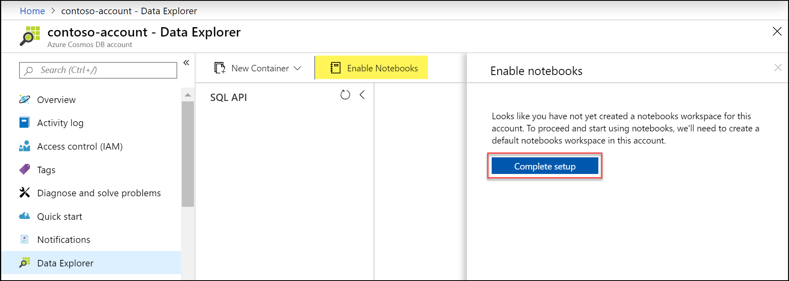
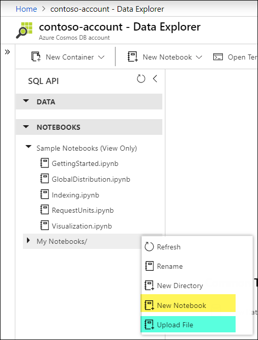

# Enable notebooks for Azure Cosmos DB accounts (preview)

> [!IMPORTANT]
> Built-in notebooks for Azure Cosmos DB are currently available in the following Azure regions: Australia East, East US, East US 2, North Europe, South Central US, Southeast Asia, UK South, West Europe and West US 2. To use notebooks, [create a new account with notebooks](#enable-notebooks-in-a-new-cosmos-account) or [enable notebooks on an existing account](#enable-notebooks-in-an-existing-cosmos-account) in one of these regions.

Built-in Jupyter notebooks in Azure Cosmos DB enable you to analyze and visualize your data from the Azure portal. This article describes how to enable this feature for your Azure Cosmos DB account.

## Enable notebooks in a new Cosmos account
1. Sign into the [Azure portal](https://portal.azure.com/).
1. Select **Create a resource** > **Databases** > **Azure Cosmos DB**.
1. On the **Create Azure Cosmos DB Account** page, select **Notebooks**. 
 
    
1. Select **Review + create**. You can skip the **Network** and **Tags** option. 
1. Review the account settings, and then select **Create**. It takes a few minutes to create the account. Wait for the portal page to display **Your deployment is complete**. 

    
1. Select **Go to resource** to go to the Azure Cosmos DB account page. 

    

1. Navigate to the **Data Explorer** pane. You should now see your notebooks workspace.

    

## Enable notebooks in an existing Cosmos account
You can also enable notebooks on existing accounts. This step needs to be done only once per account.

1. Navigate to the **Data Explorer** pane in your Cosmos account.
1. Select **Enable Notebooks**.

    
1. This will prompt you to create a new notebooks workspace. Select **Complete setup.**
1. Your account is now enabled to use notebooks!

## Create and run your first notebook

To verify that you can use notebooks, select one of notebooks under Sample Notebooks. This will save a copy of the notebook to your workspace and open it.

In this example, we'll use **GettingStarted.ipynb**. 

To run the notebook:
1. Select the first code cell that contains Python code. 
1. Select **Run** to run the cell. You can also use **Shift + Enter** to run the cell.
1. Refresh the resource pane to see the database and container that has been created.

    

You can also select **New Notebook** to create a new notebook or upload an existing notebook  (.ipynb) file by selecting **Upload File** from the **My Notebooks** menu. 

## Next steps

- Learn about the benefits of [Azure Cosmos DB Jupyter notebooks](cosmosdb-jupyter-notebooks.md)
