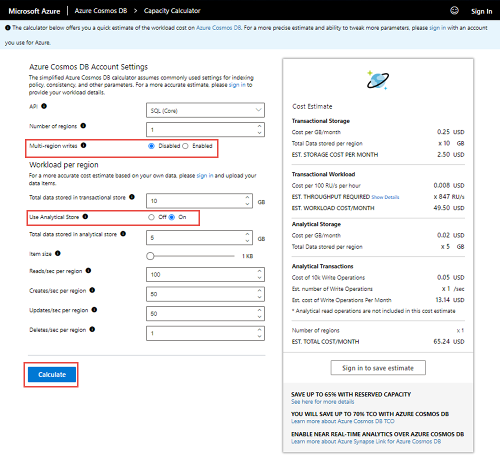
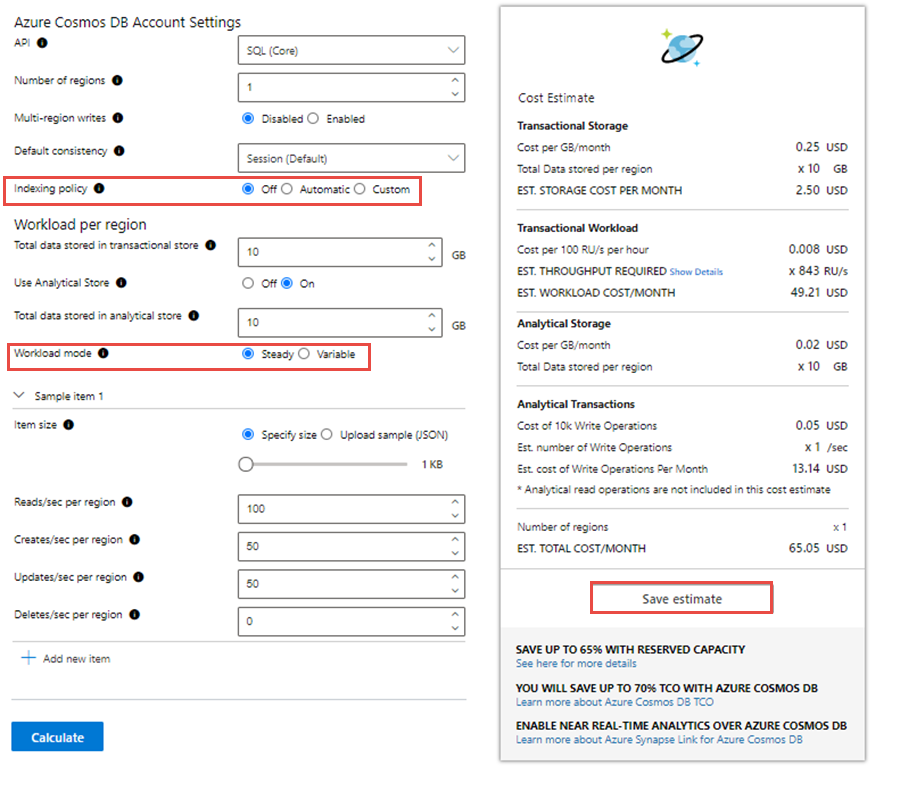

# Estimate costs using the Azure Cosmos DB capacity planner

Configuring your Azure Cosmos databases and containers with the right amount of throughput, or Request Units (RU/s), for your workload is essential to optimizing cost and performance. This article describes how to use the Azure Cosmos DB capacity planner to get an estimate of the required RU/s and cost of your workload. 

## How to estimate throughput and cost with Azure Cosmos DB capacity planner

The capacity planner can be used in two modes.

|**Mode**  |**Description**  |
|---------|---------|
|Basic|Provides a quick, high-level RU/s and cost estimate that assumes the default Azure Cosmos DB settings for indexing policy, consistency, and other parameters.   Use basic mode for a high-level estimate when you are evaluating Azure Cosmos DB.|
|Advanced|Provides a more detailed RU/s and cost estimate, with the ability to tune additional settings that affect the cost and throughput.   Use advanced mode when you are estimating RU/s for a new project or want a more detailed estimate. |

## Estimate throughput using basic mode
To get a quick estimate for your workload using the basic mode, navigate to the [capacity planner](https://cosmos.azure.com/capacitycalculator/). Enter in the following parameters based on your workload: 

|**Input**  |**Description**  |
|---------|---------|
|Number of regions|Azure Cosmos DB is available in all Azure regions. Select the number of regions required for your workload.|
|Multi-region writes|If you enable multi-region writes, your application can read and write to any Azure region. If you disable multi-region writes, your application can write data to a single region.    Enable multi-region writes if you expect to have an active-active workload that requires low latency writes in different regions. For example, an IOT workload that writes data to the database at high volumes in different regions.    Multi-region writes guarantees 99.999% read and write availability. Multi-region writes require more throughput when compared to the single write regions. To learn more, see [how RUs are different for single and write regions](optimize-cost-regions.md) article.|
|Total data stored|Total estimated data stored in GB in 1 region.|
|Item size|The estimated size of the document, ranging from 1 KB to 2 MB. |
|Reads/sec per region|Number of reads expected per second. |
|Writes/sec per region|Number of writes expected per second. |

After filling the required details, select **Calculate**. The **Cost Estimate** tab shows the total cost for storage and throughput. You can expand the **Show Details** link in this tab to get the breakdown of throughput required for read and write requests. Each time you change the value of any field, select **Calculate** to re-calculate the estimated cost. 

## Estimate throughput using advanced mode

Advanced mode allows you to provide more settings that impact the RU/s estimate. To use this option, navigate to the [capacity planner](https://cosmos.azure.com/capacitycalculator/) and sign in to the tool with an account you use for Azure. The sign-in option is available at the right-hand corner. 

After you sign in, you can see additional fields than what you had in the basic mode. Enter the additional parameters based on your workload. 

|**Input**  |**Description**  |
|---------|---------|
|API|Azure Cosmos DB is a multi-model service. For new workloads, select SQL (Core) API. |
|Number of regions|Azure Cosmos DB is available in all Azure regions. Select the number of regions required for your workload.|
|Multi-region writes|If you enable multi-region writes, your application can read and write to any Azure region. If you disable multi-region writes, your application can write data to a single region.    Enable multi-region writes if you expect to have an active-active workload that requires low latency writes in different regions. For example, an IOT workload that writes data to the database at high volumes in different regions.    Multi-region writes guarantees 99.999% read and write availability. Multi-region writes require more throughput when compared to the single write regions. To learn more, see [how RUs are different for single and write regions](optimize-cost-regions.md) article.|
|Default consistency|Azure Cosmos DB supports 5 consistency levels, to allow developers to balance the tradeoff between consistency, availability, and latency tradeoffs. To learn more, see the [consistency levels](consistency-levels.md) article.    By default, Azure Cosmos DB uses session consistency, which guarantees the ability to read your own writes in a session.    Choosing strong or bounded staleness will increase the required RU/s for reads and writes by 2 times, when compared to session, consistent prefix, and eventual consistency.    Strong consistency is not available with multi-region writes. |
|Indexing policy|By default, Azure Cosmos DB indexes all properties in all items for flexible and efficient queries (maps to the **Automatic** policy).    If you choose **off**, none of the properties are indexed. This results in the lowest RU charge for writes. Select **off** policy if you expect to only do [point reads](https://docs.microsoft.com/dotnet/api/microsoft.azure.cosmos.container.readitemasync?view=azure-dotnet) (key value lookups) and/or writes, and no queries.    Custom indexing policy allows you to include or exclude specific properties from the index for lower write throughput and storage. To learn more, see [indexing policy](index-overview.md) and [sample indexing policies](how-to-manage-indexing-policy.md#indexing-policy-examples) articles.|
|Total data stored|Total estimated data stored in GB in 1 region.|    
|Workload mode|Select **Steady** if your workload volume is constant.    Select **Variable** if your workload volume changes over time.  For example, during a specific day or a month.    The following settings are available if you choose variable workload:<ul><li>Percentage of time at peak: Percentage of time in a month where your workload requires peak (highest) throughput.    For example, if you have a workload that has high activity during 9am – 6pm weekday business hours, then the percentage of time at peak is: 45 hours at peak / 730 hours / month = ~6%.  </li><li>Reads/sec per region at peak - Number of reads expected per second at peak.</li> <li>Writes/sec per region at peak – Number of writes expected per second at peak.</li> <li>Reads/sec per region off peak – Number of reads expected per second during off peak.</li> <li>Writes/sec per region off peak – Number of writes expected per second during off peak.</li></ul>With peak and off-peak times, you can optimize your cost by [programmatically scaling your throughput](set-throughput.md#update-throughput-on-a-database-or-a-container) up and down accordingly.|
|Item size|The size of the document, ranging from 1 KB to 2 MB.   You can also **Upload sample (JSON)** document for a more accurate estimate.  If your workload has multiple types of documents in the same container, you can upload multiple JSON documents and get the estimate. Use the **Add new item** button to add multiple sample JSON documents.|

You can also use the **Save Estimate** button to download a CSV file containing the current estimate. 

The prices shown in the Azure Cosmos DB capacity planner are estimates based on the public pricing rates for throughput and storage. Refer to the [Azure Cosmos DB Pricing page](https://azure.microsoft.com/pricing/details/cosmos-db/) to see all rates by region.  

## Estimating throughput for queries

The Azure Cosmos capacity calculator assumes point reads (a read of a single document by ID and partition key value) and writes for the workload. To estimate the throughput for queries, run your query on a representative data set in a Cosmos container and [obtain the RU charge](find-request-unit-charge.md). Multiply the RU charge by number of queries/second to get the total RU/s required. 

For example, if your workload requires a query, ``SELECT * FROM c WHERE c.id = 'alice'`` that is run 100 times per second, and the RU charge of the query is 10 RUs, you will need 100 query / sec * 10 RU / query = 1000 RU/s to serve these requests. Add these RU/s to the RU/s required for any reads or writes happening in your workload.

## Next steps

* Learn more about [Azure Cosmos DB's pricing model](how-pricing-works.md).
* Create a new [Cosmos account, database, and container](create-cosmosdb-resources-portal.md).
* Learn how to [optimize provisioned throughput cost](optimize-cost-throughput.md).
* Learn how to [optimize cost with reserved capacity](cosmos-db-reserved-capacity.md).

