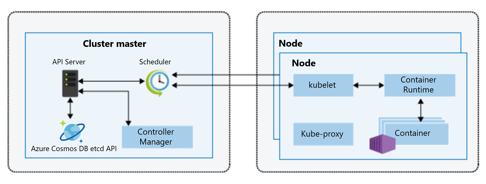

# Introduction to the Azure Cosmos DB etcd API (preview)

Azure Cosmos DB is Microsoft's globally distributed, multi-model database service for mission-critical applications. It offers turnkey global distribution, elastic scaling of throughput and storage, single-digit millisecond latencies at the 99th percentile, and guaranteed high availability, all backed by industry-leading SLA's.

[Etcd](https://github.com/etcd-io/etcd) is a distributed key/value store. In [Kubernetes](https://kubernetes.io/), etcd is used to store the state and the configuration of the Kubernetes clusters. Ensuring availability, reliability, and performance of etcd is crucial to the overall cluster health, scalability, elasticity availability, and performance of a Kubernetes cluster.

The etcd API in Azure Cosmos DB allows you to use Azure Cosmos DB as the backend store for Azure Kubernetes. etcd API in Azure Cosmos DB is currently in preview. Azure Cosmos DB implements the etcd wire protocol. With etcd API in Azure Cosmos DB, developers will automatically get highly reliable, [available](high-availability.md), [globally distributed](distribute-data-globally.md) Kubernetes. This API allows developers to scale Kubernetes state management on a fully managed cloud native PaaS service. 

> [!NOTE]
> Unlike other APIs in Azure Cosmos DB, you cannot provision an etcd API account through the Azure portal, CLI or SDKs. You can provision an etcd API account by deploying the Resource Manager template only; for detailed steps, see [How to provision Azure Kubernetes with Azure Cosmos DB](bootstrap-kubernetes-cluster.md) article. Azure Cosmos DB etcd API is currently in limited preview. You can [sign-up for the preview](https://aka.ms/cosmosetcdapi-signup), by filling out the sign-up form.

## Wire level compatibility

Azure Cosmos DB implements the wire-protocol of etcd version 3, and allows the [master node's](https://kubernetes.io/docs/concepts/overview/components/) API servers to use Azure Cosmos DB just like it would do in a locally installed etcd environment. The etcd API supports TLS mutual authentication. 

The following diagram shows the components of a Kubernetes cluster. In the cluster master, the API Server uses Azure Cosmos DB etcd API, instead of locally installed etcd. 

## Key benefits

### No etcd operations management

As a fully managed native cloud service, Azure Cosmos DB removes the need for Kubernetes developers to set up and manage etcd. The etcd API in Azure Cosmos DB is scalable, highly available, fault tolerant, and offers high performance. The overhead of setting up replication across multiple nodes, performing rolling updates, security patches, and monitoring the etcd health are handled by Azure Cosmos DB.

### Global distribution & high availability 

By using etcd API, Azure Cosmos DB guarantees 99.99% availability for data reads and writes in a single region, and 99.999% availability across multiple regions. 

### Elastic scalability

Azure Cosmos DB offers elastic scalability for read and write requests across different regions.
As the Kubernetes cluster grows, the etcd API account in Azure Cosmos DB elastically scales without any downtime. Storing etcd data in Azure Cosmos DB, instead of the Kubernetes master nodes also enables more flexible master node scaling. 

### Security & enterprise readiness

When etcd data is stored in Azure Cosmos DB, Kubernetes developers automatically get the [built-in encryption at rest](database-encryption-at-rest.md),  [certifications and compliance](compliance.md), and [backup and restore capabilities](online-backup-and-restore.md) supported by Azure Cosmos DB. 

## Next steps

* [How to use Azure Kubernetes with Azure Cosmos DB](bootstrap-kubernetes-cluster.md)
* [Key benefits of Azure Cosmos DB](introduction.md)
* [AKS engine Quickstart guide](https://github.com/Azure/aks-engine/blob/master/docs/tutorials/quickstart.md)