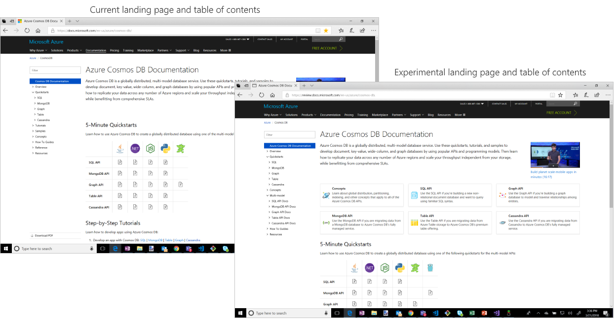

# Azure Cosmos DB documentation experiment

Azure Cosmos DB is a globally-distributed, multi-model database. Because you can do so much with Azure Cosmos DB - from creating a graph to creating a document database, or migrating your data from MongoDB, Cassandra, or Azure Table storage - organizing the documentation can be a challenge. So we'd like your help.

This page is part of an experimental view of the Azure Cosmos DB documentation. The table of contents (TOC) on the left is different from the TOC on the public [Azure Cosmos DB documentation page](https://docs.microsoft.com/azure/cosmos-db/). The landing page is also a bit different. We'd like to get your feedback on these proposed changes. 

Click the Provide feedback button below and provide feedback on this new experience after you've had a chance to get familiar with the new layout. Please submit the form no later than midnight March 27th, 2018 so that the feedback can be reviewed and incorporated. 

> [!div class="nextstepaction"]
> [Provide feedback](https://forms.office.com/Pages/ResponsePage.aspx?id=v4j5cvGGr0GRqy180BHbR7nNByCFnW1EvwkPlRiTC3hUMDJUV0w2RDdXSVFPN1UzOEY0S1QxMU5YQy4u)

If you're interested in providing feedback to the docs.microsoft.com team in the future about the organization and layout of Azure content, please fill out the [docs.Microsoft.com Customer Engagement Survey](https://microsoft.qualtrics.com/jfe/form/SV_d51TkFVpyi7TBQ1) to be part of future conversations. 