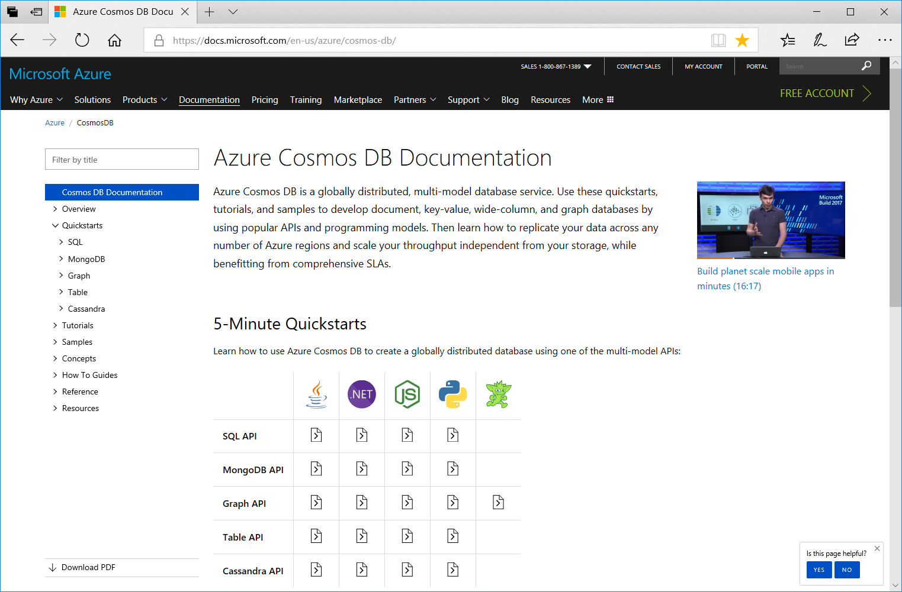
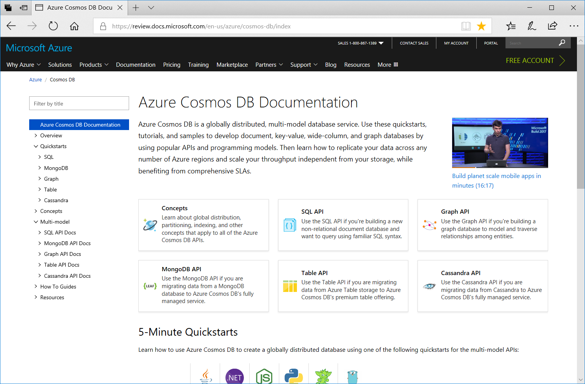

# Azure Cosmos DB documentation experiment

Azure Cosmos DB is a globally-distributed, multi-model database. Because you can do so much with Azure Cosmos DB - from creating a graph to creating a document database, or migrating your data from MongoDB, Cassandra, or Azure Table storage - organizing the documentation can be a challenge. So we'd like your help.

The page your on now is part of an experimental view of the Azure Cosmos DB documentation. The table of contents on the left organizes the content differently from the table of contents on the original [Azure Cosmos DB documentation page](https://docs.microsoft.com/azure/cosmos-db/). The [landing page](https://review.docs.microsoft.com/en-us/azure/cosmos-db/index?branch=pr-en-us-35257) for this experimental content is also a bit different from the original and introduces some new tiles. We'd like to get your feedback on these proposed changes. 

You can use the following images to compare the original page and the experimental page, or open them side-by-side in separate browsers.

**[Original page and table of contents](https://docs.microsoft.com/en-us/azure/cosmos-db/)**

**[Experimental page and table of contents](https://review.docs.microsoft.com/en-us/azure/cosmos-db/index?branch=pr-en-us-35257)**

Click the **Provide feedback** button below and provide feedback on this new experience after you've had a chance to get familiar with the new organization of the table of contents and the landing page. Please submit the form no later than midnight March 28th, 2018 so that the feedback can be reviewed and incorporated. 

> [!div class="nextstepaction"]
> [Provide feedback](https://forms.office.com/Pages/ResponsePage.aspx?id=v4j5cvGGr0GRqy180BHbR7nNByCFnW1EvwkPlRiTC3hUMDJUV0w2RDdXSVFPN1UzOEY0S1QxMU5YQy4u)

If you're interested in providing feedback to the docs.microsoft.com team in the future about the organization and layout of Azure content, please fill out the docs.Microsoft.com [Customer Engagement Survey](https://microsoft.qualtrics.com/jfe/form/SV_d51TkFVpyi7TBQ1) to be part of future conversations. 