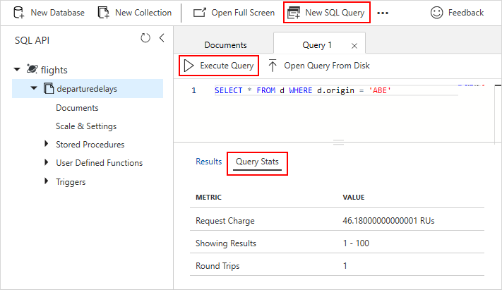
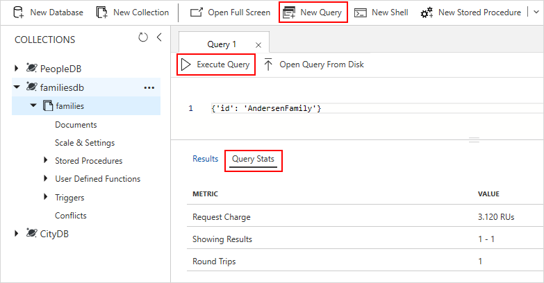

# Find the request unit charge in Azure Cosmos DB

This article presents the different ways you can find the [request unit](request-units.md) (RU) consumption for any operation executed against a container in Azure Cosmos DB. Currently, you can measure this consumption only by using the Azure portal or by inspecting the response sent back from Azure Cosmos DB through one of the SDKs.

## SQL (Core) API

If you're using the SQL API, you have multiple options for finding the RU consumption for an operation against an Azure Cosmos container.

### Use the Azure portal

Currently, you can find the request charge in the Azure portal only for a SQL query.

1. Sign in to the [Azure portal](https://portal.azure.com/).

1. [Create a new Azure Cosmos account](create-sql-api-dotnet.md#create-account) and feed it with data, or select an existing Azure Cosmos account that already contains data.

1. Go to the **Data Explorer** pane, and then select the container you want to work on.

1. Select **New SQL Query**.

1. Enter a valid query, and then select **Execute Query**.

1. Select **Query Stats** to display the actual request charge for the request you executed.



### Use the .NET SDK

# [.NET SDK V2](#tab/dotnetv2)

Objects that are returned from the [.NET SDK v2](https://www.nuget.org/packages/Microsoft.Azure.DocumentDB/) expose a `RequestCharge` property:

```csharp
ResourceResponse<Document> fetchDocumentResponse = await client.ReadDocumentAsync(
    UriFactory.CreateDocumentUri("database", "container", "itemId"),
    new RequestOptions
    {
        PartitionKey = new PartitionKey("partitionKey")
    });
var requestCharge = fetchDocumentResponse.RequestCharge;

StoredProcedureResponse<string> storedProcedureCallResponse = await client.ExecuteStoredProcedureAsync<string>(
    UriFactory.CreateStoredProcedureUri("database", "container", "storedProcedureId"),
    new RequestOptions
    {
        PartitionKey = new PartitionKey("partitionKey")
    });
requestCharge = storedProcedureCallResponse.RequestCharge;

IDocumentQuery<dynamic> query = client.CreateDocumentQuery(
    UriFactory.CreateDocumentCollectionUri("database", "container"),
    "SELECT * FROM c",
    new FeedOptions
    {
        PartitionKey = new PartitionKey("partitionKey")
    }).AsDocumentQuery();
while (query.HasMoreResults)
{
    FeedResponse<dynamic> queryResponse = await query.ExecuteNextAsync<dynamic>();
    requestCharge = queryResponse.RequestCharge;
}
```

# [.NET SDK V3](#tab/dotnetv3)

Objects that are returned from the [.NET SDK v3](https://www.nuget.org/packages/Microsoft.Azure.Cosmos/) expose a `RequestCharge` property:

[!code-csharp[](~/samples-cosmosdb-dotnet-v3/Microsoft.Azure.Cosmos/tests/Microsoft.Azure.Cosmos.Tests/SampleCodeForDocs/CustomDocsSampleCode.cs?name=GetRequestCharge)]

For more information, see [Quickstart: Build a .NET web app by using a SQL API account in Azure Cosmos DB](create-sql-api-dotnet.md).

---

### Use the Java SDK

Objects that are returned from the [Java SDK](https://mvnrepository.com/artifact/com.microsoft.azure/azure-cosmosdb) expose a `getRequestCharge()` method:

```java
RequestOptions requestOptions = new RequestOptions();
requestOptions.setPartitionKey(new PartitionKey("partitionKey"));

Observable<ResourceResponse<Document>> readDocumentResponse = client.readDocument(String.format("/dbs/%s/colls/%s/docs/%s", "database", "container", "itemId"), requestOptions);
readDocumentResponse.subscribe(result -> {
    double requestCharge = result.getRequestCharge();
});

Observable<StoredProcedureResponse> storedProcedureResponse = client.executeStoredProcedure(String.format("/dbs/%s/colls/%s/sprocs/%s", "database", "container", "storedProcedureId"), requestOptions, null);
storedProcedureResponse.subscribe(result -> {
    double requestCharge = result.getRequestCharge();
});

FeedOptions feedOptions = new FeedOptions();
feedOptions.setPartitionKey(new PartitionKey("partitionKey"));

Observable<FeedResponse<Document>> feedResponse = client
    .queryDocuments(String.format("/dbs/%s/colls/%s", "database", "container"), "SELECT * FROM c", feedOptions);
feedResponse.forEach(result -> {
    double requestCharge = result.getRequestCharge();
});
```

For more information, see [Quickstart: Build a Java application by using an Azure Cosmos DB SQL API account](create-sql-api-java.md).

### Use the Node.js SDK

Objects that are returned from the [Node.js SDK](https://www.npmjs.com/package/@azure/cosmos) expose a `headers` subobject that maps all the headers returned by the underlying HTTP API. The request charge is available under the `x-ms-request-charge` key:

```javascript
const item = await client
    .database('database')
    .container('container')
    .item('itemId', 'partitionKey')
    .read();
var requestCharge = item.headers['x-ms-request-charge'];

const storedProcedureResult = await client
    .database('database')
    .container('container')
    .storedProcedure('storedProcedureId')
    .execute({
        partitionKey: 'partitionKey'
    });
requestCharge = storedProcedureResult.headers['x-ms-request-charge'];

const query = client.database('database')
    .container('container')
    .items
    .query('SELECT * FROM c', {
        partitionKey: 'partitionKey'
    });
while (query.hasMoreResults()) {
    var result = await query.executeNext();
    requestCharge = result.headers['x-ms-request-charge'];
}
```

For more information, see [Quickstart: Build a Node.js app by using an Azure Cosmos DB SQL API account](create-sql-api-nodejs.md). 

### Use the Python SDK

The `CosmosClient` object from the [Python SDK](https://pypi.org/project/azure-cosmos/) exposes a `last_response_headers` dictionary that maps all the headers returned by the underlying HTTP API for the last operation executed. The request charge is available under the `x-ms-request-charge` key:

```python
response = client.ReadItem(
    'dbs/database/colls/container/docs/itemId', {'partitionKey': 'partitionKey'})
request_charge = client.last_response_headers['x-ms-request-charge']

response = client.ExecuteStoredProcedure(
    'dbs/database/colls/container/sprocs/storedProcedureId', None, {'partitionKey': 'partitionKey'})
request_charge = client.last_response_headers['x-ms-request-charge']
```

For more information, see [Quickstart: Build a Python app by using an Azure Cosmos DB SQL API account](create-sql-api-python.md). 

## Azure Cosmos DB API for MongoDB

The RU charge is exposed by a custom [database command](https://docs.mongodb.com/manual/reference/command/) named `getLastRequestStatistics`. The command returns a document that contains the name of the last operation executed, its request charge, and its duration. If you use the Azure Cosmos DB API for MongoDB, you have multiple options for retrieving the RU charge.

### Use the Azure portal

Currently, you can find the request charge in the Azure portal only for a query.

1. Sign in to the [Azure portal](https://portal.azure.com/).

1. [Create a new Azure Cosmos account](create-mongodb-dotnet.md#create-a-database-account) and feed it with data, or select an existing account that already contains data.

1. Go to the **Data Explorer** pane, and then select the container you want to work on.

1. Select **New Query**.

1. Enter a valid query, and then select **Execute Query**.

1. Select **Query Stats** to display the actual request charge for the request you executed.



### Use the MongoDB .NET driver

When you use the [official MongoDB .NET driver](https://docs.mongodb.com/ecosystem/drivers/csharp/), you can execute commands by calling the `RunCommand` method on a `IMongoDatabase` object. This method requires an implementation of the `Command<>` abstract class:

```csharp
class GetLastRequestStatisticsCommand : Command<Dictionary<string, object>>
{
    public override RenderedCommand<Dictionary<string, object>> Render(IBsonSerializerRegistry serializerRegistry)
    {
        return new RenderedCommand<Dictionary<string, object>>(new BsonDocument("getLastRequestStatistics", 1), serializerRegistry.GetSerializer<Dictionary<string, object>>());
    }
}

Dictionary<string, object> stats = database.RunCommand(new GetLastRequestStatisticsCommand());
double requestCharge = (double)stats["RequestCharge"];
```

For more information, see [Quickstart: Build a .NET web app by using an Azure Cosmos DB API for MongoDB](create-mongodb-dotnet.md).

### Use the MongoDB Java driver


When you use the [official MongoDB Java driver](https://mongodb.github.io/mongo-java-driver/), you can execute commands by calling the `runCommand` method on a `MongoDatabase` object:

```java
Document stats = database.runCommand(new Document("getLastRequestStatistics", 1));
Double requestCharge = stats.getDouble("RequestCharge");
```

For more information, see [Quickstart: Build a web app by using the Azure Cosmos DB API for MongoDB and the Java SDK](create-mongodb-java.md).

### Use the MongoDB Node.js driver

When you use the [official MongoDB Node.js driver](https://mongodb.github.io/node-mongodb-native/), you can execute commands by calling the `command` method on a `db` object:

```javascript
db.command({ getLastRequestStatistics: 1 }, function(err, result) {
    assert.equal(err, null);
    const requestCharge = result['RequestCharge'];
});
```

For more information, see [Quickstart: Migrate an existing MongoDB Node.js web app to Azure Cosmos DB](create-mongodb-nodejs.md).

## Cassandra API

When you perform operations against the Azure Cosmos DB Cassandra API, the RU charge is returned in the incoming payload as a field named `RequestCharge`. You have multiple options for retrieving the RU charge.

### Use the .NET SDK

When you use the [.NET SDK](https://www.nuget.org/packages/CassandraCSharpDriver/), you can retrieve the incoming payload under the `Info` property of a `RowSet` object:

```csharp
RowSet rowSet = session.Execute("SELECT table_name FROM system_schema.tables;");
double requestCharge = BitConverter.ToDouble(rowSet.Info.IncomingPayload["RequestCharge"].Reverse().ToArray(), 0);
```

For more information, see [Quickstart: Build a Cassandra app by using the .NET SDK and Azure Cosmos DB](create-cassandra-dotnet.md).

### Use the Java SDK

When you use the [Java SDK](https://mvnrepository.com/artifact/com.datastax.cassandra/cassandra-driver-core), you can retrieve the incoming payload by calling the `getExecutionInfo()` method on a `ResultSet` object:

```java
ResultSet resultSet = session.execute("SELECT table_name FROM system_schema.tables;");
Double requestCharge = resultSet.getExecutionInfo().getIncomingPayload().get("RequestCharge").getDouble();
```

For more information, see [Quickstart: Build a Cassandra app by using the Java SDK and Azure Cosmos DB](create-cassandra-java.md).

## Gremlin API

When you use the Gremlin API, you have multiple options for finding the RU consumption for an operation against an Azure Cosmos container. 

### Use drivers and SDK

Headers returned by the Gremlin API are mapped to custom status attributes, which currently are surfaced by the Gremlin .NET and Java SDK. The request charge is available under the `x-ms-request-charge` key.

### Use the .NET SDK

When you use the [Gremlin.NET SDK](https://www.nuget.org/packages/Gremlin.Net/), status attributes are available under the `StatusAttributes` property of the `ResultSet<>` object:

```csharp
ResultSet<dynamic> results = client.SubmitAsync<dynamic>("g.V().count()").Result;
double requestCharge = (double)results.StatusAttributes["x-ms-request-charge"];
```

For more information, see [Quickstart: Build a .NET Framework or Core application by using an Azure Cosmos DB Gremlin API account](create-graph-dotnet.md).

### Use the Java SDK

When you use the [Gremlin Java SDK](https://mvnrepository.com/artifact/org.apache.tinkerpop/gremlin-driver), you can retrieve status attributes by calling the `statusAttributes()` method on the `ResultSet` object:

```java
ResultSet results = client.submit("g.V().count()");
Double requestCharge = (Double)results.statusAttributes().get().get("x-ms-request-charge");
```

For more information, see [Quickstart: Create a graph database in Azure Cosmos DB by using the Java SDK](create-graph-java.md).

## Table API

Currently, the only SDK that returns the RU charge for table operations is the [.NET Standard SDK](https://www.nuget.org/packages/Microsoft.Azure.Cosmos.Table). The `TableResult` object exposes a `RequestCharge` property that is populated by the SDK when you use it against the Azure Cosmos DB Table API:

```csharp
CloudTable tableReference = client.GetTableReference("table");
TableResult tableResult = tableReference.Execute(TableOperation.Insert(new DynamicTableEntity("partitionKey", "rowKey")));
if (tableResult.RequestCharge.HasValue) // would be false when using Azure Storage Tables
{
    double requestCharge = tableResult.RequestCharge.Value;
}
```

For more information, see [Quickstart: Build a Table API app by using the .NET SDK and Azure Cosmos DB](create-table-dotnet.md).

## Next steps

To learn about optimizing your RU consumption, see these articles:

* [Request units and throughput in Azure Cosmos DB](request-units.md)
* [Optimize provisioned throughput cost in Azure Cosmos DB](optimize-cost-throughput.md)
* [Optimize query cost in Azure Cosmos DB](optimize-cost-queries.md)
* [Globally scale provisioned throughput](scaling-throughput.md)
* [Provision throughput on containers and databases](set-throughput.md)
* [Provision throughput for a container](how-to-provision-container-throughput.md)
* [Monitor and debug with metrics in Azure Cosmos DB](use-metrics.md)
