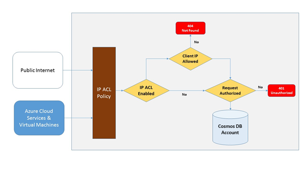
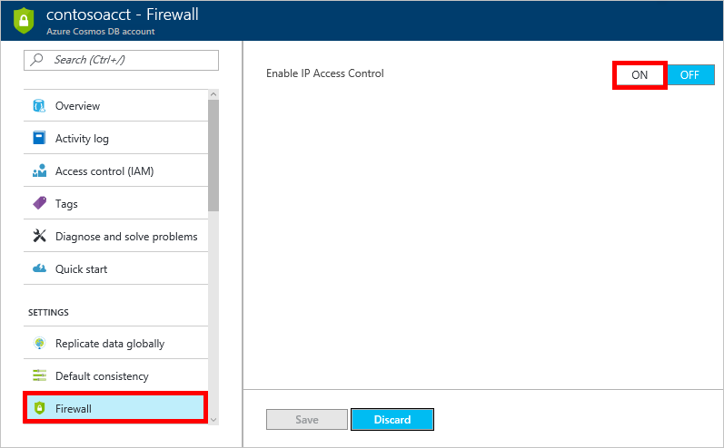
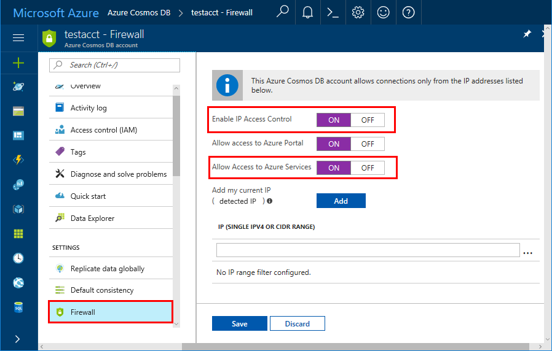
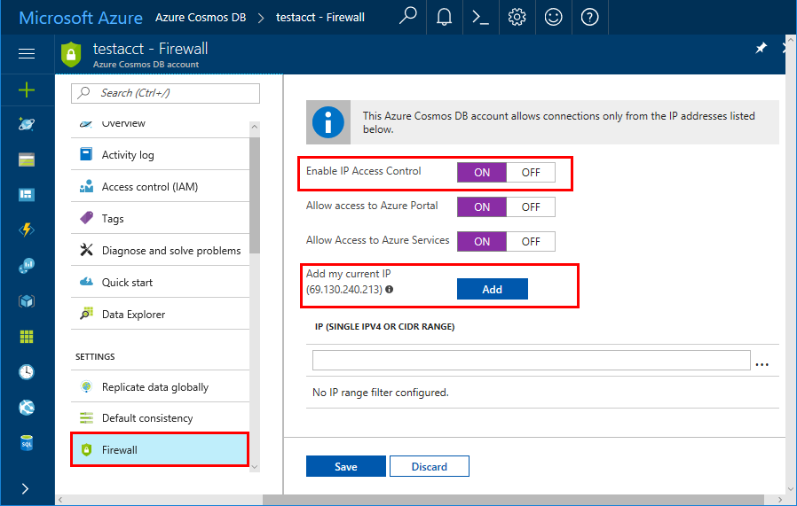

# Azure Cosmos DB firewall support
To secure data stored in an Azure Cosmos DB database account, Azure Cosmos DB has provided support for a secret based [authorization model](https://msdn.microsoft.com/library/azure/dn783368.aspx) that utilizes a strong Hash-based message authentication code (HMAC). Now, in addition to the secret based authorization model, Azure Cosmos DB supports policy driven IP-based access controls for inbound firewall support. This model is  similar to the firewall rules of a traditional database system and provides an additional level of security to the Azure Cosmos DB database account. With this model, you can now configure an Azure Cosmos DB database account to be accessible only from an approved set of machines and/or cloud services. Access to Azure Cosmos DB resources from these approved sets of machines and services still require the caller to present a valid authorization token.

## IP access control overview
By default, an Azure Cosmos DB database account is accessible from public internet as long as the request is accompanied by a valid authorization token. To configure IP policy-based access control, the user must provide the set of IP addresses or IP address ranges in CIDR form to be included as the allowed list of client IPs for a given database account. Once this configuration is applied, all requests originating from machines outside this allowed list are blocked by the server.  The connection processing flow for the IP-based access control is described in the following diagram:



## <a id="configure-ip-policy"></a> Configuring the IP access control policy
The IP access control policy can be set in the Azure portal, or programmatically through [Azure CLI](cli-samples.md), [Azure Powershell](powershell-samples.md), or the [REST API](/rest/api/cosmos-db/) by updating the **ipRangeFilter** property. 

To set the IP access control policy in the Azure portal, navigate to the Azure Cosmos DB account page, click **Firewall and virtual networks** in the navigation menu, then change the **Allow access from** value to **Selected networks**, and then click **Save**. 



Once IP access control is on, the portal provides the ability to specify IP addresses and ranges, as well as switches to enable access to other Azure services, and the Azure portal. Additional information about those switches is provided in the following sections.

> [!NOTE]
> By enabling an IP access control policy for your Azure Cosmos DB database account, all access to your Azure Cosmos DB database account from machines outside the configured allowed list of IP address ranges are blocked. By virtue of this model, browsing the data plane operation from the portal will also be blocked to ensure the integrity of access control.

## Connections from the Azure portal 

When you enable an IP access control policy programmatically, you need to add the IP address for the Azure portal to the **ipRangeFilter** property to maintain access. The portal IP addresses are:

|Region|IP address|
|------|----------|
|All regions except those specified below|104.42.195.92,40.76.54.131,52.176.6.30,52.169.50.45,52.187.184.26|
|Germany|51.4.229.218|
|China|139.217.8.252|
|US Gov|52.244.48.71|

Access to the Azure portal is enabled by default when you change the Firewall setting to **Selected Networks** in the Azure portal. 


## Connections from Global Azure datacenters or Azure PaaS services

Azure PaaS services like Azure Stream analytics, Azure Functions etc. are used in conjunction with Azure Cosmos DB. To allow applications from other Azure PaaS services to connect to your Azure Cosmos DB resources, a firewall setting must be enabled. To enable this firewall setting, add the IP address- 0.0.0.0 to the list of allowed IP addresses. 0.0.0.0 restricts connections to Azure Cosmos DB account from Azure datacenter IP range. This setting does not allow access for any other IP ranges to the Azure Cosmos DB account.

> [!IMPORTANT]
> This option configures the firewall to allow all connections from Azure including connections from the subscriptions of other customers. When selecting this option, make sure your login and user permissions limit access to only authorized users.
> 

Access to the connections from within global Azure datacenters is enabled by default when you change the Firewall setting to **Selected Networks** in the Azure portal. 



## Connections from your current IP

To simplify development, the Azure portal helps you identify and add the IP of your client machine to the allowed list, so that apps running your machine can access the Azure Cosmos DB account. The client IP address here is detected as seen by the portal. It may be the client IP address of your machine, but it could also be the IP address of your network gateway. Do not forget to remove it before going to production.

To enable your current IP, select **Add my current IP**, which adds your current IP to the list of IPs, and then click **Save**.



## Connections from cloud services
In Azure, cloud services are a common way for hosting middle tier service logic using Azure Cosmos DB. To enable access to an Azure Cosmos DB database account from a cloud service, the public IP address of the cloud service must be added to the allowed list of IP addresses associated with your Azure Cosmos DB database account by [configuring the IP access control policy](#configure-ip-policy). This ensures that all role instances of cloud services have access to your Azure Cosmos DB database account. You can retrieve IP addresses for your cloud services in the Azure portal, as shown in the following screenshot:


When you scale out your cloud service by adding additional role instance(s), those new instances will automatically have access to the Azure Cosmos DB database account since they are part of the same cloud service.

## Connections from virtual machines
[Virtual machines](https://azure.microsoft.com/services/virtual-machines/) or [virtual machine scale sets](../virtual-machine-scale-sets/virtual-machine-scale-sets-overview.md) can also be used to host middle tier services using Azure Cosmos DB.  To configure the Azure Cosmos DB database account to allow access from virtual machines, public IP addresses of virtual machine and/or virtual machine scale set must be configured as one of the allowed IP addresses for your Azure Cosmos DB database account by [configuring the IP access control policy](#configure-ip-policy). You can retrieve IP addresses for virtual machines in the Azure portal, as shown in the following screenshot.


When you add additional virtual machine instances to the group, they are automatically provided access to your Azure Cosmos DB database account.

## Connections from the internet
When you access an Azure Cosmos DB database account from a computer on the internet, the client IP address or IP address range of the machine must be added to the allowed list of IP address for the Azure Cosmos DB database account. 

## Using Azure Resource Manager Template to set up the IP access control

Add the following JSON to your template to set up IP access control. Resource Manager template for an account will have ipRangeFilter attribute that is list of IP ranges, which should be whitelisted.

```json
   {
     "apiVersion": "2015-04-08",
     "type": "Microsoft.DocumentDB/databaseAccounts",
     "kind": "GlobalDocumentDB",
     "name": "[parameters('databaseAccountName')]",
     "location": "[resourceGroup().location]",
     "properties": {
     "databaseAccountOfferType": "Standard",
     "name": "[parameters('databaseAccountName')]",
     "ipRangeFilter":"10.0.0.1,10.0.0.2,183.240.196.255"
   }
   }
```

## Troubleshooting the IP access control policy
### Portal operations
By enabling an IP access control policy for your Azure Cosmos DB database account, all access to your Azure Cosmos DB database account from machines outside the configured allowed list of IP address ranges are blocked. Therefore if you want to enable portal data plane operations like browsing containers and query documents, you need to explicitly allow Azure portal access using the **Firewall** page in the portal. 

### SDK & Rest API
For security reasons, access via SDK or REST API from machines not on the allowed list will return a generic 404 Not Found response with no additional details. Verify the IP allowed list configured for your Azure Cosmos DB database account to ensure the correct policy configuration is applied to your Azure Cosmos DB database account.

## Next steps
For information about network-related performance tips, see [Performance tips](performance-tips.md).

