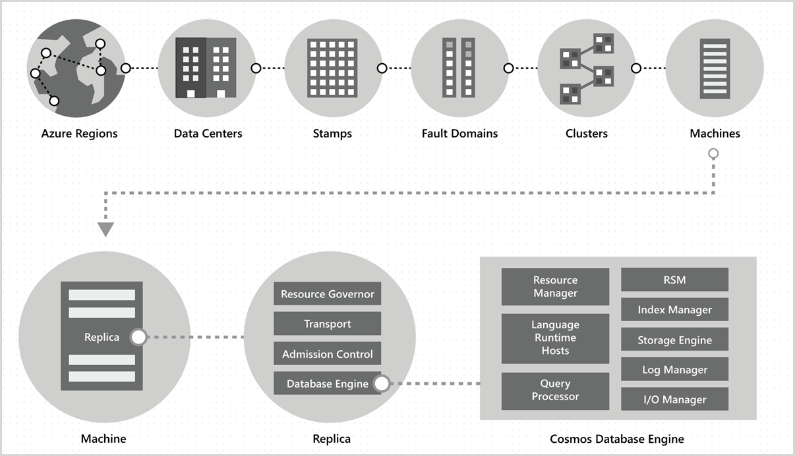
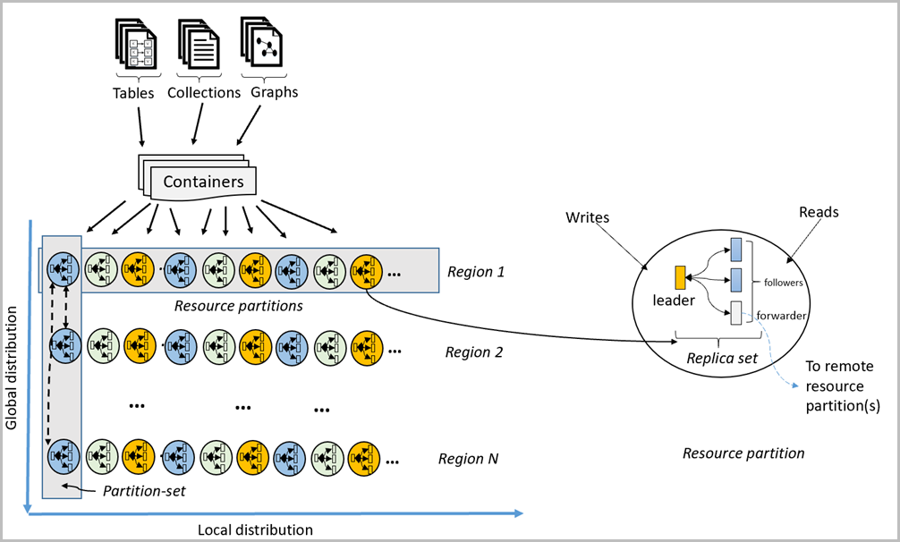
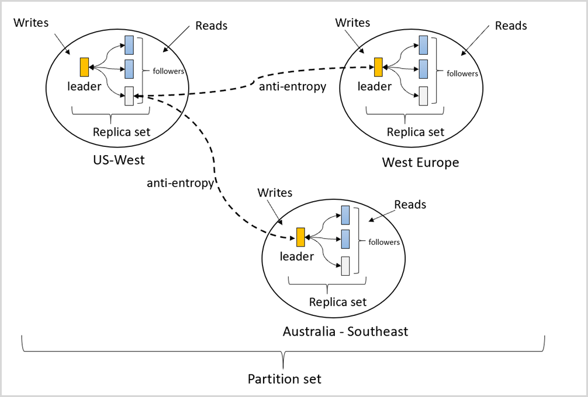

# Global data distribution with Azure Cosmos DB - under the hood

Azure Cosmos DB is a foundational service in Azure, so it's deployed across all Azure regions worldwide including the public, sovereign, Department of Defense (DoD) and government clouds. Within a data center, we deploy and manage the Azure Cosmos DB on massive stamps of machines, each with dedicated local storage. Within a data center, Azure Cosmos DB is deployed across many clusters, each potentially running multiple generations of hardware. Machines within a cluster are typically spread across 10-20 fault domains for high availability within a region. The following image shows the Cosmos DB global distribution system topology:

**Global distribution in Azure Cosmos DB is turnkey:** At any time, with a few clicks or programmatically with a single API call, you can add or remove the geographical regions associated with your Cosmos database. A Cosmos database, in turn, consists of a set of Cosmos containers. In Cosmos DB, containers serve as the logical units of distribution and scalability. The collections, tables, and graphs you create are (internally) just Cosmos containers. Containers are completely schema-agnostic and provide a scope for a query. Data in a Cosmos container is automatically indexed upon ingestion. Automatic indexing enables users to query the data without the hassles of schema or index management, especially in a globally distributed setup.  

- In a given region, data within a container is distributed by using a partition-key, which you provide and is transparently managed by the underlying physical partitions (*local distribution*).  

- Each physical partition is also replicated across geographical regions (*global distribution*). 

When an app using Cosmos DB elastically scales throughput on a Cosmos container or consumes more storage, Cosmos DB transparently handles partition management operations (split, clone, delete) across all the regions. Independent of the scale, distribution, or failures, Cosmos DB continues to provide a single system image of the data within the containers, which are globally distributed across any number of regions.  

As shown in the following image, the data within a container is distributed along two dimensions - within a region and across regions, worldwide:  

A physical partition is implemented by a group of replicas, called a *replica-set*. Each machine hosts hundreds of replicas that correspond to various physical partitions within a fixed set of processes as shown in the image above. Replicas corresponding to the physical partitions are dynamically placed and load balanced across the machines within a cluster and data centers within a region.  

A replica uniquely belongs to an Azure Cosmos DB tenant. Each replica hosts an instance of Cosmos DB’s [database engine](https://www.vldb.org/pvldb/vol8/p1668-shukla.pdf), which manages the resources as well as the associated indexes. The Cosmos DB database engine operates on an atom-record-sequence (ARS) based type system. The engine is agnostic to the concept of a schema, blurring the boundary between the structure and instance values of records. Cosmos DB achieves full schema agnosticism by automatically indexing everything upon ingestion in an efficient manner, which allows users to query their globally distributed data without having to deal with schema or index management.

The Cosmos database engine consists of components including implementation of several coordination primitives, language runtimes, the query processor, and the storage and indexing subsystems responsible for transactional storage and indexing of data, respectively. To provide durability and high availability, the database engine persists its data and index on SSDs and replicates it among the database engine instances within the replica-set(s) respectively. Larger tenants correspond to higher scale of throughput and storage and have either bigger or more replicas or both. Every component of the system is fully asynchronous – no thread ever blocks, and each thread does short-lived work without incurring any unnecessary thread switches. Rate-limiting and back-pressure are plumbed across the entire stack from the admission control to all I/O paths. Cosmos database engine is designed to exploit fine-grained concurrency and to deliver high throughput while operating within frugal amounts of system resources.

Cosmos DB’s global distribution relies on two key abstractions – *replica-sets* and *partition-sets*. A replica-set is a modular Lego block for coordination, and a partition-set is a dynamic overlay of one or more geographically distributed physical partitions. To understand how global distribution works, we need to understand these two key abstractions. 

## Replica-sets

A physical partition is materialized as a self-managed and dynamically load-balanced group of replicas spread across multiple fault domains, called a replica-set. This set collectively implements the replicated state machine protocol to make the data within the physical partition highly available, durable, and consistent. The replica-set membership *N* is dynamic – it keeps fluctuating between *NMin* and *NMax* based on the failures, administrative operations, and the time for failed replicas to regenerate/recover. Based on the membership changes, the replication protocol also reconfigures the size of read and write quorums. To uniformly distribute the throughput that is assigned to a given physical partition, we employ two ideas: 

- First, the cost of processing the write requests on the leader is higher than the cost of applying the updates on the follower. Correspondingly, the leader is budgeted more system resources than the followers. 

- Secondly, as far as possible, the read quorum for a given consistency level is composed exclusively of the follower replicas. We avoid contacting the leader for serving reads unless  required. We employ a number of ideas from the research done on the relationship of [load and capacity](https://www.cs.utexas.edu/~lorenzo/corsi/cs395t/04S/notes/naor98load.pdf) in the quorum-based systems for the [five consistency models](consistency-levels.md) that Cosmos DB supports.  

## Partition-sets

A group of physical partitions, one from each of the configured with the Cosmos database regions, is composed to manage the same set of keys replicated across all the configured regions. This higher coordination primitive is called a *partition-set* - a geographically distributed dynamic overlay of physical partitions managing a given set of keys. While a given physical partition (a replica-set) is scoped within a cluster, a partition-set can span clusters, data centers, and geographical regions as shown in the image below:  

You can think of a partition-set as a geographically dispersed “super replica-set”, which is composed of multiple replica-sets owning the same set of keys. Similar to a replica-set, a partition-set’s membership is also dynamic – it fluctuates based on implicit physical partition management operations to add/remove new partitions to/from a given partition-set (for instance, when you scale out throughput on a container, add/remove a region to your Cosmos database, or when failures occur). By virtue of having each of the partitions (of a partition-set) manage the partition-set membership within its own replica-set, the membership is fully decentralized and highly available. During the reconfiguration of a partition-set, the topology of the overlay between physical partitions is also established. The topology is dynamically selected based on the consistency level, geographical distance, and available network bandwidth between the source and the target physical partitions.  

The service allows you to configure your Cosmos databases with either a single write region or multiple write regions, and depending on the choice, partition-sets are configured to accept writes in exactly one or all regions. The system employs a two-level, nested consensus protocol – one level operates within the replicas of a replica-set of a physical partition accepting the writes, and the other operates at the level of a partition-set to provide complete ordering guarantees for all the committed writes within the partition-set. This multi-layered, nested consensus is critical for the implementation of our stringent SLAs for high availability, as well as the implementation of the consistency models, which Cosmos DB offers to its customers.  

## Conflict resolution

Our design for the update propagation, conflict resolution, and causality tracking is inspired from the prior work on [epidemic algorithms](https://www.cs.utexas.edu/~lorenzo/corsi/cs395t/04S/notes/naor98load.pdf) and the [Bayou](https://zoo.cs.yale.edu/classes/cs422/2013/bib/terry95managing.pdf) system. While the kernels of the ideas have survived and provide a convenient frame of reference for communicating the Cosmos DB’s system design, they have also undergone significant transformation as we applied them to the Cosmos DB system. This was needed, because the previous systems were designed neither with the resource governance nor with the scale at which Cosmos DB needs to operate, nor to provide the capabilities (for example, bounded staleness consistency) and the stringent and comprehensive SLAs that Cosmos DB delivers to its customers.  

Recall that a partition-set is distributed across multiple regions and follows Cosmos DBs (multi-master) replication protocol to replicate the data among the physical partitions comprising a given partition-set. Each physical partition (of a partition-set) accepts writes and serves reads typically to the clients that are local to that region. Writes accepted by a physical partition within a region are durably committed and made highly available within the physical partition before they are acknowledged to the client. These are tentative writes and are propagated to other physical partitions within the partition-set using an anti-entropy channel. Clients can request either tentative or committed writes by passing a request header. The anti-entropy propagation (including the frequency of propagation) is dynamic, based on the topology of the partition-set, regional proximity of the physical partitions, and the consistency level configured. Within a partition-set, Cosmos DB follows a primary commit scheme with a dynamically selected arbiter partition. The arbiter selection is dynamic and is an integral part of the reconfiguration of the partition-set based on the topology of the overlay. The committed writes (including multi-row/batched updates) are guaranteed to be ordered. 

We employ encoded vector clocks (containing region ID and logical clocks corresponding to each level of consensus at the replica-set and partition-set, respectively) for causality tracking and version vectors to detect and resolve update conflicts. The topology and the peer selection algorithm are designed to ensure fixed and minimal storage and minimal network overhead of version vectors. The algorithm guarantees the strict convergence property.  

For the Cosmos databases configured with multiple write regions, the system offers a number of flexible automatic conflict resolution policies for the developers to choose from, including: 

- **Last-Write-Wins (LWW)**, which, by default, uses a system-defined timestamp property (which is based on the time-synchronization clock protocol). Cosmos DB also allows you to specify any other custom numerical property to be used for conflict resolution.  
- **Application-defined (Custom) conflict resolution policy** (expressed via merge procedures), which is designed for application-defined semantics reconciliation of conflicts. These procedures get invoked upon detection of the write-write conflicts under the auspices of a database transaction on the server side. The system provides exactly once guarantee for the execution of a merge procedure as a part of the commitment protocol. There are [several conflict resolution samples](how-to-manage-conflicts.md) available for you to play with.  

## Consistency Models

Whether you configure your Cosmos database with a single or multiple write regions, you can choose from the five well-defined consistency models. With multiple write regions, the following are a few notable aspects of the consistency levels:  

The bounded staleness consistency guarantees that all reads will be within *K* prefixes or *T* seconds from the latest write in any of the regions. Furthermore, reads with bounded staleness consistency are guaranteed to be monotonic and with consistent prefix guarantees. The anti-entropy protocol operates in a rate-limited manner and ensures that the prefixes do not accumulate and the backpressure on the writes does not have to be applied. Session consistency guarantees monotonic read, monotonic write, read your own writes, write follows read, and consistent prefix guarantees, worldwide. For the databases configured with strong consistency, the benefits (low write latency, high write availability) of multiple write regions does not apply, because of synchronous replication across regions.

The semantics of the five consistency models in Cosmos DB are described [here](consistency-levels.md), and mathematically described using a high-level TLA+ specifications [here](https://github.com/Azure/azure-cosmos-tla).

## Next steps

Next learn how to configure global distribution by using the following articles:

* [Add/remove regions from your database account](how-to-manage-database-account.md#addremove-regions-from-your-database-account)
* [How to configure clients for multi-homing](how-to-manage-database-account.md#configure-multiple-write-regions)
* [How to create a custom conflict resolution policy](how-to-manage-conflicts.md#create-a-custom-conflict-resolution-policy)
