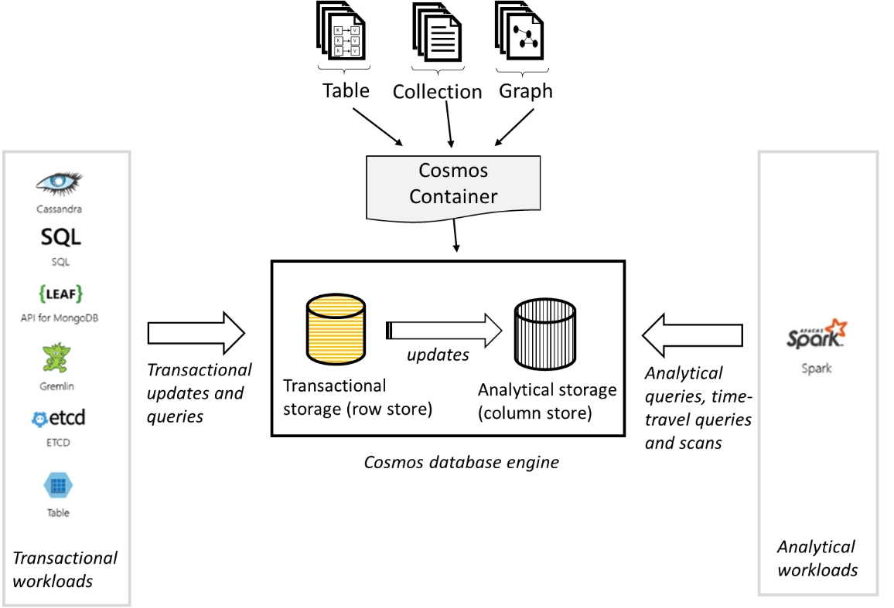

# Globally distributed transactional and analytical storage for Azure Cosmos containers

Azure Cosmos container is internally backed by two storage engines - transactional storage engine and an updatable analytical storage engine (in private preview). Both the storage engines are log-structured and write-optimized for faster updates. However, each of them is encoded differently:

* **Transactional storage engine** – It is encoded in row-oriented format for fast transactional reads and queries.

* **Analytical storage engine** - It is encoded in columnar format for fast analytical queries and scans.

The transactional storage engine is backed by local SSDs, whereas the analytical storage is stored on an inexpensive off-cluster SSD storage. The following table captures the notable differences between the transactional and the analytical storage.

|Feature  |Transactional storage  |Analytical storage |
|---------|---------|---------|
|Maximum storage per an Azure Cosmos container |   Unlimited      |    Unlimited     |
|Maximum storage per a logical partition key   |   20 GB      |   Unlimited      |
|Storage encoding  |   Row-oriented, using an internal format.   |   Column-oriented, using Apache Parquet format. |
|Storage locality |   Replicated storage backed by local/intra-cluster SSDs. |  Replicated storage backed by inexpensive remote/off-cluster SSDs.       |
|Durability  |    99.99999 (7-9 s)     |  99.99999 (7-9 s)       |
|APIs that access the data  |   SQL, MongoDB, Cassandra, Gremlin, Tables, and etcd.       | Apache Spark         |
|Retention (Time-to-live or TTL)   |  Policy driven, configured on the Azure Cosmos container by using the `DefaultTimeToLive` property.       |   Policy driven, configured on the Azure Cosmos container by using the `ColumnStoreTimeToLive` property.      |
|Price per GB    |   See the [pricing page](https://azure.microsoft.com/pricing/details/cosmos-db/)     |   See the [pricing page](https://azure.microsoft.com/pricing/details/cosmos-db/)        |
|Price for storage transactions    |  See the [pricing page](https://azure.microsoft.com/pricing/details/cosmos-db/)         |   See the [pricing page](https://azure.microsoft.com/pricing/details/cosmos-db/)        |

## Benefits of transactional and analytical storage

### No ETL operations

Traditional analytical pipelines are complex with multiple stages each requiring Extract-Transform-Load (ETL) operations to and from the compute and storage tiers. It results in complex data processing architectures. Which means high costs for multiple stages of storage and compute, and high latency due to massive volumes of data transferred between various stages of storage and compute.  

There is no overhead of performing ETL operations with Azure Cosmos DB. Each Azure Cosmos container is backed by both transactional and analytical storage engines, and the data transfer between the transactional and analytical storage engine is done within the database engine, and without any network hops. The resulting latency and cost are significantly lower compared to traditional analytical solutions. And you get a single globally distributed storage system for both transactional and analytical workloads.  

### Store multiple versions, update, and query the analytical storage

The analytical storage is fully updatable, and it contains the complete version history of all the transactional updates that occurred on the Azure Cosmos container.

Any update made to the transactional storage is guaranteed to be visible to the analytical storage within 30 seconds. 

### Globally distributed, multi-master analytical storage

If your Azure Cosmos account is scoped to a single region, the data stored (in transactional and analytical storage) in the containers is also scoped to a single region. On the other hand, if the Azure Cosmos account is globally distributed, the data stored in the containers is also globally distributed.

For Azure Cosmos accounts configured with multiple write regions, writes to the container (to both the transactional and the analytical storage) are always performed in the local region and hence they are fast.

For both single or multi-region Azure Cosmos accounts, regardless if single write region (single master) or multiple write regions (also known as multi-master), both transactional and analytical reads/queries are performed locally in the given region.

### Performance isolation between transactional and analytical workloads

In a given region, the transactional workloads operate against your container’s transactional/row storage. On the other hand, the analytical workloads operate against your container’s analytical/column storage. The two storage engines operate independently and provide strict performance isolation between the workloads.

The transactional workloads consume the provisioned throughput (RUs). Unlike the transactional workloads, the analytical workloads throughput is based on the actual consumption. The analytical workloads consume resources on-demand.

## Next steps

* [Time to live in Azure Cosmos DB](time-to-live.md)
