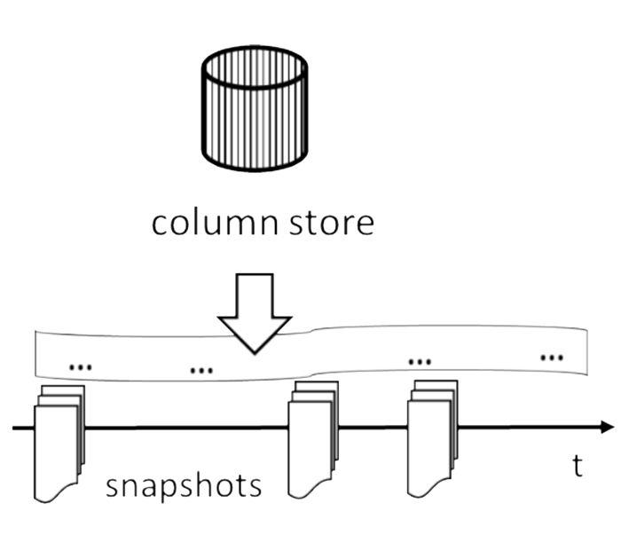
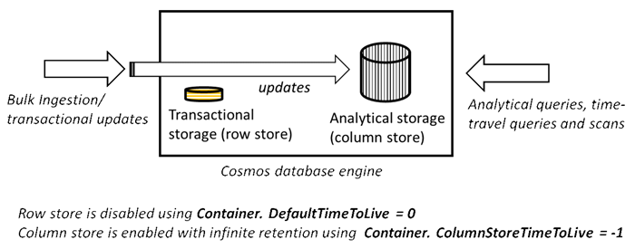
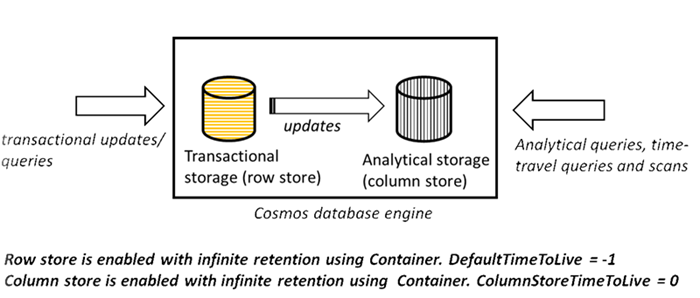
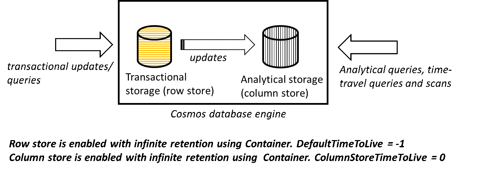
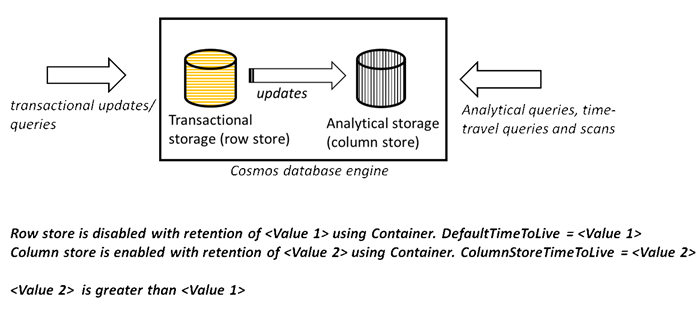

# Globally distributed transactional and analytical storage for Azure Cosmos containers

Azure Cosmos container is internally backed by two storage engines - transactional storage engine and an updatable analytical storage engine. Both the storage engines are log-structured and write-optimized for faster updates. However, each of them is encoded differently:

* **Transactional storage engine** – It is encoded in row-oriented format for fast transactional reads and queries.

* **Analytical storage engine** - It is encoded in columnar format for fast analytical queries and scans.

The transactional storage engine is backed by local SSDs, whereas the analytical storage is stored on an inexpensive off-cluster SSD storage. The following table captures the notable differences between the transactional and the analytical storage.

|Feature  |Transactional storage  |Analytical storage |
|---------|---------|---------|
|Maximum storage per an Azure Cosmos container |   Unlimited      |    Unlimited     |
|Maximum storage per a logical partition key   |   10 GB      |   Unlimited      |
|Storage encoding  |   Row-oriented, using an internal format.   |   Column-oriented, using Apache Parquet format. |
|Storage locality |   Replicated storage backed by local/intra-cluster SSDs. |  Replicated storage backed by inexpensive remote/off-cluster SSDs.       |
|Durability  |    99.99999 (7-9 s)     |  99.99999 (7-9 s)       |
|APIs that access the data  |   SQL, MongoDB, Cassandra, Gremlin, Tables, and Etcd.       | Apache Spark         |
|Retention (Time-to-live or TTL)   |  Policy driven, configured on the Azure Cosmos container by using the `DefaultTimeToLive` property.       |   Policy driven, configured on the Azure Cosmos container by using the `ColumnStoreTimeToLive` property.      |
|Price per GB    |   $0.25/GB      |  $0.02/GB       |
|Price for storage transactions    | Provisioned throughput is charged at $0.008 per 100 RU/s with hourly billing.        |  Consumption-based throughput is charged at $0.05 for 10,000 write transactions and $0.004 for 10,000 read transactions.       |

## Benefits of transactional and analytical storage

### No ETL operations

Traditional analytical pipelines are complex with multiple stages each requiring Extract-Transform-Load (ETL) operations to and from the compute and storage tiers. It results in complex data processing architectures. Which means high costs for multiple stages of storage and compute, and high latency due to massive volumes of data transferred between various stages of storage and compute.  

There is no overhead of performing ETL operations with Azure Cosmos DB. Each Azure Cosmos container is backed by both transactional and analytical storage engines, and the data transfer between the transactional and analytical storage engine is done within the database engine, and without any network hops. The resulting latency and cost are significantly lower compared to traditional analytical solutions. And you get a single globally distributed storage system for both transactional and analytical workloads.  

### Store multiple versions, update, and query the analytical storage

The analytical storage is fully updatable, and it contains the complete version history of all the transactional updates that occurred on the Azure Cosmos container.

Any update made to the transactional storage is guaranteed to be visible to the analytical storage within 30 seconds. 

### Globally distributed, multi-master analytical storage

If your Azure Cosmos account is scoped to a single region, the data stored (in transactional and analytical storage) in the containers is also scoped to a single region. On the other hand, if the Azure Cosmos account is globally distributed, the data stored in the containers is also globally distributed.

For Azure Cosmos accounts configured with multiple write regions, writes to the container (to both the transactional and the analytical storage) are always performed in the local region and hence they are fast.

For both single or multi-region Azure Cosmos accounts, regardless if single write region (single master) or multiple write regions (also known as multi-master), both transactional and analytical reads/queries are performed locally in the given region.

### Performance isolation between transactional and analytical workloads

In a given region, the transactional workloads operate against your container’s transactional/row storage. On the other hand, the analytical workloads operate against your container’s analytical/column storage. The two storage engines operate independently and provide strict performance isolation between the workloads.

The transactional workloads consume the provisioned throughput (RUs). Unlike the transactional workloads, the analytical workloads throughput is based on the actual consumption. The analytical workloads consume resources on-demand.

### On-demand snapshots and time-travel analytics

You can take snapshots of your data stored in the analytical storage of your Azure Cosmos containers, at any time, by calling the `CreateSnapshot (name, timestamp)` command on the container. Snapshots are named “bookmarks” in the history of the updates that were ever done on your container.

At the time of creating the snapshot, in addition to the name, you can specify the timestamp that defines the state of your container in the history of updates. You can then load the snapshot data into Spark and perform the queries.

Currently, you can only take snapshots on-demand at any time on the container, the ability to automatically take snapshots based on a schedule or custom policy isn’t yet supported.

### Configure and tier data between transactional and analytical storage independently

Depending on your scenario, you can independently enable or disable each of the two storage engines. The following are the configurations for each scenario:

|Scenario |Transactional storage setting  |Analytical storage setting |
|---------|---------|---------|
|Running analytical workloads exclusively (with infinite retention) |  DefaultTimeToLive = 0       |  ColumnStoreTimeToLive = -1       |
|Running transactional workloads exclusively (with infinite retention)  |   DefaultTimeToLive = -1      |  ColumnStoreTimeToLive = 0       |
|Running both transactional and analytical workloads (with infinite retention)   |   DefaultTimeToLive = -1      | ColumnStoreTimeToLive = -1        |
|Running both transactional and analytical workloads (with different retention intervals, also known as storage tiering)  |  DefaultTimeToLive = <Value1>       |     ColumnStoreTimeToLive = <Value2>    |

1. **Configure the container exclusively for analytical workloads (with infinite retention)**

   You can configure your Azure Cosmos container exclusively for analytical workloads. This configuration has an advantage where you do not need to pay for the transactional storage. If your goal is to use the container for analytical workloads only, you can disable the transactional storage by setting `DefaultTimeToLive` to 0 on the Cosmos container, and you can enable analytical storage with infinite retention by setting `ColumnStoreTimeToLive` to -1.

   

1. **Configure the container exclusively for transactional workloads (with infinite retention)**

   You can configure your Azure Cosmos container exclusively for transactional workloads. You can disable the analytical storage by setting `ColumnStoreTimeToLive` to 0 on the container, and you can enable analytical storage with infinite retention by setting `DefaultTimeToLive` to -1.

   

1. **Configure the container for both transactional and analytical workloads (with infinite retention)**

   You can configure your Azure Cosmos container for both transactional and analytical workloads with full performance isolation between them. You can enable the analytical storage by setting `ColumnStoreTimeToLive` to -1, and enable transactional storage with infinite retention by setting `DefaultTimeToLive ` to -1.

   

1. **Configure the container for both transactional and analytical workloads with storage-tiering**

   You can configure your Azure Cosmos container for both transactional and analytical workloads with full performance isolation between them with different retention intervals. Azure Cosmos DB will enforce that your analytical storage is always retained for a longer duration than the transactional storage.

   You can enable transactional storage with infinite retention by setting `DefaultTimeToLive` to <Value 1> and enable analytical storage by setting `ColumnStoreTimeToLive` to <Value 2>. Azure Cosmos DB will enforce that <Value 2>  is always greater than <Value 1>.

   

## Next steps

* [Time to live in Azure Cosmos DB](time-to-live.md)
