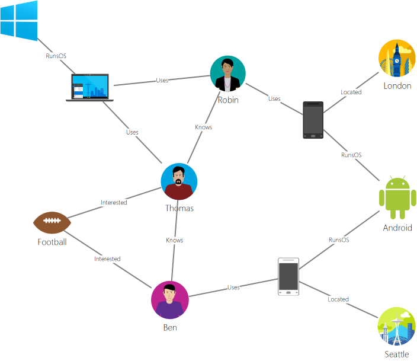
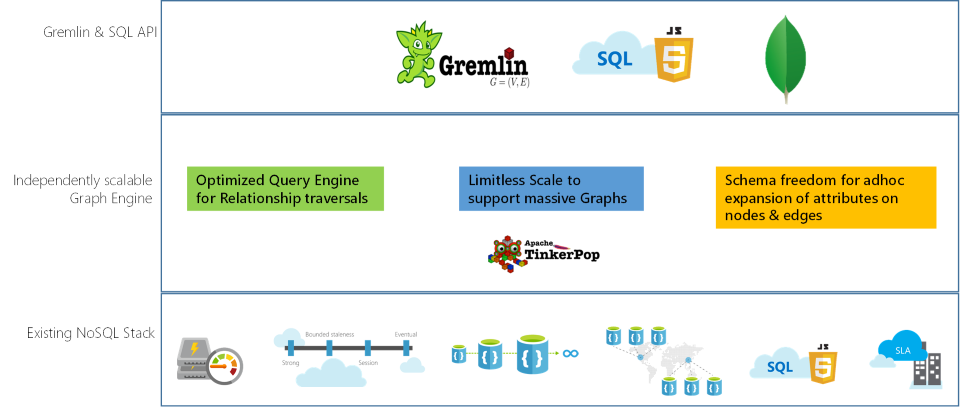
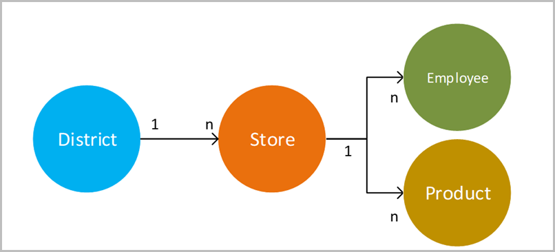

# Introduction to Azure Cosmos DB: Gremlin API

[Azure Cosmos DB](introduction.md) is the globally distributed, multimodel database service from Microsoft for mission-critical applications. It is a multimodel database and supports document, key-value, graph, and columnar data models. The Azure Cosmos DB Gremlin API is used to store and operate on graph data. Gremlin API supports modeling Graph data and provides APIs to traverse through the graph data.

This article provides an overview of the Azure Cosmos DB Gremlin API and explains how you can use it to store massive graphs with billions of vertices and edges. You can query the graphs with millisecond latency and evolve the graph structure and schema easily. To query Azure Cosmos DB, you can use the [Apache TinkerPop](http://tinkerpop.apache.org) graph traversal language, or [Gremlin](http://tinkerpop.apache.org/docs/current/reference/#graph-traversal-steps).

## What is a graph database
Data as it appears in the real world is naturally connected. Traditional data modeling focuses on entities. For many applications, there's also a need to model or to model both entities and relationships naturally.

A [graph](http://mathworld.wolfram.com/Graph.html) is a structure that's composed of [vertices](http://mathworld.wolfram.com/GraphVertex.html) and [edges](http://mathworld.wolfram.com/GraphEdge.html). Both vertices and edges can have an arbitrary number of properties. 

* **Vertices** - Vertices denote discrete objects, such as a person, a place, or an event. 

* **Edges** - Edges denote relationships between vertices. For example, a person might know another person, be involved in an event, and recently been at a location. 

* **Properties** -  Properties express information about the vertices and edges. Example properties include a vertex that has   name and age. An edge, which has a time stamp and/or a weight. More formally, this model is known as a [property graph](http://tinkerpop.apache.org/docs/current/reference/#intro). Azure Cosmos DB supports the property graph model.

For example, the following sample graph shows relationships among people, mobile devices, interests, and operating systems:

Graph databases let you model and store graphs naturally and efficiently, which makes them useful for many scenarios. Graph databases are typically NoSQL databases because these use cases often also need schema flexibility and rapid iteration.

You can combine the fast traversals that graph databases provide with graph algorithms, like depth-first search, breadth-first search, and Dijkstra's algorithm, to solve problems in various domains like social networking, content management, geospatial, and recommendations.

## Features of Azure Cosmos DB graph database
 
Azure Cosmos DB is a fully managed graph database that offers global distribution, elastic scaling of storage and throughput, automatic indexing and query, tunable consistency levels, and support for the TinkerPop standard.

Azure Cosmos DB offers the following differentiated capabilities when compared to other graph databases in the market:

* Elastically scalable throughput and storage

 Graphs in the real world need to scale beyond the capacity of a single server. With Azure Cosmos DB, you can scale your graphs seamlessly across multiple servers. You can also scale the throughput of your graph independently based on your access patterns. Azure Cosmos DB supports graph databases that can scale to virtually unlimited storage sizes and provisioned throughput.

* Multi-region replication

 Azure Cosmos DB transparently replicates your graph data to all regions that you've associated with your account. Replication enables you to develop applications that require global access to data. There are tradeoffs in the areas of consistency, availability, and performance and corresponding guarantees. Azure Cosmos DB provides transparent regional failover with multi-homing APIs. You can elastically scale throughput and storage across the globe.

* Fast queries and traversals with familiar Gremlin syntax

 Store heterogeneous vertices and edges and query these documents through a familiar Gremlin syntax. Azure Cosmos DB utilizes a highly concurrent, lock-free, log-structured indexing technology to automatically index all content. This capability enables rich real-time queries and traversals without the need to specify schema hints, secondary indexes, or views. Learn more in [Query graphs by using Gremlin](gremlin-support.md).

* Fully managed

 Azure Cosmos DB eliminates the need to manage database and machine resources. As a fully managed Microsoft Azure service, you don't need to manage virtual machines, deploy and configure software, manage scaling, or deal with complex data-tier upgrades. Every graph is automatically backed up and protected against regional failures. You can easily add an Azure Cosmos DB account and provision capacity as you need it so that you can focus on your application instead of operating and managing your database.

* Automatic indexing

 By default, Azure Cosmos DB automatically indexes all the properties within nodes and edges in the graph and doesn't expect or require any schema or creation of secondary indices.

* Compatibility with Apache TinkerPop

 Azure Cosmos DB natively supports the open-source Apache TinkerPop standard and can be integrated with other TinkerPop-enabled graph systems. So, you can easily migrate from another graph database, like Titan or Neo4j, or use Azure Cosmos DB with graph analytics frameworks like Apache Spark GraphX.

* Tunable consistency levels

 Select from five well-defined consistency levels to achieve optimal tradeoff between consistency and performance. For queries and read operations, Azure Cosmos DB offers five distinct consistency levels: strong, bounded-staleness, session, consistent prefix, and eventual. These granular, well-defined consistency levels allow you to make sound tradeoffs among consistency, availability, and latency. Learn more in [Tunable data consistency levels in Azure Cosmos DB](consistency-levels.md).

Azure Cosmos DB also can use multiple models, like document and graph, within the same containers/databases. You can use a document container to store graph data side by side with documents. You can use both SQL queries over JSON and Gremlin queries to query the same data as a graph.

## Get started

You can use the Azure command-line interface (CLI), Azure PowerShell, or the Azure portal to create and access Azure Cosmos DB Gremlin API accounts. After you create an account, you can access the graph databases within that account by using a Gremlin API service endpoint  `https://<youraccount>.gremlin.cosmosdb.azure.com`, that provides a WebSocket frontend for Gremlin. You can configure your TinkerPop-compatible tools, like the [Gremlin Console](http://tinkerpop.apache.org/docs/current/reference/#gremlin-console), to connect to this endpoint and build applications in Java, Node.js, or any Gremlin client driver.

The following table shows popular Gremlin drivers that you can use against Azure Cosmos DB:

| Download | Documentation | Getting Started | Supported connector version |
| --- | --- | --- | --- |
| [.NET](http://tinkerpop.apache.org/docs/3.3.1/reference/#gremlin-DotNet) | [Gremlin.NET on GitHub](https://github.com/apache/tinkerpop/tree/master/gremlin-dotnet) | [Create Graph using .NET](create-graph-dotnet.md) | 3.4.0-RC2 |
| [Java](https://mvnrepository.com/artifact/com.tinkerpop.gremlin/gremlin-java) | [Gremlin JavaDoc](http://tinkerpop.apache.org/javadocs/current/full/) | [Create Graph using Java](create-graph-java.md) | 3.2.0+ |
| [Node.js](https://www.npmjs.com/package/gremlin) | [Gremlin-JavaScript on GitHub](https://github.com/jbmusso/gremlin-javascript) | [Create Graph using Node.js](create-graph-nodejs.md) | 2.6.0|
| [Python](http://tinkerpop.apache.org/docs/3.3.1/reference/#gremlin-python) | [Gremlin-Python on GitHub](https://github.com/apache/tinkerpop/tree/master/gremlin-python) | [Create Graph using Python](create-graph-python.md) | 3.2.7 |
| [PHP](https://packagist.org/packages/brightzone/gremlin-php) | [Gremlin-PHP on GitHub](https://github.com/PommeVerte/gremlin-php) | [Create Graph using PHP](create-graph-php.md) | 3.1.0 |
| [Gremlin console](https://tinkerpop.apache.org/downloads.html) | [TinkerPop docs](http://tinkerpop.apache.org/docs/current/reference/#gremlin-console) |  [Create Graph using Gremlin Console](create-graph-gremlin-console.md) | 3.2.0 + |

## Graph database design considerations

During graph design, the decision of modelling an entity as a vertex of its own, as opposed to as a property of other vertex entities has performance and cost implications. The main driver for this decision relies on how the data is going to be queried, as well as the scalability of the model itself.

Consider the following questions before planning on how to model the entity:

* What are the entities that need to be retrieved as vertices for most of my queries?

* What is the information that I’m including in the graph that is added for data filtering purposes?

* What entities are mere connections to other entities, which are then retrieved for their values?

* What pieces of information does my query need to retrieve, and what is the RU charge that they’re going to generate?

For example, assume the following graph design:

* Depending on the queries, it is possible that the District->Store relationship is used uniquely for filtering the Store vertices. For example, if queries are in the format - “obtain all the stores that belong to a specific district”. If this is the case, then it is worth to consider collapsing the District entity from a vertex of its own to a property of the Store vertex. 

* This approach has the benefit of reducing the cost of retrieving each Store vertex from obtaining three graph objects at a time (District, District->Store, Store) to a single Store vertex. This can provide performance improvements, as well as a reduced cost per query.

* Because the Store vertex links to two different entities- Employee and Product. It makes the Store a necessary vertex since it can provide additional possibilities to traverse.  

## Scenarios that can use Gremlin API
Here are some scenarios where graph support of Azure Cosmos DB can be used:

* Social networks

 By combining data about your customers and their interactions with other people, you can develop personalized experiences, predict customer behavior, or connect people with others with similar interests. Azure Cosmos DB can be used to manage social networks and track customer preferences and data.

* Recommendation engines

 This scenario is commonly used in the retail industry. By combining information about products, users, and user interactions, like purchasing, browsing, or rating an item, you can build customized recommendations. The low latency, elastic scale, and native graph support of Azure Cosmos DB is ideal for modeling these interactions.

* Geospatial

 Many applications in telecommunications, logistics, and travel planning need to find a location of interest within an area or locate the shortest/optimal route between two locations. Azure Cosmos DB is a natural fit for these problems.

* Internet of Things

 With the network and connections between IoT devices modeled as a graph, you can build a better understanding of the state of your devices and assets. You also can learn how changes in one part of the network can potentially affect another part.

## Next steps
To learn more about graph support in Azure Cosmos DB, see:

* Get started with the [Azure Cosmos DB graph tutorial](create-graph-dotnet.md).
* Learn about how to [query graphs in Azure Cosmos DB by using Gremlin](gremlin-support.md).
