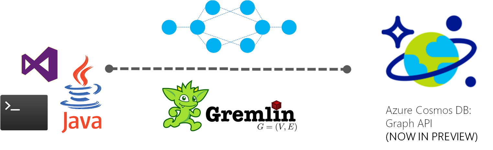

---
title: 'Introduction to Azure Cosmos DB Graph APIs | Microsoft Docs'
description: Learn how you can use Azure Cosmos DB to store, query, and traverse massive graphs with low latency using the Apache TinkerPop's Gremlin graph query language. 
services: cosmosdb
author: arramac
documentationcenter: ''

ms.assetid: b916644c-4f28-4964-95fe-681faa6d6e08
ms.service: cosmosdb
ms.workload: data-services
ms.tgt_pltfrm: na
ms.devlang: dotnet
ms.topic: article
ms.date: 05/21/2017
ms.author: arramac

---
# Introduction to Azure Cosmos DB: Graph API

[Azure Cosmos DB](introduction.md) is Microsoft's globally distributed, multi-model database service for mission-critical applications. Azure Cosmos DB provides [turn-key global distribution](../documentdb/documentdb-distribute-data-globally.md), [elastic scaling of throughput and storage](partition-data.md) worldwide, single-digit millisecond latencies at the 99th percentile, [five well-defined consistency levels](../documentdb/documentdb-consistency-levels.md), and guaranteed high availability, all backed by [industry-leading SLAs](https://azure.microsoft.com/support/legal/sla/documentdb/v1_1/). Azure Cosmos DB [automatically indexes data](http://www.vldb.org/pvldb/vol8/p1668-shukla.pdf) without requiring you to deal with schema and index management. It is multi-model and supports document, key-value, graph, and columnar data models. 

 

Azure Cosmos DB provides graph modeling and traversal APIs along with turn-key global distribution, elastic scaling of storage and throughput, <10 ms read latencies and <15 ms at p99, automatic indexing and query, tunable consistency levels, and comprehensive SLAs including 99.99% availability. Azure Cosmos DB can be queried using [Apache TinkerPop's](http://tinkerpop.apache.org) graph traversal language, [Gremlin](http://tinkerpop.apache.org/docs/current/reference/#graph-traversal-steps), and integrates with other TinkerPop-compatible graph systems like [Apache Spark GraphX](spark-connector-graph.md).

In this article, we provide an overview of the Azure Cosmos DB's Graph API, and how you can use it to store massive graphs with billions of vertices and edges, query them within order of milliseconds latency, and evolve the graph structure and schema easily. 

## Graph databases
Data as it appears in the real world is naturally connected. Traditional data modeling focuses on entities. But for many applications, there is also a need to model the rich relationships between entities. Graphs allow you to model both entities and relationships naturally. 

A [graph](http://mathworld.wolfram.com/Graph.html) is a structure composed of [vertices](http://mathworld.wolfram.com/GraphVertex.html) and [edges](http://mathworld.wolfram.com/GraphEdge.html). Both vertices and edges can have an arbitrary number of properties. Vertices denote discrete objects such as a person, a place, or an event. Edges denote relationships between vertices. For instance, a person may know another person, have been involved in an event, and/or was recently at a particular place. Properties express information about the vertices and edges. Example properties include a vertex having a name, an age, and an edge having a timestamp and/or a weight. More formally, this model is known as a [property graph](http://tinkerpop.apache.org/docs/current/reference/#intro). Azure Cosmos DB supports the property graph model. 

For example, the following diagram sample graph that shows the relationship between people, mobile devices, interests, and operating systems. 

 

Graphs are useful in understanding a wide range of datasets in science, technology, and business. Graph databases let you model and store graphs naturally and efficiently, which makes them appealing for many scenarios. Graph databases are typically NoSQL databases, because these use cases often also need schema flexibility and rapid iteration. 

Graphs offer a novel and powerful data modeling technique. But this by itself, is not a sufficient reason to use a graph database. For many use cases and patterns involving graph traversals, graphs outperform traditional SQL and NoSQL databases by orders of magnitude. This difference in performance is further amplified when traversing more than one relationship like friend-of-a-friend. 

You can combine the fast traversals provided by graph databases with graph algorithms like depth-first search, breadth-first search, Dijkstra’s algorithm, etc., to solve problems in various domains like social networking, geospatial, content management, geospatial, and recommendations. 

## Planet-scale graphs with Azure Cosmos DB
Azure Cosmos DB is a fully managed graph database that offers global distribution, elastic scaling of storage and throughput, automatic indexing and query, tunable consistency levels, and supports the TinkerPop standard.  

 

Azure Cosmos DB offers the following differentiated capabilities compared to other graph databases in the market: 

* **Elastically scalable throughput and storage**: Graphs in the real world need to scale beyond the capacity of a single server. With Azure Cosmos DB, you can scale your graphs seamlessly across multiple servers. You can also independently scale the throughput of your graph independently based on your access patterns. Azure Cosmos DB supports graph databases that can scale to virtually unlimited storage sizes and provisioned throughput. 

* **Multi-region replication**: Azure Cosmos DB transparently replicates your graph data to all regions you've associated with your account, enabling you to develop applications that require global access to data while providing tradeoffs between consistency, availability, and performance, all with corresponding guarantees. Azure Cosmos DB provides transparent regional failover with multi-homing APIs, and the ability to elastically scale throughput and storage across the globe.

* **Fast queries and traversals with familiar Gremlin syntax**: Store heterogeneous vertices and edges and query these documents through a familiar Gremlin syntax (enhanced-SQL will also be available soon). Azure Cosmos DB utilizes a highly concurrent, lock free, log structured indexing technology to automatically index all content. This enables rich real-time queries and traversals without the need to specify schema hints, secondary indexes, or views. Learn more in [Query Graphs using Gremlin](gremlin-support.md).

* **Fully managed**: Eliminate the need to manage database and machine resources. As a fully managed Microsoft Azure service, you do not need to manage virtual machines, deploy and configure software, manage scaling, or deal with complex data-tier upgrades. Every graph is automatically backed up and protected against regional failures. You can easily add an Azure Cosmos DB account and provision capacity as you need it, allowing you to focus on your application instead of operating and managing your database.

* **Automatic indexing**: By default, Azure Cosmos DB automatically indexes all the properties within nodes and edges in the graph and does not expect or require any schema or creation of secondary indices. 

* **Compatibility with Apache TinkerPop**: Azure Cosmos DB natively supports the open-source Apache TinkerPop standard, and can be integrated with other TinkerPop-enabled graph systems. So, you can easily migrate from an another different graph database like Titan or Neo4j, or use Azure Cosmos DB with graph analytics frameworks like [Apache Spark GraphX](spark-connector-graph.md).

* **Tunable consistency levels:** Select from five well-defined consistency levels to achieve optimal trade-off between consistency and performance. For queries and read operations, Azure Cosmos DB offers five distinct consistency levels: strong, bounded-staleness, session, consistent prefix, and eventual. These granular, well-defined consistency levels allow you to make sound tradeoffs between consistency, availability, and latency. Learn more in [Using consistency levels to maximize availability and performance in DocumentDB](../documentdb/documentdb-consistency-levels.md).

Azure Cosmos DB also provides the ability to use multiple models like document and graph within the same containers/databases. You can use a document collection to store graph data side by side with documents, and use both SQL queries over JSON, and Gremlin queries to query the same data as a graph. 

## Getting started
Azure Cosmos DB accounts can be created via the Azure CLI, Azure Powershell, or Azure portal with support for graph API. Once created, the Azure portal provides you with a service endpoint like `https://<youraccount>.graphs.azure.com` that provides a WebSocket frontend for Gremlin. You can configure your TinkerPop-compatible tools like the [Gremin Console](http://tinkerpop.apache.org/docs/current/reference/#gremlin-console) to connect to this endpoint, and build applications in Java, Node.js, or any Gremlin client driver.

The following table shows popular Gremlin drivers that you can start using against Azure Cosmos DB:

| Download | Documentation |
| --- | --- |
| [Java](https://mvnrepository.com/artifact/com.tinkerpop.gremlin/gremlin-java) |[Gremlin JavaDoc](http://tinkerpop.apache.org/javadocs/current/full/) |
| [Node.js](https://www.npmjs.com/package/gremlin) |[Gremlin-JavaScript on Github](https://github.com/jbmusso/gremlin-javascript) |
| [Gremlin console](https://tinkerpop.apache.org/downloads.html) |[TinkerPop docs](http://tinkerpop.apache.org/docs/current/reference/#gremlin-console) |

Azure Cosmos DB also provides a first-party .NET library with Gremlin extension methods on top of the [Azure Cosmos DB SDKs](../documentdb/documentdb-sdk-dotnet.md) via NuGet. This library provide an "in-proc" Gremlin server that can be used to connect directly to DocumenDB data partitions. 

| Download | Documentation |
| --- | --- |
| [.NET](https://www.nuget.org/packages/Microsoft.Azure.Graphs/) |[Microsoft.Azure.Graphs](https://msdn.microsoft.com/library/azure/dn948556.aspx) |

Using the [Azure Cosmos DB Emulator](../documentdb/documentdb-nosql-local-emulator.md), you can develop and test locally using the Graph API, without creating an Azure subscription or incurring any costs. When you're satisfied with how your application is working in the Emulator, you can switch to using an Azure Cosmos DB account in the cloud.

## Scenarios for Azure Cosmos DB's Graph support
Here are some scenarios where Azure Cosmos DB's graph support can be used: 

* **Social networks**: By combining data about your customers and their interactions with other people, you can develop personalized experiences, predict customer behavior, or connect people with others with similar interests. Azure Cosmos DB can be used to manage social networks and track customer preferences and data. 

* **Recommendation engines**: Commonly used in the retail industry. By combining information about products, users, and user interactions like purchasing, browsing or rating an item, you can build customized recommendations. Azure Cosmos DB with its low latency, elastic scale, and native graph support is ideal for modeling these interactions.

* **Geospatial**: Many applications in telecommunications, logistics, and travel planning need to find a location of interest within a particular area, or locate the shortest/optimal route between two locations. Azure Cosmos DB is a natural fit for these problems. 

* **Internet of Things**: With the network and connections between IoT devices modeled as a graph, you can build a better understanding of the state of your devices and assets, and how changes in one part of the network can potentially affect another part. 

## Next steps
To learn more about graph support in Azure Cosmos DB, see:

* Get started with the [Azure Cosmos DB graph tutorial](create-graph-dotnet.md)
* Learn about how to [query graphs in Azure Cosmos DB using Gremlin](gremlin-support.md)