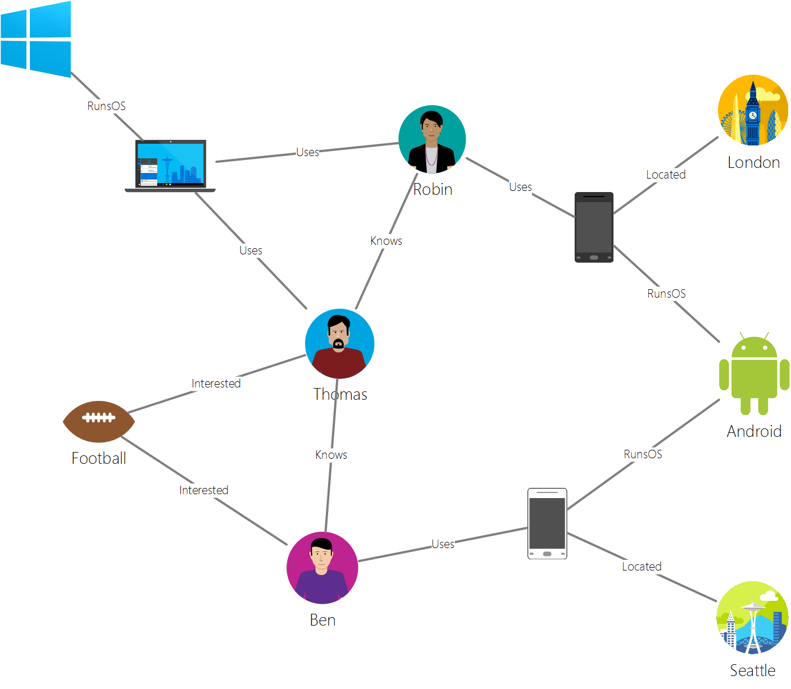

# Azure Cosmos DB Gremlin graph support
Azure Cosmos DB supports [Apache Tinkerpop's](http://tinkerpop.apache.org) graph traversal language, [Gremlin](http://tinkerpop.apache.org/docs/current/reference/#graph-traversal-steps), which is a Gremlin API for creating graph entities, and performing graph query operations. You can use the Gremlin language to create graph entities (vertices and edges), modify properties within those entities, perform queries and traversals, and delete entities. 

Azure Cosmos DB brings enterprise-ready features to graph databases. This includes global distribution, independent scaling of storage and throughput, predictable single-digit millisecond latencies, automatic indexing, SLAs, read availability for database accounts spanning two or more Azure regions. Because Azure Cosmos DB supports TinkerPop/Gremlin, you can easily migrate applications written using another graph database without having to make code changes. Additionally, by virtue of Gremlin support, Azure Cosmos DB seamlessly integrates with TinkerPop-enabled analytics frameworks like [Apache Spark GraphX](http://spark.apache.org/graphx/). 

In this article, we provide a quick walkthrough of Gremlin, and enumerate the Gremlin features and steps that are supported by the Gremlin API.

## Gremlin by example
Let's use a sample graph to understand how queries can be expressed in Gremlin. The following figure shows a business application that manages data about users, interests, and devices in the form of a graph.  

 

This graph has the following vertex types (called "label" in Gremlin):

- People: The graph has three people, Robin, Thomas, and Ben
- Interests: Their interests, in this example, the game of Football
- Devices: The devices that people use
- Operating Systems: The operating systems that the devices run on

We represent the relationships between these entities via the following edge types/labels:

- Knows: For example, "Thomas knows Robin"
- Interested: To represent the interests of the people in our graph, for example, "Ben is interested in Football"
- RunsOS: Laptop runs the Windows OS
- Uses: To represent which device a person uses. For example, Robin uses a Motorola phone with serial number 77

Let's run some operations against this graph using the [Gremlin Console](http://tinkerpop.apache.org/docs/current/reference/#gremlin-console). You can also perform these operations using Gremlin drivers in the platform of your choice (Java, Node.js, Python, or .NET).  Before we look at what's supported in Azure Cosmos DB, let's look at a few examples to get familiar with the syntax.

First let's look at CRUD. The following Gremlin statement inserts the "Thomas" vertex into the graph:

```
:> g.addV('person').property('id', 'thomas.1').property('firstName', 'Thomas').property('lastName', 'Andersen').property('age', 44)
```

Next, the following Gremlin statement inserts a "knows" edge between Thomas and Robin.

```
:> g.V('thomas.1').addE('knows').to(g.V('robin.1'))
```

The following query returns the "person" vertices in descending order of their first names:
```
:> g.V().hasLabel('person').order().by('firstName', decr)
```

Where graphs shine is when you need to answer questions like "What operating systems do friends of Thomas use?". You can run this simple Gremlin traversal to get that information from the graph:

```
:> g.V('thomas.1').out('knows').out('uses').out('runsos').group().by('name').by(count())
```
Now let's look at what Azure Cosmos DB provides for Gremlin developers.

## Gremlin features
TinkerPop is a standard that covers a wide range of graph technologies. Therefore, it has standard terminology to describe what features are provided by a graph provider. Azure Cosmos DB provides a persistent, high concurrency, writeable graph database that can be partitioned across multiple servers or clusters. 

The following table lists the TinkerPop features that are implemented by Azure Cosmos DB: 

| Category | Azure Cosmos DB implementation |  Notes | 
| --- | --- | --- |
| Graph features | Provides Persistence and ConcurrentAccess. Designed to support Transactions | Computer methods can be implemented via the Spark connector. |
| Variable features | Supports Boolean, Integer, Byte, Double, Float, Integer, Long, String | Supports primitive types, is compatible with complex types via data model |
| Vertex features | Supports RemoveVertices, MetaProperties, AddVertices, MultiProperties, StringIds, UserSuppliedIds, AddProperty, RemoveProperty  | Supports creating, modifying, and deleting vertices |
| Vertex property features | StringIds, UserSuppliedIds, AddProperty, RemoveProperty, BooleanValues, ByteValues, DoubleValues, FloatValues, IntegerValues, LongValues, StringValues | Supports creating, modifying, and deleting vertex properties |
| Edge features | AddEdges, RemoveEdges, StringIds, UserSuppliedIds, AddProperty, RemoveProperty | Supports creating, modifying, and deleting edges |
| Edge property features | Properties, BooleanValues, ByteValues, DoubleValues, FloatValues, IntegerValues, LongValues, StringValues | Supports creating, modifying, and deleting edge properties |

## Gremlin wire format: GraphSON

Azure Cosmos DB uses the [GraphSON format](https://github.com/thinkaurelius/faunus/wiki/GraphSON-Format) when returning results from Gremlin operations. GraphSON is the Gremlin standard format for representing vertices, edges, and properties (single and multi-valued properties) using JSON. 

For example, the following snippet shows a GraphSON representation of a vertex *returned to the client* from Azure Cosmos DB. 

```json
  {
    "id": "a7111ba7-0ea1-43c9-b6b2-efc5e3aea4c0",
    "label": "person",
    "type": "vertex",
    "outE": {
      "knows": [
        {
          "id": "3ee53a60-c561-4c5e-9a9f-9c7924bc9aef",
          "inV": "04779300-1c8e-489d-9493-50fd1325a658"
        },
        {
          "id": "21984248-ee9e-43a8-a7f6-30642bc14609",
          "inV": "a8e3e741-2ef7-4c01-b7c8-199f8e43e3bc"
        }
      ]
    },
    "properties": {
      "firstName": [
        {
          "value": "Thomas"
        }
      ],
      "lastName": [
        {
          "value": "Andersen"
        }
      ],
      "age": [
        {
          "value": 45
        }
      ]
    }
  }
```

The properties used by GraphSON for vertices are the following:

| Property | Description |
| --- | --- |
| id | The ID for the vertex. Must be unique (in combination with the value of _partition if applicable) |
| label | The label of the vertex. This is optional, and used to describe the entity type. |
| type | Used to distinguish vertices from non-graph documents |
| properties | Bag of user-defined properties associated with the vertex. Each property can have multiple values. |
| _partition (configurable) | The partition key of the vertex. Can be used to scale out graphs to multiple servers |
| outE | This contains a list of out edges from a vertex. Storing the adjacency information with vertex allows for fast execution of traversals. Edges are grouped based on their labels. |

And the edge contains the following information to help with navigation to other parts of the graph.

| Property | Description |
| --- | --- |
| id | The ID for the edge. Must be unique (in combination with the value of _partition if applicable) |
| label | The label of the edge. This property is optional, and used to describe the relationship type. |
| inV | This contains a list of in vertices for an edge. Storing the adjacency information with the edge allows for fast execution of traversals. Vertices are grouped based on their labels. |
| properties | Bag of user-defined properties associated with the edge. Each property can have multiple values. |

Each property can store multiple values within an array. 

| Property | Description |
| --- | --- |
| value | The value of the property

## Gremlin steps
Now let's look at the Gremlin steps supported by Azure Cosmos DB. For a complete reference on Gremlin, see [TinkerPop reference](http://tinkerpop.apache.org/docs/current/reference).

| step | Description | TinkerPop 3.2 Documentation |
| --- | --- | --- |
| `addE` | Adds an edge between two vertices | [addE step](http://tinkerpop.apache.org/docs/current/reference/#addedge-step) |
| `addV` | Adds a vertex to the graph | [addV step](http://tinkerpop.apache.org/docs/current/reference/#addvertex-step) |
| `and` | Ensures that all the traversals return a value | [and step](http://tinkerpop.apache.org/docs/current/reference/#and-step) |
| `as` | A step modulator to assign a variable to the output of a step | [as step](http://tinkerpop.apache.org/docs/current/reference/#as-step) |
| `by` | A step modulator used with `group` and `order` | [by step](http://tinkerpop.apache.org/docs/current/reference/#by-step) |
| `coalesce` | Returns the first traversal that returns a result | [coalesce step](http://tinkerpop.apache.org/docs/current/reference/#coalesce-step) |
| `constant` | Returns a constant value. Used with `coalesce`| [constant step](http://tinkerpop.apache.org/docs/current/reference/#constant-step) |
| `count` | Returns the count from the traversal | [count step](http://tinkerpop.apache.org/docs/current/reference/#count-step) |
| `dedup` | Returns the values with the duplicates removed | [dedup step](http://tinkerpop.apache.org/docs/current/reference/#dedup-step) |
| `drop` | Drops the values (vertex/edge) | [drop step](http://tinkerpop.apache.org/docs/current/reference/#drop-step) |
| `fold` | Acts as a barrier that computes the aggregate of results| [fold step](http://tinkerpop.apache.org/docs/current/reference/#fold-step) |
| `group` | Groups the values based on the labels specified| [group step](http://tinkerpop.apache.org/docs/current/reference/#group-step) |
| `has` | Used to filter properties, vertices, and edges. Supports `hasLabel`, `hasId`, `hasNot`, and `has` variants. | [has step](http://tinkerpop.apache.org/docs/current/reference/#has-step) |
| `inject` | Inject values into a stream| [inject step](http://tinkerpop.apache.org/docs/current/reference/#inject-step) |
| `is` | Used to perform a filter using a boolean expression | [is step](http://tinkerpop.apache.org/docs/current/reference/#is-step) |
| `limit` | Used to limit number of items in the traversal| [limit step](http://tinkerpop.apache.org/docs/current/reference/#limit-step) |
| `local` | Local wraps a section of a traversal, similar to a subquery | [local step](http://tinkerpop.apache.org/docs/current/reference/#local-step) |
| `not` | Used to produce the negation of a filter | [not step](http://tinkerpop.apache.org/docs/current/reference/#not-step) |
| `optional` | Returns the result of the specified traversal if it yields a result else it returns the calling element | [optional step](http://tinkerpop.apache.org/docs/current/reference/#optional-step) |
| `or` | Ensures at least one of the traversals returns a value | [or step](http://tinkerpop.apache.org/docs/current/reference/#or-step) |
| `order` | Returns results in the specified sort order | [order step](http://tinkerpop.apache.org/docs/current/reference/#order-step) |
| `path` | Returns the full path of the traversal | [path step](http://tinkerpop.apache.org/docs/current/reference/#path-step) |
| `project` | Projects the properties as a Map | [project step](http://tinkerpop.apache.org/docs/current/reference/#project-step) |
| `properties` | Returns the properties for the specified labels | [properties step](http://tinkerpop.apache.org/docs/current/reference/#properties-step) |
| `range` | Filters to the specified range of values| [range step](http://tinkerpop.apache.org/docs/current/reference/#range-step) |
| `repeat` | Repeats the step for the specified number of times. Used for looping | [repeat step](http://tinkerpop.apache.org/docs/current/reference/#repeat-step) |
| `sample` | Used to sample results from the traversal | [sample step](http://tinkerpop.apache.org/docs/current/reference/#sample-step) |
| `select` | Used to project results from the traversal |  [select step](http://tinkerpop.apache.org/docs/current/reference/#select-step) | |
| `store` | Used for non-blocking aggregates from the traversal | [store step](http://tinkerpop.apache.org/docs/current/reference/#store-step) |
| `tree` | Aggregate paths from a vertex into a tree | [tree step](http://tinkerpop.apache.org/docs/current/reference/#tree-step) |
| `unfold` | Unroll an iterator as a step| [unfold step](http://tinkerpop.apache.org/docs/current/reference/#unfold-step) |
| `union` | Merge results from multiple traversals| [union step](http://tinkerpop.apache.org/docs/current/reference/#union-step) |
| `V` | Includes the steps necessary for traversals between vertices and edges `V`, `E`, `out`, `in`, `both`, `outE`, `inE`, `bothE`, `outV`, `inV`, `bothV`, and `otherV` for | [vertex steps](http://tinkerpop.apache.org/docs/current/reference/#vertex-steps) |
| `where` | Used to filter results from the traversal. Supports `eq`, `neq`, `lt`, `lte`, `gt`, `gte`, and `between` operators  | [where step](http://tinkerpop.apache.org/docs/current/reference/#where-step) |

The write-optimized engine provided by Azure Cosmos DB supports automatic indexing of all properties within vertices and edges by default. Therefore, queries with filters, range queries, sorting, or aggregates on any property are processed from the index, and served efficiently. For more information on how indexing works in Azure Cosmos DB, see our paper on [schema-agnostic indexing](http://www.vldb.org/pvldb/vol8/p1668-shukla.pdf).

## Next steps
* Get started building a graph application [using our SDKs](create-graph-dotnet.md) 
* Learn more about [graph support](graph-introduction.md) in Azure Cosmos DB
