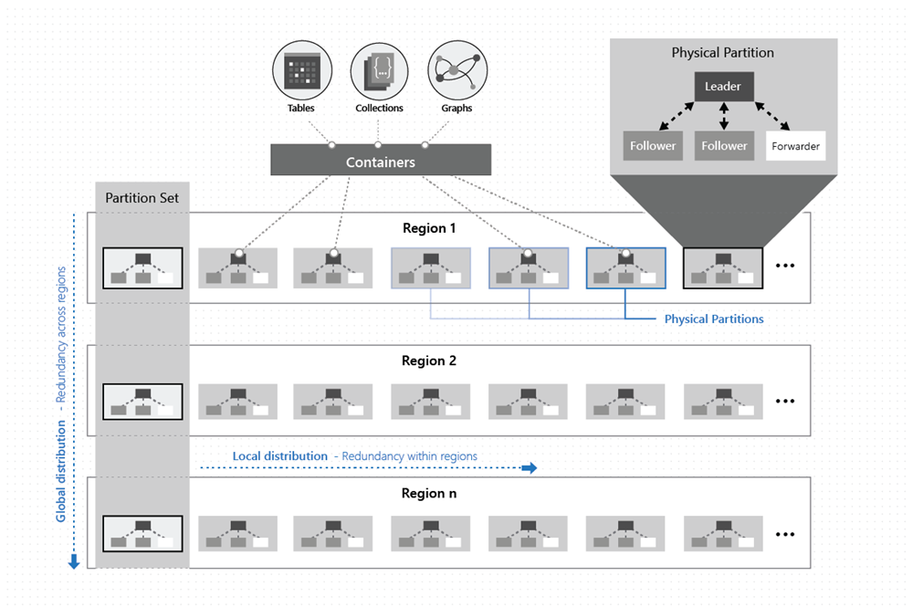
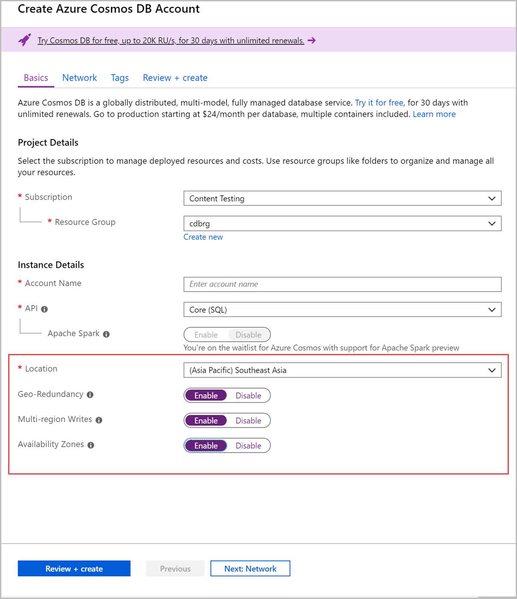

# High availability with Azure Cosmos DB

Azure Cosmos DB transparently replicates your data across all the Azure regions associated with your Cosmos account. Cosmos DB employs multiple layers of redundancy for your data as shown in the following image:



- The data within Cosmos containers is [horizontally partitioned](partitioning-overview.md).

- Within each region, every partition is protected by a replica-set with all writes replicated and durably committed by a majority of replicas. Replicas are distributed across as many as 10-20 fault domains.

- Each partition across all the regions is replicated. Each region contains all the data partitions of a Cosmos container and can accept writes and serve reads.  

If your Cosmos account is distributed across *N* Azure regions, there will be at least *N* x 4 copies of all your data. In addition to providing low latency data access and scaling write/read throughput across the regions associated with your Cosmos account, having more regions (higher *N*) further improves availability.  

## SLAs for availability

As a globally distributed database, Cosmos DB provides comprehensive SLAs that encompass throughput, latency at the 99th percentile, consistency, and high availability. The table below shows the guarantees for high availability provided by Cosmos DB for single and multi-region accounts. For high availability, always configure your Cosmos accounts to have multiple write regions.

|Operation type  | Single region |Multi-region (single region writes)|Multi-region (multi-region writes) |
|---------|---------|---------|-------|
|Writes    | 99.99    |99.99   |99.999|
|Reads     | 99.99    |99.999  |99.999|

> [!NOTE]
> In practice, the actual write availability for bounded staleness, session, consistent prefix and eventual consistency models is significantly higher than the published SLAs. The actual read availability for all consistency levels is significantly higher than the published SLAs.

## High availability with Cosmos DB in the event of regional outages

Regional outages aren't uncommon, and Azure Cosmos DB makes sure your database is always highly available. The following details capture Cosmos DB behavior during an outage, depending on your Cosmos account configuration:

- With Cosmos DB, before a write operation is acknowledged to the client, the data is durably committed by a quorum of replicas within the region that accepts the write operations.

- Multi-region accounts configured with multiple-write regions will be highly available for both writes and reads. Regional failovers are instantaneous and don't require any changes from the application.

- **Multi-region accounts with a single-write region (write region outage):** During a write region outage, these accounts will remain highly available for reads. However, for writes you must **“enable automatic failover”** on your Cosmos account to failover the impacted region to another region. The failover will occur in the order of region priority you’ve specified. When the impacted region is back online, the unreplicated data present in the impacted write region during the outage is made available through the [conflicts feed](how-to-manage-conflicts.md#read-from-conflict-feed). Applications can read the conflicts feed, resolve the conflicts based on the application-specific logic, and write the updated data back to the Cosmos container as appropriate. Once the previously impacted write region recovers, it becomes automatically available as a read region. You can invoke a manual failover and configure the impacted region as the write region. Again you can do a manual failover by using [Azure CLI or Azure portal](how-to-manage-database-account.md#manual-failover). There is **no data or availability loss** before, during or after the manual failover. Your application continues to be highly available. 

- **Multi-region accounts with a single-write region (read region outage):** During a read region outage, these accounts will remain highly available for reads and writes. The impacted region is automatically disconnected from the write region and will be marked offline. The [Cosmos DB SDKs](sql-api-sdk-dotnet.md) will redirect read calls to the next available region in the preferred region list. If none of the regions in the preferred region list is available, calls automatically fall back to the current write region. No changes are required in your application code to handle read region outage. Eventually, when the impacted region is back online, the previously impacted read region will automatically sync with the current write region and will be available again to serve read requests. Subsequent reads are redirected to the recovered region without requiring any changes to your application code. During both failover and rejoining of a previously failed region, read consistency guarantees continue to be honored by Cosmos DB.

- Single-region accounts may lose availability following a regional outage. It's always recommended to set up **at least two regions** (preferably, at least two write regions) with your Cosmos account to ensure high availability at all times.

- Even in a rare and unfortunate event when the Azure region is permanently irrecoverable, there is no data loss if your multi-region Cosmos account is configured with the default consistency level of *Strong*. In the event of a permanently irrecoverable write region, for the multi-region Cosmos accounts configured with bounded-staleness consistency, the potential data loss window is restricted to the staleness window (*K* or *T*); for session, consistent-prefix and eventual consistency levels, the potential data loss window is restricted to a maximum of five seconds. 

## Availability Zone support

Azure Cosmos DB is a globally distributed, multi-master database service that provides high availability and resiliency during regional outages. In addition to cross region resiliency, you can now enable **zone redundancy** when selecting a region to associate with your Azure Cosmos database. 

With Availability Zone support, Azure Cosmos DB will ensure replicas are placed across multiple zones within a given region to provide high availability and resiliency during zonal failures. There are no changes to latency and other SLAs in this configuration. In the event of a single zone failure, zone redundancy provides full data durability with RPO=0 and availability with RTO=0. 

Zone redundancy is a *supplemental capability* to the [multi-master replication](how-to-multi-master.md) feature. Zone redundancy alone cannot be relied upon to achieve regional resiliency. For example, in the event of regional outages or low latency access across the regions, it’s advised to have multiple write regions in addition to zone redundancy. 

When configuring multi-region writes for your Azure Cosmos account, you can opt into zone redundancy at no extra cost. Otherwise, please see the note below regarding the pricing for zone redundancy support. You can enable zone redundancy on an existing region of your Azure Cosmos account by removing the region and adding it back with the zone redundancy enabled.

This feature is available in following Azure regions:

* UK South
* Southeast Asia 
* East US
* East US 2 
* Central US

> [!NOTE] 
> Enabling Availability Zones for a single region Azure Cosmos account will result in charges that are equivalent to adding an additional region to your account. For details on pricing, see the [pricing page](https://azure.microsoft.com/pricing/details/cosmos-db/) and the [multi-region cost in Azure Cosmos DB](optimize-cost-regions.md) articles. 

The following table summarizes the high availability capability of various account configurations: 

|KPI  |Single region without Availability Zones (Non-AZ)  |Single region with Availability Zones (AZ)  |Multi-region writes with Availability Zones (AZ, 2 regions) – Most recommended setting |
|---------|---------|---------|---------|
|Write availability SLA     |   99.99%      |    99.99%     |  99.999%  |
|Read availability SLA   |   99.99%      |   99.99%      |  99.999%       |
|Price  |  Single region billing rate |  Single region Availability Zone billing rate |  Multi-region billing rate       |
|Zone failures – data loss   |  Data loss  |   No data loss |   No data loss  |
|Zone failures – availability |  Availability loss  | No availability loss  |  No availability loss  |
|Read latency    |  Cross region    |   Cross region   |    Low  |
|Write latency    |   Cross region   |  Cross region    |   Low   |
|Regional outage – data loss    |   Data loss      |  Data loss       |   Data loss <br/><br/> When using bounded staleness consistency with multi master and more than one region, data loss is limited to the bounded staleness configured on your account. <br/><br/> Data loss during regional outage can be avoided by configuring strong consistency with multiple regions. This option comes with tradeoffs that impact availability and performance.      |
|Regional outage –availability  |  Availability loss       |  Availability loss       |  No availability loss  |
|Throughput    |  X RU/s provisioned throughput      |  X RU/s provisioned throughput       |  2X RU/s provisioned throughput <br/><br/> This configuration mode requires twice the amount of throughput when compared to a single region with Availability Zones because there are two regions.   |

> [!NOTE] 
> To enable Availability Zone support for a multi region Azure Cosmos account, the account must have multi-master writes enabled.


You can enable zone redundancy when adding a region to new or existing Azure Cosmos accounts. Currently, you can only enable zone redundancy by using Azure portal, PowerShell and Azure Resource Manager templates. To enable zone redundancy on your Azure Cosmos account, you should set the `isZoneRedundant` flag to `true` for a specific location. You can set this flag within the locations property. For example, the following powershell snippet enables zone redundancy for the "Southeast Asia" region:

```powershell
$locations = @( 
    @{ "locationName"="Southeast Asia"; "failoverPriority"=0; "isZoneRedundant"= "true" }, 
    @{ "locationName"="East US"; "failoverPriority"=1 } 
) 
```

You can enable Availability Zones by using Azure portal when creating an Azure Cosmos account. When you create an account, make sure to enable the **Geo-redundancy**, **Multi-region Writes**, and choose a region where Availability Zones are supported: 

 

## Building highly available applications

- To ensure high write and read availability, configure your Cosmos account to span at least two regions with multiple-write regions. This configuration will provide the highest availability, lowest latency, and best scalability for both reads and writes backed by SLAs. To learn more, see how to [configure your Cosmos account with multiple write-regions](tutorial-global-distribution-sql-api.md).

- For multi-region Cosmos accounts that are configured with a single-write region, [enable automatic-failover by using Azure CLI or Azure portal](how-to-manage-database-account.md#automatic-failover). After you enable automatic failover, whenever there is a regional disaster, Cosmos DB will automatically failover your account.  

- Even if your Cosmos account is highly available, your application may not be correctly designed to remain highly available. To test the end-to-end high availability of your application, periodically invoke the [manual failover by using Azure CLI or Azure portal](how-to-manage-database-account.md#manual-failover), as a part of your application testing or disaster-recovery (DR) drills.

- Within a globally distributed database environment, there is a direct relationship between the consistency level and data durability in the presence of a region-wide outage. As you develop your business continuity plan, you need to understand the maximum acceptable time before the application fully recovers after a disruptive event. The time required for an application to fully recover is known as recovery time objective (RTO). You also need to understand the maximum period of recent data updates the application can tolerate losing when recovering after a disruptive event. The time period of updates that you might afford to lose is known as recovery point objective (RPO). To see the RPO and RTO for Azure Cosmos DB, see [Consistency levels and data durability](consistency-levels-tradeoffs.md#rto)

## Next steps

Next you can read the following articles:

* [Availability and performance tradeoffs for various consistency levels](consistency-levels-tradeoffs.md)
* [Globally scaling provisioned throughput](scaling-throughput.md)
* [Global distribution - under the hood](global-dist-under-the-hood.md)
* [Consistency levels in Azure Cosmos DB](consistency-levels.md)
* [How to configure your Cosmos account with multiple write regions](how-to-multi-master.md)
