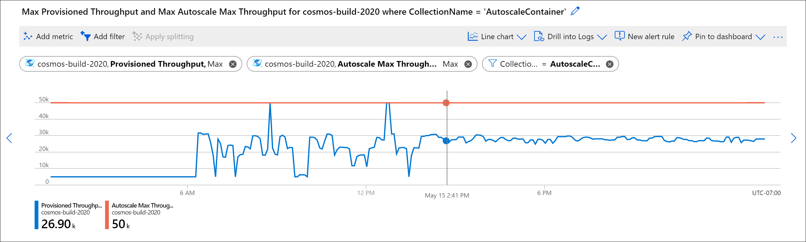

# How to choose between standard (manual) and autoscale provisioned throughput 

Azure Cosmos DB supports two types or offers of provisioned throughput: standard (manual) and autoscale. Both throughput types are suitable for mission-critical workloads that require high performance and scale, and are backed by the same Azure Cosmos DB SLAs on throughput, availability, latency, and consistency.

This article describes how to choose between standard (manual) and autoscale provisioned throughput for your workload. 

## Overview of provisioned throughput types
Before diving into the difference between standard (manual) and autoscale, it's important to first understand how provisioned throughput works in Azure Cosmos DB. 

When you use provisioned throughput, you set the throughput, measured in request units per second (RU/s) required for your workload. The service provisions the capacity needed to support the throughput requirements. Database operations against the service, such as reads, writes, and queries consume some amount of request units (RUs). Learn more about [request units](request-units.md).

The following table shows a high-level comparison between standard (manual) and autoscale.

|Description|Standard (manual)|Autoscale|
|-------------|------|-------|
|Best suited for|Workloads with steady or predictable traffic|Workloads with variable or unpredictable traffic. See [use cases of autoscale](provision-throughput-autoscale.md#use-cases-of-autoscale).|
|How it works|You provision a set amount of RU/s `T` that is static over time, unless you manually change them. Each second, you can use up to `T` RU/s throughput.   For example, if you set standard (manual) 400 RU/s, the throughput will stay at 400 RU/s.|You set the highest, or maximum RU/s `Tmax` you don't want the system to exceed. The system automatically scales the throughput `T` such that `0.1* Tmax <= T <= Tmax`.   For example, if you set autoscale maximum RU/s of 4000 RU/s, the system will scale between 400 - 4000 RU/s.|
|When to use it|You want to manually manage your throughput capacity (RU/s) and scale yourself.  You have high, consistent utilization of provisioned RU/s. Of all hours in a month, if you set provisioned RU/s `T` and use the full amount for 66% of the hours or more, it's estimated you'll save with standard (manual) provisioned RU/s.  This is based on a comparison between setting `T` in standard (manual) and the same amount `Tmax` in autoscale. |You want Azure Cosmos DB to manage your throughput capacity (RU/s) and scale, based on usage.  You have RU/s usage that is variable or hard to predict. Of all hours in a month, if you set autoscale max RU/s `Tmax` and use the full amount `Tmax` for 66% of the hours or less, it's estimated you'll save with autoscale.  This is based on a comparison between setting autoscale `Tmax` and the same amount `T` in standard (manual) throughput.|
|Billing model|Billing is done on a per-hour basis for the RU/s provisioned, regardless of how many RUs were consumed.  Example: <li>Provision 400 RU/s</li><li>Hour 1: no requests</li><li>Hour 2: 400 RU/s worth of requests</li>  For both hours 1 and 2, you'll be billed 400 RU/s for both hours at the [standard (manual) rates](https://azure.microsoft.com/pricing/details/cosmos-db/).|Billing is done on a per-hour basis, for the highest RU/s the system scaled to in the hour.   Example: <li>Provision autoscale max RU/s of 4000 RU/s (scales between 400 - 4000 RU/s)</li><li>Hour 1: system scaled up to highest value of 3500 RU/s</li><li>Hour 2: system scaled down to minimum of 400 RU/s (always 10% of `Tmax`), due to no usage</li>  You will be billed for 3500 RU/s in hour 1, and 400 RU/s in hour 2 at the [autoscale provisioned throughput rates](https://azure.microsoft.com/pricing/details/cosmos-db/). The autoscale rate per RU/s is 1.5 * the standard (manual) rate.
|What happens if you exceed provisioned RU/s|The RU/s remain static at what is provisioned. Any requests that consume beyond the provisioned RUs in a second will be rate-limited, with a response that recommends a time to wait before retrying. You can manually increase or decrease the RU/s if needed.| The system will scale the RU/s up to the autoscale max RU/s. Any requests that consume beyond the autoscale max RU/s in a second will be rate-limited, with a response that recommends a time to wait before retrying.|

## Understand your traffic patterns

### New applications ###
If you are building a new application and do not know your traffic pattern yet, you may want to start at the entry point RU/s (or minimum RU/s) to avoid over-provisioning in the beginning. Or, if you have a small application that doesn't need high scale, you may want to provision just the minimum entry point RU/s to optimize cost. In both cases, both standard (manual) or autoscale are suitable. Here's what you should consider:

If you provision standard (manual) RU/s at the entry point of 400 RU/s, you won't be able to consume above 400 RU/s, unless you manually change the throughput. You'll be billed for 400 RU/s at the standard (manual) provisioned throughput rate, per hour.

If you provision autoscale throughput at the entry point of max RU/s of 4000 RU/s, the resource will scale between 400 to 4000 RU/s. Since the autoscale throughput billing rate per RU/s is 1.5x of the standard (manual) rate, for hours where the system has scaled down to the minimum of 400 RU/s, your bill will be higher than if you provisioned 400 RU/s manually. However, with autoscale, at any time, if your application traffic spikes, you can consume up to 4000 RU/s with no user action required. In general, you should weigh the benefit of being able to consume up to the max RU/s at any time with the 1.5x rate of autoscale.

Use the Azure Cosmos DB [capacity calculator](estimate-ru-with-capacity-planner.md) to estimate your throughput requirements. 

### Existing applications ###

If you have an existing application using standard (manual) provisioned throughput, you can use [Azure Monitor metrics](../azure-monitor/insights/cosmosdb-insights-overview.md) to determine if your traffic pattern is suitable for autoscale. 

First, find the [normalized request unit consumption metric](monitor-normalized-request-units.md#view-the-normalized-request-unit-consumption-metric) of your database or container. Normalized utilization is a measure of how much you are currently using your standard (manual) provisioned throughput. The closer the number is to 100%, the more you are fully using your provisioned RU/s. [Learn more](monitor-normalized-request-units.md#view-the-normalized-request-unit-consumption-metric) about the metric.

Next, determine how the normalized utilization varies over time. If you see that your normalized utilization is variable or unpredictable, consider enabling autoscale on your database or container. In contrast, if it's steady and predictable, consider remaining on standard (manual) provisioned throughput. 

> [!TIP]
> With standard (manual) throughput, you can use the normalized utilization metric to estimate the actual RU/s you may use if you switch to autoscale. Multiply the normalized utilization at a point in time by the currently provisioned standard (manual) RU/s. For example, if you have provisioned 5000 RU/s, and the normalized utilization is 90%, the RU/s usage is 0.9 * 5000 = 4500 RU/s. 
If you see that your traffic pattern is variable, but you are over or under provisioned, you may want to enable autoscale and then change the autoscale max RU/s setting accordingly.

## Measure and monitor your usage
Over time, after you've chosen the throughput type, you should monitor your application and make adjustments as needed. 

When using autoscale, use Azure Monitor to see the provisioned autoscale max RU/s (**Autoscale Max Throughput**) and the RU/s the system is currently scaled to (**Provisioned Throughput**). Below is an example of a variable or unpredictable workload using autoscale. Note when there isn't any traffic, the system scales the RU/s to the minimum of 10% of the max RU/s, which in this case is 5000 RU/s and 50,000 RU/s, respectively. 

> [!NOTE]
> When you use standard (manual) provisioned throughput, the **Provisioned Throughput** metric refers to what you as a user have set. When you use autoscale throughput, this metric refers to the RU/s the system is currently scaled to.

## Next steps
* Use [RU calculator](https://cosmos.azure.com/capacitycalculator/) to estimate throughput for new workloads.
* Use [Azure Monitor](monitor-cosmos-db.md#view-operation-level-metrics-for-azure-cosmos-db) to monitor your existing workloads.
* Learn how to [provision autoscale throughput on an Azure Cosmos database or container](how-to-provision-autoscale-throughput.md).
* Review the [autoscale FAQ](autoscale-faq.md).