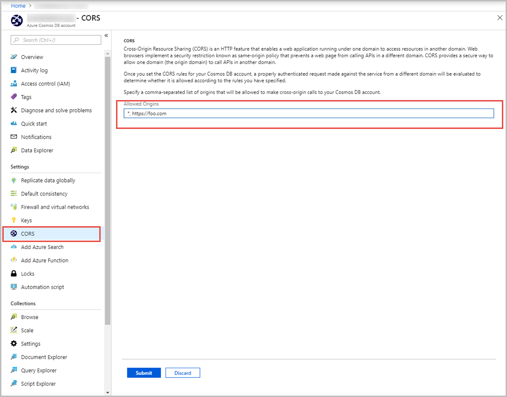

# Configure Cross-Origin Resource Sharing (CORS) 

Cross-Origin Resource Sharing (CORS) is an HTTP feature that enables a web application running under one domain to access resources in another domain. Web browsers implement a security restriction known as same-origin policy that prevents a web page from calling APIs in a different domain. However, CORS provides a secure way to allow the origin domain to call APIs in another domain.Core SQL API in Azure Cosmos DB now supports Cross-Origin Resource Sharing (CORS) by using the “allowedOrigins” header. After you enable the CORS support for your Azure Cosmos account, only authenticated requests are evaluated to determine whether they are allowed according to the rules you have specified.

You can configure the Cross-origin resource sharing (CORS) setting from the Azure portal or from an Azure Resource Manager template. Core SQL API in Azure Cosmos DB supports a JavaScript library that works in both Node.js and browser-based environments. This library can now take advantage of CORS support when using Gateway mode. There is no client-side configuration needed to use this feature. With CORS support, resources from a browser can directly access Azure Cosmos DB through the [JavaScript library](https://www.npmjs.com/package/@azure/cosmos) or directly from the [REST API](https://docs.microsoft.com/rest/api/cosmos-db/) for simple operations. 

## Enable CORS support from Azure portal

Use the following steps to enable Cross-Origin Resource Sharing by using Azure portal:

1. Navigate to your Azure cosmos DB account. Open the **CORS** blade.

2. Specify a comma-separated list of origins that can make cross-origin calls to your Azure Cosmos DB account. For example, `https://www.mydomain.com`, `https://mydomain.com`, `https://api.mydomain.com`. You can also use a wildcard “\*” to allow all origins and select **Submit**. 

   > [!NOTE]
   > Currently, you cannot use wildcards as part of the domain name. For example `https://*.mydomain.net` format is not yet supported. 
   
   
 
## Enable CORS support from Resource Manager template

To enable CORS by using a Resource Manager template, add the “cors” section with “allowedOrigins” property to any existing template. The following JSON is an example of a template that creates a new Azure Cosmos account with CORS enabled.

```json
{
    "$schema": "https://schema.management.azure.com/schemas/2015-01-01/deploymentTemplate.json#",
    "contentVersion": "1.0.0.0",
    "parameters": {},
    "variables": {},
    "resources": [
        {
            "name": "test",
            "type": "Microsoft.DocumentDB/databaseAccounts",
            "apiVersion": "2015-04-08",
            "location": "East US 2",
            "properties": {
                "databaseAccountOfferType": "Standard",
                "consistencyPolicy": {
                    "defaultConsistencyLevel": "Session",
                    "maxIntervalInSeconds": 5,
                    "maxStalenessPrefix": 100
                },
                "locations": [
                    {
                        "id": "test-eastus2",
                        "failoverPriority": 0,
                        "locationName": "East US 2"
                    }
                ],
                "cors": [
                    {
                        "allowedOrigins": "*"
                    }
                ]
            },
            "dependsOn": [
            ]
        }
    ]
}
```

## Using the Azure Cosmos DB JavaScript library from a browser

Today, the Azure Cosmos DB JavaScript library only has the CommonJS version of the library shipped with its package. To use this library from the browser, you have to use a tool such as Rollup or Webpack to create a browser compatible library. Certain Node.js libraries should have browser mocks for them. The following is an example of a webpack config file that has the necessary mock settings.

```javascript
const path = require("path");

module.exports = {
  entry: "./src/index.ts",
  devtool: "inline-source-map",
  node: {
    net: "mock",
    tls: "mock"
  },
  output: {
    filename: "bundle.js",
    path: path.resolve(__dirname, "dist")
  }
};
```
 
Here is a [code sample](https://github.com/christopheranderson/cosmos-browser-sample) that uses TypeScript and Webpack with the Azure Cosmos DB JavaScript SDK library to build a Todo app that sends real time updates when new items are created.
As a best practice, do not use the primary key to communicate with Azure Cosmos DB from the browser. Instead, use resource tokens to communicate. For more information about resource tokens, see [Securing access to Azure Cosmos DB](secure-access-to-data.md#resource-tokens) article.

## Next steps

To learn about other ways to secure your Azure Cosmos account, see the following articles:

* [Configure a firewall for Azure Cosmos DB](how-to-configure-firewall.md) article.

* [Configure virtual network and subnet-based access for your Azure Cosmos DB account](how-to-configure-vnet-service-endpoint.md)
 	

