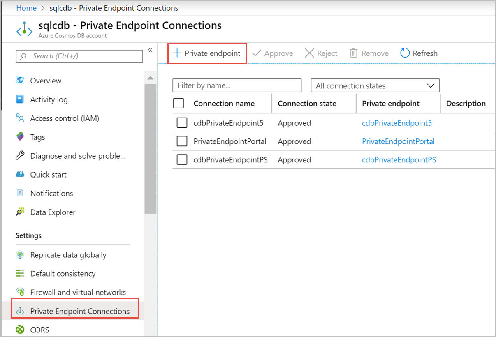
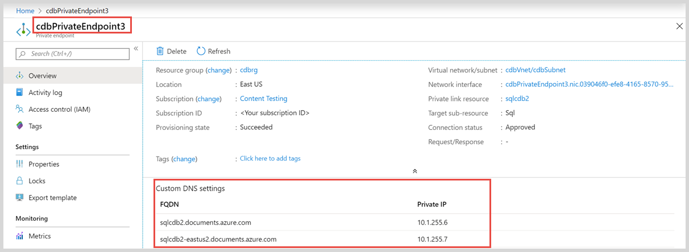
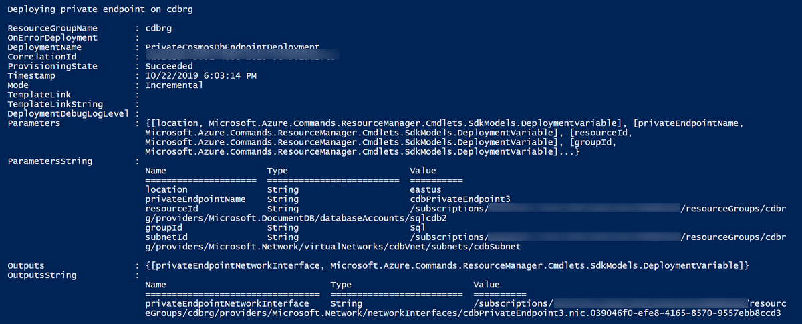

# Configure Azure Private Link for an Azure Cosmos account

By using Azure Private Link, you can connect to an Azure Cosmos account via a private endpoint. The private endpoint is a set of private IP addresses in a subnet within your virtual network. You can then limit access to an Azure Cosmos account over private IP addresses. When Private Link is combined with restricted NSG policies, it helps reduce the risk of data exfiltration. To learn more about private endpoints, see the [Azure Private Link](../private-link/private-link-overview.md) article.

Private Link allows users to access an Azure Cosmos account from within the virtual network or from any peered virtual network. Resources mapped to Private Link are also accessible on-premises over private peering through VPN or Azure ExpressRoute. 

You can connect to an Azure Cosmos account configured with Private Link by using the automatic or manual approval method. To learn more, see the [Approval workflow](../private-link/private-endpoint-overview.md#access-to-a-private-link-resource-using-approval-workflow) section of the Private Link documentation. 

This article describes the steps to create a private endpoint. It assumes that you're using the automatic approval method.

## Create a private endpoint by using the Azure portal

Use the following steps to create a private endpoint for an existing Azure Cosmos account by using the Azure portal:

1. From the **All resources** pane, choose an Azure Cosmos account.

1. Select **Private Endpoint Connections** from the list of settings, and then select **Private endpoint**:

   

1. In the **Create a private endpoint - Basics** pane, enter or select the following details:

    | Setting | Value |
    | ------- | ----- |
    | **Project details** | |
    | Subscription | Select your subscription. |
    | Resource group | Select a resource group.|
    | **Instance details** |  |
    | Name | Enter any name for your private endpoint. If this name is taken, create a unique one. |
    |Region| Select the region where you want to deploy Private Link. Create the private endpoint in the same location where your virtual network exists.|
    |||
1. Select **Next: Resource**.
1. In **Create a private endpoint - Resource**, enter or select this information:

    | Setting | Value |
    | ------- | ----- |
    |Connection method  | Select **Connect to an Azure resource in my directory**. <br/><br/> You can then choose one of your resources to set up Private Link. Or you can connect to someone else's resource by using a resource ID or alias that they've shared with you.|
    | Subscription| Select your subscription. |
    | Resource type | Select **Microsoft.AzureCosmosDB/databaseAccounts**. |
    | Resource |Select your Azure Cosmos account. |
    |Target sub-resource |Select the Azure Cosmos DB API type that you want to map. This defaults to only one choice for the SQL, MongoDB, and Cassandra APIs. For the Gremlin and Table APIs, you can also choose **Sql** because these APIs are interoperable with the SQL API. |
    |||

1. Select **Next: Configuration**.
1. In **Create a private endpoint - Configuration**, enter or select this information:

    | Setting | Value |
    | ------- | ----- |
    |**Networking**| |
    | Virtual network| Select your virtual network. |
    | Subnet | Select your subnet. |
    |**Private DNS Integration**||
    |Integrate with private DNS zone |Select **Yes**. <br><br/> To connect privately with your private endpoint, you need a DNS record. We recommend that you integrate your private endpoint with a private DNS zone. You can also use your own DNS servers or create DNS records by using the host files on your virtual machines. |
    |Private DNS Zone |Select **privatelink.documents.azure.com**. <br><br/> The private DNS zone is determined automatically. You can't change it by using the Azure portal.|
    |||

1. Select **Review + create**. On the **Review + create** page, Azure validates your configuration.
1. When you see the **Validation passed** message, select **Create**.

When you have approved Private Link for an Azure Cosmos account, in the Azure portal, the **All networks** option in the **Firewall and virtual networks** pane is unavailable.

The following table shows the mapping between different Azure Cosmos account API types, supported sub-resources, and the corresponding private zone names. You can also access the Gremlin and Table API accounts through the SQL API, so there are two entries for these APIs.

|Azure Cosmos account API type  |Supported sub-resources (or group IDs) |Private zone name  |
|---------|---------|---------|
|Sql    |   Sql      | privatelink.documents.azure.com   |
|Cassandra    | Cassandra        |  privatelink.cassandra.cosmos.azure.com    |
|Mongo   |  MongoDB       |  privatelink.mongo.cosmos.azure.com    |
|Gremlin     | Gremlin        |  privatelink.gremlin.cosmos.azure.com   |
|Gremlin     |  Sql       |  privatelink.documents.azure.com    |
|Table    |    Table     |   privatelink.table.cosmos.azure.com    |
|Table     |   Sql      |  privatelink.documents.azure.com    |

### Fetch the private IP addresses

After the private endpoint is provisioned, you can query the IP addresses. To view the IP addresses from the Azure portal:

1. Select **All resources**.
1. Search for the private endpoint that you created earlier. In this case, it's **cdbPrivateEndpoint3**.
1. Select the **Overview** tab to see the DNS settings and IP addresses.



Multiple IP addresses are created per private endpoint:

* One for the global (region-agnostic) endpoint of the Azure Cosmos account
* One for each region where the Azure Cosmos account is deployed

## Create a private endpoint by using Azure PowerShell

Run the following PowerShell script to create a private endpoint named "MyPrivateEndpoint" for an existing Azure Cosmos account. Replace the variable values with the details for your environment.

```azurepowershell-interactive
$SubscriptionId = "<your Azure subscription ID>"
# Resource group where the Azure Cosmos account and virtual network resources are located
$ResourceGroupName = "myResourceGroup"
# Name of the Azure Cosmos account
$CosmosDbAccountName = "mycosmosaccount"

# API type of the Azure Cosmos account: Sql, MongoDB, Cassandra, Gremlin, or Table
$CosmosDbApiType = "Sql"
# Name of the existing virtual network
$VNetName = "myVnet"
# Name of the target subnet in the virtual network
$SubnetName = "mySubnet"
# Name of the private endpoint to create
$PrivateEndpointName = "MyPrivateEndpoint"
# Location where the private endpoint can be created. The private endpoint should be created in the same location where your subnet or the virtual network exists
$Location = "westcentralus"

$cosmosDbResourceId = "/subscriptions/$($SubscriptionId)/resourceGroups/$($ResourceGroupName)/providers/Microsoft.DocumentDB/databaseAccounts/$($CosmosDbAccountName)"

$privateEndpointConnection = New-AzPrivateLinkServiceConnection -Name "myConnectionPS" -PrivateLinkServiceId $cosmosDbResourceId -GroupId $CosmosDbApiType
 
$virtualNetwork = Get-AzVirtualNetwork -ResourceGroupName  $ResourceGroupName -Name $VNetName  
 
$subnet = $virtualNetwork | Select -ExpandProperty subnets | Where-Object  {$_.Name -eq $SubnetName}  
 
$privateEndpoint = New-AzPrivateEndpoint -ResourceGroupName $ResourceGroupName -Name $PrivateEndpointName -Location "westcentralus" -Subnet  $subnet -PrivateLinkServiceConnection $privateEndpointConnection
```

### Integrate the private endpoint with a private DNS zone

After you create the private endpoint, you can integrate it with a private DNS zone by using the following PowerShell script:

```azurepowershell-interactive
Import-Module Az.PrivateDns
$zoneName = "privatelink.documents.azure.com"
$zone = New-AzPrivateDnsZone -ResourceGroupName $ResourceGroupName `
  -Name $zoneName

$link  = New-AzPrivateDnsVirtualNetworkLink -ResourceGroupName $ResourceGroupName `
  -ZoneName $zoneName `
  -Name "myzonelink" `
  -VirtualNetworkId $virtualNetwork.Id  
 
$pe = Get-AzPrivateEndpoint -Name $PrivateEndpointName `
  -ResourceGroupName $ResourceGroupName

$networkInterface = Get-AzResource -ResourceId $pe.NetworkInterfaces[0].Id `
  -ApiVersion "2019-04-01"
 
foreach ($ipconfig in $networkInterface.properties.ipConfigurations) { 
foreach ($fqdn in $ipconfig.properties.privateLinkConnectionProperties.fqdns) { 
Write-Host "$($ipconfig.properties.privateIPAddress) $($fqdn)"  
$recordName = $fqdn.split('.',2)[0] 
$dnsZone = $fqdn.split('.',2)[1] 
New-AzPrivateDnsRecordSet -Name $recordName `
  -RecordType A -ZoneName $zoneName  `
  -ResourceGroupName $ResourceGroupName -Ttl 600 `
  -PrivateDnsRecords (New-AzPrivateDnsRecordConfig `
  -IPv4Address $ipconfig.properties.privateIPAddress)  
}
}
```

### Fetch the private IP addresses

After the private endpoint is provisioned, you can query the IP addresses and the FQDN mapping by using the following PowerShell script:

```azurepowershell-interactive
$pe = Get-AzPrivateEndpoint -Name MyPrivateEndpoint -ResourceGroupName myResourceGroup
$networkInterface = Get-AzNetworkInterface -ResourceId $pe.NetworkInterfaces[0].Id
foreach ($IPConfiguration in $networkInterface.IpConfigurations)
{
    Write-Host $IPConfiguration.PrivateIpAddress ":" $IPConfiguration.PrivateLinkConnectionProperties.Fqdns
}
```

## Create a private endpoint by using Azure CLI

Run the following Azure CLI script to create a private endpoint named "myPrivateEndpoint" for an existing Azure Cosmos account. Replace the variable values with the details for your environment.

```azurecli-interactive
# Resource group where the Azure Cosmos account and virtual network resources are located
ResourceGroupName="myResourceGroup"

# Subscription ID where the Azure Cosmos account and virtual network resources are located
SubscriptionId="<your Azure subscription ID>"

# Name of the existing Azure Cosmos account
CosmosDbAccountName="mycosmosaccount"

# API type of your Azure Cosmos account: Sql, MongoDB, Cassandra, Gremlin, or Table
CosmosDbApiType="Sql"

# Name of the virtual network to create
VNetName="myVnet"

# Name of the subnet to create
SubnetName="mySubnet"

# Name of the private endpoint to create
PrivateEndpointName="myPrivateEndpoint"

# Name of the private endpoint connection to create
PrivateConnectionName="myConnection"

az network vnet create \
 --name $VNetName \
 --resource-group $ResourceGroupName \
 --subnet-name $SubnetName

az network vnet subnet update \
 --name $SubnetName \
 --resource-group $ResourceGroupName \
 --vnet-name $VNetName \
 --disable-private-endpoint-network-policies true

az network private-endpoint create \
    --name $PrivateEndpointName \
    --resource-group $ResourceGroupName \
    --vnet-name $VNetName  \
    --subnet $SubnetName \
    --private-connection-resource-id "/subscriptions/$SubscriptionId/resourceGroups/$ResourceGroupName/providers/Microsoft.DocumentDB/databaseAccounts/$CosmosDbAccountName" \
    --group-ids $CosmosDbApiType \
    --connection-name $PrivateConnectionName
```

### Integrate the private endpoint with a private DNS zone

After you create the private endpoint, you can integrate it with a private DNS zone by using the following Azure CLI script:

```azurecli-interactive
zoneName="privatelink.documents.azure.com"

az network private-dns zone create --resource-group $ResourceGroupName \
   --name  $zoneName

az network private-dns link vnet create --resource-group $ResourceGroupName \
   --zone-name  $zoneName\
   --name myzonelink \
   --virtual-network $VNetName \
   --registration-enabled false 

#Query for the network interface ID  
networkInterfaceId=$(az network private-endpoint show --name $PrivateEndpointName --resource-group $ResourceGroupName --query 'networkInterfaces[0].id' -o tsv)
 
# Copy the content for privateIPAddress and FQDN matching the Azure Cosmos account 
az resource show --ids $networkInterfaceId --api-version 2019-04-01 -o json 
 
#Create DNS records 
az network private-dns record-set a create --name recordSet1 --zone-name privatelink.documents.azure.com --resource-group $ResourceGroupName
az network private-dns record-set a add-record --record-set-name recordSet2 --zone-name privatelink.documents.azure.com --resource-group $ResourceGroupName -a <Private IP Address>
```

## Create a private endpoint by using a Resource Manager template

You can set up Private Link by creating a private endpoint in a virtual network subnet. You achieve this by using an Azure Resource Manager template.

Use the following code to create a Resource Manager template named "PrivateEndpoint_template.json." This template creates a private endpoint for an existing Azure Cosmos SQL API account in an existing virtual network.

```json
{
    "$schema": "http://schema.management.azure.com/schemas/2015-01-01/deploymentTemplate.json#",
    "contentVersion": "1.0.0.0",
    "parameters": {
        "location": {
          "type": "string",
          "defaultValue": "[resourceGroup().location]",
          "metadata": {
            "description": "Location for all resources."
          }
        },
        "privateEndpointName": {
            "type": "string"
        },
        "resourceId": {
            "type": "string"
        },
        "groupId": {
            "type": "string"
        },
        "subnetId": {
            "type": "string"
        }
    },
    "resources": [
        {
            "name": "[parameters('privateEndpointName')]",
            "type": "Microsoft.Network/privateEndpoints",
            "apiVersion": "2019-04-01",
            "location": "[parameters('location')]",
            "properties": {
                "subnet": {
                    "id": "[parameters('subnetId')]"
                },
                "privateLinkServiceConnections": [
                    {
                        "name": "MyConnection",
                        "properties": {
                            "privateLinkServiceId": "[parameters('resourceId')]",
                            "groupIds": [ "[parameters('groupId')]" ],
                            "requestMessage": ""
                        }
                    }
                ]
            }
        }
    ],
    "outputs": {
        "privateEndpointNetworkInterface": {
          "type": "string",
          "value": "[reference(concat('Microsoft.Network/privateEndpoints/', parameters('privateEndpointName'))).networkInterfaces[0].id]"
        }
    }
}
```

**Define the parameters file for the template**

Create a parameters file for the template, and name it "PrivateEndpoint_parameters.json." Add the following code to the parameters file:

```json
{
    "$schema": "https://schema.management.azure.com/schemas/2015-01-01/deploymentParameters.json#",
    "contentVersion": "1.0.0.0",
    "parameters": {
        "privateEndpointName": {
            "value": ""
        },
        "resourceId": {
            "value": ""
        },
        "groupId": {
            "value": ""
        },
        "subnetId": {
            "value": ""
        }
    }
}
```

**Deploy the template by using a PowerShell script**

Create a PowerShell script by using the following code. Before you run the script, replace the subscription ID, resource group name, and other variable values with the details for your environment.

```azurepowershell-interactive
### This script creates a private endpoint for an existing Azure Cosmos account in an existing virtual network

## Step 1: Fill in these details. Replace the variable values with the details for your environment.
$SubscriptionId = "<your Azure subscription ID>"
# Resource group where the Azure Cosmos account and virtual network resources are located
$ResourceGroupName = "myResourceGroup"
# Name of the Azure Cosmos account
$CosmosDbAccountName = "mycosmosaccount"
# API type of the Azure Cosmos account. It can be one of the following: "Sql", "MongoDB", "Cassandra", "Gremlin", "Table"
$CosmosDbApiType = "Sql"
# Name of the existing virtual network
$VNetName = "myVnet"
# Name of the target subnet in the virtual network
$SubnetName = "mySubnet"
# Name of the private endpoint to create
$PrivateEndpointName = "myPrivateEndpoint"

$cosmosDbResourceId = "/subscriptions/$($SubscriptionId)/resourceGroups/$($ResourceGroupName)/providers/Microsoft.DocumentDB/databaseAccounts/$($CosmosDbAccountName)"
$VNetResourceId = "/subscriptions/$($SubscriptionId)/resourceGroups/$($ResourceGroupName)/providers/Microsoft.Network/virtualNetworks/$($VNetName)"
$SubnetResourceId = "$($VNetResourceId)/subnets/$($SubnetName)"
$PrivateEndpointTemplateFilePath = "PrivateEndpoint_template.json"
$PrivateEndpointParametersFilePath = "PrivateEndpoint_parameters.json"

## Step 2: Sign in to your Azure account and select the target subscription.
Login-AzAccount
Select-AzSubscription -SubscriptionId $subscriptionId

## Step 3: Make sure private endpoint network policies are disabled in the subnet.
$VirtualNetwork= Get-AzVirtualNetwork -Name "$VNetName" -ResourceGroupName "$ResourceGroupName"
($virtualNetwork | Select -ExpandProperty subnets | Where-Object  {$_.Name -eq "$SubnetName"} ).PrivateEndpointNetworkPolicies = "Disabled"
$virtualNetwork | Set-AzVirtualNetwork

## Step 4: Create the private endpoint.
Write-Output "Deploying private endpoint on $($resourceGroupName)"
$deploymentOutput = New-AzResourceGroupDeployment -Name "PrivateCosmosDbEndpointDeployment" `
    -ResourceGroupName $resourceGroupName `
    -TemplateFile $PrivateEndpointTemplateFilePath `
    -TemplateParameterFile $PrivateEndpointParametersFilePath `
    -SubnetId $SubnetResourceId `
    -ResourceId $CosmosDbResourceId `
    -GroupId $CosmosDbApiType `
    -PrivateEndpointName $PrivateEndpointName

$deploymentOutput
```

In the PowerShell script, the `GroupId` variable can contain only one value. That value is the API type of the account. Allowed values are: `Sql`, `MongoDB`, `Cassandra`, `Gremlin`, and `Table`. Some Azure Cosmos account types are accessible through multiple APIs. For example:

* A Gremlin API account can be accessed from both Gremlin and SQL API accounts.
* A Table API account can be accessed from both Table and SQL API accounts.

For those accounts, you must create one private endpoint for each API type. The corresponding API type is specified in the `GroupId` array.

After the template is deployed successfully, you can see an output similar to what the following image shows. The `provisioningState` value is `Succeeded` if the private endpoints are set up correctly.



After the template is deployed, the private IP addresses are reserved within the subnet. The firewall rule of the Azure Cosmos account is configured to accept connections from the private endpoint only.

### Integrate the private endpoint with a Private DNS Zone

Use the following code to create a Resource Manager template named "PrivateZone_template.json." This template creates a private DNS zone for an existing Azure Cosmos SQL API account in an existing virtual network.

```json
{
    "$schema": "http://schema.management.azure.com/schemas/2015-01-01/deploymentTemplate.json#",
    "contentVersion": "1.0.0.0",
    "parameters": {
        "privateZoneName": {
            "type": "string"
        },
        "VNetId": {
            "type": "string"
        }        
    },
    "resources": [
        {
            "name": "[parameters('privateZoneName')]",
            "type": "Microsoft.Network/privateDnsZones",
            "apiVersion": "2018-09-01",
            "location": "global",
            "properties": {                
            }
        },
        {
            "type": "Microsoft.Network/privateDnsZones/virtualNetworkLinks",
            "apiVersion": "2018-09-01",
            "name": "[concat(parameters('privateZoneName'), '/myvnetlink')]",
            "location": "global",
            "dependsOn": [
                "[resourceId('Microsoft.Network/privateDnsZones', parameters('privateZoneName'))]"
            ],
            "properties": {
                "registrationEnabled": false,
                "virtualNetwork": {
                    "id": "[parameters('VNetId')]"
                }
            }
        }        
    ]
}
```

Use the following code to create a Resource Manager template named "PrivateZoneRecords_template.json."

```json
{
    "$schema": "http://schema.management.azure.com/schemas/2015-01-01/deploymentTemplate.json#",
    "contentVersion": "1.0.0.0",
    "parameters": {
        "DNSRecordName": {
            "type": "string"
        },
        "IPAddress": {
            "type":"string"
        }        
    },
    "resources": [
         {
            "type": "Microsoft.Network/privateDnsZones/A",
            "apiVersion": "2018-09-01",
            "name": "[parameters('DNSRecordName')]",
            "properties": {
                "ttl": 300,
                "aRecords": [
                    {
                        "ipv4Address": "[parameters('IPAddress')]"
                    }
                ]
            }
        }    
    ]
}
```

**Define the parameters file for the template**

Create the following two parameters file for the template. Create the "PrivateZone_parameters.json." with the following code:

```json
{
    "$schema": "https://schema.management.azure.com/schemas/2015-01-01/deploymentParameters.json#",
    "contentVersion": "1.0.0.0",
    "parameters": {
        "privateZoneName": {
            "value": ""
        },
        "VNetId": {
            "value": ""
        }
    }
}
```

Create the "PrivateZoneRecords_parameters.json." with the following code:

```json
{
    "$schema": "https://schema.management.azure.com/schemas/2015-01-01/deploymentParameters.json#",
    "contentVersion": "1.0.0.0",
    "parameters": {
        "DNSRecordName": {
            "value": ""
        },
        "IPAddress": {
            "type":"object"
        }
    }
}
```

**Deploy the template by using a PowerShell script**

Create a PowerShell script by using the following code. Before you run the script, replace the subscription ID, resource group name, and other variable values with the details for your environment.

```azurepowershell-interactive
### This script:
### - creates a private zone
### - creates a private endpoint for an existing Cosmos DB account in an existing VNet
### - maps the private endpoint to the private zone

## Step 1: Fill in these details. Replace the variable values with the details for your environment.
$SubscriptionId = "<your Azure subscription ID>"
# Resource group where the Azure Cosmos account and virtual network resources are located
$ResourceGroupName = "myResourceGroup"
# Name of the Azure Cosmos account
$CosmosDbAccountName = "mycosmosaccount"
# API type of the Azure Cosmos account. It can be one of the following: "Sql", "MongoDB", "Cassandra", "Gremlin", "Table"
$CosmosDbApiType = "Sql"
# Name of the existing virtual network
$VNetName = "myVnet"
# Name of the target subnet in the virtual network
$SubnetName = "mySubnet"
# Name of the private zone to create
$PrivateZoneName = "myPrivateZone.documents.azure.com"
# Name of the private endpoint to create
$PrivateEndpointName = "myPrivateEndpoint"

$cosmosDbResourceId = "/subscriptions/$($SubscriptionId)/resourceGroups/$($ResourceGroupName)/providers/Microsoft.DocumentDB/databaseAccounts/$($CosmosDbAccountName)"
$VNetResourceId = "/subscriptions/$($SubscriptionId)/resourceGroups/$($ResourceGroupName)/providers/Microsoft.Network/virtualNetworks/$($VNetName)"
$SubnetResourceId = "$($VNetResourceId)/subnets/$($SubnetName)"
$PrivateZoneTemplateFilePath = "PrivateZone_template.json"
$PrivateZoneParametersFilePath = "PrivateZone_parameters.json"
$PrivateZoneRecordsTemplateFilePath = "PrivateZoneRecords_template.json"
$PrivateZoneRecordsParametersFilePath = "PrivateZoneRecords_parameters.json"
$PrivateEndpointTemplateFilePath = "PrivateEndpoint_template.json"
$PrivateEndpointParametersFilePath = "PrivateEndpoint_parameters.json"

## Step 2: Login your Azure account and select the target subscription
Login-AzAccount 
Select-AzSubscription -SubscriptionId $subscriptionId

## Step 3: Make sure private endpoint network policies are disabled in the subnet
$VirtualNetwork= Get-AzVirtualNetwork -Name "$VNetName" -ResourceGroupName "$ResourceGroupName"
($virtualNetwork | Select -ExpandProperty subnets | Where-Object  {$_.Name -eq "$SubnetName"} ).PrivateEndpointNetworkPolicies = "Disabled"
$virtualNetwork | Set-AzVirtualNetwork

## Step 4: Create the private zone
New-AzResourceGroupDeployment -Name "PrivateZoneDeployment" `
    -ResourceGroupName $ResourceGroupName `
    -TemplateFile $PrivateZoneTemplateFilePath `
    -TemplateParameterFile $PrivateZoneParametersFilePath `
    -PrivateZoneName $PrivateZoneName `
    -VNetId $VNetResourceId

## Step 5: Create the private endpoint
Write-Output "Deploying private endpoint on $($resourceGroupName)"
$deploymentOutput = New-AzResourceGroupDeployment -Name "PrivateCosmosDbEndpointDeployment" `
    -ResourceGroupName $resourceGroupName `
    -TemplateFile $PrivateEndpointTemplateFilePath `
    -TemplateParameterFile $PrivateEndpointParametersFilePath `
    -SubnetId $SubnetResourceId `
    -ResourceId $CosmosDbResourceId `
    -GroupId $CosmosDbApiType `
    -PrivateEndpointName $PrivateEndpointName
$deploymentOutput

## Step 6: Map the private endpoint to the private zone
$networkInterface = Get-AzResource -ResourceId $deploymentOutput.Outputs.privateEndpointNetworkInterface.Value -ApiVersion "2019-04-01"
foreach ($ipconfig in $networkInterface.properties.ipConfigurations) {
    foreach ($fqdn in $ipconfig.properties.privateLinkConnectionProperties.fqdns) {
        $recordName = $fqdn.split('.',2)[0]
        $dnsZone = $fqdn.split('.',2)[1]
        Write-Output "Deploying PrivateEndpoint DNS Record $($PrivateZoneName)/$($recordName) Template on $($resourceGroupName)"
        New-AzResourceGroupDeployment -Name "PrivateEndpointDNSDeployment" `
            -ResourceGroupName $ResourceGroupName `
            -TemplateFile $PrivateZoneRecordsTemplateFilePath `
            -TemplateParameterFile $PrivateZoneRecordsParametersFilePath `
            -DNSRecordName "$($PrivateZoneName)/$($RecordName)" `
            -IPAddress $ipconfig.properties.privateIPAddress
    }
}
```

## Configure custom DNS

You should use a private DNS zone within the subnet where you've created the private endpoint. Configure the endpoints so that each private IP address is mapped to a DNS entry. (See the `fqdns` property in the response shown earlier.)

When you're creating the private endpoint, you can integrate it with a private DNS zone in Azure. If you choose to instead use a custom DNS zone, you have to configure it to add DNS records for all private IP addresses reserved for the private endpoint.

## Private Link combined with firewall rules

The following situations and outcomes are possible when you use Private Link in combination with firewall rules:

* If you don't configure any firewall rules, then by default, all traffic can access an Azure Cosmos account.

* If you configure public traffic or a service endpoint and you create private endpoints, then different types of incoming traffic are authorized by the corresponding type of firewall rule. If a private endpoint is configured in a subnet where service endpoint is also configured:
  * traffic to the database account mapped by the private endpoint is routed via private endpoint,
  * traffic to other database accounts from the subnet is routed via service endpoint.

* If you don't configure any public traffic or service endpoint and you create private endpoints, then the Azure Cosmos account is accessible only through the private endpoints. If you don't configure public traffic or a service endpoint, after all approved private endpoints are rejected or deleted, the account is open to the entire network unless PublicNetworkAccess is set to Disabled (see section below).

## Blocking public network access during account creation

As described in the previous section, and unless specific firewall rules have been set, adding a private endpoint makes your Azure Cosmos account accessible through private endpoints only. This means that the Azure Cosmos account could be reached from public traffic after it is created and before a private endpoint gets added. To make sure that public network access is disabled even before the creation of private endpoints, you can set the `publicNetworkAccess` flag to `Disabled` during account creation. See [this Azure Resource Manager template](https://azure.microsoft.com/resources/templates/101-cosmosdb-private-endpoint/) for an example showing how to use this flag.

## Port range when using direct mode

When you're using Private Link with an Azure Cosmos account through a direct mode connection, you need to ensure that the full range of TCP ports (0 - 65535) is open.

## Update a private endpoint when you add or remove a region

Adding or removing regions to an Azure Cosmos account requires you to add or remove DNS entries for that account. After regions have been added or removed, you can update the subnet's private DNS zone to reflect the added or removed DNS entries and their corresponding private IP addresses.

For example, imagine that you deploy an Azure Cosmos account in three regions: "West US," "Central US," and "West Europe." When you create a private endpoint for your account, four private IPs are reserved in the subnet. There's one IP for each of the three regions, and there's one IP for the global/region-agnostic endpoint.

Later, you might add a new region (for example, "East US") to the Azure Cosmos account. After adding the new region, you need to add a corresponding DNS record to either your private DNS zone or your custom DNS.

You can use the same steps when you remove a region. After removing the region, you need to remove the corresponding DNS record from either your private DNS zone or your custom DNS.

## Current limitations

The following limitations apply when you're using Private Link with an Azure Cosmos account:

* You can't have more than 200 private endpoints on a single Azure Cosmos account.

* When you're using Private Link with an Azure Cosmos account through a direct mode connection, you can use only the TCP protocol. The HTTP protocol is not currently supported.

* When you're using Azure Cosmos DB's API for MongoDB accounts, a private endpoint is supported for accounts on server version 3.6 only (that is, accounts using the endpoint in the format `*.mongo.cosmos.azure.com`). Private Link is not supported for accounts on server version 3.2 (that is, accounts using the endpoint in the format `*.documents.azure.com`). To use Private Link, you should migrate old accounts to the new version.

* When you're using an Azure Cosmos DB's API for MongoDB account that has Private Link, some tools or libraries may not work as they automatically strip out the `appName` parameter from the connection string. This parameter is required to connect to the account over a private endpoint. Some tools, like Visual Studio Code, do not remove this parameter from the connection string and are therefore compatible.

* A network administrator should be granted at least the `Microsoft.DocumentDB/databaseAccounts/PrivateEndpointConnectionsApproval/action` permission at the Azure Cosmos account scope to create automatically approved private endpoints.

* Direct mode isn't currently supported in China-based Azure regions.

### Limitations to private DNS zone integration

DNS records in the private DNS zone are not removed automatically when you delete a private endpoint or you remove a region from the Azure Cosmos account. You must manually remove the DNS records before:

* Adding a new private endpoint linked to this private DNS zone.
* Adding a new region to any database account that has private endpoints linked to this private DNS zone.

If you don't clean up the DNS records, unexpected data plane issues might happen. These issues include data outage to regions added after private endpoint removal or region removal.

## Next steps

To learn more about Azure Cosmos DB security features, see the following articles:

* To configure a firewall for Azure Cosmos DB, see [Firewall support](firewall-support.md).

* To learn how to configure a virtual network service endpoint for your Azure Cosmos account, see [Configure access from virtual networks](how-to-configure-vnet-service-endpoint.md).

* To learn more about Private Link, see the [Azure Private Link](../private-link/private-link-overview.md) documentation.
