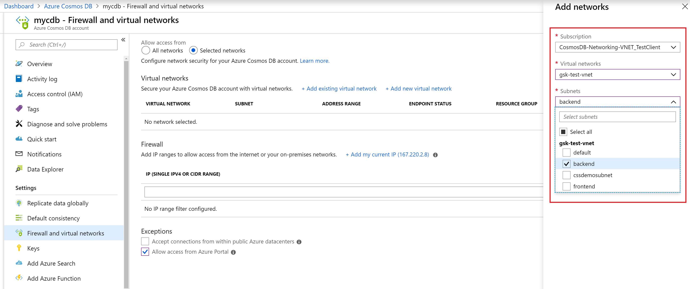
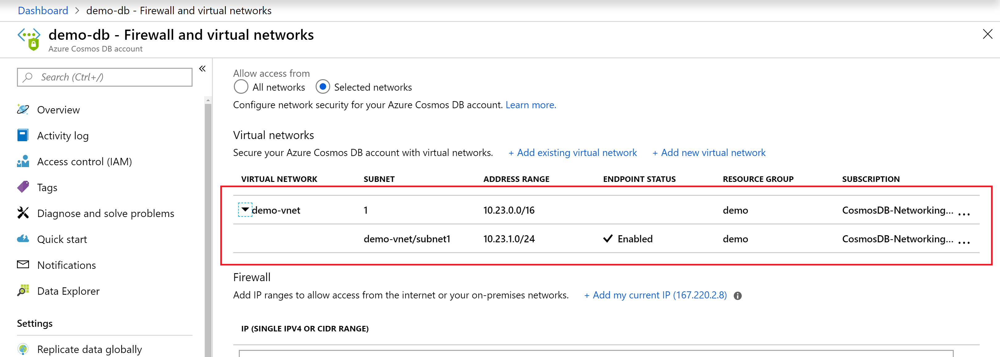
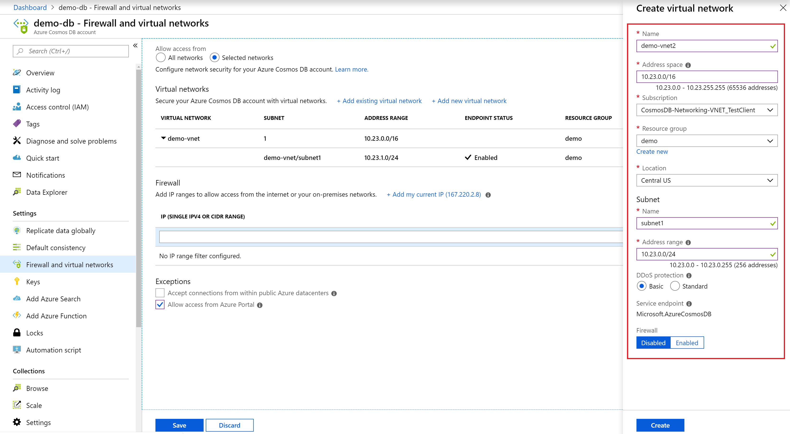
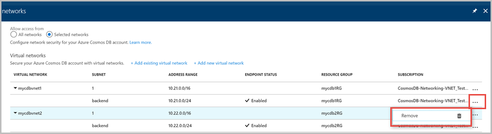

# Configure access from virtual networks (VNet)

You can configure Azure Cosmos DB accounts to allow access from only a specific subnet of an Azure virtual network. To limit access to an Azure Cosmos DB account with connections from a subnet in a virtual network:

1. Enable the subnet to send the subnet and virtual network identity to Azure Cosmos DB. You can achieve this by enabling a service endpoint for Azure Cosmos DB on the specific subnet.

1. Add a rule in the Azure Cosmos DB account to specify the subnet as a source from which the account can be accessed.

> [!NOTE]
> When a service endpoint for your Azure Cosmos DB account is enabled on a subnet, the source of the traffic that reaches Azure Cosmos DB switches from a public IP to a virtual network and subnet. The traffic switching applies for any Azure Cosmos DB account that's accessed from this subnet. If your Azure Cosmos DB accounts have an IP-based firewall to allow this subnet, requests from the service-enabled subnet no longer match the IP firewall rules, and they're rejected.
>
> To learn more, see the steps outlined in the [Migrating from an IP firewall rule to a virtual network access control list](#migrate-from-firewall-to-vnet) section of this article.

The following sections describe how to configure a virtual network service endpoint for an Azure Cosmos DB account.

[!INCLUDE [updated-for-az](../../includes/updated-for-az.md)]

## <a id="configure-using-portal"></a>Configure a service endpoint by using the Azure portal

### Configure a service endpoint for an existing Azure virtual network and subnet

1. From the **All resources** blade, find the Azure Cosmos DB account that you want to secure.

1. Select **Firewalls and virtual networks** from the settings menu, and choose to allow access from **Selected networks**.

1. To grant access to an existing virtual network's subnet, under **Virtual networks**, select **Add existing Azure virtual network**.

1. Select the **Subscription** from which you want to add an Azure virtual network. Select the Azure **Virtual networks** and **Subnets** that you want to provide access to your Azure Cosmos DB account. Next, select **Enable** to enable selected networks with service endpoints for "Microsoft.AzureCosmosDB". When it's complete, select **Add**.

   

1. After the Azure Cosmos DB account is enabled for access from a virtual network, it will allow traffic from only this chosen subnet. The virtual network and subnet that you added should appear as shown in the following screenshot:

   

> [!NOTE]
> To enable virtual network service endpoints, you need the following subscription permissions:
>   * Subscription with virtual network: Network contributor
>   * Subscription with Azure Cosmos DB account: DocumentDB account contributor
>   * If your virtual network and Azure Cosmos DB account are in different subscriptions, make sure that the subscription that has virtual network also has `Microsoft.DocumentDB` resource provider registered. To register a resource provider, see [Azure resource providers and types](../azure-resource-manager/management/resource-providers-and-types.md) article.

Here are the directions for registering subscription with resource provider.

### Configure a service endpoint for a new Azure virtual network and subnet

1. From the **All resources** blade, find the Azure Cosmos DB account that you want to secure.  

1. Select **Firewalls and Azure virtual networks** from the settings menu, and choose to allow access from **Selected networks**.  

1. To grant access to a new Azure virtual network, under **Virtual networks**, select **Add new virtual network**.  

1. Provide the details required to create a new virtual network, and then select **Create**. The subnet will be created with a service endpoint for "Microsoft.AzureCosmosDB" enabled.

   

If your Azure Cosmos DB account is used by other Azure services like Azure Cognitive Search, or is accessed from Stream analytics or Power BI, you allow access by selecting **Accept connections from within global Azure datacenters**.

To ensure that you have access to Azure Cosmos DB metrics from the portal, you need to enable **Allow access from Azure portal** options. To learn more about these options, see the [Configure an IP firewall](how-to-configure-firewall.md) article. After you enable access, select **Save** to save the settings.

## <a id="remove-vnet-or-subnet"></a>Remove a virtual network or subnet

1. From the **All resources** blade, find the Azure Cosmos DB account for which you assigned service endpoints.  

1. Select **Firewalls and virtual networks** from the settings menu.  

1. To remove a virtual network or subnet rule, select **...** next to the virtual network or subnet, and select **Remove**.

   

1. Select **Save** to apply your changes.

## <a id="configure-using-powershell"></a>Configure a service endpoint by using Azure PowerShell

> [!NOTE]
> When you're using PowerShell or the Azure CLI, be sure to specify the complete list of IP filters and virtual network ACLs in parameters, not just the ones that need to be added.

Use the following steps to configure a service endpoint to an Azure Cosmos DB account by using Azure PowerShell:  

1. Install [Azure PowerShell](https://docs.microsoft.com/powershell/azure/install-Az-ps) and [sign in](https://docs.microsoft.com/powershell/azure/authenticate-azureps).  

1. Enable the service endpoint for an existing subnet of a virtual network.  

   ```powershell
   $resourceGroupName = "<Resource group name>"
   $vnetName = "<Virtual network name>"
   $subnetName = "<Subnet name>"
   $subnetPrefix = "<Subnet address range>"
   $serviceEndpoint = "Microsoft.AzureCosmosDB"

   Get-AzVirtualNetwork `
      -ResourceGroupName $resourceGroupName `
      -Name $vnetName | Set-AzVirtualNetworkSubnetConfig `
      -Name $subnetName `
      -AddressPrefix $subnetPrefix `
      -ServiceEndpoint $serviceEndpoint | Set-AzVirtualNetwork
   ```

1. Get virtual network information.

   ```powershell
   $vnet = Get-AzVirtualNetwork `
      -ResourceGroupName $resourceGroupName `
      -Name $vnetName

   $subnetId = $vnet.Id + "/subnets/" + $subnetName
   ```

1. Prepare a Cosmos DB Virtual Network Rule

   ```powershell
   $vnetRule = New-AzCosmosDBVirtualNetworkRule `
      -Id $subnetId
   ```

1. Update Azure Cosmos DB account properties with the new Virtual Network endpoint configuration: 

   ```powershell
   $accountName = "<Cosmos DB account name>"

   Update-AzCosmosDBAccount `
      -ResourceGroupName $resourceGroupName `
      -Name $accountName `
      -EnableVirtualNetwork $true `
      -VirtualNetworkRuleObject @($vnetRule)
   ```

1. Run the following command to verify that your Azure Cosmos DB account is updated with the virtual network service endpoint that you configured in the previous step:

   ```powershell
   $account = Get-AzCosmosDBAccount `
      -ResourceGroupName $resourceGroupName `
      -Name $accountName

   $account.IsVirtualNetworkFilterEnabled
   $account.VirtualNetworkRules
   ```

## <a id="configure-using-cli"></a>Configure a service endpoint by using the Azure CLI

Azure Cosmos accounts can be configured for service endpoints when they are created or updated at a later time if the subnet is already configured for them. Service endpoints can also be enabled on the Cosmos account where the subnet is not yet configured for them and then will begin to work when the subnet is configured later. This flexibility allows for administrators who do not have access to both the Cosmos account and virtual network resources to make their configurations independent of each other.

### Create a new Cosmos account and connect it to a back end subnet for a new virtual network

In this example the virtual network and subnet is created with service endpoints enabled for both when they are created.

```azurecli-interactive
# Create an Azure Cosmos Account with a service endpoint connected to a backend subnet

# Resource group and Cosmos account variables
resourceGroupName='MyResourceGroup'
location='West US 2'
accountName='mycosmosaccount'

# Variables for a new Virtual Network with two subnets
vnetName='myVnet'
frontEnd='FrontEnd'
backEnd='BackEnd'

# Create a resource group
az group create -n $resourceGroupName -l $location

# Create a virtual network with a front-end subnet
az network vnet create \
   -n $vnetName \
   -g $resourceGroupName \
   --address-prefix 10.0.0.0/16 \
   --subnet-name $frontEnd \
   --subnet-prefix 10.0.1.0/24

# Create a back-end subnet with service endpoints enabled for Cosmos DB
az network vnet subnet create \
   -n $backEnd \
   -g $resourceGroupName \
   --address-prefix 10.0.2.0/24 \
   --vnet-name $vnetName \
   --service-endpoints Microsoft.AzureCosmosDB

svcEndpoint=$(az network vnet subnet show -g $resourceGroupName -n $backEnd --vnet-name $vnetName --query 'id' -o tsv)

# Create a Cosmos DB account with default values and service endpoints
az cosmosdb create \
   -n $accountName \
   -g $resourceGroupName \
   --enable-virtual-network true \
   --virtual-network-rules $svcEndpoint
```

### Connect and configure a Cosmos account to a back end subnet independently

This sample is intended to show how to connect an Azure Cosmos account to an existing new virtual network where the subnet is not yet configured for service endpoints. This is done  by using the `--ignore-missing-vnet-service-endpoint` parameter. This allows the configuration for the Cosmos account to complete without error before the configuration to the virtual network's subnet is complete. Once the subnet configuration is complete, the Cosmos account will then be accessible through the configured subnet.

```azurecli-interactive
# Create an Azure Cosmos Account with a service endpoint connected to a backend subnet
# that is not yet enabled for service endpoints.

# Resource group and Cosmos account variables
resourceGroupName='MyResourceGroup'
location='West US 2'
accountName='mycosmosaccount'

# Variables for a new Virtual Network with two subnets
vnetName='myVnet'
frontEnd='FrontEnd'
backEnd='BackEnd'

# Create a resource group
az group create -n $resourceGroupName -l $location

# Create a virtual network with a front-end subnet
az network vnet create \
   -n $vnetName \
   -g $resourceGroupName \
   --address-prefix 10.0.0.0/16 \
   --subnet-name $frontEnd \
   --subnet-prefix 10.0.1.0/24

# Create a back-end subnet but without configuring service endpoints (--service-endpoints Microsoft.AzureCosmosDB)
az network vnet subnet create \
   -n $backEnd \
   -g $resourceGroupName \
   --address-prefix 10.0.2.0/24 \
   --vnet-name $vnetName

svcEndpoint=$(az network vnet subnet show -g $resourceGroupName -n $backEnd --vnet-name $vnetName --query 'id' -o tsv)

# Create a Cosmos DB account with default values
az cosmosdb create -n $accountName -g $resourceGroupName

# Add the virtual network rule but ignore the missing service endpoint on the subnet
az cosmosdb network-rule add \
   -n $accountName \
   -g $resourceGroupName \
   --virtual-network $vnetName \
   --subnet svcEndpoint \
   --ignore-missing-vnet-service-endpoint true

read -p'Press any key to now configure the subnet for service endpoints'

az network vnet subnet update \
   -n $backEnd \
   -g $resourceGroupName \
   --vnet-name $vnetName \
   --service-endpoints Microsoft.AzureCosmosDB
```

## Port range when using direct mode

When you're using service endpoints with an Azure Cosmos account through a direct mode connection, you need to ensure that the TCP port range from 10000 to 20000 is open.

## <a id="migrate-from-firewall-to-vnet"></a>Migrating from an IP firewall rule to a virtual network ACL

To migrate an Azure Cosmos DB account from using IP firewall rules to using virtual network service endpoints, use the following steps.

After an Azure Cosmos DB account is configured for a service endpoint for a subnet, requests from that subnet are sent to Azure Cosmos DB with virtual network and subnet source information instead of a source public IP address. These requests will no longer match an IP filter configured on the Azure Cosmos DB account, which is why the following steps are necessary to avoid downtime.

Before proceeding, enable the Azure Cosmos DB service endpoint on the virtual network and subnet using the step shown above in "Enable the service endpoint for an existing subnet of a virtual network".

1. Get virtual network and subnet information:

   ```powershell
   $resourceGroupName = "myResourceGroup"
   $accountName = "mycosmosaccount"
   $vnetName = "myVnet"
   $subnetName = "mySubnet"

   $vnet = Get-AzVirtualNetwork `
      -ResourceGroupName $resourceGroupName `
      -Name $vnetName

   $subnetId = $vnet.Id + "/subnets/" + $subnetName
   ```

1. Prepare a new Virtual Network rule object for the Azure Cosmos DB account:

   ```powershell
   $vnetRule = New-AzCosmosDBVirtualNetworkRule `
      -Id $subnetId
   ```

1. Update the Azure Cosmos DB account to enable service endpoint access from the subnet:

   ```powershell
   Update-AzCosmosDBAccount `
      -ResourceGroupName $resourceGroupName `
      -Name $accountName `
      -EnableVirtualNetwork $true `
      -VirtualNetworkRuleObject @($vnetRule)
   ```

1. Repeat the previous steps for all Azure Cosmos DB accounts accessed from the subnet.

1. Remove the IP firewall rule for the subnet from the Azure Cosmos DB account's Firewall rules.

## Next steps

* To configure a firewall for Azure Cosmos DB, see the [Firewall support](firewall-support.md) article.
