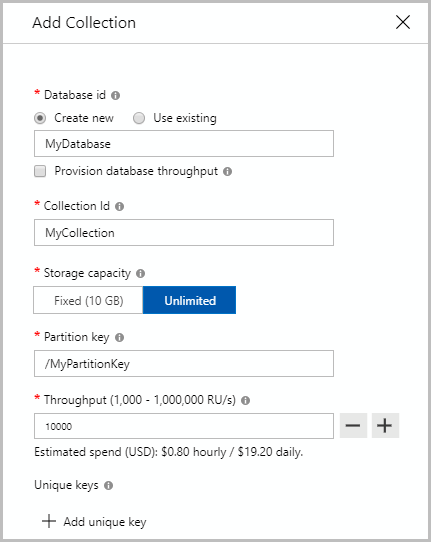
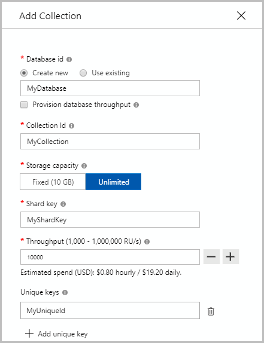
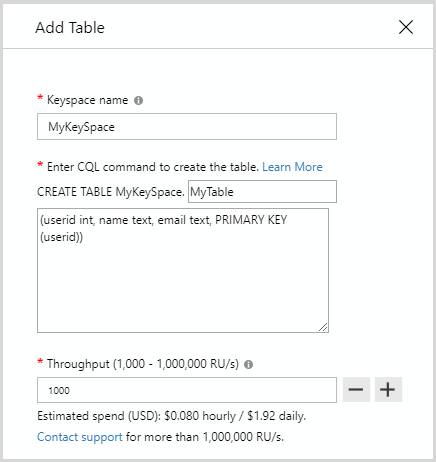
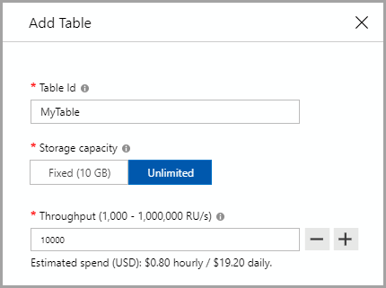

# Create an Azure Cosmos container

This article explains the different ways to create an Azure Cosmos container (collection, table, or graph). You can use Azure portal, Azure CLI, or supported SDKs for this. This article demonstrates how to create a container, specify the partition key, and provision throughput.

## Create a container using Azure portal

### <a id="portal-sql"></a>SQL API

1. Sign in to the [Azure portal](https://portal.azure.com/).

1. [Create a new Azure Cosmos account](create-sql-api-dotnet.md#create-account), or select an existing account.

1. Open the **Data Explorer** pane, and select **New Collection**. Next, provide the following details:

   * Indicate whether you are creating a new database or using an existing one.
   * Enter a collection ID.
   * Enter a partition key.
   * Enter a throughput to be provisioned (for example, 1000 RUs).
   * Select **OK**.



### <a id="portal-mongodb"></a>Azure Cosmos DB API for MongoDB

1. Sign in to the [Azure portal](https://portal.azure.com/).

1. [Create a new Azure Cosmos account](create-mongodb-dotnet.md#create-a-database-account), or select an existing account.

1. Open the **Data Explorer** pane, and select **New Collection**. Next, provide the following details:

   * Indicate whether you are creating a new database or using an existing one.
   * Enter a collection ID.
   * Enter a shard key.
   * Enter a throughput to be provisioned (for example, 1000 RUs).
   * Select **OK**.



### <a id="portal-cassandra"></a>Cassandra API

1. Sign in to the [Azure portal](https://portal.azure.com/).

1. [Create a new Azure Cosmos account](create-cassandra-dotnet.md#create-a-database-account), or select an existing account.

1. Open the **Data Explorer** pane, and select **New Table**. Next, provide the following details:

   * Indicate whether you are creating a new keyspace, or using an existing one.
   * Enter a table name.
   * Enter the properties and specify a primary key.
   * Enter a throughput to be provisioned (for example, 1000 RUs).
   * Select **OK**.



> [!NOTE]
> For Cassandra API, the primary key is used as the partition key.

### <a id="portal-gremlin"></a>Gremlin API

1. Sign in to the [Azure portal](https://portal.azure.com/).

1. [Create a new Azure Cosmos account](create-graph-dotnet.md#create-a-database-account), or select an existing account.

1. Open the **Data Explorer** pane, and select **New Graph**. Next, provide the following details:

   * Indicate whether you are creating a new database, or using an existing one.
   * Enter a Graph ID.
   * Select **Unlimited** storage capacity.
   * Enter a partition key for vertices.
   * Enter a throughput to be provisioned (for example, 1000 RUs).
   * Select **OK**.


### <a id="portal-table"></a>Table API

1. Sign in to the [Azure portal](https://portal.azure.com/).

1. [Create a new Azure Cosmos account](create-table-dotnet.md#create-a-database-account), or select an existing account.

1. Open the **Data Explorer** pane, and select **New Table**. Next, provide the following details:

   * Enter a Table ID.
   * Enter a throughput to be provisioned (for example, 1000 RUs).
   * Select **OK**.



> [!Note]
> For Table API, the partition key is specified each time you add a new row.

## Create a container using Azure CLI

### <a id="cli-sql"></a>SQL API

```azurecli-interactive
# Create a container with a partition key and provision 400 RU/s throughput.

az cosmosdb collection create \
    --resource-group $resourceGroupName \
    --collection-name $containerName \
    --name $accountName \
    --db-name $databaseName \
    --partition-key-path /myPartitionKey \
    --throughput 400
```

### <a id="cli-mongodb"></a>Azure Cosmos DB API for MongoDB

```azurecli-interactive
# Create a collection with a shard key and provision 400 RU/s throughput.
az cosmosdb collection create \
    --resource-group $resourceGroupName \
    --collection-name $collectionName \
    --name $accountName \
    --db-name $databaseName \
    --partition-key-path /myShardKey \
    --throughput 400
```

### <a id="cli-cassandra"></a>Cassandra API

```azurecli-interactive
# Create a table with a partition/primary key and provision 400 RU/s throughput.
az cosmosdb collection create \
    --resource-group $resourceGroupName \
    --collection-name $tableName \
    --name $accountName \
    --db-name $keyspaceName \
    --partition-key-path /myPrimaryKey \
    --throughput 400
```

### <a id="cli-gremlin"></a>Gremlin API

```azurecli-interactive
# Create a graph with a partition key and provision 400 RU/s throughput.
az cosmosdb collection create \
    --resource-group $resourceGroupName \
    --collection-name $graphName \
    --name $accountName \
    --db-name $databaseName \
    --partition-key-path /myPartitionKey \
    --throughput 400
```

### <a id="cli-table"></a>Table API

```azurecli-interactive
# Create a table with 400 RU/s
# Note: you don't need to specify partition key in the following command because the partition key is set on each row.
az cosmosdb collection create \
    --resource-group $resourceGroupName \
    --collection-name $tableName \
    --name $accountName \
    --db-name $databaseName \
    --throughput 400
```

## Create a container using PowerShell

The samples below shows creating all the supporting resources needed to provision a container-level resource in Azure Cosmos DB

### <a id="ps-sql"></a>SQL API

```azurepowershell-interactive
# Create an Azure Cosmos Account for Core (SQL) API
$resourceGroupName = "myResourceGroup"
$location = "West US"
$accountName = "mycosmosaccount" # must be lower case.
$databaseName = "database1"
$databaseResourceName = $accountName + "/sql/" + $databaseName
$containerName = "container1"
$containerResourceName = $accountName + "/sql/" + $databaseName + "/" + $containerName

# Create account
$locations = @(
    @{ "locationName"="West US"; "failoverPriority"=0 },
    @{ "locationName"="East US"; "failoverPriority"=1 }
)

$consistencyPolicy = @{ "defaultConsistencyLevel"="Session" }

$accountProperties = @{
    "databaseAccountOfferType"="Standard";
    "locations"=$locations;
    "consistencyPolicy"=$consistencyPolicy;
    "enableMultipleWriteLocations"="true"
}

New-AzResource -ResourceType "Microsoft.DocumentDb/databaseAccounts" `
    -ApiVersion "2015-04-08" -ResourceGroupName $resourceGroupName -Location $location `
    -Kind "GlobalDocumentDB" -Name $accountName -PropertyObject $accountProperties


# Create database with shared throughput
$databaseProperties = @{
    "resource"=@{ "id"=$databaseName };
    "options"=@{ "Throughput"="400" }
}
New-AzResource -ResourceType "Microsoft.DocumentDb/databaseAccounts/apis/databases" `
    -ApiVersion "2015-04-08" -ResourceGroupName $resourceGroupName `
    -Name $databaseResourceName -PropertyObject $databaseProperties

# Create a container with default policies
$containerProperties = @{
    "resource"=@{
        "id"=$containerName; 
        "partitionKey"=@{
            "paths"=@("/myPartitionKey"); 
            "kind"="Hash"
        }
    }; 
    "options"=@{}
} 
New-AzResource -ResourceType "Microsoft.DocumentDb/databaseAccounts/apis/databases/containers" `
    -ApiVersion "2015-04-08" -ResourceGroupName $resourceGroupName `
    -Name $containerResourceName -PropertyObject $containerProperties 
```

### <a id="ps-cassandra"></a>Cassandra API

```azurepowershell-interactive
# Create an Azure Cosmos Account for Cassandra API
$resourceGroupName = "myResourceGroup"
$location = "West US"
$accountName = "mycosmosaccount" # must be lower case.
$keyspaceName = "keyspace1"
$keyspaceResourceName = $accountName + "/cassandra/" + $keyspaceName
$tableName = "table1"
$tableResourceName = $accountName + "/cassandra/" + $keyspaceName + "/" + $tableName

# Create account
$locations = @(
    @{ "locationName"="West US"; "failoverPriority"=0 },
    @{ "locationName"="East US"; "failoverPriority"=1 }
)

$consistencyPolicy = @{
    "defaultConsistencyLevel"="BoundedStaleness";
    "maxIntervalInSeconds"=300;
    "maxStalenessPrefix"=100000
}

$accountProperties = @{
    "capabilities"= @( @{ "name"="EnableCassandra" } );
    "databaseAccountOfferType"="Standard";
    "locations"=$locations;
    "consistencyPolicy"=$consistencyPolicy;
    "enableMultipleWriteLocations"="true"
}

New-AzResource -ResourceType "Microsoft.DocumentDb/databaseAccounts" `
    -ApiVersion "2015-04-08" -ResourceGroupName $resourceGroupName -Location $location `
    -Kind "GlobalDocumentDB" -Name $accountName -PropertyObject $accountProperties

# Create keyspace with shared throughput
$keyspaceProperties = @{
    "resource"=@{ "id"=$keyspaceName };
    "options"=@{ "Throughput"="400" }
}
New-AzResource -ResourceType "Microsoft.DocumentDb/databaseAccounts/apis/keyspaces" `
    -ApiVersion "2015-04-08" -ResourceGroupName $resourceGroupName `
    -Name $keyspaceResourceName -PropertyObject $keyspaceProperties

# Create a table
$tableProperties = @{
    "resource"=@{
        "id"=$tableName; 
        "schema"= @{
            "columns"= @(
                @{ "name"= "loadid"; "type"= "uuid" };
                @{ "name"= "machine"; "type"= "uuid" };
                @{ "name"= "cpu"; "type"= "int" };
                @{ "name"= "mtime"; "type"= "int" };
                @{ "name"= "load"; "type"= "float" };
            );
            "partitionKeys"= @(
                @{ "name"= "machine" };
                @{ "name"= "cpu" };
                @{ "name"= "mtime" }; 
            );
            "clusterKeys"= @( 
                @{ "name"= "loadid"; "orderBy"= "asc" }
            )
        }
    }; 
    "options"=@{}
} 
New-AzResource -ResourceType "Microsoft.DocumentDb/databaseAccounts/apis/keyspaces/tables" `
    -ApiVersion "2015-04-08" -ResourceGroupName $resourceGroupName `
    -Name $tableResourceName -PropertyObject $tableProperties 

```

### <a id="ps-mongodb"></a>MongoDB API

```azurepowershell-interactive
# Create a collection for an Azure Cosmos Account for MongoDB API
$resourceGroupName = "myResourceGroup"
$location = "West US"
$accountName = "mycosmosaccount" # must be lower case.
$databaseName = "database1"
$databaseResourceName = $accountName + "/mongodb/" + $databaseName
$collectionName = "collection1"
$collectionResourceName = $accountName + "/mongodb/" + $databaseName + "/" + $collectionName

# Create account
$locations = @(
    @{ "locationName"="East US 2"; "failoverPriority"=0 },
    @{ "locationName"="North Central US"; "failoverPriority"=1 }
)

$consistencyPolicy = @{ "defaultConsistencyLevel"="Session" }

$accountProperties = @{
    "databaseAccountOfferType"="Standard";
    "locations"=$locations;
    "consistencyPolicy"=$consistencyPolicy;
    "enableMultipleWriteLocations"="true"
}

New-AzResource -ResourceType "Microsoft.DocumentDb/databaseAccounts" `
    -ApiVersion "2015-04-08" -ResourceGroupName $resourceGroupName -Location $location `
    -Kind "MongoDB" -Name $accountName -PropertyObject $accountProperties


# Create database with shared throughput
$databaseProperties = @{
    "resource"=@{ "id"=$databaseName };
    "options"=@{ "Throughput"="400" }
} 
New-AzResource -ResourceType "Microsoft.DocumentDb/databaseAccounts/apis/databases" `
    -ApiVersion "2015-04-08" -ResourceGroupName $resourceGroupName `
    -Name $databaseResourceName -PropertyObject $databaseProperties


# Create Collection
$collectionProperties = @{
    "resource"=@{
        "id"=$collectionName; 
        "shardKey"= @{ "user_id"="Hash" };
        "indexes"= @(
            @{
                "key"= @{ "keys"=@("user_id", "user_address") };
                "options"= @{ "unique"= "true" }
            };
            @{
                "key"= @{ "keys"=@("_ts") };
                "options"= @{ "expireAfterSeconds"= "1000" }
            }
        )
    }; 
    "options"=@{}
} 
New-AzResource -ResourceType "Microsoft.DocumentDb/databaseAccounts/apis/databases/collections" `
    -ApiVersion "2015-04-08" -ResourceGroupName $resourceGroupName `
    -Name $collectionResourceName -PropertyObject $collectionProperties 
```

### <a id="ps-gremlin"></a>Gremlin API

```azurepowershell-interactive
# Create an Azure Cosmos Account for Gremlin API
$resourceGroupName = "myResourceGroup"
$location = "West US"
$accountName = "mycosmosaccount" # must be lower case.
$databaseName = "database1"
$databaseResourceName = $accountName + "/gremlin/" + $databaseName
$graphName = "graph1"
$graphResourceName = $accountName + "/gremlin/" + $databaseName + "/" + $graphName

# Create account
$locations = @(
    @{ "locationName"="East US 2"; "failoverPriority"=0 },
    @{ "locationName"="North Central US"; "failoverPriority"=1 }
)

$consistencyPolicy = @{ "defaultConsistencyLevel"="Session" }

$accountProperties = @{
    "capabilities"= @( @{ "name"="EnableGremlin" } );
    "databaseAccountOfferType"="Standard";
    "locations"=$locations;
    "consistencyPolicy"=$consistencyPolicy;
    "enableMultipleWriteLocations"="true"
}

New-AzResource -ResourceType "Microsoft.DocumentDb/databaseAccounts" `
    -ApiVersion "2015-04-08" -ResourceGroupName $resourceGroupName -Location $location `
    -Kind "GlobalDocumentDB" -Name $accountName -PropertyObject $accountProperties


# Create database with shared throughput
$databaseProperties = @{
    "resource"=@{ "id"=$databaseName };
    "options"=@{ "Throughput"="400" }
}
New-AzResource -ResourceType "Microsoft.DocumentDb/databaseAccounts/apis/databases" `
    -ApiVersion "2015-04-08" -ResourceGroupName $resourceGroupName `
    -Name $databaseResourceName -PropertyObject $databaseProperties


# Create a graph with defaults
$graphProperties = @{
    "resource"=@{
        "id"=$graphName; 
        "partitionKey"=@{
            "paths"=@("/myPartitionKey"); 
            "kind"="Hash"
        }
    }; 
    "options"=@{}
} 
New-AzResource -ResourceType "Microsoft.DocumentDb/databaseAccounts/apis/databases/graphs" `
    -ApiVersion "2015-04-08" -ResourceGroupName $resourceGroupName `
    -Name $graphResourceName -PropertyObject $graphProperties 
```

### <a id="ps-table"></a>Table API

```azurepowershell-interactive
# Create an Azure Cosmos account for Table API
$resourceGroupName = "myResourceGroup"
$location = "West US"
$accountName = "mycosmosaccount" # must be lower case.
$tableName = "table1"
$tableResourceName = $accountName + "/table/" + $tableName

# Create account
$locations = @(
    @{ "locationName"="East US 2"; "failoverPriority"=0 },
    @{ "locationName"="North Central US"; "failoverPriority"=1 }
)

$consistencyPolicy = @{ "defaultConsistencyLevel"="Session" }

$accountProperties = @{
    "capabilities"= @( @{ "name"="EnableTable" } );
    "databaseAccountOfferType"="Standard";
    "locations"=$locations;
    "consistencyPolicy"=$consistencyPolicy;
    "enableMultipleWriteLocations"="true"
}

New-AzResource -ResourceType "Microsoft.DocumentDb/databaseAccounts" `
    -ApiVersion "2015-04-08" -ResourceGroupName $resourceGroupName -Location $location `
    -Kind "GlobalDocumentDB" -Name $accountName -PropertyObject $accountProperties


# Create table
$tableProperties = @{
    "resource"=@{ "id"=$tableName };
    "options"=@{ "Throughput"="400" }
}
New-AzResource -ResourceType "Microsoft.DocumentDb/databaseAccounts/apis/tables" `
    -ApiVersion "2015-04-08" -ResourceGroupName $resourceGroupName `
    -Name $tableResourceName -PropertyObject $tableProperties
```

## Create a container using .NET SDK

### <a id="dotnet-sql-graph"></a>SQL API and Gremlin API

```csharp
// Create a container with a partition key and provision 1000 RU/s throughput.
DocumentCollection myCollection = new DocumentCollection();
myCollection.Id = "myContainerName";
myCollection.PartitionKey.Paths.Add("/myPartitionKey");

await client.CreateDocumentCollectionAsync(
    UriFactory.CreateDatabaseUri("myDatabaseName"),
    myCollection,
    new RequestOptions { OfferThroughput = 1000 });
```

### <a id="dotnet-mongodb"></a>Azure Cosmos DB API for MongoDB

```csharp
// Create a collection with a partition key by using Mongo Shell:
db.runCommand( { shardCollection: "myDatabase.myCollection", key: { myShardKey: "hashed" } } )
```

> [!Note]
> MongoDB wire protocol does not understand the concept of [Request Units](request-units.md). To create a new collection with provisioned throughput on it, use the Azure portal or Cosmos DB SDKs for SQL API.

### <a id="dotnet-cassandra"></a>Cassandra API

```csharp
// Create a Cassandra table with a partition/primary key and provision 1000 RU/s throughput.
session.Execute(CREATE TABLE myKeySpace.myTable(
    user_id int PRIMARY KEY,
    firstName text,
    lastName text) WITH cosmosdb_provisioned_throughput=1000);
```

## Next steps

- [Partitioning in Azure Cosmos DB](partitioning-overview.md)
- [Request Units in Azure Cosmos DB](request-units.md)
- [Provision throughput on containers and databases](set-throughput.md)
- [Work with Azure Cosmos account](account-overview.md)