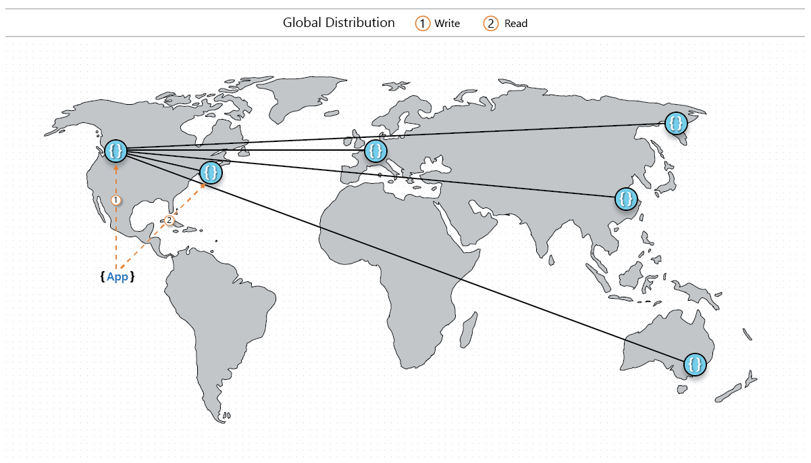

# Implement custom synchronization to optimize for higher availability and performance

Azure Cosmos DB offers [five well-defined consistency levels](consistency-levels.md) for you to choose from to balance the tradeoff between consistency, performance, and availability. Strong consistency helps ensure that data is synchronously replicated and durably persisted in every region where the Azure Cosmos account is available. This configuration provides the highest level of durability but comes at the cost of performance and availability. If you want your application to control or relax data durability to suit the application needs without compromising availability, you can use *custom synchronization* at the application layer to achieve the level of durability you want.

The following image visually depicts the custom synchronization model:



In this scenario, an Azure Cosmos container is replicated globally across several regions on multiple continents. Using strong consistency for all regions in this scenario affects performance. To ensure a higher level of data durability without compromising write latency, the application can use two clients that share the same [session token](how-to-manage-consistency.md#utilize-session-tokens).

The first client can write data to the local region (for example, US West). The second client (for example, in US East) is a read client that is used to ensure synchronization. By flowing the session token from the write response to the following read, the read ensures the synchronization of writes to US East. Azure Cosmos DB ensures that writes are seen by at least one region. They are guaranteed to survive a regional outage if the original write region goes down. In this scenario, every write is synced to US East, reducing the latency of employing strong consistency across all regions. In a multi-master scenario, where writes occur in every region, you can extend this model to sync to multiple regions in parallel.

## Configure the clients

The following sample shows a data access layer that instantiates two clients for custom synchronization:

```csharp
class MyDataAccessLayer
{
    private DocumentClient writeClient;
    private DocumentClient readClient;

    public async Task InitializeAsync(Uri accountEndpoint, string key)
    {
        ConnectionPolicy writeConnectionPolicy = new ConnectionPolicy
        {
            ConnectionMode = ConnectionMode.Direct,
            ConnectionProtocol = Protocol.Tcp,
            UseMultipleWriteLocations = true
        };
        writeConnectionPolicy.SetCurrentLocation(LocationNames.WestUS);

        ConnectionPolicy readConnectionPolicy = new ConnectionPolicy
        {
            ConnectionMode = ConnectionMode.Direct,
            ConnectionProtocol = Protocol.Tcp
        };
        readConnectionPolicy.SetCurrentLocation(LocationNames.EastUS);

        writeClient = new DocumentClient(accountEndpoint, key, writeConnectionPolicy);
        readClient = new DocumentClient(accountEndpoint, key, readConnectionPolicy, ConsistencyLevel.Session);

        await Task.WhenAll(new Task[]
        {
            writeClient.OpenAsync(),
            readClient.OpenAsync()
        });
    }
}
```

## Implement custom synchronization

After the clients are initialized, the application can perform writes to the local region (US West) and force-sync the writes to US East as follows.

```csharp
class MyDataAccessLayer
{
    public async Task CreateItem(string containerLink, Document document)
    {
        ResourceResponse<Document> response = await writeClient.CreateDocumentAsync(
            containerLink, document);

        await readClient.ReadDocumentAsync(response.Resource.SelfLink,
            new RequestOptions { SessionToken = response.SessionToken });
    }
}
```

You can extend the model to sync to multiple regions in parallel.

## Next steps

To learn more about global distribution and consistency in Azure Cosmos DB, read these articles:

* [Choose the right consistency level in Azure Cosmos DB](consistency-levels-choosing.md)
* [Consistency, availability, and performance tradeoffs in Azure Cosmos DB](consistency-levels-tradeoffs.md)
* [Manage consistency in Azure Cosmos DB](how-to-manage-consistency.md)
* [Partitioning and data distribution in Azure Cosmos DB](partition-data.md)
