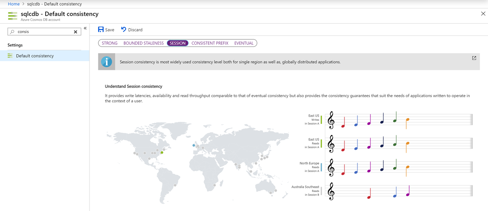
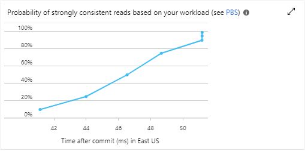

# Manage consistency levels in Azure Cosmos DB

This article explains how to manage consistency levels in Azure Cosmos DB. You learn how to configure the default consistency level, override the default consistency, manually manage session tokens, and understand the Probabilistically Bounded Staleness (PBS) metric.

[!INCLUDE [updated-for-az](../../includes/updated-for-az.md)]

## Configure the default consistency level

The [default consistency level](consistency-levels.md) is the consistency level that clients use by default. Clients can always override it.

### CLI

```bash
# create with a default consistency
az cosmosdb create --name <name of Cosmos DB Account> --resource-group <resource group name> --default-consistency-level Session

# update an existing account's default consistency
az cosmosdb update --name <name of Cosmos DB Account> --resource-group <resource group name> --default-consistency-level Eventual
```

### PowerShell

This example creates a new Azure Cosmos account with multiple write regions enabled, in East US and West US regions. The default consistency level is set to *Session* consistency.

```azurepowershell-interactive
$locations = @(@{"locationName"="East US"; "failoverPriority"=0},
             @{"locationName"="West US"; "failoverPriority"=1})

$iprangefilter = ""

$consistencyPolicy = @{"defaultConsistencyLevel"="Session"}

$CosmosDBProperties = @{"databaseAccountOfferType"="Standard";
                        "locations"=$locations;
                        "consistencyPolicy"=$consistencyPolicy;
                        "ipRangeFilter"=$iprangefilter;
                        "enableMultipleWriteLocations"="true"}

New-AzResource -ResourceType "Microsoft.DocumentDb/databaseAccounts" `
  -ApiVersion "2015-04-08" `
  -ResourceGroupName "myResourceGroup" `
  -Location "East US" `
  -Name "myCosmosDbAccount" `
  -Properties $CosmosDBProperties
```

### Azure portal

To view or modify the default consistency level, sign in to the Azure portal. Find your Azure Cosmos account, and open the **Default consistency** pane. Select the level of consistency you want as the new default, and then select **Save**. The Azure portal also provides a visualization of different consistency levels with music notes. 



## Override the default consistency level

Clients can override the default consistency level that is set by the service. 
Consistency level can be set on a per request, which overrides the default consistency level set at the account level.

### <a id="override-default-consistency-dotnet"></a>.NET SDK

```csharp
// Override consistency at the client level
documentClient = new DocumentClient(new Uri(endpoint), authKey, connectionPolicy, ConsistencyLevel.Eventual);

// Override consistency at the request level via request options
RequestOptions requestOptions = new RequestOptions { ConsistencyLevel = ConsistencyLevel.Eventual };

var response = await client.CreateDocumentAsync(collectionUri, document, requestOptions);
```

### <a id="override-default-consistency-java-async"></a>Java Async SDK

```java
// Override consistency at the client level
ConnectionPolicy policy = new ConnectionPolicy();

AsyncDocumentClient client =
        new AsyncDocumentClient.Builder()
                .withMasterKey(this.accountKey)
                .withServiceEndpoint(this.accountEndpoint)
                .withConsistencyLevel(ConsistencyLevel.Eventual)
                .withConnectionPolicy(policy).build();
```

### <a id="override-default-consistency-java-sync"></a>Java Sync SDK

```java
// Override consistency at the client level
ConnectionPolicy connectionPolicy = new ConnectionPolicy();
DocumentClient client = new DocumentClient(accountEndpoint, accountKey, connectionPolicy, ConsistencyLevel.Eventual);
```

### <a id="override-default-consistency-javascript"></a>Node.js/JavaScript/TypeScript SDK

```javascript
// Override consistency at the client level
const client = new CosmosClient({
  /* other config... */
  consistencyLevel: ConsistencyLevel.Eventual
});

// Override consistency at the request level via request options
const { body } = await item.read({ consistencyLevel: ConsistencyLevel.Eventual });
```

### <a id="override-default-consistency-python"></a>Python SDK

```python
# Override consistency at the client level
connection_policy = documents.ConnectionPolicy()
client = cosmos_client.CosmosClient(self.account_endpoint, {'masterKey': self.account_key}, connection_policy, documents.ConsistencyLevel.Eventual)
```

## Utilize session tokens

One of the consistency levels in Azure Cosmos DB is *Session* consistency. This is the default level applied to Cosmos accounts by default. When working with *Session* consistency, the client will use a session token internally with each read/query request to ensure that the set consistency level is maintained.

To manage session tokens manually, get the session token from the response and set them per request. If you don't need to manage session tokens manually, you don't need to use these samples. The SDK keeps track of session tokens automatically. If you don't set the session token manually, by default, the SDK uses the most recent session token.

### <a id="utilize-session-tokens-dotnet"></a>.NET SDK

```csharp
var response = await client.ReadDocumentAsync(
                UriFactory.CreateDocumentUri(databaseName, collectionName, "SalesOrder1"));
string sessionToken = response.SessionToken;

RequestOptions options = new RequestOptions();
options.SessionToken = sessionToken;
var response = await client.ReadDocumentAsync(
                UriFactory.CreateDocumentUri(databaseName, collectionName, "SalesOrder1"), options);
```

### <a id="utilize-session-tokens-java-async"></a>Java Async SDK

```java
// Get session token from response
RequestOptions options = new RequestOptions();
options.setPartitionKey(new PartitionKey(document.get("mypk")));
Observable<ResourceResponse<Document>> readObservable = client.readDocument(document.getSelfLink(), options);
readObservable.single()           // we know there will be one response
  .subscribe(
      documentResourceResponse -> {
          System.out.println(documentResourceResponse.getSessionToken());
      },
      error -> {
          System.err.println("an error happened: " + error.getMessage());
      });

// Resume the session by setting the session token on RequestOptions
RequestOptions options = new RequestOptions();
requestOptions.setSessionToken(sessionToken);
Observable<ResourceResponse<Document>> readObservable = client.readDocument(document.getSelfLink(), options);
```

### <a id="utilize-session-tokens-java-sync"></a>Java Sync SDK

```java
// Get session token from response
ResourceResponse<Document> response = client.readDocument(documentLink, null);
String sessionToken = response.getSessionToken();

// Resume the session by setting the session token on the RequestOptions
RequestOptions options = new RequestOptions();
options.setSessionToken(sessionToken);
ResourceResponse<Document> response = client.readDocument(documentLink, options);
```

### <a id="utilize-session-tokens-javascript"></a>Node.js/JavaScript/TypeScript SDK

```javascript
// Get session token from response
const { headers, item } = await container.items.create({ id: "meaningful-id" });
const sessionToken = headers["x-ms-session-token"];

// Immediately or later, you can use that sessionToken from the header to resume that session.
const { body } = await item.read({ sessionToken });
```

### <a id="utilize-session-tokens-python"></a>Python SDK

```python
// Get the session token from the last response headers
item = client.ReadItem(item_link)
session_token = client.last_response_headers["x-ms-session-token"]

// Resume the session by setting the session token on the options for the request
options = {
    "sessionToken": session_token
}
item = client.ReadItem(doc_link, options)
```

## Monitor Probabilistically Bounded Staleness (PBS) metric

How eventual is eventual consistency? For the average case, can we offer staleness bounds with respect to version history and time. The [**Probabilistically Bounded Staleness (PBS)**](https://pbs.cs.berkeley.edu/) metric tries to quantify the probability of staleness and shows it as a metric. To view the PBS metric, go to your Azure Cosmos account in the Azure portal. Open the **Metrics** pane, and select the **Consistency** tab. Look at the graph named **Probability of strongly consistent reads based on your workload (see PBS)**.




## Next steps

Learn more about how to manage data conflicts, or move on to the next key concept in Azure Cosmos DB. See the following articles:

* [Consistency Levels in Azure Cosmos DB](consistency-levels.md)
* [Manage conflicts between regions](how-to-manage-conflicts.md)
* [Partitioning and data distribution](partition-data.md)
* [Consistency tradeoffs in modern distributed database systems design](https://www.computer.org/csdl/magazine/co/2012/02/mco2012020037/13rRUxjyX7k)
* [High availability](high-availability.md)
* [Azure Cosmos DB SLA](https://azure.microsoft.com/support/legal/sla/cosmos-db/v1_2/)
