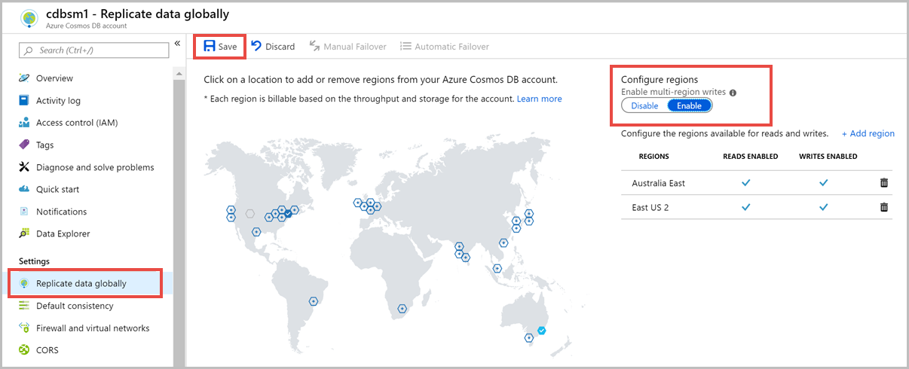

# Manage an Azure Cosmos account

This article describes how to manage various tasks on an Azure Cosmos account using the Azure portal, Azure PowerShell, Azure CLI, and Azure Resource Manager templates.

## Create an account

### <a id="create-database-account-via-portal"></a>Azure portal

[!INCLUDE [cosmos-db-create-dbaccount](../../includes/cosmos-db-create-dbaccount.md)]

### <a id="create-database-account-via-cli"></a>Azure CLI

[!code-azurecli-interactive[main](../../../cli_scripts/cosmosdb/sql/create.sh?range=18-24)]

### <a id="create-database-account-via-ps"></a>Azure PowerShell

```azurepowershell-interactive
# Create an Azure Cosmos account for Core (SQL) API
$resourceGroupName = "myResourceGroup"
$resourceType = "Microsoft.DocumentDb/databaseAccounts"
$accountName = "mycosmosaccount" # must be lower case and < 31 characters

$locations = @(
    @{ "locationName"="West US"; "failoverPriority"=0 },
    @{ "locationName"="East US"; "failoverPriority"=1 }
)

$consistencyPolicy = @{
    "defaultConsistencyLevel"="BoundedStaleness";
    "maxIntervalInSeconds"=300;
    "maxStalenessPrefix"=100000
}

$CosmosDBProperties = @{
    "databaseAccountOfferType"="Standard";
    "locations"=$locations;
    "consistencyPolicy"=$consistencyPolicy
}

New-AzResource -ResourceType $resourceType `
    -ApiVersion "2015-04-08" -ResourceGroupName $resourceGroupName `
    -Name $accountName -PropertyObject $CosmosDBProperties
```

### <a id="create-database-account-via-arm-template"></a>Azure Resource Manager template

This Azure Resource Manager template will create an Azure Cosmos account for any supported API configured with two regions and options to select consistency level, automatic failover, and multi-master. To deploy this template, click on Deploy to Azure on the readme page, [Create Azure Cosmos account](https://github.com/Azure/azure-quickstart-templates/tree/master/101-cosmosdb-create-multi-region-account)

## Add/remove regions from your database account

### <a id="add-remove-regions-via-portal"></a>Azure portal

1. Sign in to [Azure portal](https://portal.azure.com). 

1. Go to your Azure Cosmos account, and open the **Replicate data globally** menu.

1. To add regions, select the hexagons on the map with the **+** label that corresponds to your desired region(s). Alternatively, to add a region, select the **+ Add region** option and choose a region from the drop-down menu.

1. To remove regions, clear one or more regions from the map by selecting the blue hexagons with check marks. Or select the "wastebasket" (🗑) icon next to the region on the right side.

1. To save your changes, select **OK**.

   

In a single-region write mode, you cannot remove the write region. You must fail over to a different region before you can delete the current write region.

In a multi-region write mode, you can add or remove any region, if you have at least one region.

### <a id="add-remove-regions-via-cli"></a>Azure CLI

```azurecli-interactive
resourceGroupName = 'myResourceGroup'
accountName = 'mycosmosaccount' # must be lower case and <31 characters

# Create an account with 2 regions
az cosmosdb create --name $accountName --resource-group $resourceGroupName \
    --locations regionName= "West US 2" failoverPriority=0 isZoneRedundant=False \
    --locations regionName= "East US 2" failoverPriority=1 isZoneRedundant=False

# Add a region
az cosmosdb update --name $accountName --resource-group $resourceGroupName \
    --locations regionName= "West US 2" failoverPriority=0 isZoneRedundant=False \
    --locations regionName= "East US 2" failoverPriority=1 isZoneRedundant=False \
    --locations regionName= "South Central US" failoverPriority=2 isZoneRedundant=False

# Remove a region
az cosmosdb update --name $accountName --resource-group $resourceGroupName \
    --locations regionName= "West US 2" failoverPriority=0 isZoneRedundant=False \
    --locations regionName= "East US 2" failoverPriority=1 isZoneRedundant=False
```

### <a id="add-remove-regions-via-ps"></a>Azure PowerShell

```azurepowershell-interactive
# Create an account with 2 regions
$resourceGroupName = "myResourceGroup"
$resourceType = "Microsoft.DocumentDb/databaseAccounts"
$accountName = "mycosmosaccount" # must be lower case and < 31 characters

$locations = @(
    @{ "locationName"="West US 2"; "failoverPriority"=0, "isZoneRedundant"=false },
    @{ "locationName"="East US 2"; "failoverPriority"=1, "isZoneRedundant"=false }
)
$consistencyPolicy = @{ "defaultConsistencyLevel"="Session" }
$CosmosDBProperties = @{
    "databaseAccountOfferType"="Standard";
    "locations"=$locations;
    "consistencyPolicy"=$consistencyPolicy
}
New-AzResource -ResourceType $resourceType `
    -ApiVersion "2015-04-08" -ResourceGroupName $resourceGroupName `
    -Name $accountName -PropertyObject $CosmosDBProperties

# Add a region
$account = Get-AzResource -ResourceType $resourceType `
    -ApiVersion "2015-04-08" -ResourceGroupName $resourceGroupName `
    -Name $accountName

$locations = @(
    @{ "locationName"="West US 2"; "failoverPriority"=0, "isZoneRedundant"=false },
    @{ "locationName"="East US 2"; "failoverPriority"=1, "isZoneRedundant"=false },
    @{ "locationName"="South Central US"; "failoverPriority"=2, "isZoneRedundant"=false }
)

$account.Properties.locations = $locations
$CosmosDBProperties = $account.Properties

Set-AzResource -ResourceType $resourceType `
    -ApiVersion "2015-04-08" -ResourceGroupName $resourceGroupName `
    -Name $accountName -PropertyObject $CosmosDBProperties

# Azure Resource Manager does not wait on the resource update
Write-Host "Confirm region added before continuing..."

# Remove a region
$account = Get-AzResource -ResourceType $resourceType `
    -ApiVersion "2015-04-08" -ResourceGroupName $resourceGroupName `
    -Name $accountName

$locations = @(
    @{ "locationName"="West US 2"; "failoverPriority"=0, "isZoneRedundant"=false },
    @{ "locationName"="East US 2"; "failoverPriority"=1, "isZoneRedundant"=false }
)

$account.Properties.locations = $locations
$CosmosDBProperties = $account.Properties

Set-AzResource -ResourceType $resourceType `
    -ApiVersion "2015-04-08" -ResourceGroupName $resourceGroupName `
    -Name $accountName -PropertyObject $CosmosDBProperties
```

## <a id="configure-multiple-write-regions"></a>Configure multiple write-regions

### <a id="configure-multiple-write-regions-portal"></a>Azure portal

Open the **Replicate Data Globally** tab and select **Enable** to enable multi-region writes. After you enable multi-region writes, all the read regions that you currently have on the account will become read and write regions.



### <a id="configure-multiple-write-regions-cli"></a>Azure CLI

```azurecli-interactive
# Update an Azure Cosmos account from single to multi-master
resourceGroupName = 'myResourceGroup'
accountName = 'mycosmosaccount'

# Get the account resource id for an existing account
accountId=$(az cosmosdb show -g $resourceGroupName -n $accountName --query id -o tsv)

az cosmosdb update --ids $accountId --enable-multiple-write-locations true
```

### <a id="configure-multiple-write-regions-ps"></a>Azure PowerShell

```azurepowershell-interactive
# Update an Azure Cosmos account from single to multi-master
$resourceGroupName = "myResourceGroup"
$accountName = "mycosmosaccount"
$resourceType = "Microsoft.DocumentDb/databaseAccounts"

$account = Get-AzResource -ResourceType $resourceType `
    -ApiVersion "2015-04-08" -ResourceGroupName $resourceGroupName `
    -Name $accountName

$account.Properties.enableMultipleWriteLocations = "true"
$CosmosDBProperties = $account.Properties

Set-AzResource -ResourceType $resourceType `
    -ApiVersion "2015-04-08" -ResourceGroupName $resourceGroupName `
    -Name $accountName -PropertyObject $CosmosDBProperties
```

### <a id="configure-multiple-write-regions-arm"></a>Resource Manager template

An account can be migrated from single-master to multi-master by deploying the Resource Manager template used to create the account and setting `enableMultipleWriteLocations: true`. The following Azure Resource Manager template is a bare minimum template that will deploy an Azure Cosmos account for SQL API with two regions and multiple write locations enabled.

```json
{
    "$schema": "https://schema.management.azure.com/schemas/2015-01-01/deploymentTemplate.json#",
    "contentVersion": "1.0.0.0",
    "parameters": {
        "name": {
            "type": "String"
        },
        "location": {
            "type": "String",
            "defaultValue": "[resourceGroup().location]"
        },
        "primaryRegion":{
            "type":"string",
            "metadata": {
                "description": "The primary replica region for the Cosmos DB account."
            }
        },
        "secondaryRegion":{
            "type":"string",
            "metadata": {
              "description": "The secondary replica region for the Cosmos DB account."
          }
        }
    },
    "resources": [
        {
            "type": "Microsoft.DocumentDb/databaseAccounts",
            "kind": "GlobalDocumentDB",
            "name": "[parameters('name')]",
            "apiVersion": "2015-04-08",
            "location": "[parameters('location')]",
            "tags": {},
            "properties": {
                "databaseAccountOfferType": "Standard",
                "consistencyPolicy": { "defaultConsistencyLevel": "Session" },
                "locations":
                [
                    {
                        "locationName": "[parameters('primaryRegion')]",
                        "failoverPriority": 0
                    },
                    {
                        "locationName": "[parameters('secondaryRegion')]",
                        "failoverPriority": 1
                    }
                ],
                "enableMultipleWriteLocations": true
            }
        }
    ]
}
```

## <a id="automatic-failover"></a>Enable automatic failover for your Azure Cosmos account

The Automatic failover option allows Azure Cosmos DB to failover to the region with the highest failover priority with no user action should a region become unavailable. When automatic failover is enabled, region priority can be modified. Account must have two or more regions to enable automatic failover.

### <a id="enable-automatic-failover-via-portal"></a>Azure portal

1. From your Azure Cosmos account, open the **Replicate data globally** pane.

2. At the top of the pane, select **Automatic Failover**.

   

3. On the **Automatic Failover** pane, make sure that **Enable Automatic Failover** is set to **ON**. 

4. Select **Save**.

   

### <a id="enable-automatic-failover-via-cli"></a>Azure CLI

```azurecli-interactive
# Enable automatic failover on an existing account
resourceGroupName = 'myResourceGroup'
accountName = 'mycosmosaccount'

# Get the account resource id for an existing account
accountId=$(az cosmosdb show -g $resourceGroupName -n $accountName --query id -o tsv)

az cosmosdb update --ids $accountId --enable-automatic-failover true
```

### <a id="enable-automatic-failover-via-ps"></a>Azure PowerShell

```azurepowershell-interactive
$resourceGroupName = "myResourceGroup"
$accountName = "mycosmosaccount"
$resourceType = "Microsoft.DocumentDb/databaseAccounts"

$account = Get-AzResource -ResourceType $resourceType `
    -ApiVersion "2015-04-08" -ResourceGroupName $resourceGroupName `
    -Name $accountName

$account.Properties.enableAutomaticFailover="true";
$CosmosDBProperties = $account.Properties;

Set-AzResource -ResourceType $resourceType `
    -ApiVersion "2015-04-08" -ResourceGroupName $resourceGroupName `
    -Name $accountName -PropertyObject $CosmosDBProperties
```

## Set failover priorities for your Azure Cosmos account

After a Cosmos account is configured for automatic failover, the failover priority for regions can be changed.

> [!IMPORTANT]
> You cannot modify the write region (failover priority of zero) when the account is configured for automatic failover. To change the write region, you must disable automatic failover and do a manual failover.

### <a id="set-failover-priorities-via-portal"></a>Azure portal

1. From your Azure Cosmos account, open the **Replicate data globally** pane.

2. At the top of the pane, select **Automatic Failover**.

   

3. On the **Automatic Failover** pane, make sure that **Enable Automatic Failover** is set to **ON**.

4. To modify the failover priority, drag the read regions via the three dots on the left side of the row that appear when you hover over them.

5. Select **Save**.

   

### <a id="set-failover-priorities-via-cli"></a>Azure CLI

```azurecli-interactive
# Assume region order is initially 'West US 2'=0 'East US 2'=1 'South Central US'=2 for account
resourceGroupName = 'myResourceGroup'
accountName = 'mycosmosaccount'

# Get the account resource id for an existing account
accountId=$(az cosmosdb show -g $resourceGroupName -n $accountName --query id -o tsv)

# Make South Central US the next region to fail over to instead of East US 2
az cosmosdb failover-priority-change --ids $accountId \
    --failover-policies 'West US 2'=0 'South Central US'=1 'East US 2'=2
```

### <a id="set-failover-priorities-via-ps"></a>Azure PowerShell

```azurepowershell-interactive
# Assume account currently has regions with priority: West US = 0, East US = 1, South Central US = 2
$resourceGroupName = "myResourceGroup"
$accountName = "mycosmosaccount"
$resourceType = "Microsoft.DocumentDb/databaseAccounts"

$failoverRegions = @(
    @{ "locationName"="West US 2"; "failoverPriority"=0 },
    @{ "locationName"="South Central US"; "failoverPriority"=1 },
    @{ "locationName"="East US 2"; "failoverPriority"=2 }
)

$failoverPolicies = @{
    "failoverPolicies"= $failoverRegions
}

Invoke-AzResourceAction -Action failoverPriorityChange `
    -ResourceType $resourceType -ApiVersion "2015-04-08" `
    -ResourceGroupName $resourceGroupName -Name $accountName -Parameters $failoverPolicies
```

## <a id="manual-failover"></a>Perform manual failover on an Azure Cosmos account

> [!IMPORTANT]
> The Azure Cosmos account must be configured for manual failover for this operation to succeed.

The process for performing a manual failover involves changing the account's write region (failover priority = 0) to another region configured for the account.

> [!NOTE]
> Multi-master accounts cannot be manually failed over. For applications using the Azure Cosmos SDK, the SDK will detect when a region becomes unavailable, then redirect automatically to the next closest region if using multi-homing API in the SDK.

### <a id="enable-manual-failover-via-portal"></a>Azure portal

1. Go to your Azure Cosmos account, and open the **Replicate data globally** menu.

2. At the top of the menu, select **Manual Failover**.

   

3. On the **Manual Failover** menu, select your new write region. Select the check box to indicate that you understand this option changes your write region.

4. To trigger the failover, select **OK**.

   

### <a id="enable-manual-failover-via-cli"></a>Azure CLI

```azurecli-interactive
# Assume region order is initially 'West US 2'=0 'East US 2'=1 'South Central US'=2 for account
resourceGroupName = 'myResourceGroup'
accountName = 'mycosmosaccount'

# Get the account resource id for an existing account
accountId=$(az cosmosdb show -g $resourceGroupName -n $accountName --query id -o tsv)

# Trigger a manual failover to promote East US 2 as new write region
az cosmosdb failover-priority-change --ids $accountId \
    --failover-policies 'East US 2'=0 'South Central US'=1 'West US 2'=2
```

### <a id="enable-manual-failover-via-ps"></a>Azure PowerShell

```azurepowershell-interactive
# Assume account currently has regions with priority: West US = 0, East US = 1, South Central US = 2
$resourceGroupName = "myResourceGroup"
$accountName = "mycosmosaccount"
$resourceType = "Microsoft.DocumentDb/databaseAccounts"

$failoverRegions = @(
    @{ "locationName"="East US 2"; "failoverPriority"=0 },
    @{ "locationName"="South Central US"; "failoverPriority"=1 },
    @{ "locationName"="West US 2"; "failoverPriority"=2 }
)

$failoverPolicies = @{
    "failoverPolicies"= $failoverRegions
}
# Trigger a manual failover to promote East US 2 as new write region
Invoke-AzResourceAction -Action failoverPriorityChange `
    -ResourceType $resourceType -ApiVersion "2015-04-08" `
    -ResourceGroupName $resourceGroupName -Name $accountName `
    -Parameters $failoverPolicies
```

## Next steps

For more information and examples on how to manage the Azure Cosmos account as well as database and containers, read the following articles:

* [Manage Azure Cosmos DB using Azure PowerShell](manage-with-powershell.md)
* [Manage Azure Cosmos DB using Azure CLI](manage-with-cli.md)
