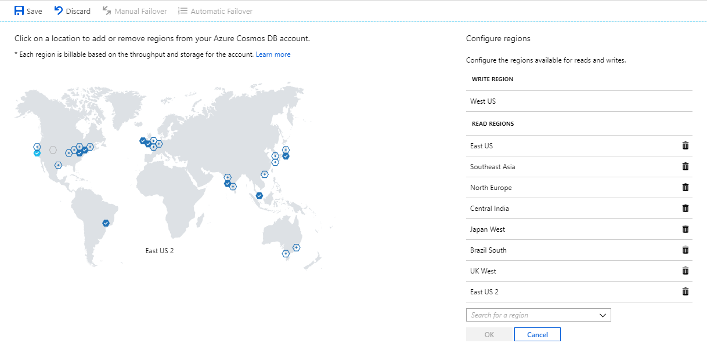
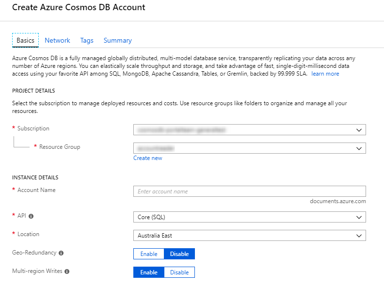
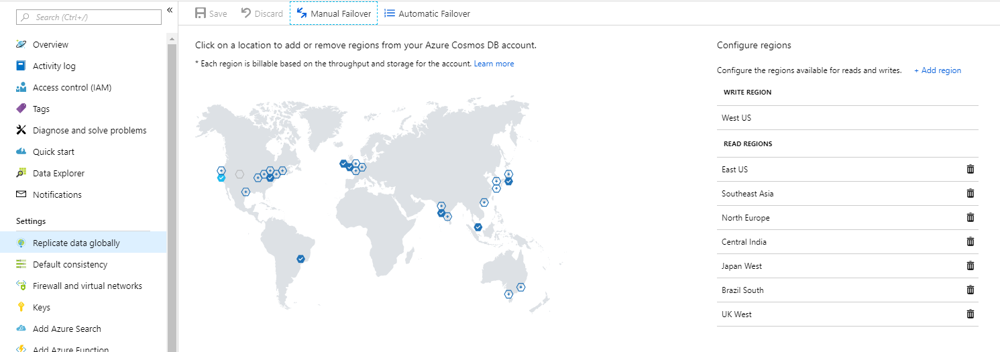
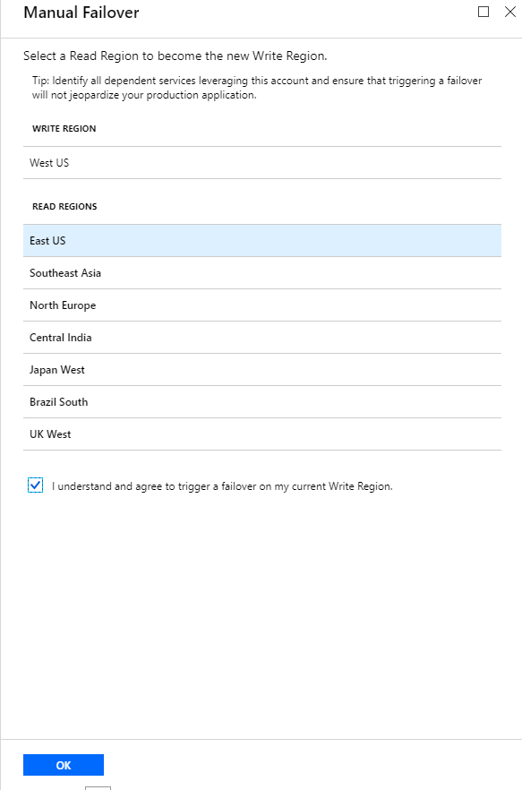
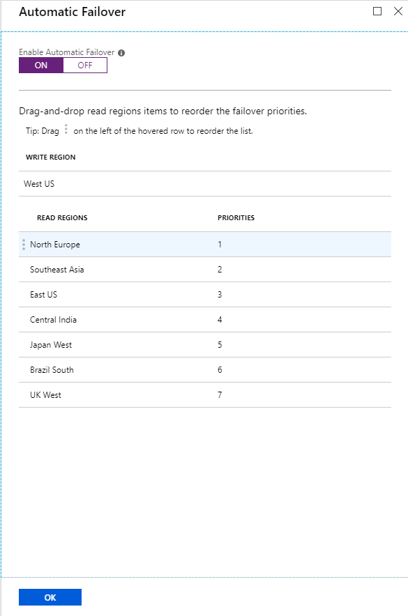

# Manage an Azure Cosmos account

This article describes how to manage your Azure Cosmos DB account. You learn how to set up multi-homing, add or remove a region, configure multiple write regions, and set up failover priorities. 

## Create a database account

### <a id="create-database-account-via-portal"></a>Azure portal

[!INCLUDE [cosmos-db-create-dbaccount](../../includes/cosmos-db-create-dbaccount.md)]

### <a id="create-database-account-via-cli"></a>Azure CLI

```bash
# Create an account
az cosmosdb create --name <Azure Cosmos account name> --resource-group <Resource Group Name>
```

## Configure clients for multi-homing

### <a id="configure-clients-multi-homing-dotnet"></a>.NET SDK v2

```csharp
ConnectionPolicy policy = new ConnectionPolicy
    {
        ConnectionMode = ConnectionMode.Direct,
        ConnectionProtocol = Protocol.Tcp,
        UseMultipleWriteLocations = true
    };
policy.SetCurrentLocation("West US 2");

// Pass the connection policy with the preferred locations on it to the client.
DocumentClient client = new DocumentClient(new Uri(this.accountEndpoint), this.accountKey, policy);
```

### <a id="configure-clients-multi-homing-dotnet-v3"></a>.NET SDK v3 (preview)

```csharp
CosmosConfiguration config = new CosmosConfiguration("endpoint", "key");
config.UseCurrentRegion("West US");
CosmosClient client = new CosmosClient(config);
```

### <a id="configure-clients-multi-homing-java-async"></a>Java Async SDK

```java
ConnectionPolicy policy = new ConnectionPolicy();
policy.setUsingMultipleWriteLocations(true);
policy.setPreferredLocations(Collections.singletonList(region));

AsyncDocumentClient client =
    new AsyncDocumentClient.Builder()
        .withMasterKeyOrResourceToken(this.accountKey)
        .withServiceEndpoint(this.accountEndpoint)
        .withConsistencyLevel(ConsistencyLevel.Eventual)
        .withConnectionPolicy(policy).build();
```

### <a id="configure-clients-multi-homing-javascript"></a>Node.js/JavaScript/TypeScript SDK

```javascript
const connectionPolicy: ConnectionPolicy = new ConnectionPolicy();
connectionPolicy.UseMultipleWriteLocations = true;
connectionPolicy.PreferredLocations = [region];

const client = new CosmosClient({
  endpoint: config.endpoint,
  auth: { masterKey: config.key },
  connectionPolicy,
  consistencyLevel: ConsistencyLevel.Eventual
});
```

### <a id="configure-clients-multi-homing-python"></a>Python SDK

```python
connection_policy = documents.ConnectionPolicy()
connection_policy.UseMultipleWriteLocations = True
connection_policy.PreferredLocations = [region]

client = cosmos_client.CosmosClient(self.account_endpoint, {'masterKey': self.account_key}, connection_policy, documents.ConsistencyLevel.Session)
```

## Add/remove regions from your database account

### <a id="add-remove-regions-via-portal"></a>Azure portal

1. Go to your Azure Cosmos DB account, and open the **Replicate data globally** menu.

2. To add regions, select the hexagons on the map with the **+** label that correspond to your desired region. To add a region, select the **+ Add region** option and choose a region from the drop-down menu.

3. To remove regions, clear one or more regions from the map by selecting the blue hexagons with check marks. Or select the "wastebasket" (🗑) icon next to the region on the right side.

4. To save your changes, select **OK**.

   

In single-region write mode, you can't remove the write region. You must fail over to a different region before you can delete that current write region.

In multi-region write mode, you can add or remove any region if you have at least one region.

### <a id="add-remove-regions-via-cli"></a>Azure CLI

```bash
# Given an account created with 1 region like so
az cosmosdb create --name <Azure Cosmos account name> --resource-group <Resource Group name> --locations 'eastus=0'

# Add a new region by adding another region to the list
az cosmosdb update --name <Azure Cosmos account name> --resource-group <Resource Group name> --locations 'eastus=0 westus=1'

# Remove a region by removing a region from the list
az cosmosdb update --name <Azure Cosmos account name> --resource-group <Resource Group name> --locations 'westus=0'
```

## Configure multiple write-regions

### <a id="configure-multiple-write-regions-portal"></a>Azure portal

When you create a database account, make sure the **Multi-region Writes** setting is enabled.



### <a id="configure-multiple-write-regions-cli"></a>Azure CLI

```bash
az cosmosdb create --name <Azure Cosmos account name> --resource-group <Resource Group name> --enable-multiple-write-locations true
```

### <a id="configure-multiple-write-regions-arm"></a>Resource Manager template

The following JSON code is an example of an Azure Resource Manager template. You can use it to deploy an Azure Cosmos DB account with a consistency policy of bounded staleness. The maximum staleness interval is set at 5 seconds. The maximum number of stale requests that's tolerated is set at 100. To learn about the Resource Manager template format and syntax, see [Resource Manager](../azure-resource-manager/resource-group-authoring-templates.md).

```json
{
    "$schema": "https://schema.management.azure.com/schemas/2015-01-01/deploymentTemplate.json#",
    "contentVersion": "1.0.0.0",
    "parameters": {
        "name": {
            "type": "String"
        },
        "location": {
            "type": "String"
        },
        "locationName": {
            "type": "String"
        },
        "defaultExperience": {
            "type": "String"
        }
    },
    "resources": [
        {
            "type": "Microsoft.DocumentDb/databaseAccounts",
            "kind": "GlobalDocumentDB",
            "name": "[parameters('name')]",
            "apiVersion": "2015-04-08",
            "location": "[parameters('location')]",
            "tags": {
                "defaultExperience": "[parameters('defaultExperience')]"
            },
            "properties": {
                "databaseAccountOfferType": "Standard",
                "consistencyPolicy": {
                    "defaultConsistencyLevel": "BoundedStaleness",
                    "maxIntervalInSeconds": 5,
                    "maxStalenessPrefix": 100
                },
                "locations": [
                    {
                        "id": "[concat(parameters('name'), '-', parameters('location'))]",
                        "failoverPriority": 0,
                        "locationName": "[parameters('locationName')]"
                    }
                ],
                "isVirtualNetworkFilterEnabled": false,
                "enableMultipleWriteLocations": true,
                "virtualNetworkRules": [],
                "dependsOn": []
            }
        }
    ]
}
```


## <a id="manual-failover"></a>Enable manual failover for your Azure Cosmos DB account

### <a id="enable-manual-failover-via-portal"></a>Azure portal

1. Go to your Azure Cosmos DB account, and open the **Replicate data globally** menu.

2. At the top of the menu, select **Manual Failover**.

   

3. On the **Manual Failover** menu, select your new write region. Select the check box to indicate that you understand this option changes your write region.

4. To trigger the failover, select **OK**.

   

### <a id="enable-manual-failover-via-cli"></a>Azure CLI

```bash
# Given your account currently has regions with priority like so: 'eastus=0 westus=1'
# Change the priority order to trigger a failover of the write region
az cosmosdb update --name <Azure Cosmos account name> --resource-group <Resource Group name> --locations 'eastus=1 westus=0'
```

## <a id="automatic-failover"></a>Enable automatic failover for your Azure Cosmos DB account

### <a id="enable-automatic-failover-via-portal"></a>Azure portal

1. From your Azure Cosmos DB account, open the **Replicate data globally** pane. 

2. At the top of the pane, select **Automatic Failover**.

   

3. On the **Automatic Failover** pane, make sure that **Enable Automatic Failover** is set to **ON**. 

4. Select **Save**.

   

You also can set your failover priorities on this menu.

### <a id="enable-automatic-failover-via-cli"></a>Azure CLI

```bash
# Enable automatic failover on account creation
az cosmosdb create --name <Azure Cosmos account name> --resource-group <Resource Group name> --enable-automatic-failover true

# Enable automatic failover on an existing account
az cosmosdb update --name <Azure Cosmos account name> --resource-group <Resource Group name> --enable-automatic-failover true

# Disable automatic failover on an existing account
az cosmosdb update --name <Azure Cosmos account name> --resource-group <Resource Group name> --enable-automatic-failover false
```

## Set failover priorities for your Azure Cosmos DB account

### <a id="set-failover-priorities-via-portal"></a>Azure portal

1. From your Azure Cosmos DB account, open the **Replicate data globally** pane. 

2. At the top of the pane, select **Automatic Failover**.

   

3. On the **Automatic Failover** pane, make sure that **Enable Automatic Failover** is set to **ON**. 

4. To modify the failover priority, drag the read regions via the three dots on the left side of the row that appear when you hover over them. 

5. Select **Save**.

   

You can't modify the write region on this menu. To change the write region manually, you must do a manual failover.

### <a id="set-failover-priorities-via-cli"></a>Azure CLI

```bash
az cosmosdb failover-priority-change --name <Azure Cosmos account name> --resource-group <Resource Group name> --failover-policies 'eastus=0 westus=2 southcentralus=1'
```

## Next steps

Learn about how to manage consistency levels and data conflicts in Azure Cosmos DB. See the following articles:

* [Manage consistency](how-to-manage-consistency.md)
* [Manage conflicts between regions](how-to-manage-conflicts.md)

