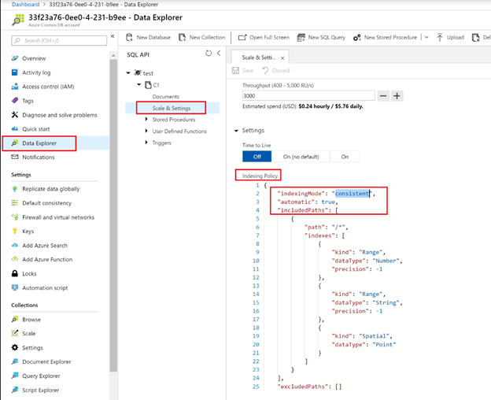

# Manage indexing in Azure Cosmos DB

In Azure Cosmos DB, you can choose whether you want a container to automatically index all the items or not. By default, all items in an Azure Cosmos container are automatically indexed, but you can turn off the automatic indexing. When indexing is turned off, items can be accessed through their self-links or through the queries by using the ID of the item, such as document id. You can explicitly request to serve results without using index by passing in **x-ms-documentdb-enable-scan** header in REST API or the **EnableScanInQuery** request option by using the .NET SDK.

With automatic indexing turned off, you can still selectively add specific items to the index. Conversely, you can leave automatic indexing turned on and selectively choose to exclude specific items. Indexing on/off configurations are useful when you have a subset of items that need to be queried.  

Write throughput and request units are proportional to the number of values that need to be indexed, which is specified by the included set in the indexing policy. If you have a good understanding of query patterns, you can explicitly choose the include/exclude subset of paths to improve the write throughput.

## Manage indexing using Azure portal

1. Sign in to the [Azure portal](https://portal.azure.com/).

2. Create a new Azure Cosmos account or select an existing account.

3. Open the **Data Explorer** pane.

4. Select an existing container, expand it and modify the following values:

   * Open the **Scale & Settings** window.
   * Change **indexingMode** from *consistent* to *none* or include/exclude certain paths from indexing.
   * Click **OK** to save the changes.

   

## Manage indexing using Azure SDKs

### <a id="dotnet"></a>.NET SDK

The following sample shows how to include an item explicitly by using the [SQL API .NET SDK](sql-api-sdk-dotnet.md) and the [RequestOptions.IndexingDirective](/dotnet/api/microsoft.azure.documents.client.requestoptions.indexingdirective) property.

```csharp
// To override the default behavior to exclude (or include) a document in indexing,
// use the RequestOptions.IndexingDirective property.
client.CreateDocumentAsync(UriFactory.CreateDocumentCollectionUri("myDatabaseName", "myCollectionName"),
    new { id = "myDocumentId", isRegistered = true },
    new RequestOptions { IndexingDirective = IndexingDirective.Include });
```

## Next steps

Read more about the indexing in the following articles:

* [Indexing Overview](index-overview.md)
* [Indexing policy](index-policy.md)
* [Index types](index-types.md)
* [Index paths](index-paths.md)
