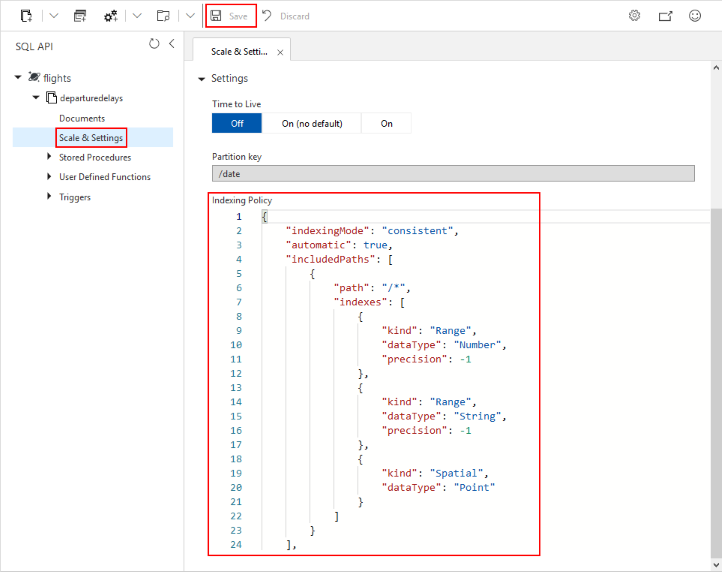

# Manage indexing policies in Azure Cosmos DB

In Azure Cosmos DB, data is indexed following [indexing policies](index-policy.md) that are defined for each container. The default indexing policy for newly created containers enforces range indexes for any string or number. This policy can be overridden with your own custom indexing policy.

## Indexing policy examples

Here are some examples of indexing policies shown in [their JSON format](index-policy.md#include-exclude-paths), which is how they are exposed on the Azure portal. The same parameters can be set through the Azure CLI or any SDK.

### Opt-out policy to selectively exclude some property paths

```json
    {
        "indexingMode": "consistent",
        "includedPaths": [
            {
                "path": "/*"
            }
        ],
        "excludedPaths": [
            {
                "path": "/path/to/single/excluded/property/?"
            },
            {
                "path": "/path/to/root/of/multiple/excluded/properties/*"
            }
        ]
    }
```

This indexing policy is equivalent to the one below which manually sets ```kind```, ```dataType```, and ```precision``` to their default values. These properties are no longer necessary to explicitly set and you can omit them from your indexing policy entirely (as shown in above example).

```json
    {
        "indexingMode": "consistent",
        "includedPaths": [
            {
                "path": "/*",
                "indexes": [
                    {
                        "kind": "Range",
                        "dataType": "Number",
                        "precision": -1
                    },
                    {
                        "kind": "Range",
                        "dataType": "String",
                        "precision": -1
                    }
                ]
            }
        ],
        "excludedPaths": [
            {
                "path": "/path/to/single/excluded/property/?"
            },
            {
                "path": "/path/to/root/of/multiple/excluded/properties/*"
            }
        ]
    }
```

### Opt-in policy to selectively include some property paths

```json
    {
        "indexingMode": "consistent",
        "includedPaths": [
            {
                "path": "/path/to/included/property/?"
            },
            {
                "path": "/path/to/root/of/multiple/included/properties/*"
            }
        ],
        "excludedPaths": [
            {
                "path": "/*"
            }
        ]
    }
```

This indexing policy is equivalent to the one below which manually sets ```kind```, ```dataType```, and ```precision``` to their default values. These properties are no longer necessary to explicitly set and you can omit them from your indexing policy entirely (as shown in above example).

```json
    {
        "indexingMode": "consistent",
        "includedPaths": [
            {
                "path": "/path/to/included/property/?",
                "indexes": [
                    {
                        "kind": "Range",
                        "dataType": "Number"
                    },
                    {
                        "kind": "Range",
                        "dataType": "String"
                    }
                ]
            },
            {
                "path": "/path/to/root/of/multiple/included/properties/*",
                "indexes": [
                    {
                        "kind": "Range",
                        "dataType": "Number"
                    },
                    {
                        "kind": "Range",
                        "dataType": "String"
                    }
                ]
            }
        ],
        "excludedPaths": [
            {
                "path": "/*"
            }
        ]
    }
```

> [!NOTE]
> It is generally recommended to use an **opt-out** indexing policy to let Azure Cosmos DB proactively index any new property that may be added to your model.

### Using a spatial index on a specific property path only

```json
{
    "indexingMode": "consistent",
    "automatic": true,
    "includedPaths": [
        {
            "path": "/*"
        }
    ],
    "excludedPaths": [
        {
            "path": "/_etag/?"
        }
    ],
    "spatialIndexes": [
        {
            "path": "/path/to/geojson/property/?",
            "types": [
                "Point",
                "Polygon",
                "MultiPolygon",
                "LineString"
            ]
        }
    ]
}
```

## Composite indexing policy examples

In addition to including or excluding paths for individual properties, you can also specify a composite index. If you would like to perform a query that has an `ORDER BY` clause for multiple properties, a [composite index](index-policy.md#composite-indexes) on those properties is required. Additionally, composite indexes will have a performance benefit for queries that have a filter and have an ORDER BY clause on different properties.

> [!NOTE]
> Composite paths have an implicit `/?` since only the scalar value at that path is indexed. The `/*` wildcard is not supported in composite paths. You shouldn't specify `/?` or `/*` in a composite path.

### Composite index defined for (name asc, age desc):

```json
    {  
        "automatic":true,
        "indexingMode":"Consistent",
        "includedPaths":[  
            {  
                "path":"/*"
            }
        ],
        "excludedPaths":[],
        "compositeIndexes":[  
            [  
                {  
                    "path":"/name",
                    "order":"ascending"
                },
                {  
                    "path":"/age",
                    "order":"descending"
                }
            ]
        ]
    }
```

The above composite index on name and age is required for Query #1 and Query #2:

Query #1:

```sql
    SELECT *
    FROM c
    ORDER BY c.name ASC, c.age DESC
```

Query #2:

```sql
    SELECT *
    FROM c
    ORDER BY c.name DESC, c.age ASC
```

This composite index will benefit Query #3 and Query #4 and optimize the filters:

Query #3:

```sql
SELECT *
FROM c
WHERE c.name = "Tim"
ORDER BY c.name DESC, c.age ASC
```

Query #4:

```sql
SELECT *
FROM c
WHERE c.name = "Tim" AND c.age > 18
```

### Composite index defined for (name ASC, age ASC) and (name ASC, age DESC):

You can define multiple different composite indexes within the same indexing policy.

```json
    {  
        "automatic":true,
        "indexingMode":"Consistent",
        "includedPaths":[  
            {  
                "path":"/*"
            }
        ],
        "excludedPaths":[],
        "compositeIndexes":[  
            [  
                {  
                    "path":"/name",
                    "order":"ascending"
                },
                {  
                    "path":"/age",
                    "order":"ascending"
                }
            ],
            [  
                {  
                    "path":"/name",
                    "order":"ascending"
                },
                {  
                    "path":"/age",
                    "order":"descending"
                }
            ]
        ]
    }
```

### Composite index defined for (name ASC, age ASC):

It is optional to specify the order. If not specified, the order is ascending.

```json
{  
        "automatic":true,
        "indexingMode":"Consistent",
        "includedPaths":[  
            {  
                "path":"/*"
            }
        ],
        "excludedPaths":[],
        "compositeIndexes":[  
            [  
                {  
                    "path":"/name",
                },
                {  
                    "path":"/age",
                }
            ]
        ]
}
```

### Excluding all property paths but keeping indexing active

This policy can be used in situations where the [Time-to-Live (TTL) feature](time-to-live.md) is active but no secondary index is required (to use Azure Cosmos DB as a pure key-value store).

```json
    {
        "indexingMode": "consistent",
        "includedPaths": [],
        "excludedPaths": [{
            "path": "/*"
        }]
    }
```

### No indexing

This policy will turn off indexing. If `indexingMode` is set to `none`, you cannot set a TTL on the container.

```json
    {
        "indexingMode": "none"
    }
```

## Updating indexing policy

In Azure Cosmos DB, the indexing policy can be updated using any of the below methods:

- from the Azure portal
- using the Azure CLI
- using PowerShell
- using one of the SDKs

An [indexing policy update](index-policy.md#modifying-the-indexing-policy) triggers an index transformation. The progress of this transformation can also be tracked from the SDKs.

> [!NOTE]
> When updating indexing policy, writes to Azure Cosmos DB will be uninterrupted. During re-indexing, queries may return partial results as the index is being updated.

## Use the Azure portal

Azure Cosmos containers store their indexing policy as a JSON document that the Azure portal lets you directly edit.

1. Sign in to the [Azure portal](https://portal.azure.com/).

1. Create a new Azure Cosmos account or select an existing account.

1. Open the **Data Explorer** pane and select the container that you want to work on.

1. Click on **Scale & Settings**.

1. Modify the indexing policy JSON document (see examples [below](#indexing-policy-examples))

1. Click **Save** when you are done.



## Use the Azure CLI

To create a container with a custom indexing policy see, [Create a container with a custom index policy using CLI](manage-with-cli.md#create-a-container-with-a-custom-index-policy)

## Use PowerShell

To create a container with a custom indexing policy see, [Create a container with a custom index policy using Powershell](manage-with-powershell.md#create-container-custom-index)

## <a id="dotnet-sdk"></a> Use the .NET SDK

# [.NET SDK V2](#tab/dotnetv2)

The `DocumentCollection` object from the [.NET SDK v2](https://www.nuget.org/packages/Microsoft.Azure.DocumentDB/) exposes an `IndexingPolicy` property that lets you change the `IndexingMode` and add or remove `IncludedPaths` and `ExcludedPaths`.

```csharp
// Retrieve the container's details
ResourceResponse<DocumentCollection> containerResponse = await client.ReadDocumentCollectionAsync(UriFactory.CreateDocumentCollectionUri("database", "container"));
// Set the indexing mode to consistent
containerResponse.Resource.IndexingPolicy.IndexingMode = IndexingMode.Consistent;
// Add an included path
containerResponse.Resource.IndexingPolicy.IncludedPaths.Add(new IncludedPath { Path = "/*" });
// Add an excluded path
containerResponse.Resource.IndexingPolicy.ExcludedPaths.Add(new ExcludedPath { Path = "/name/*" });
// Add a spatial index
containerResponse.Resource.IndexingPolicy.SpatialIndexes.Add(new SpatialSpec() { Path = "/locations/*", SpatialTypes = new Collection<SpatialType>() { SpatialType.Point } } );
// Add a composite index
containerResponse.Resource.IndexingPolicy.CompositeIndexes.Add(new Collection<CompositePath> {new CompositePath() { Path = "/name", Order = CompositePathSortOrder.Ascending }, new CompositePath() { Path = "/age", Order = CompositePathSortOrder.Descending }});
// Update container with changes
await client.ReplaceDocumentCollectionAsync(containerResponse.Resource);
```

To track the index transformation progress, pass a `RequestOptions` object that sets the `PopulateQuotaInfo` property to `true`.

```csharp
// retrieve the container's details
ResourceResponse<DocumentCollection> container = await client.ReadDocumentCollectionAsync(UriFactory.CreateDocumentCollectionUri("database", "container"), new RequestOptions { PopulateQuotaInfo = true });
// retrieve the index transformation progress from the result
long indexTransformationProgress = container.IndexTransformationProgress;
```

# [.NET SDK V3](#tab/dotnetv3)

The `ContainerProperties` object from the [.NET SDK v3](https://www.nuget.org/packages/Microsoft.Azure.Cosmos/) (see [this Quickstart](create-sql-api-dotnet.md) regarding its usage) exposes an `IndexingPolicy` property that lets you change the `IndexingMode` and add or remove `IncludedPaths` and `ExcludedPaths`.

```csharp
// Retrieve the container's details
ContainerResponse containerResponse = await client.GetContainer("database", "container").ReadContainerAsync();
// Set the indexing mode to consistent
containerResponse.Resource.IndexingPolicy.IndexingMode = IndexingMode.Consistent;
// Add an included path
containerResponse.Resource.IndexingPolicy.IncludedPaths.Add(new IncludedPath { Path = "/*" });
// Add an excluded path
containerResponse.Resource.IndexingPolicy.ExcludedPaths.Add(new ExcludedPath { Path = "/name/*" });
// Add a spatial index
SpatialPath spatialPath = new SpatialPath
{
    Path = "/locations/*"
};
spatialPath.SpatialTypes.Add(SpatialType.Point);
containerResponse.Resource.IndexingPolicy.SpatialIndexes.Add(spatialPath);
// Add a composite index
containerResponse.Resource.IndexingPolicy.CompositeIndexes.Add(new Collection<CompositePath> { new CompositePath() { Path = "/name", Order = CompositePathSortOrder.Ascending }, new CompositePath() { Path = "/age", Order = CompositePathSortOrder.Descending } });
// Update container with changes
await client.GetContainer("database", "container").ReplaceContainerAsync(containerResponse.Resource);
```

To track the index transformation progress, pass a `RequestOptions` object that sets the `PopulateQuotaInfo` property to `true`, then retrieve the value from the `x-ms-documentdb-collection-index-transformation-progress` response header.

```csharp
// retrieve the container's details
ContainerResponse containerResponse = await client.GetContainer("database", "container").ReadContainerAsync(new ContainerRequestOptions { PopulateQuotaInfo = true });
// retrieve the index transformation progress from the result
long indexTransformationProgress = long.Parse(containerResponse.Headers["x-ms-documentdb-collection-index-transformation-progress"]);
```

When defining a custom indexing policy while creating a new container, the SDK V3's fluent API lets you write this definition in a concise and efficient way:

```csharp
await client.GetDatabase("database").DefineContainer(name: "container", partitionKeyPath: "/myPartitionKey")
    .WithIndexingPolicy()
        .WithIncludedPaths()
            .Path("/*")
        .Attach()
        .WithExcludedPaths()
            .Path("/name/*")
        .Attach()
        .WithSpatialIndex()
            .Path("/locations/*", SpatialType.Point)
        .Attach()
        .WithCompositeIndex()
            .Path("/name", CompositePathSortOrder.Ascending)
            .Path("/age", CompositePathSortOrder.Descending)
        .Attach()
    .Attach()
    .CreateIfNotExistsAsync();
```
---

## Use the Java SDK

The `DocumentCollection` object from the [Java SDK](https://mvnrepository.com/artifact/com.microsoft.azure/azure-cosmosdb) (see [this Quickstart](create-sql-api-java.md) regarding its usage) exposes `getIndexingPolicy()` and `setIndexingPolicy()` methods. The `IndexingPolicy` object they manipulate lets you change the indexing mode and add or remove included and excluded paths.

```java
// Retrieve the container's details
Observable<ResourceResponse<DocumentCollection>> containerResponse = client.readCollection(String.format("/dbs/%s/colls/%s", "database", "container"), null);
containerResponse.subscribe(result -> {
DocumentCollection container = result.getResource();
IndexingPolicy indexingPolicy = container.getIndexingPolicy();

// Set the indexing mode to consistent
indexingPolicy.setIndexingMode(IndexingMode.Consistent);

// Add an included path

Collection<IncludedPath> includedPaths = new ArrayList<>();
IncludedPath includedPath = new IncludedPath();
includedPath.setPath("/*");
includedPaths.add(includedPath);
indexingPolicy.setIncludedPaths(includedPaths);

// Add an excluded path

Collection<ExcludedPath> excludedPaths = new ArrayList<>();
ExcludedPath excludedPath = new ExcludedPath();
excludedPath.setPath("/name/*");
excludedPaths.add(excludedPath);
indexingPolicy.setExcludedPaths(excludedPaths);

// Add a spatial index

Collection<SpatialSpec> spatialIndexes = new ArrayList<SpatialSpec>();
Collection<SpatialType> collectionOfSpatialTypes = new ArrayList<SpatialType>();

SpatialSpec spec = new SpatialSpec();
spec.setPath("/locations/*");
collectionOfSpatialTypes.add(SpatialType.Point);
spec.setSpatialTypes(collectionOfSpatialTypes);
spatialIndexes.add(spec);

indexingPolicy.setSpatialIndexes(spatialIndexes);

// Add a composite index

Collection<ArrayList<CompositePath>> compositeIndexes = new ArrayList<>();
ArrayList<CompositePath> compositePaths = new ArrayList<>();

CompositePath nameCompositePath = new CompositePath();
nameCompositePath.setPath("/name");
nameCompositePath.setOrder(CompositePathSortOrder.Ascending);

CompositePath ageCompositePath = new CompositePath();
ageCompositePath.setPath("/age");
ageCompositePath.setOrder(CompositePathSortOrder.Descending);

compositePaths.add(ageCompositePath);
compositePaths.add(nameCompositePath);

compositeIndexes.add(compositePaths);
indexingPolicy.setCompositeIndexes(compositeIndexes);

// Update the container with changes

 client.replaceCollection(container, null);
});
```

To track the index transformation progress on a container, pass a `RequestOptions` object that requests the quota info to be populated, then retrieve the value from the `x-ms-documentdb-collection-index-transformation-progress` response header.

```java
// set the RequestOptions object
RequestOptions requestOptions = new RequestOptions();
requestOptions.setPopulateQuotaInfo(true);
// retrieve the container's details
Observable<ResourceResponse<DocumentCollection>> containerResponse = client.readCollection(String.format("/dbs/%s/colls/%s", "database", "container"), requestOptions);
containerResponse.subscribe(result -> {
    // retrieve the index transformation progress from the response headers
    String indexTransformationProgress = result.getResponseHeaders().get("x-ms-documentdb-collection-index-transformation-progress");
});
```

## Use the Node.js SDK

The `ContainerDefinition` interface from [Node.js SDK](https://www.npmjs.com/package/@azure/cosmos) (see [this Quickstart](create-sql-api-nodejs.md) regarding its usage) exposes an `indexingPolicy` property that lets you change the `indexingMode` and add or remove `includedPaths` and `excludedPaths`.

Retrieve the container's details

```javascript
const containerResponse = await client.database('database').container('container').read();
```

Set the indexing mode to consistent

```javascript
containerResponse.body.indexingPolicy.indexingMode = "consistent";
```

Add included path including a spatial index

```javascript
containerResponse.body.indexingPolicy.includedPaths.push({
    includedPaths: [
      {
        path: "/age/*",
        indexes: [
          {
            kind: cosmos.DocumentBase.IndexKind.Range,
            dataType: cosmos.DocumentBase.DataType.String
          },
          {
            kind: cosmos.DocumentBase.IndexKind.Range,
            dataType: cosmos.DocumentBase.DataType.Number
          }
        ]
      },
      {
        path: "/locations/*",
        indexes: [
          {
            kind: cosmos.DocumentBase.IndexKind.Spatial,
            dataType: cosmos.DocumentBase.DataType.Point
          }
        ]
      }
    ]
  });
```

Add excluded path

```javascript
containerResponse.body.indexingPolicy.excludedPaths.push({ path: '/name/*' });
```

Update the container with changes

```javascript
const replaceResponse = await client.database('database').container('container').replace(containerResponse.body);
```

To track the index transformation progress on a container, pass a `RequestOptions` object that sets the `populateQuotaInfo` property to `true`, then retrieve the value from the `x-ms-documentdb-collection-index-transformation-progress` response header.

```javascript
// retrieve the container's details
const containerResponse = await client.database('database').container('container').read({
    populateQuotaInfo: true
});
// retrieve the index transformation progress from the response headers
const indexTransformationProgress = replaceResponse.headers['x-ms-documentdb-collection-index-transformation-progress'];
```

## Use the Python SDK

# [Python SDK V3](#tab/pythonv3)

When using the [Python SDK V3](https://pypi.org/project/azure-cosmos/) (see [this Quickstart](create-sql-api-python.md) regarding its usage), the container configuration is managed as a dictionary. From this dictionary, it is possible to access the indexing policy and all its attributes.

Retrieve the container's details

```python
containerPath = 'dbs/database/colls/collection'
container = client.ReadContainer(containerPath)
```

Set the indexing mode to consistent

```python
container['indexingPolicy']['indexingMode'] = 'consistent'
```

Define an indexing policy with an included path and a spatial index

```python
container["indexingPolicy"] = {

    "indexingMode":"consistent",
    "spatialIndexes":[
                {"path":"/location/*","types":["Point"]}
             ],
    "includedPaths":[{"path":"/age/*","indexes":[]}],
    "excludedPaths":[{"path":"/*"}]
}
```

Define an indexing policy with an excluded path

```python
container["indexingPolicy"] = {
    "indexingMode":"consistent",
    "includedPaths":[{"path":"/*","indexes":[]}],
    "excludedPaths":[{"path":"/name/*"}]
}
```

Add a composite index

```python
container['indexingPolicy']['compositeIndexes'] = [
                [
                    {
                        "path": "/name",
                        "order": "ascending"
                    },
                    {
                        "path": "/age",
                        "order": "descending"
                    }
                ]
                ]
```

Update the container with changes

```python
response = client.ReplaceContainer(containerPath, container)
```

# [Python SDK V4](#tab/pythonv4)

When using the [Python SDK V4](https://pypi.org/project/azure-cosmos/), the container configuration is managed as a dictionary. From this dictionary, it is possible to access the indexing policy and all its attributes.

Retrieve the container's details

```python
database_client = cosmos_client.get_database_client('database')
container_client = database_client.get_container_client('container')
container = container_client.read()
```

Set the indexing mode to consistent

```python
indexingPolicy = {
    'indexingMode': 'consistent'
}
```

Define an indexing policy with an included path and a spatial index

```python
indexingPolicy = {
    "indexingMode":"consistent",
    "spatialIndexes":[
        {"path":"/location/*","types":["Point"]}
    ],
    "includedPaths":[{"path":"/age/*","indexes":[]}],
    "excludedPaths":[{"path":"/*"}]
}
```

Define an indexing policy with an excluded path

```python
indexingPolicy = {
    "indexingMode":"consistent",
    "includedPaths":[{"path":"/*","indexes":[]}],
    "excludedPaths":[{"path":"/name/*"}]
}
```

Add a composite index

```python
indexingPolicy['compositeIndexes'] = [
    [
        {
            "path": "/name",
            "order": "ascending"
        },
        {
            "path": "/age",
            "order": "descending"
        }
    ]
]
```

Update the container with changes

```python
response = database_client.replace_container(container_client, container['partitionKey'], indexingPolicy)
```
---

## Next steps

Read more about the indexing in the following articles:

- [Indexing overview](index-overview.md)
- [Indexing policy](index-policy.md)
