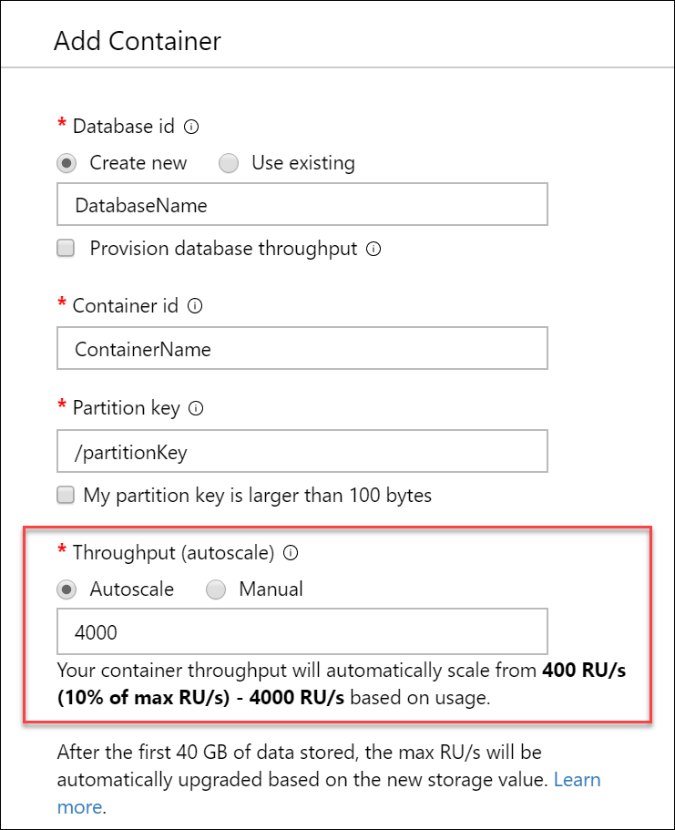

# Provision autoscale throughput on database or container in Azure Cosmos DB

This article explains how to provision autoscale throughput on a database or container (collection, graph, or table) in Azure Cosmos DB. You can enable autoscale on a single container, or provision autoscale throughput on a database and share it among all the containers in the database. 

## Azure portal

### Create new database or container with autoscale
1. Sign in to the [Azure portal](https://portal.azure.com) or the [Azure Cosmos DB explorer.](https://cosmos.azure.com/)

1. Navigate to your Azure Cosmos DB account and open the **Data Explorer** tab.

1. Select **New Container.** Enter a name for your database, container, and a partition key. Under **Throughput**, select the **autoscale** option, and set the [maximum throughput (RU/s)](provision-throughput-autoscale.md#how-autoscale-provisioned-throughput-works) that you want the database or container to scale to.

   

1. Select **OK**.

To provision autoscale on shared throughput database, select the **Provision database throughput** option when creating a new database. 

### Enable autoscale on existing database or container

> [!IMPORTANT]
> In the current release, the Azure portal is the only way to migrate between autoscale and standard (manual) provisioned throughput. 

1. Sign in to the [Azure portal](https://portal.azure.com) or the [Azure Cosmos DB explorer.](https://cosmos.azure.com/)

1. Navigate to your Azure Cosmos DB account and open the **Data Explorer** tab.

1. Select **Scale and Settings** for your container, or **Scale** for your database.

1. Under **Scale**, select the **Autoscale** option and **Save**.

   

> [!NOTE]
> When you enable autoscale on an existing database or container, the starting value for max RU/s is determined by the system, based on your current manual provisioned throughput settings and storage. After the operation completes, you can change the max RU/s if needed. [Learn more.](autoscale-faq.md#how-does-the-migration-between-autoscale-and-standard-manual-provisioned-throughput-work) 

## Azure Cosmos DB .NET V3 SDK for SQL API
Use [version 3.9 or higher](https://www.nuget.org/packages/Microsoft.Azure.Cosmos) of the Azure Cosmos DB .NET SDK for SQL API to manage autoscale resources. 

> [!IMPORTANT]
> You can use the .NET SDK to create new autoscale resources. The SDK does not support migrating between autoscale and standard (manual) throughput. The migration scenario is currently supported in only the Azure portal. 

### Create database with shared throughput
```csharp
// Create instance of CosmosClient
CosmosClient cosmosClient = new CosmosClient(Endpoint, PrimaryKey);
 
// Autoscale throughput settings
ThroughputProperties autoscaleThroughputProperties = ThroughputProperties.CreateAutoscaleThroughput(4000); //Set autoscale max RU/s

//Create the database with autoscale enabled
database = await cosmosClient.CreateDatabaseAsync(DatabaseName, throughputProperties: autoscaleThroughputProperties);
```

### Create container with dedicated throughput
```csharp
// Get reference to database that container will be created in
Database database = await cosmosClient.GetDatabase("DatabaseName");

// Container and autoscale throughput settings
ContainerProperties autoscaleContainerProperties = new ContainerProperties("ContainerName", "/partitionKey");
ThroughputProperties autoscaleThroughputProperties = ThroughputProperties.CreateAutoscaleThroughput(4000); //Set autoscale max RU/s

// Create the container with autoscale enabled
container = await database.CreateContainerAsync(autoscaleContainerProperties, autoscaleThroughputProperties);
```

### Read the current throughput (RU/s)
```csharp
// Get a reference to the resource
Container container = cosmosClient.GetDatabase("DatabaseName").GetContainer("ContainerName");

// Read the throughput on a resource
ThroughputProperties autoscaleContainerThroughput = await container.ReadThroughputAsync(requestOptions: null); 

// The autoscale max throughput (RU/s) of the resource
int? autoscaleMaxThroughput = autoscaleContainerThroughput.AutoscaleMaxThroughput;

// The throughput (RU/s) the resource is currently scaled to
int? currentThroughput = autoscaleContainerThroughput.Throughput;
```

### Change the autoscale max throughput (RU/s)
```csharp
// Change the autoscale max throughput (RU/s)
await container.ReplaceThroughputAsync(ThroughputProperties.CreateAutoscaleThroughput(newAutoscaleMaxThroughput));
```

## Azure Cosmos DB Java V4 SDK for SQL API
You can use [version 4.0 or higher](https://mvnrepository.com/artifact/com.azure/azure-cosmos) of the Azure Cosmos DB Java SDK for SQL API to manage autoscale resources. 

> [!IMPORTANT]
> You can use the Java SDK to create new autoscale resources. The SDK does not support migrating between autoscale and standard (manual) throughput. The migration scenario is currently supported in only the Azure portal. 

### Create database with shared throughput

#### [Async](#tab/api-async)

```java
// Create instance of CosmosClient
CosmosAsyncClient client = new CosmosClientBuilder()
    .setEndpoint(HOST)
    .setKey(MASTER)
    .setConnectionPolicy(CONNECTIONPOLICY)
    .buildAsyncClient();

// Autoscale throughput settings
ThroughputProperties autoscaleThroughputProperties = ThroughputProperties.createAutoscaledThroughput(4000); //Set autoscale max RU/s

//Create the database with autoscale enabled
CosmosAsyncDatabase database = client.createDatabase(databaseName, autoscaleThroughputProperties).block().getDatabase();
```

#### [Sync](#tab/api-sync)

```java
// Create instance of CosmosClient
CosmosClient client = new CosmosClientBuilder()
    .setEndpoint(HOST)
    .setKey(MASTER)
    .setConnectionPolicy(CONNECTIONPOLICY)
    .buildClient();

// Autoscale throughput settings
ThroughputProperties autoscaleThroughputProperties = ThroughputProperties.createAutoscaledThroughput(4000); //Set autoscale max RU/s

//Create the database with autoscale enabled
CosmosDatabase database = client.createDatabase(databaseName, autoscaleThroughputProperties).getDatabase();
```

--- 

### Create container with dedicated throughput

#### [Async](#tab/api-async)

```java
// Get reference to database that container will be created in
CosmosAsyncDatabase database = client.createDatabase("DatabaseName").block().getDatabase();

// Container and autoscale throughput settings
CosmosContainerProperties autoscaleContainerProperties = new CosmosContainerProperties("ContainerName", "/partitionKey");
ThroughputProperties autoscaleThroughputProperties = ThroughputProperties.createAutoscaledThroughput(4000); //Set autoscale max RU/s

// Create the container with autoscale enabled
CosmosAsyncContainer container = database.createContainer(autoscaleContainerProperties, autoscaleThroughputProperties, new CosmosContainerRequestOptions())
                                .block()
                                .getContainer();
```

#### [Sync](#tab/api-sync)

```java
// Get reference to database that container will be created in
CosmosDatabase database = client.createDatabase("DatabaseName").getDatabase();

// Container and autoscale throughput settings
CosmosContainerProperties autoscaleContainerProperties = new CosmosContainerProperties("ContainerName", "/partitionKey");
ThroughputProperties autoscaleThroughputProperties = ThroughputProperties.createAutoscaledThroughput(4000); //Set autoscale max RU/s

// Create the container with autoscale enabled
CosmosContainer container = database.createContainer(autoscaleContainerProperties, autoscaleThroughputProperties, new CosmosContainerRequestOptions())
                                .getContainer();
```

--- 

### Read the current throughput (RU/s)

#### [Async](#tab/api-async)

```java
// Get a reference to the resource
CosmosAsyncContainer container = client.getDatabase("DatabaseName").getContainer("ContainerName");

// Read the throughput on a resource
ThroughputProperties autoscaleContainerThroughput = container.readThroughput().block().getProperties();

// The autoscale max throughput (RU/s) of the resource
int autoscaleMaxThroughput = autoscaleContainerThroughput.getAutoscaleMaxThroughput();

// The throughput (RU/s) the resource is currently scaled to
int currentThroughput = autoscaleContainerThroughput.Throughput;
```

#### [Sync](#tab/api-sync)

```java
// Get a reference to the resource
CosmosContainer container = client.getDatabase("DatabaseName").getContainer("ContainerName");

// Read the throughput on a resource
ThroughputProperties autoscaleContainerThroughput = container.readThroughput().getProperties();

// The autoscale max throughput (RU/s) of the resource
int autoscaleMaxThroughput = autoscaleContainerThroughput.getAutoscaleMaxThroughput();

// The throughput (RU/s) the resource is currently scaled to
int currentThroughput = autoscaleContainerThroughput.Throughput;
```

--- 

### Change the autoscale max throughput (RU/s)

#### [Async](#tab/api-async)

```java
// Change the autoscale max throughput (RU/s)
container.replaceThroughput(ThroughputProperties.createAutoscaledThroughput(newAutoscaleMaxThroughput)).block();
```

#### [Sync](#tab/api-sync)

```java
// Change the autoscale max throughput (RU/s)
container.replaceThroughput(ThroughputProperties.createAutoscaledThroughput(newAutoscaleMaxThroughput));
```

--- 

## Cassandra API 
See this article on [how to use CQL commands](manage-scale-cassandra.md#use-autoscale) to enable autoscale.

## Azure Cosmos DB API for MongoDB 
See this article on [how to use MongoDB extension commands](mongodb-custom-commands.md) to enable autoscale.

## Azure Resource Manager
You can use an Resource Manager template to provision autoscale throughput on a database or container for any API. See this [article](manage-sql-with-resource-manager.md#azure-cosmos-account-with-autoscale-throughput) for a sample.

## Next steps
* Learn about the [benefits of provisioned throughput with autoscale](provision-throughput-autoscale.md#benefits-of-autoscale).
* Learn how to [choose between manual and autoscale throughput](how-to-choose-offer.md).
* Review the [autoscale FAQ](autoscale-faq.md).
