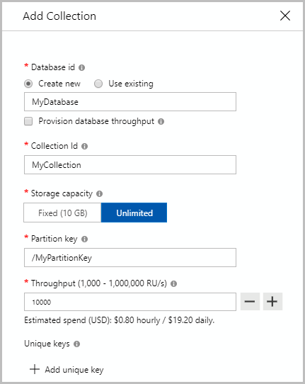

# Provision throughput on an Azure Cosmos container

This article explains how to provision throughput on a container (collection, graph, or table) in Azure Cosmos DB. You can provision throughput on a single container, or [provision throughput on a database](how-to-provision-database-throughput.md) and share it among the containers within the database. You can provision throughput on a container using Azure portal, Azure CLI, or Azure Cosmos DB SDKs.

## Provision throughput using Azure portal

1. Sign in to the [Azure portal](https://portal.azure.com/).

1. [Create a new Azure Cosmos account](create-sql-api-dotnet.md#create-account), or select an existing Azure Cosmos account.

1. Open the **Data Explorer** pane, and select **New Collection**. Next, provide the following details:

   * Indicate whether you are creating a new database or using an existing one.
   * Enter a Container (or Table or Graph) ID.
   * Enter a partition key value (for example, `/userid`).
   * Enter a throughput that you want to provision (for example, 1000 RUs).
   * Select **OK**.



## Provision throughput using Azure CLI

```azurecli-interactive
# Create a container with a partition key and provision throughput of 400 RU/s
az cosmosdb collection create \
    --resource-group $resourceGroupName \
    --collection-name $containerName \
    --name $accountName \
    --db-name $databaseName \
    --partition-key-path /myPartitionKey \
    --throughput 400
```

## Provision throughput using PowerShell

```azurepowershell-interactive
# Create a container with a partition key and provision throughput of 400 RU/s
$resourceGroupName = "myResourceGroup"
$accountName = "mycosmosaccount"
$databaseName = "database1"
$containerName = "container1"
$resourceName = $accountName + "/sql/" + $databaseName + "/" + $containerName

$ContainerProperties = @{
    "resource"=@{
        "id"=$containerName;
        "partitionKey"=@{
            "paths"=@("/myPartitionKey");
            "kind"="Hash"
        }
    };
    "options"=@{ "Throughput"= 400 }
}

New-AzResource -ResourceType "Microsoft.DocumentDb/databaseAccounts/apis/databases/containers" `
    -ApiVersion "2015-04-08" -ResourceGroupName $resourceGroupName `
    -Name $resourceName -PropertyObject $ContainerProperties
```

If you are provisioning throughput on a container in an Azure Cosmos account configured with the Azure Cosmos DB API for MongoDB, use `/myShardKey` for the partition key path. If you are provisioning throughput on a container in an Azure Cosmos account configured with Cassandra API, use `/myPrimaryKey` for the partition key path.

## Provision throughput by using .NET SDK

> [!Note]
> Use the Cosmos SDKs for SQL API to provision throughput for all Cosmos DB APIs, except Cassandra API.

### <a id="dotnet-most"></a>SQL, MongoDB, Gremlin, and Table APIs

```csharp
// Create a container with a partition key and provision throughput of 400 RU/s
DocumentCollection myCollection = new DocumentCollection();
myCollection.Id = "myContainerName";
myCollection.PartitionKey.Paths.Add("/myPartitionKey");

await client.CreateDocumentCollectionAsync(
    UriFactory.CreateDatabaseUri("myDatabaseName"),
    myCollection,
    new RequestOptions { OfferThroughput = 400 });
```

### <a id="dotnet-cassandra"></a>Cassandra API

```csharp
// Create a Cassandra table with a partition (primary) key and provision throughput of 400 RU/s
session.Execute(CREATE TABLE myKeySpace.myTable(
    user_id int PRIMARY KEY,
    firstName text,
    lastName text) WITH cosmosdb_provisioned_throughput=400);
```

## Next steps

See the following articles to learn about throughput provisioning in Azure Cosmos DB:

* [How to provision throughput on a database](how-to-provision-database-throughput.md)
* [Request units and throughput in Azure Cosmos DB](request-units.md)
