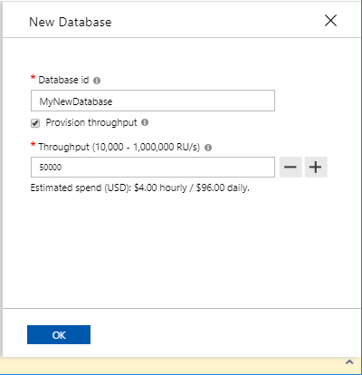

# Provision throughput for a database

This article explains how to provision throughput for a database in Azure Cosmos DB. Throughput can be [provisioned for a single container](how-to-provision-container-throughput.md), or for a database and shared among multiple containers within it. Database throughput can be provisioned using the Azure portal or CosmosDB SDKs.

## Portal

### <a id="portal-sql"></a>SQL (Core) API

1. Sign in to the Azure portal
2. Select an existing or create a new Azure Cosmos DB account
3. Click Data Explorer
4. Click New Database
5. Enter a Database Id
6. Select Provision throughput
7. Enter a throughput
8. Click OK



## .NET

> [!Note]
> Use the SQL API to provision throughput for all APIs. You can optionally use the example below for Cassandra API as well.

### <a id="dotnet-all"></a>All APIs

```csharp
//set the throughput for the database
RequestOptions options = new RequestOptions
{
    OfferThroughput = 10000
};

//create the database
await client.CreateDatabaseIfNotExistsAsync(
    new Database {Id = databaseName},  
    options);
```

### <a id="dotnet-cassandra"></a>Cassandra API

```csharp
// Create a Cassandra keyspace and provision throughput of 10000 RU/s
session.Execute(CREATE KEYSPACE IF NOT EXISTS myKeySpace WITH cosmosdb_provisioned_throughput=1000);
```

## Next steps

See more articles about throughput provisioning in Cosmos DB:

* [How to provision container throughput](how-to-provision-container-throughput.md)
* [Request units and throughput in Azure Cosmos DB](request-units.md)
