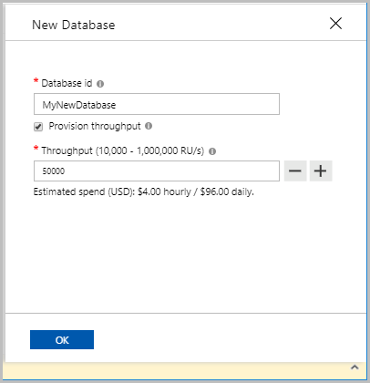

# Provision throughput on a database in Azure Cosmos DB

This article explains how to provision throughput on a database in Azure Cosmos DB. You can provision throughput for a single [container](how-to-provision-container-throughput.md), or for a database and share the throughput among the containers within it. To learn when to use container-level and database-level throughput, see the [Use cases for provisioning throughput on containers and databases](set-throughput.md) article. You can provision database level throughput by using the Azure portal or Azure Cosmos DB SDKs.

## Provision throughput using Azure portal

### <a id="portal-sql"></a>SQL (Core) API

1. Sign in to the [Azure portal](https://portal.azure.com/).

1. [Create a new Azure Cosmos account](create-sql-api-dotnet.md#create-account), or select an existing Azure Cosmos account.

1. Open the **Data Explorer** pane, and select **New Database**. Provide the following details:

   * Enter a database ID. 
   * Select **Provision throughput**.
   * Enter a throughput (for example, 1000 RUs).
   * Select **OK**.



## Provision throughput using PowerShell

```azurepowershell-interactive
# Create a database and provision throughput of 400 RU/s
$resourceGroupName = "myResourceGroup"
$accountName = "mycosmosaccount"
$databaseName = "database1"
$databaseResourceName = $accountName + "/sql/" + $databaseName

$databaseProperties = @{
    "resource"=@{ "id"=$databaseName };
    "options"=@{ "Throughput"= 400 }
}

New-AzResource -ResourceType "Microsoft.DocumentDb/databaseAccounts/apis/databases" `
    -ApiVersion "2015-04-08" -ResourceGroupName $resourceGroupName `
    -Name $databaseResourceName -PropertyObject $databaseProperties
```

## Provision throughput using .NET SDK

> [!Note]
> You can use Cosmos SDKs for SQL API to provision throughput for all APIs. You can optionally use the following example for Cassandra API as well.

### <a id="dotnet-all"></a>All APIs

```csharp
//set the throughput for the database
RequestOptions options = new RequestOptions
{
    OfferThroughput = 500
};

//create the database
await client.CreateDatabaseIfNotExistsAsync(
    new Database {Id = databaseName},  
    options);
```

### <a id="dotnet-cassandra"></a>Cassandra API

```csharp
// Create a Cassandra keyspace and provision throughput of 400 RU/s
session.Execute(CREATE KEYSPACE IF NOT EXISTS myKeySpace WITH cosmosdb_provisioned_throughput=400);
```

## Next steps

See the following articles to learn about provisioned throughput in Azure Cosmos DB:

* [Globally scale provisioned throughput](scaling-throughput.md)
* [Provision throughput on containers and databases](set-throughput.md)
* [How to provision throughput for a container](how-to-provision-container-throughput.md)
* [Request units and throughput in Azure Cosmos DB](request-units.md)