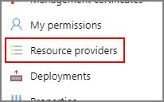
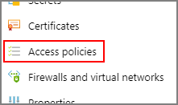
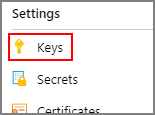
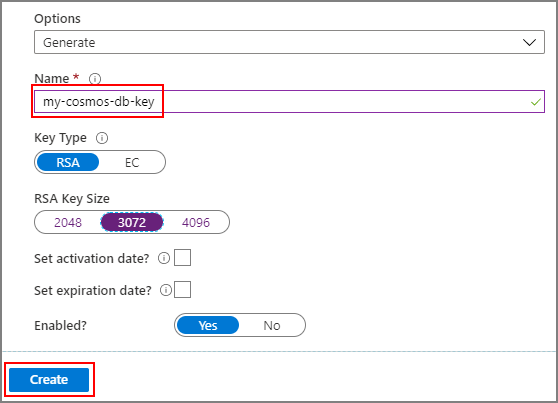
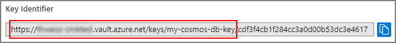

# Configure customer-managed keys for your Azure Cosmos account with Azure Key Vault

> [!NOTE]
> At this time, you must request access to use this capability. To do so, please contact [cosmosdbpm@microsoft.com](mailto:cosmosdbpm@microsoft.com).

Data stored in your Azure Cosmos account is automatically and seamlessly encrypted. Azure Cosmos DB offers two options to manage the keys used to encrypt the data at rest:

- **Service-managed keys** - By default, Microsoft manages the keys that are used to encrypt the data in your Azure Cosmos account.

- **Customer-managed keys (CMK)**- You can optionally choose to add a second layer of encryption with your own keys.

You must store customer-managed keys in the [Azure Key Vault](../key-vault/key-vault-overview.md) and provide a key for each Azure Cosmos account that is enabled with customer-managed keys. This key is used to encrypt all the data stored in that account.

> [!NOTE]
> Currently, customer-managed keys are only available for new Azure Cosmos accounts and you should configure them during account creation.

## <a id="register-resource-provider"></a> Register the Azure Cosmos DB resource provider for your Azure subscription

1. Sign into the [Azure portal](https://portal.azure.com/), go to your Azure subscription and select **Resource providers** under the **Settings** tab:

   

1. Search for the **Microsoft.DocumentDB** resource provider. Verify if the resource provider is already marked as registered. If not, choose the resource provider and select **Register**:

   

## Configure your Azure Key Vault instance

Using customer-managed keys with Azure Cosmos DB requires you to set two properties on the Azure Key Vault instance that you plan to use to host your encryption keys. These properties include **Soft Delete** and **Do Not Purge**. These properties aren't enabled by default, you can enable them by using either PowerShell or the Azure CLI.

To learn how to enable these properties on an existing Azure Key Vault instance, see the "Enabling soft-delete" and "Enabling Purge Protection" sections in one of the following articles:

- [How to use soft-delete with PowerShell](../key-vault/key-vault-soft-delete-powershell.md)
- [How to use soft-delete with Azure CLI](../key-vault/key-vault-soft-delete-cli.md)

## Add an access policy to your Azure Key Vault instance

1. From the Azure portal, go to the Azure Key Vault instance that you plan to use to host your encryption keys. Select **Access Policies** from the left menu:

   

1. Select **+ Add Access Policy**

1. Under the **Key permissions** dropdown menu, select **Get**, **Unwrap Key** and **Wrap Key** permissions:

   

1. Under **Select principal**, select **None selected**. Then, search for **Azure Cosmos DB** principal and select it. Finally, click **Select** at the bottom (if the **Azure Cosmos DB** principal isn't in the list, you may need to re-register the **Microsoft.DocumentDB** resource provider as described in [register the resource provider](#register-resource-provider) section of this article):

   

1. Select **Add** to add the new access policy

## Generate a key in Azure Key Vault

1. From the Azure portal, go the Azure Key Vault instance that you plan to use to host your encryption keys. Then, select **Keys** from the left menu:

   

1. Select **Generate/Import**, provide a name for the new key, select an RSA key size (a minimum of 3072 is recommended for best security), and then select **Create**:

   

1. After the key is created, select the newly created key, and then on its current version.

1. Copy the key’s **Key Identifier** except the part after the last forward slash:

   

## Create a new Azure Cosmos account

### Using the Azure portal

When creating a new Azure Cosmos DB account from the Azure portal, choose **Customer-managed key** in the **Encryption** step. In the **Key URI** field, paste the URI/key identifier of the Azure Key Vault key that you copied from the previous step:


### Using Azure PowerShell

When creating a new Azure Cosmos DB account with PowerShell,

- Pass the URI of the Azure Key Vault key copied from earlier under the **keyVaultKeyUri** property in the **PropertyObject**

- Use **2019-12-12** as the API version.

> [!IMPORTANT]
> You must set the `Location` parameter explicitly for the account to be successfully created with customer-managed keys.

```powershell
$resourceGroupName = "myResourceGroup"
$accountLocation = "West US 2"
$accountName = "mycosmosaccount"

$failoverLocations = @(
    @{ "locationName"="West US 2"; "failoverPriority"=0 }
)

$CosmosDBProperties = @{
    "databaseAccountOfferType"="Standard";
    "locations"=$failoverLocations;
    "keyVaultKeyUri" = "https://<my-vault>.vault.azure.net/keys/<my-key>";
}

New-AzResource -ResourceType "Microsoft.DocumentDb/databaseAccounts" `
    -ApiVersion "2019-12-12" -ResourceGroupName $resourceGroupName `
    -Location $accountLocation -Name $accountName -PropertyObject $CosmosDBProperties
```

### Using Azure Resource Manager template

When creating a new Azure Cosmos account through an Azure Resource Manager template:

- Pass the URI of the Azure Key Vault key that you copied earlier under the **keyVaultKeyUri** property in the **properties** object.

- Use **2019-12-12** as the API version.

> [!IMPORTANT]
> You must set the `Location` parameter explicitly for the account to be successfully created with customer-managed keys.

```json
{
    "$schema": "https://schema.management.azure.com/schemas/2015-01-01/deploymentTemplate.json#",
    "contentVersion": "1.0.0.0",
    "parameters": {
        "accountName": {
            "type": "string"
        },
        "location": {
            "type": "string"
        },
        "keyVaultKeyUri": {
            "type": "string"
        }
    },
    "resources": 
    [
        {
            "type": "Microsoft.DocumentDB/databaseAccounts",
            "name": "[parameters('accountName')]",
            "apiVersion": "2019-12-12",
            "kind": "GlobalDocumentDB",
            "location": "[parameters('location')]",
            "properties": {
                "locations": [ 
                    {
                        "locationName": "[parameters('location')]",
                        "failoverPriority": 0,
                        "isZoneRedundant": false
                    }
                ],
                "databaseAccountOfferType": "Standard",
                "keyVaultKeyUri": "[parameters('keyVaultKeyUri')]"
            }
        }
    ]
}

```

Deploy the template with the following PowerShell script:

```powershell
$resourceGroupName = "myResourceGroup"
$accountName = "mycosmosaccount"
$accountLocation = "West US 2"
$keyVaultKeyUri = "https://<my-vault>.vault.azure.net/keys/<my-key>"

New-AzResourceGroupDeployment `
    -ResourceGroupName $resourceGroupName `
    -TemplateFile "deploy.json" `
    -accountName $accountName `
    -location $accountLocation `
    -keyVaultKeyUri $keyVaultKeyUri
```

## Frequently asked questions

### Is there any additional charge when using customer-managed keys?

Yes. To account for the additional compute load that is required to manage data encryption and decryption with customer-managed keys, all operations executed against the Azure Cosmos account consume a 25% increase in [Request Units](./request-units.md).

### What data gets encrypted with the customer-managed keys?

All the data stored in your Azure Cosmos account is encrypted with the customer-managed keys, except for the following meta-data:

- The names of your Azure Cosmos DB [accounts, databases, and containers](./account-overview.md#elements-in-an-azure-cosmos-account)

- The names of your [stored procedures](./stored-procedures-triggers-udfs.md)

- The property paths declared in your [indexing policies](./index-policy.md)

- The values of your containers' [partition key](./partitioning-overview.md)

### Are customer-managed keys supported for existing Azure Cosmos accounts?

This feature is currently available for new accounts only.

### Is there a plan to support finer granularity than account-level keys?

Not currently, however container-level keys are being considered.

### How does customer-managed keys affect a backup?

Azure Cosmos DB takes [regular and automatic backups](./online-backup-and-restore.md) of the data stored in your account. This operation backs up the encrypted data. To use the restored backup, the encryption key that you used at the time of the backup is required. This means that no revocation shall have been made and the version of the key that was used at the time of the backup shall still be enabled.

### How do I revoke an encryption key?

Key revocation is done by disabling the latest version of the key:


Alternatively, to revoke all keys from an Azure Key Vault instance, you can delete the access policy granted to the Azure Cosmos DB principal:


### What operations are available after a customer-managed key is revoked?

The only operation possible when the encryption key has been revoked is account deletion.

## Next steps

- Learn more about [data encryption in Azure Cosmos DB](./database-encryption-at-rest.md)
- Get an overview of [secure access to data in Cosmos DB](secure-access-to-data.md)